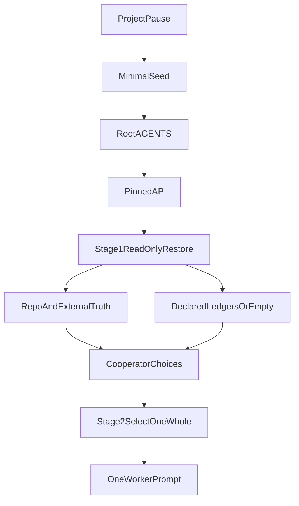

# AP Continuation Bootstrap And Optional Ledger Contract

```yaml
logical_whole: ap-universal-project-continuation-bootstrap-and-durable-observation-ledger
experimental_replication: worker-02-blind-independent-planning
baseline:
  ap_public_main: 041de310ea33ed1b47dd8f5fbfcc2829d1a32514
  ap_tree: a66b81d75d427a1d465bbfe76a890de1fd16aa52
  framenest_public_main: 230ce43a8ea978422ee6cefa2c70b42a4ee4d8eb
  framenest_ap_gitlink: 041de310ea33ed1b47dd8f5fbfcc2829d1a32514
  meta_blind_cutoff: 01de27e1e822b6e05b287da5064e87ce97c2d8d0
  meta_prompt_tip: 36876324be9a4887c999dbfe9195863682e2bac1
  meta_current_public_main: b6ee17df1041609e1a42afc46f81b0d5c6c73e58
problem: missing-operational-continuation-algorithm-and-optional-ledger-storage-projection
selected_disposition: B-extend-existing-projections
semantic_owners:
  continuation_algorithm: AP.md section 14 plus RF-19 restore order
  ledger_lifecycle: AP.md RF-09
  ledger_storage_discovery: AP.md RF-14 and RF-09
  field_spellings: PROMPT_CONTRACTS.md
  operational_steps: AP_ORCHESTRATOR.md
  consumer_declaration: project-owned AGENTS.md outside managed block
implementation_boundary: AP-repository-documentation-only
likely_changed_paths:
  semantic: [AP.md]
  structural: [PROMPT_CONTRACTS.md]
  operational: [AP_ORCHESTRATOR.md, ARTIFACT_LIFECYCLE.md, AP_WORKER.md, INTEGRATION.md]
  explanatory: [README.md, FAQ.md, GLOSSARY.md]
  historical: [CHANGELOG.md, docs/adr/README.md, docs/adr/0016-continuation-bootstrap-and-optional-observation-ledger.md]
  unchanged: [ap, ap.project.conf, managed AGENTS.md block, FrameNest]
compatibility:
  schema_v1: unchanged
  managed_block: unchanged
  older_pins: unchanged-until-explicit-update
  absent_ledger: empty-active-set
risks:
  - ledger-becomes-roadmap-or-NEXT-file
  - continuation-section-accumulates-session-state
  - consumer-copies-AP-algorithm
  - malformed-or-unknown-version-ledger
validation: documentation-first-proportional
acceptance_route: fresh-independent-acceptance-of-AP-docs-candidate
explicit_exclusions:
  - new CONTINUATION.md or MEMORY.md
  - ap continuation/ledger command
  - schemaVersion bump or extension.*.* protocol use
  - FrameNest mutation in this whole
  - reopening prompt-archive or sidecar wholes
smallest_next_step: one-fresh-AP-docs-implementation-prompt-after-ORCHESTRATOR-convergence
```

## 1. Problem statement

Current AP already owns restoration meaning, four continuity layers, PASS/PARTIAL/BLOCKED restoration readiness, source-of-truth precedence, non-authoritative `upgrade <canonical-repository>` lifecycle, optional Discovery Records, exceptional handoffs, rejection of permanent BOOT/NEXT/session-state files, adaptive fresh/current routing, and optional subordinate Meta history. Those semantics are not missing.

The proven gap is narrower:

- **Missing operational projection, plus weak discoverability:** a strong fresh Orchestrator given only a consumer clone and pinned AP has no single named, executable, session-state-free procedure from a minimal seed to (1) governing AP, (2) current project truth, (3) active non-authoritative observations, (4) exactly one next logical whole chosen with the COOPERATOR. Restoration today is an outgoing-Orchestrator synthesized chat prompt ([AP.md](AP.md) §14; [PROMPT_CONTRACTS.md](PROMPT_CONTRACTS.md) Fresh Orchestrator Restoration). The managed block in [`ap` `managed_block`](ap) points only at `AP.md`, role projections, and `PROMPT_CONTRACTS.md`. FrameNest [AGENTS.md](https://github.com/cisarik/framenest/blob/230ce43a8ea978422ee6cefa2c70b42a4ee4d8eb/AGENTS.md) at `230ce43a` distributes product truth across many documents and rejects permanent BOOT/NEXT files, but names no continuation algorithm and no observation ledger.
- **Missing structural/storage projection, not missing ledger semantics:** RF-09 and [Upgrade Observation Ledger](AP.md) define states, transitions, non-authority, and closure reconciliation. [PROMPT_CONTRACTS.md](PROMPT_CONTRACTS.md) already spells entry fields. No AP artifact defines how a consumer stores, declares, versions, or discovers the active ledger. FrameNest has no such path and uses no `extension.*.*` keys.

Rejected framings:

- “AP has no restoration rules” — false; §14, RF-19 restore order, and the Restoration phase already exist.
- “A missing filename, CLI command, or short seed is itself a protocol failure” — false; absence of `CONTINUATION.md` or `ap continue` is not proof.
- “Reopen `project-local-fresh-orchestrator-prompt-archive`” — false. At older baselines that whole selected superseded/no implementation because RF-19 plus external Meta already archived finalized restoration prompts and no repository-only restoration failure was proven ([Meta cutoff](01de27e1) `projects/ap/01/01-project-local-fresh-orchestrator-prompt-archive/01_report_00.md`). The present question is a **stable algorithm and optional active-observation storage in the consumer**, not a project-local archive of handouts.
- “Make the pre-cutoff handout’s `planning-PASS` / `no-new-material` / `invariant-failure` values valid” — false. At AP `041de310`, planning uses `not-applicable` as the phase-qualified result, and report justifications are `new-mutation`, `new-evidence`, `new-material-risk`, `changed-external-state`, `final-acceptance`, `explicit-closure`.

The 611-line / 22,410-byte cutoff handout is evidence of **manual synthesis cost and outgoing-Orchestrator dependence**, not proof that a new permanent AP file is required.

## 2. Contradiction and duplication map

- **Semantic vs operational vs structural:** `AP.md` owns meaning; `PROMPT_CONTRACTS.md` owns spellings; `AP_ORCHESTRATOR.md` already has Rotation and Restoration plus restore-order steps; `ARTIFACT_LIFECYCLE.md` classifies ledgers as retained non-authoritative input. Adding `CONTINUATION.md` would duplicate the Orchestrator operational owner.
- **Ledger meaning vs ledger bytes:** RF-09 lifecycle exists; consumer storage does not. Closure still requires `Upgrade-ledger reconciliation: complete` even when no durable consumer representation exists, so reconciliation currently depends on chat, memory, or Meta.
- **Managed block vs README vs FrameNest rules:** all three say “read AP.md / role docs / contracts”; none names a continuation bootstrap heading. Discoverability is weak, not absent.
- **`extension.*.*` vs protocol discovery:** [ADR-0012](docs/adr/0012-baseline-bound-project-execution.md) states schema v1 is closed except ignored `extension.<name>.<field>` keys; [`ap` `project_validate_contract`](ap) accepts `extension.*.*` with no value checks; “Extensions are ignored and cannot affect execution.” This is an unvalidated project-local escape hatch, not a safe AP discovery surface. FrameNest’s `ap.project.conf` at `230ce43a` has no extension keys.
- **Trace vs continuation:** RF-19 already forbids treating Meta as restoration authority. A consumer-only clone is a supported starting condition; an unavailable trace must not block ordinary AP work.
- **BOOT/NEXT vs algorithm file:** ADR-0005 / FrameNest ADR-0034 rejected permanent session-state files because they go stale. A session-state-free algorithm inside an existing operational projection does not revive BOOT/NEXT. A new root `CONTINUATION.md` would look like BOOT even if its prose were stable.
- **Copied enums vs structural owner:** cutoff handout lines 545 and 548 copied invalid phase-result and justification values. Sidecar acceptance at the same AP pin used non-canonical `FAIL`, `acceptance-FAIL`, and `correction-PASS`. This is prompt-synthesis drift, already owned by “prefer references over copied protocol text” (RF-14 / ADR-0013). It is not a reason to mint new enums or a new AP file.
- **Meta `_00` suffixes vs RF-19:** standard Markdown/Git projection uses unsuffixed exchange `01` and forbids `_01`. Meta’s `01_planning_00.md` / `01_report_00.md` is trace-local layout, not AP semantics (CONT-009).
- **Archive whole vs this whole:** archive placement inside the consumer was rejected as a second canonical home. This whole must not reintroduce a prompt archive, `LATEST.md`, or Meta-as-runtime.

## 3. Current lifecycle map



Today, after pause, an outgoing Orchestrator typically writes a large restoration prompt that **bundles** verified anchors with a proposed next whole. After a long pause that bundled next step is stale. Selected design: **stage 1** restores and reconciles; **stage 2** selects one whole with the COOPERATOR against current evidence; only then is mutation authority granted.

## 4. Semantic-ownership table

- Continuation bootstrap algorithm (stable steps, no session state): semantic owner `AP.md` §14 + RF-19 restore order; operational projection `AP_ORCHESTRATOR.md`; explanatory README row; not a new file.
- Optional ledger storage/discovery/absence/staleness meaning: semantic owner `AP.md` RF-09 + RF-14; structural spellings `PROMPT_CONTRACTS.md`; operational lifecycle `ARTIFACT_LIFECYCLE.md`; consumer declaration in project-owned `AGENTS.md` outside the managed block.
- Ledger record fields already defined (`Entry`, `Entry state`, `Entry authority: non-authorizing`, task grant, implementation status, closure action, historical evidence): keep owner split; add storage-only fields in contracts under AP meaning.
- Managed `AGENTS.md` block: unchanged consumer projection of RF-15.
- `ap.project.conf` / `extension.*.*` / `ap` commands: unchanged executable projection of RF-16; not a ledger or continuation surface.
- Minimal seed: COOPERATOR presentation; not an AP artifact; must not copy protocol prose.
- Restoration prompt: remains chat-delivered, grants no mutation, remains distinct from the durable algorithm.
- Discovery Record, exceptional handoff, roadmap, issue, ADR, SPEC, Git history, Meta trace: unchanged owners; ledger must not replace them.
- New historical ADR + CHANGELOG: rationale/delivery only.

Every committed AP artifact in this whole keeps relationship, canonical owner, consumer/discovery path, retention trigger (superseded by later AP pin), and cleanup owner (AP maintainers under a later exact task).

## 5. New continuation file?

**No.** Extend [AP_ORCHESTRATOR.md](AP_ORCHESTRATOR.md) with an early, named **Continuation Bootstrap** section. Put meaning in `AP.md`, not a second operational home. A new `CONTINUATION.md` would duplicate RF-14’s lightest-artifact rule, resemble rejected BOOT files, and force extra discovery edges (README, managed block, doctor).

## 6. Durable ledger file as AP distribution?

**No AP-owned ledger file, and no mandatory consumer file.** Standardize an **optional project-owned storage and discovery contract**. A brand-new consumer with no ledger is valid (empty active set). When a project has unresolved upgrade observations that must survive pause without chat/Meta/memory, it declares one or more ledgers in project-owned rules and stores YAML records at the declared project-relative paths.

## 7. Disposition evaluation

- **A — new continuation file plus project-ledger contract:** rejected. Ledger contract is warranted; a new continuation file is not.
- **B — extend existing AP projections, no new continuation file:** **selected.** Smallest evidence-backed change that closes both proven gaps.
- **C — semantics sufficient; change only consumer integration:** rejected. FrameNest mutation is out of scope; managed-block-only change would not define ledger grammar or two-stage pause selection; the storage projection is missing from AP itself.
- **D — reject the proposal / no implementation:** rejected. The storage gap and pause-time selection gap are real. No-implementation would leave continuation dependent on outgoing synthesis. The older archive rejection does not cover this question.

## 8. Selected disposition and rejected alternatives

Selected: **B**.

Also rejected: `ap continue` / `ap ledger`; schemaVersion 2; `extension.*.*` as discovery; mandatory `OBSERVATION_LEDGER.md` filename; `MEMORY.md`; Meta as runtime; copying AP algorithm into FrameNest; encoding models/providers/IDEs/emoji as protocol; making any ledger state authorizing.

## 9. Source precedence and contradiction handling

Restore in RF-19 order: (1) governing immutable AP pin, (2) canonical project repository and current external truth, (3) accepted durable decisions, (4) optional trace, (5) tentative narrative. Later explicit COOPERATOR decisions outrank older restoration prompts and ledger `accepted` flags. Repository fact outranks a contradicting ledger entry (candidate `invalidated`, still non-authorizing). Unresolved instruction conflicts stop work. After AP publication, consumers change behavior only by explicit pin update ([UPDATING.md](UPDATING.md)). Implementation Workers re-verify public AP `main` and FrameNest `main` before mutation; if those hard gates differ, stop with `changed-external-state`.

## 10. Ledger grammar (selected)

- **Target identity:** ledger name is exactly `upgrade <canonical-repository>`. `<canonical-repository>` is `owner/name` (same shape as `ap.project.conf` `projectId`, e.g. `cisarik/ap`). One ledger per target repository. Multiple targets mean multiple named ledgers and multiple declarations. Presentation ordinals are not identity (already in `AP.md`).
- **Record identifier:** immutable after first commit; unique within that ledger; grammar `^[A-Z][A-Z0-9]{1,7}-[A-Z0-9][A-Z0-9-]{0,47}$`. Collision or reuse fails closed. `CONT-001`…`CONT-010` remain discussion labels until first committed assignment; they are not required protocol IDs.
- **Storage schema version:** `observationLedgerSchemaVersion: 1` inside the ledger document, independent of `ap.project.conf` `schemaVersion`. Unknown version is malformed.
- **Format:** one UTF-8 YAML document per declared ledger (machine-parseable nested records). Not freeform Markdown-as-ledger; not git-config (poor nested lists). Optional human notes outside the YAML document are not ledger records.
- **Discovery:** explicit declaration in project-owned root `AGENTS.md` outside the managed block, mapping `upgrade <canonical-repository>` to one project-relative path. **No required conventional filename.** An undeclared file is not a ledger, even if the name looks like one.
- **Required record fields:** `id`; `state` (`untriaged|accepted|duplicate|rejected|invalidated|implemented|parked`); `authority: non-authorizing` (only legal value); `implementation_task_grant` (`none` or one exact current Orchestrator task plus Worker boundary); `implementation_status`; public-safe `summary`; `evidence_class`; `provenance`; `observed_commit` or explicit `observed_commit: unknown` with why; `last_revalidated_commit`; `closure_action` consistent with RF-09; `historical_evidence` for terminal states; `privacy_class: public-safe`.
- **Optional fields:** `observed_at`, `last_revalidated_at`, `conflicts_with`, `duplicates`, `supersedes`, `excluded_by`, `promotion_target`.
- **Evidence class:** `repository-fact | public-ref | consumer-rule | optional-trace | inference | cooperator-intent`. Inference cannot outrank repository-fact.
- **Lifecycle:** unchanged RF-09 transitions. `accepted` is validity only. Implementation requires a separate current task grant. Terminal states use `remove-from-active-ledger`; live YAML drops them; Git history retains provenance. Do not add a second growing archive file.
- **Invalidation:** current repository truth contradicts the claim; the observed content no longer exists at the governing pin/HEAD; COOPERATOR rejects; unknown schema; merge-conflict markers; secret/private material present. After a long pause, revalidate every active entry before using it as discovery input.
- **Malformed / missing / empty / duplicate declaration:** missing/undeclared = empty active set (safe). Declared but absent, empty YAML, unknown version, conflict markers, or duplicate ids = fail closed; no mutation; restoration readiness BLOCKED or COOPERATOR decision. Duplicate of a roadmap/issue = `duplicate` with pointer; ledger does not replace those owners.
- **Concurrency:** ordinary Git merge; conflicted ledger is malformed.
- **Ordering:** display by `id` ascending; order is not identity.
- **Privacy:** public-safe default; exclude secrets, credentials, private paths, private media, transcripts, hidden reasoning, unnecessary production detail. Private conversational memory is disposable once active entries are committed and accepted decisions are promoted to their owners.

Independent triage of the provisional snapshot (non-authorizing):

- CONT-001: accepted as valid; implement as named bootstrap in existing projections.
- CONT-002: accepted as valid; optional storage/discovery contract.
- CONT-003: reject `ap.project.conf` / `extension.*.*` / new `ap` command; accept YAML + AGENTS.md declaration only.
- CONT-004: reject as AP semantics; existing routing contracts suffice; post-prompt routing stays presentation.
- CONT-005: accepted as two-stage operational algorithm; do not turn Meta filenames into lifecycle names.
- CONT-006: duplicate of RF-05; no new rule.
- CONT-007: reject; AP stays model-neutral.
- CONT-008: already required on every Worker prompt; no extra projection.
- CONT-009: Meta-local; AP RF-19 already owns exchange grammar.
- CONT-010: accepted as drift evidence; do not validate the bad enums; prefer references to `PROMPT_CONTRACTS.md`. Out of scope to add new status values such as `FAIL`.

## 11. Staleness controls

`observed_commit` is what was seen. `last_revalidated_commit` is the last governing consumer/AP identity against which the claim was checked. After pause, stage 1 revalidates actives against current HEAD/pin/public refs. Stale `accepted` entries are not implementation grants. Restoration prompts and Meta handouts never freeze a next whole across a pause.

## 12. Privacy and public-repository constraints

Same RF-19 / INFOSEC exclusions. Ledgers in public consumers are public. Do not dump chats or hidden reasoning into AP or consumer trees. FrameNest private media remains out of scope.

## 13. Fresh/current routing

Unchanged RF-05 / session-and-mode contract. This planning exchange is `fresh-worker-session` + native planning `required` and expires at the terminal report. Later implementation: `fresh-worker-session`, `Native planning mode: not-used`, because it changes the sole protocol and structural fields. Independent acceptance: another fresh Worker. Do not encode client, model, provider, or IDE names. Reasoning remains lowest-sufficient guidance, not authority. Post-prompt “routing capsules” stay Orchestrator/project presentation (Hypothesis E rejected as new AP semantics).

## 14. Artifact relationship

- **Minimal seed:** human entry; points at AGENTS.md + pinned continuation bootstrap; copies no protocol.
- **Continuation contract:** durable operational algorithm in `AP_ORCHESTRATOR.md` under `AP.md`.
- **Restoration prompt:** optional chat synthesis at rotation; still useful for operational continuity; must not be the only way to continue; grants no mutation; must cite structural contracts rather than copy enums.
- **Observation ledger:** optional consumer YAML; non-authoritative discovery.
- **Discovery Record:** optional decision-support; not a ledger.
- **Repository handoff:** exceptional, Worker-authored, still only when durable evidence plus the algorithm cannot reconstruct material state.
- **Roadmap / issue / ADR / SPEC / project rules / Git history:** owners of deferred work, architecture, product, and commits.
- **Meta trace:** optional historical evidence, never restoration authority.

## 15. Minimal universal continuation seed (viable)

```text
Resume this AP-integrated project.
Read the root AGENTS.md and the pinned AP Orchestrator continuation bootstrap.
Begin read-only. Restore canonical state, reconcile any declared project
observation ledger, and select exactly one bounded next logical whole with
the COOPERATOR before granting mutation authority.
```

Viable because the managed block already requires `AP.md` and `AP_ORCHESTRATOR.md`, and the new named heading becomes the binding target. Not viable today without that named heading: “continuation contract” currently names no artifact. The seed must stay vendor-neutral and must not mention Meta.

## 16. Integration and discovery

Path: root `AGENTS.md` managed block → `.ap/AP.md` + `.ap/AP_ORCHESTRATOR.md` → Continuation Bootstrap heading → optional project-rule ledger declarations → current product documents.

**Managed block: do not change in this whole** (default). Orchestrators already must read `AP_ORCHESTRATOR.md`. Changing the block forces every consumer through `./.ap/ap init` on pin update. Add a README reading-order row instead.

One isolated COOPERATOR choice, with default: add a single managed-block bullet pointing at the continuation bootstrap? **Default no.** Consequence of yes: universal discoverability even if someone skips the Orchestrator projection, at the cost of a compatibility init step. Consequence of no: discoverability via existing required reading plus a prominent heading.

## 17. Compatibility

- Existing pins keep old AP until they update; doctor remains green if the managed block is unchanged.
- Public AP `main` ahead of a consumer pin does not govern that consumer (RF-15).
- Absent ledger: empty active set; continuation proceeds from repository truth + COOPERATOR.
- Malformed/stale/conflicting/unknown-version ledger: fail closed; no mutation.
- New consumer: no ledger required.
- Stricter project rules may add constraints; they cannot make ledger state authorizing or copy AP semantics into a second owner.

## 18. `ap.project.conf`, extensions, managed block, `ap`, schema

No change. `extension.*.*` is irrelevant to this contract. No `ap init`/`doctor`/`exec` continuation or ledger command. No schema version bump. Doctor must not start parsing project-owned YAML in this whole.

## 19. Structural/executable validation

Documentation-first only (ADR-0015). Exact diff of new headings and field spellings, owner/projection review, link/path review, comparison to `PROMPT_CONTRACTS.md` enums, and independent acceptance of the protocol/schema change. Do not recreate `tests/ap_tool_tests.sh`. Do not mirror the protocol in tests. Optional later `ap doctor` ledger checks are out of scope.

## 20. Likely changed paths

- Semantic owner: [AP.md](AP.md)
- Structural: [PROMPT_CONTRACTS.md](PROMPT_CONTRACTS.md)
- Operational: [AP_ORCHESTRATOR.md](AP_ORCHESTRATOR.md), [ARTIFACT_LIFECYCLE.md](ARTIFACT_LIFECYCLE.md), [AP_WORKER.md](AP_WORKER.md), [INTEGRATION.md](INTEGRATION.md)
- Explanatory: [README.md](README.md), [FAQ.md](FAQ.md), [GLOSSARY.md](GLOSSARY.md)
- Historical: [CHANGELOG.md](CHANGELOG.md), [docs/adr/README.md](docs/adr/README.md), new `docs/adr/0016-continuation-bootstrap-and-optional-observation-ledger.md` (number assigned at implementation by current ADR index; 0016 is the next unused number at this baseline)
- Unchanged: `ap`, `ap.project.conf`, managed block text, FrameNest

## 21. Smallest coherent AP-only boundary

One documentation change in `https://github.com/cisarik/ap.git` that (a) names the two-stage continuation bootstrap as operational projection of existing restoration/precedence rules, and (b) defines optional consumer ledger storage/discovery/staleness without authorizing ledger state. No FrameNest, host, Meta, or executable mutation.

## 22. Implementation slices

Prefer **one implementation Worker, one reviewable AP commit** covering semantic + structural + operational + explanatory + historical paths, because splitting them creates temporary dual-owner drift. If split: (1) `AP.md` + `PROMPT_CONTRACTS.md`, (2) role/lifecycle/integration projections, (3) README/FAQ/GLOSSARY/ADR/CHANGELOG. Same-session implementation continuation is allowed only under a complete renewed grant after planning expiry; this planner session cannot implement. Independence required for acceptance: **yes**.

Phase gates: implementation PASS → fresh independent acceptance → COOPERATOR/ORCHESTRATOR publication of AP `main` → later separate FrameNest adoption whole.

## 23. Validation and acceptance

- Re-check credential-free `ls-remote` for AP and FrameNest hard gates.
- Diff-inspect every changed heading against RF-09/RF-14/RF-15/§14 and exact contract enums.
- Confirm `ap` and managed block hashes unchanged.
- Confirm no FrameNest paths in the AP commit.
- Fresh independent acceptance Worker, `fresh-worker-session`, native planning `not-used`, read-only except as needed to inspect the candidate, no publication/closure authority.

## 24. Later FrameNest adoption (separate whole)

After AP is accepted and published: explicit FrameNest pin update via [UPDATING.md](UPDATING.md); update `EXPECTED_AP_COMMIT` in `tests/contract/test_ap_integration.py`; run `./.ap/ap doctor`; do not copy AP bootstrap prose. Optionally declare ledgers for `upgrade cisarik/ap` and/or `upgrade cisarik/framenest` in FrameNest `AGENTS.md` outside the managed block and add YAML at chosen paths. Initialize from then-current evidence, not from this planner’s provisional CONT labels as authority. Sidecar residuals stay out of that whole unless new evidence says otherwise.

## 25. Exclusions

No `CONTINUATION.md`, `MEMORY.md`, BOOT/NEXT/session-state files, prompt archive, Meta runtime, model/provider/IDE encoding, emoji protocol, authoritative ledger, FrameNest product work, retired AP suite, same-slice AP+FrameNest mutation, implementation in this session, Worker 3 prompt, or closure.

## 26. Smallest next step

After ORCHESTRATOR comparison and COOPERATOR review: issue **one** fresh implementation prompt (`Native planning mode: not-used`) whose allowlist is the AP documentation paths above, with explicit prohibition on `ap`, `ap.project.conf`, managed-block text, FrameNest, and Meta.

COOPERATOR question (only one): change the managed block to mention the continuation bootstrap? **Recommended default: no.**

## 27. Blind-replication integrity

Allowed evidence: this prompt; AP `041de310ea33ed1b47dd8f5fbfcc2829d1a32514`; FrameNest `230ce43a8ea978422ee6cefa2c70b42a4ee4d8eb`; Meta content at `01de27e1e822b6e05b287da5064e87ce97c2d8d0` or older; Meta post-cutoff **path names, subjects, and ancestry only**.

Prohibited blobs were not opened, including `01_planning_00.md`, `01_report_00.md`, `01_planning_01.md`, `01_report_01.md`, and untracked `02_planning_00.md`. No prior-plan substance was consumed. Blindness boundary remained intact.

## Failure-model results

- New consumer, no ledger: empty set; proceed.
- Older AP pin: old semantics; no new obligation.
- Six-month pause: stage 1 + revalidation + COOPERATOR stage 2; ignore stale handout next-steps.
- Public AP ahead of pin: pin governs.
- Meta absent/private; no chat memory; no outgoing Orchestrator: seed + AGENTS.md + pinned AP suffice.
- Empty declared ledger: empty set.
- Malformed/unknown-version/conflicted ledger: fail closed.
- Ledger vs repository contradiction: repository fact wins; candidate `invalidated`.
- `accepted` without task grant: no implementation.
- Terminal dropped from live YAML, kept in Git: required.
- Multiple targets: separate ledgers.
- Invalid structural fields in a hand-written prompt: reject the prompt; do not legalize the fields.
- Roadmap/issue already owns the work: `duplicate`.
- Stricter local rules: additive only.
- Client without native planning at implementation: `not-used` prompt, as already required.
- Agent knows only seed + AGENTS.md + pinned AP: sufficient after this change; not sufficient today for observations that live only in chat/Meta.

## Terminal control record

Planning cycle: initial. Plan disposition: approval-gated. Implementation in this session: prohibited. Planning authority expires when the terminal Worker report is submitted. This plan is not architecture approval, implementation authority, acceptance, publication, or closure.
