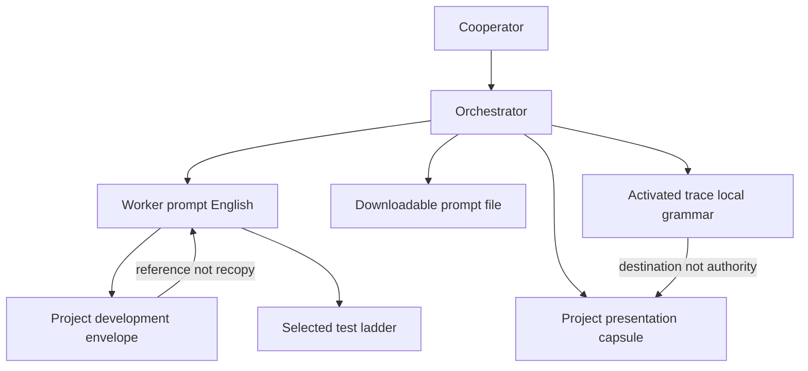

# AP Cooperator Ergonomics Implementation Plan

Disposition: **B** (existing RF families are sufficient; bounded semantic clarifications plus structural/operational/integration projections are required). Disposition **C** fails because current AP at `17b7e085` cannot deterministically produce the §8 Cooperator-facing workflow without hidden chat context. Disposition **A** is unnecessary: no new RF family, continuation protocol, ledger, or executable enforcement is justified.

## Verified baselines

- AP public `refs/heads/main` = `17b7e085139e9bcbb0e4953d26aef9b6687d541c` (tree `6f0d09c9…`, parent `a1b04ffc…`). Local `/home/agile/Projects/ap` remains on `refactor/retire-monolithic-ap-test-suite` at ancestor `041de310…`. Inspection root: existing worktree at `17b7e085`. Stale `.git/REBASE_HEAD` left untouched.
- Meta public/local `main` = `1fb7f3683fa244fe90d0465bfae843f9d3d2bfca`, descendant of handout ancestor `01de27e1…`. Archival-compatible. Coordinate `projects/ap/03/00-ap-cooperator-ergonomics-cost-proportional-execution-and-meta-trace-integration/` is unused of Worker exchanges except tracked `00_handout.md`; local untracked `01_planning_00.md` is this delivery artifact.
- FrameNest public `main` = `4b04b86e…`; local candidate `2d995bb…` is a descendant. `.ap` gitlink at both = `17b7e085`. Field evidence only.

## Why C fails (deterministic-workflow burden)

Current AP already has compact-prompt permission, lowest-sufficient reasoning, evidence tiers, pre-existing-failure classification, optional trace activation, and “localized routing labels remain outside the Worker prompt.” Those pieces are dispersed. They do **not** require an Orchestrator to emit, without hidden context:

- a Cooperator routing capsule (project presentation, not AP semantics);
- one downloadable authoritative prompt file with a shown filename;
- the exact activated-trace destination using Meta’s zero-based grammar;
- archival allowed-now vs wait-for-report;
- a selected test ladder with loop stop;
- project-tooling reuse by reference;
- named development-envelope activation.

A “the rule already exists somewhere” answer is therefore insufficient. Predecessor `ap-task-prompt-minimality-and-authority-preserving-synthesis` (Disposition C) is not reopened as an abstract length question.

## Architecture (smallest coherent repair)

Keep one semantic owner. Add four **activatable records** (same pattern as External Trace and upgrade-ledger declaration): inactive by default, granted only by the current prompt, declared in project rules when a consumer wants them.



Owners:

- Presentation profile (emoji, Slovak, filenames for humans): **project-owned rules**, never AP semantics.
- Duty to emit that profile after every Worker prompt, when activated: [AP.md](AP.md) RF-02 / Communication Routing; operationalized in [AP_ORCHESTRATOR.md](AP_ORCHESTRATOR.md).
- Downloadable prompt file: transient delivery artifact in [ARTIFACT_LIFECYCLE.md](ARTIFACT_LIFECYCLE.md); does not prove issuance or success.
- Reasoning stop/escalation/downgrade: [AP.md](AP.md) RF-06 and Provider-Neutral routing table; structural fields in [PROMPT_CONTRACTS.md](PROMPT_CONTRACTS.md).
- Test ladder and loop guards: [AP.md](AP.md) §12 / RF-07; structural validation contract; Worker validation.
- Development-envelope activation: [AP.md](AP.md) §5 Task Authority + RF-06 (authority still comes only from the current prompt); declaration in [INTEGRATION.md](INTEGRATION.md) like the upgrade ledger; **not** RF-16/`ap.project.conf`.
- Trace destination projection: RF-19 meaning stays AP-owned; Meta README keeps Meta-local storage; Orchestrator projects the **activated local grammar**, not `cisarik/meta` as universal AP.

## Tension matrix (true vs scoped)

Scoped non-conflicts (different scopes, not two owners): optional trace vs Michal’s activated trace; self-contained prompts vs `AGENTS.md` references; capability vs authority; current-session reuse vs fresh independence; exact Worker fields vs human capsule; AP unsuffixed exchange-01 grammar vs Meta `_00` grammar.

Operational failures that current text did not prevent (repair these):

1. Common Worker Task Fields used as a dump list despite compact-communication and annex rules.
2. Activated trace without a projected destination/filename/archival-wait bit.
3. High/Extra High recommended without a named missing-evidence trigger; no downgrade after planning.
4. E2 wording “affected full suite” plus Orchestrator practice made the entire pytest suite a Worker tax (FrameNest exchange 01: contained clone, no `.venv` create, mandatory full suite).
5. Isolation treated as virtue; canonical Poetry `.venv` and console scripts became unavailable.
6. Micro-denials blocked a Cooperator-designated testbed class.
7. Fresh-Worker/audit ceremony multiplied cost inside one healthy whole.
8. Mandatory reading drowned the actual slice.

Mild semantic contributor (repair in AP.md §12, not a second owner): E2 “affected full suite” is easy to misread as repository-wide suite-always. Replace with selected affected tests, and a broad/full suite only when a project rule or named decision risk requires it.

Filename item 13: **not** a semantic contradiction. RF-19 already lets replaceable traces own storage. Meta commit `81a6419` normalized to always-suffixed zero-based names and says that grammar must not be promoted to universal AP. Repair: project the activated local destination. Do not change AP’s interoperable default; do not import Meta’s grammar into AP; do not mutate Meta.

Meta placeholder practice (`14a67f3` first-added empty `02_report_01.md`; `1fb7f36` filled it) contradicts Meta README (“pairs added only after the report exists”) and RF-19 atomic first-add. Classify only; do not repair Meta in this whole; do not weaken AP’s after-report atomic rule.

## Exact path allowlist

Edit only AP source at a future implementation grant (not this session):

- [AP.md](AP.md)
- [PROMPT_CONTRACTS.md](PROMPT_CONTRACTS.md)
- [AP_ORCHESTRATOR.md](AP_ORCHESTRATOR.md)
- [AP_WORKER.md](AP_WORKER.md)
- [ARTIFACT_LIFECYCLE.md](ARTIFACT_LIFECYCLE.md)
- [INTEGRATION.md](INTEGRATION.md)
- [PROMPT_ENGINEERING_PATTERNS.md](PROMPT_ENGINEERING_PATTERNS.md)
- [README.md](README.md) (reading-order row only if needed)
- [FAQ.md](FAQ.md) / [GLOSSARY.md](GLOSSARY.md) (short terms only)
- [CHANGELOG.md](CHANGELOG.md)
- [docs/adr/README.md](docs/adr/README.md)
- new [docs/adr/0017-cooperator-ergonomics-cost-proportional-execution.md](docs/adr/0017-cooperator-ergonomics-cost-proportional-execution.md)

Do **not** edit: `ap`, `ap.project.conf`, `INFOSEC.md`, Meta, FrameNest, tests/, managed `AGENTS.md` block template beyond a one-line “project rules may declare envelopes/presentation/trace grammar” if the current block already points at INTEGRATION (prefer zero managed-block change).

## Per-file intended changes

**AP.md** (small targeted amendments under existing RFs; prefer replace over append):

- RF-02 / §3 Communication Routing / §7: when project rules activate a Cooperator presentation profile, the Orchestrator must emit it **after** the English Worker prompt: route, Plan Mode on/off without showing the plan-mode mark when off, lowest-sufficient reasoning, exact downloadable filename, activated-trace destination, archival wait/allow. Presentation marks are not task authority.
- RF-06 / reasoning table: Medium default for ordinary bounded work; High needs a named risk; Extra High is exceptional; client maximum/enhanced mode is never inferred and never recommended merely because it is available; escalation names the missing evidence the higher profile must solve; downgrade after convergence; unchanged hypothesis + unchanged candidate + unchanged failing gate is not progress; cost cannot falsify evidence.
- §5: a current prompt may activate a **named, versioned, project-owned development envelope by reference**. Activation grants the declared reversible class and does not grant secrets, destruction, accounts, public exposure, unrelated owner data, publication, or closure. Residual task-specific exclusions remain explicit. Topology is selected: canonical checkout vs isolated worktree vs contained clone; none is universally mandatory.
- §12: selected validation ladder; classify before fix; new tests must name the uncovered invariant; broad gate once per materially changed candidate; narrow before re-broad; pre-existing requires exact baseline identity; non-zero remains non-zero; documentation-first AP evolution unchanged.
- RF-19: standard Markdown/Git grammar remains the interoperable default; an activated trace’s local filename grammar is the archival destination the Orchestrator must project; local grammar is never universal AP meaning.
- §17: compact prompts reference stable AP and **declared project tooling/envelope** instead of rediscovery; Common Fields are a catalog, not a dump.
- §19: add anti-patterns: isolation-as-virtue, full-suite-as-Worker-tax, reasoning-maximization, ceremonial extra Workers, presentation-as-authority, recopying stable tooling.

**PROMPT_CONTRACTS.md**:

- Add a selection rule above Common Worker Task Fields: include only material rows; inactive annexes omitted; stable tooling referenced.
- New compact records: Validation Ladder; Repeated-Gate/Reasoning-Loop Stop; Development Envelope Activation (`not-used` | `activated`); Cooperator Delivery / Trace Destination (filename, destination path, archival wait/allow). Keep them short, like External Trace Activation Record.
- Keep standard grammar unsuffixed for exchange 01. Add one mapping example showing Meta-local `meta_exchange_index = Worker exchange ordinal - 1` as a **trace-local** example, not AP grammar.
- Do not encode Slovak, emoji, or `cisarik/meta` as required fields.

**AP_ORCHESTRATOR.md**: Prompt Construction emits compact core + activated records + project references, then the presentation/delivery package. Topology and test-breadth are selected with a why. Prefer current-session reuse inside a healthy whole. One accountable Worker by default.

**AP_WORKER.md**: Obey the selected ladder and envelope; classify failures before repair; do not rerun an unchanged broad gate; do not reconstruct environments to force PASS; do not archive the current pair.

**ARTIFACT_LIFECYCLE.md**: Downloadable prompt file is transient delivery evidence. Archived pair remains after-report, atomic, exact bytes. Local trace grammar is storage, not authority.

**INTEGRATION.md**: How a project declares (outside the managed block): presentation profile, development envelope (tooling, interpreter, topology preference, reversible class, irreversible exclusions), optional trace local grammar pointer. Absence preserves current behavior. Non-normative Michal-facing capsule example lives here, labelled project-owned.

**PROMPT_ENGINEERING_PATTERNS.md**: Extend P04 (escalation/downgrade/loop stop) and P08 (reuse declared tooling). Add three bounded fixtures: simple Worker prompt; planning prompt; testbed-envelope prompt. Negative fixture: contained clone + no `.venv` + mandatory full suite.

**ADR-0017**: Historical rationale for Disposition B; rejected C, new RF, Meta-grammar-as-AP, FrameNest envelope in this whole, executable validators, token/currency caps.

## Contracts to add (text, not new files except the ADR)

Reasoning: Medium default; High for named security/destructive/concurrency/publication/architectural ambiguity; Extra High only for genuine unresolved cross-cutting contradiction; client Max/enhanced only after explicit Cooperator selection; escalate on named missing evidence; downgrade after planning; unaffordable required evidence => limitation, not PASS.

Test ladder (prompt must select and justify): inspection/provenance; existing focused; affected; new causal regression (or none); broad/full; runtime/testbed; independent acceptance. Full suite is not an automatic Worker tax. Loop: broad once per material candidate change; diagnose with smallest reproducer; pre-existing needs baseline SHA + test identity + signature.

Envelope: declared in project rules; activated by current prompt; canonical checkout preferred when the authoritative environment is required and Cooperator authorized direct work; worktree when overlap/isolation materially reduces risk. Future FrameNest envelope is **out of this allowlist**; AP only enables the activation mechanism.

Meta mapping (this whole, unused, keep):

```text
AP Worker 01 / exchange 01 -> 01_planning_00.md + 01_report_00.md
projects/ap/03/00-ap-cooperator-ergonomics-cost-proportional-execution-and-meta-trace-integration/
Archival: wait until the real terminal report exists; archive exact issued prompt + exact actual report together; Worker does not archive.
```

## Compatibility, security, validation, rollback

- Backward compatible: new records default `not-used`; consumers unchanged until they update the AP pin and optionally declare envelope/presentation/trace grammar. No schema/CLI/`ap` change.
- Vendor-neutral: no currency, token caps, provider brand names, emoji-as-semantics, Slovak-as-protocol, or `cisarik/meta` as required AP.
- Security: envelope cannot imply secret disclosure, media destruction, account/identity changes, public exposure, force-push, or unrelated owner-data damage. Privilege remains process-bound (RF-13).
- Validation (ADR-0015): exact diff + semantic-owner review; contradiction/duplication review; Markdown/link/path checks; rendered positive/negative/boundary prompt examples; one Meta mapping example; three fixtures above. No `tests/ap_tool_tests.sh`, no conformance suite, no CI, no consumer full suites, no speculative tests. Every check exists to change a ship/no-ship decision on owner collision, hidden authority, or vendor leakage.
- Independent acceptance: **required once after implementation**, because AP.md §15 requires a fresh independent route for changes to this sole protocol. Scope: semantic-owner map, the four new records, and contradiction review of the exact candidate. Reasoning: High. Not Extra High, not Max, not a second audit.
- Rollback: revert the AP documentation commit. No runtime or consumer migration.

## Implementation Worker profile (next session only)

- Fresh Worker 02, `Native planning mode: not-used`, Fresh Implementation Worker, Medium reasoning.
- Escalation: High only if authorship finds a genuine unresolved owner contradiction; Extra High/Max not used.
- Same-session implementation from this planning Worker: prohibited (already declared).
- Do not create the FrameNest envelope; do not mutate Meta; do not run consumer suites.

## Manual Meta archival (not this Worker)

After this real report exists, Cooperator archives `01_planning_00.md` + `01_report_00.md` together at the coordinate above. Do not keep the empty-placeholder pattern. Do not rewrite bytes later.

## Exact next-prompt readiness capsule (Orchestrator-owned; no emoji here)

```text
Worker session target: fresh-worker-session
Native planning mode: not-used
Worker session profile: Fresh Implementation Worker
Recommended reasoning: Medium
Recommendation basis: bounded documentation edits against a decision-complete plan
Escalation or downgrade gate: High only for a genuine unresolved semantic-owner contradiction discovered during authorship; Extra High and client maximum mode not used
Implementation in same Worker session: prohibited
Post-plan implementation session: fresh-worker-session
Independent acceptance: required once after implementation PASS; High; sequential; not a second audit
```
