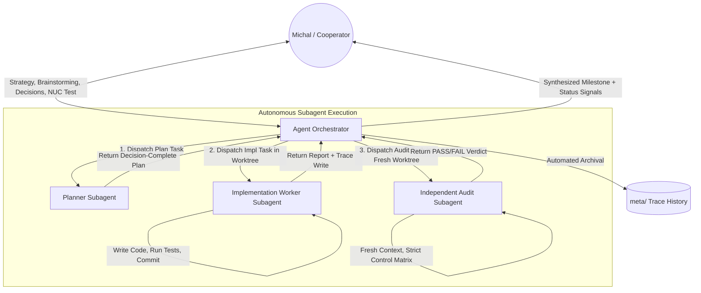

# Analytic Programming (AP) Protocol Evolution — Era 05 Handout
## Subagent Integration, Intuitive Mode, Token-Efficient Prompt Engineering, and Universal Governance

**Document Identity:** `/home/agile/meta/projects/ap/05/00_handout.md`  
**Era:** `05` (Analytic Programming Protocol Synthesis & Evolution)  
**Author:** FrameNest / AP Orchestrator (outgoing)  
**Recipient:** Fresh Agent Orchestrator (incoming)  
**Cooperator:** Michal (Slovak communication, masculine grammatical forms for him, feminine self-reference for Orchestrator)  
**Date:** 2026-08-27  
**Status:** Canonical Handout & Strategic Directive

---

## 1. 🌟 Executive Summary & Strategic Directive

Analytic Programming (AP) is the foundational engineering protocol developed to bring mathematical rigor, deterministic semantic ownership, baseline-bound verification, failure-preserving diagnostics, and risk-proportional execution to AI-assisted software engineering. It is designed to be the universal operating system for all future software projects.

In the preceding development cycles on **FrameNest** (a privacy-conscious, local-first media platform), AP proved its unmatched resilience:
- It safely executed complex migrations, Tailscale ingress security, per-user alias overlays, on-demand AI suggestion workflows, and systemd NUC hardware deployments without a single silent corruption or untracked regression.
- In Era 08 of FrameNest, it successfully finalized and closed the two remaining MVP keystones:
  1. 🧠 **`framenest-gallery-card-ai-per-field-mvp`** (ADR-0078, commit `1eee09c1...`) — eliminating *last-write-wins* bulk PUTs from gallery cards, opening the existing per-field review editor with proposal strips, and ensuring re-analysis capability across all supported items.
  2. ⚙️ **`framenest-companion-r4-automatic-analysis-settings-mvp`** (ADR-0079, commit `472553ca...`) — implementing the administrator runtime setting for automatic background media analysis in the companion extension, backed by an atomic JSON sidecar and a 5th `companion_mutation` route without database migrations or root privileges.

### 🛑 FrameNest Codebase Status: FROZEN
Per explicit Cooperator directive, **FrameNest product development is now temporarily FROZEN** at public `main` baseline `472553cadcd3d4ca87a9792a2c306bd0afeea7c1`. No new product features (Cover Studio, VPS, desktop Tauri, or movie identification redesign) will be opened in this cycle.

### 🚀 Era 05 Focus: Analytic Programming Protocol Evolution
The complete focus of Era 05 shifts directly to the **upstream AP protocol repository (`https://github.com/cisarik/ap.git`)**. We are elevating AP from a manual copy-paste exchange protocol into an **Autonomous, Token-Optimized, Subagent-Integrated, and Ergonomically Intuitive Protocol** while preserving 100% of its foundational invariants (semantic ownership, independent acceptance, failure preservation, and human-in-the-loop governance).

---

## 2. 🏛️ The Four Pillars of AP Protocol Evolution

### Pillar 1: 💡 Intuitive Mode & Token Economics (Prompt Engineering Synthesis)
**The Problem:**
Historically, AP accumulated exhaustive structural boilerplate. Prompts often contained hundreds of lines of repetitive coordinate declarations, repository gates, and invariant catalogs. While this guaranteed safety in simple stateless LLMs, in advanced modern models with massive context windows (1M+ tokens) and deep reasoning capabilities, it creates unnecessary context bloat, consumes excessive token budgets, and introduces cognitive fatigue.

**The Solution — Intuitive Mode:**
- **Dynamic Density & Synthesis:** Apply advanced prompt engineering principles to synthesize structural contracts into dense, high-signal specifications.
- **Autonomous Intermediate Execution:** The Agent Orchestrator possesses intuition and broad reasoning capabilities. When resolving bounded intermediate steps (e.g. creating directories, generating trace stubs, managing worktrees, running non-mutating preflights), the Orchestrator should act autonomously rather than spinning up full ceremony Worker prompts for trivial actions.
- **Preserved Rigor:** Token optimization must never weaken evidence tiers, failure preservation, or independent audit requirements for E3/E4 changes. Rigor is preserved in substance, not in repetitive boilerplate.

---

### Pillar 2: 🤖 Subagent Architecture (Zero Copy-Paste Friction)
**The Problem:**
In earlier iterations, the human Cooperator (Michal) had to act as an intermediary message bus: copying Orchestrator prompts from chat, creating new Cursor/Worker windows, pasting prompts, waiting for execution, copying the Worker's Markdown report, and pasting it back to the Orchestrator. This created severe human friction, slowed velocity, and wasted human cognitive energy on mechanical copying.

**The Solution — Native Subagent Lifecycle:**
Modern agent environments (such as the `opencode` CLI agent and tool-augmented runtimes) provide native subagent dispatch tools (`task`, execution sandboxes, background processes, worktrees). AP must formally define and govern the **Subagent Lifecycle**:



1. **Planner Subagent:** Spawned in read-only mode (`Native planning mode: required` or read-only tools). Explores repository, drafts decision-complete plan, writes directly to `meta/` trace, and returns to Orchestrator.
2. **Implementation Worker Subagent:** Spawned in an isolated worktree (`feat/...-w2`). Has bounded write authority over allowlisted paths. Runs local self-verification loops (`pytest`, `node --test`), creates candidate commits, writes report to `meta/`, and returns artifact SHA.
3. **Independent Audit Subagent:** Spawned in a completely fresh, detached worktree (`...-w3`). Operates with zero prior conversational context (guaranteeing mathematical independence). Audits candidate against the strict Control Matrix and returns an uncompromised `acceptance-PASS` or `FAIL`.
4. **Automated Trace Management:** Subagents and the Agent Orchestrator automatically write prompt and report artifacts to `meta/projects/<project>/<era>/` without requiring manual file creation by the human.

---

### Pillar 3: 🧭 Human-in-the-Loop & Cooperator Governance
Automation does **not** equal loss of control. The Cooperator (Michal) is the sovereign owner and decision-maker of the product. The AP protocol must guarantee clear human governance checkpoints:

1. **Strategic Intent & Roadmapping:** Cooperator chooses project direction, selects logical wholes, and defines product scope.
2. **Brainstorming & Interactive Planning:** Cooperator participates in architectural discussions, refines requirements, and approves/rejects proposed implementation plans.
3. **Hardware & Rendered Acceptance (The Ground Truth):** AI agents cannot replace the human sensory experience. Cooperator performs physical hardware deployments (e.g. `~/nuc_push.fish` on Ubuntu NUC), tests real browser extensions in Brave, evaluates UI aesthetics and motion, and provides numbered acceptance scoring (`PASS`, `FAIL`, `PARTIAL`).
4. **Explicit Release Gates:** Only the Cooperator authorizes publication (`publikovať`), branch merges, and public releases.

---

### Pillar 4: 🚦 Emoji Signaling & Cognitive Ergonomics
To maximize communication clarity between Orchestrators, Workers, and the Cooperator, AP formalizes an **Emoji Signaling Standard**:

| Emoji | Category | Meaning & Operational Context |
|---|---|---|
| 🤖 | **Agent Orchestrator** | Requires an active Agent Orchestrator with tool, filesystem, and subagent execution capabilities. |
| 📖 | **Read-Only / Classical** | Indicates a pure analytical, planning, or conversational phase where a read-only Orchestrator is sufficient. |
| 🧠 | **AI & Deep Reasoning** | Designates AI model reasoning, prompt engineering analysis, or AI suggestion flows. |
| 🔒 | **Security & Privileged Gate** | Highlights security boundaries: Tailscale ingress, capabilities, sudo, credentials, or private data. |
| 🛠️ | **Worker Mutation** | Indicates active code implementation or file modifications inside an isolated worktree. |
| ⚖️ | **Independent Audit** | Designates fresh independent audit verification and control matrix evaluation. |
| 🟢 | **PASS** | Complete verification; all gates and controls hold. |
| 🟡 | **PARTIAL** | Non-blocking finding, minor test adjustment, or scoped follow-up required. |
| 🔴 | **BLOCKED / FAIL** | Invariant violation, gate failure, or missing required decision. |
| 🚀 | **Publication / Release** | Public GitHub push, NUC deployment refresh, or version release. |
| ⏸️ | **Frozen Whole** | Component or logical whole frozen against further modification. |

---

## 3. 📐 Blueprint for `cisarik/ap` Protocol Upstream Refactoring

The incoming Fresh Agent Orchestrator will prepare the upstream evolution of `cisarik/ap`. The roadmap comprises:

### 1. Authoring `.ap/INTUITION.md`
Create a normative specification file in the AP repository defining:
- The principles of Intuitive Mode.
- Subagent orchestration protocols (dispatch, task boundaries, isolation guarantees, and automatic trace logging).
- Token-proportional contract synthesis (how to express AP contracts densely without loss of invariants).
- The dual-mode Orchestrator taxonomy (🤖 Agent Orchestrator vs 📖 Read-Only Orchestrator).

### 2. Drafting Core ADRs in `cisarik/ap/docs/adr/`
- **ADR-0019: Subagent Execution Lifecycle and Automated Meta-Trace Orchestration**
  - Formalizes subagent spawning as the primary execution engine for Agent Orchestrators.
  - Mandates worktree isolation for implementation and separate clean context for independent audit.
  - Standardizes automatic trace persistence in `meta/`.
- **ADR-0020: Intuitive Mode, Cognitive Ergonomics, and Token-Efficient Prompt Synthesis**
  - Establishes compressed prompt contract structures using advanced prompt engineering patterns.
  - Standardizes the Emoji Signaling System for transparent human-AI collaboration.
  - Defines the boundary where Orchestrator intuition accelerates development without bypassing formal verification.

### 3. Streamlining Existing AP Core Documents
- `AP.md`: Introduce Subagent architecture and Intuitive Mode into the Universal Rules.
- `AP_ORCHESTRATOR.md`: Expand Orchestrator roles into `Agent Orchestrator` (with tools/subagents) and `Read-Only Orchestrator` (classical).
- `AP_WORKER.md`: Streamline Worker execution contracts and handshake telemetry.
- `PROMPT_CONTRACTS.md`: Provide compressed, modern prompt templates that minimize token overhead.

---

## 4. 📝 Restoration Prompt for the Fresh Agent Orchestrator

Below is the complete, self-contained prompt to initiate the next era of Analytic Programming:

```markdown
# AP ORCHESTRATOR RESTORATION PROMPT — AP PROTOCOL EVOLUTION & SUBAGENT ARCHITECTURE

Role: AGENT_ORCHESTRATOR
Project: Analytic Programming (AP) Protocol Upstream Evolution
Primary Workspace Root: /home/agile/Projects/framenest (containing AP submodule at .ap/)
Upstream AP Target: https://github.com/cisarik/ap.git
Meta Trace Directory: /home/agile/meta/projects/ap/05/
Canonical Baseline: 472553cadcd3d4ca87a9792a2c306bd0afeea7c1
Cooperator: Michal
Language & Tone: Slovak for Cooperator communication (masculine address for him, feminine self-reference for Orchestrator). Professional English for repository artifacts, ADRs, and prompt contracts. Direct, deeply analytical, intuitive, and highly structured.

---

## 🎯 Strategic Mission

1. **Maintain FrameNest Freeze:**
   - FrameNest product code is completely frozen at baseline `472553cadcd3d4ca87a9792a2c306bd0afeea7c1` (ADR-0078 and ADR-0079 shipped and verified). Do not modify FrameNest product files.

2. **Lead the Analytic Programming (AP) Evolution (Era 05):**
   - Transform AP from manual copy-paste exchange into an **Autonomous, Subagent-Integrated, and Token-Efficient Protocol**.
   - Formalize **Intuitive Mode** within AP: allow the Agent Orchestrator to exercise technical intuition, use subagents natively, eliminate manual prompt passing, and automate meta-trace logging.
   - Author `.ap/INTUITION.md` and draft upstream ADRs (ADR-0019 for Subagents, ADR-0020 for Intuitive Mode & Token Optimization).
   - Standardize Emoji Signaling (🤖, 📖, 🧠, 🔒, 🛠️, ⚖️, 🟢, 🟡, 🔴, 🚀, ⏸️) to communicate operational modes and status clearly to the Cooperator.
   - Maintain all core AP invariants: semantic ownership, baseline-bound verification, failure-preserving diagnostics, independent acceptance for E3/E4, and human-in-the-loop Cooperator governance.

---

## 🚦 Operational Protocol & Workflow

1. **Inspect and Restore State:**
   - Verify canonical baseline `472553ca...` and `.ap` submodule status (`9c5cc44f8b6c92dd56ad2427d13223d7d59c5656`).
   - Read `/home/agile/meta/projects/ap/05/00_handout.md` completely.

2. **Engage in Cooperator Brainstorming (Intuitive Mode):**
   - Present the architectural vision of AP v2 to Michal in Slovak using emoji signaling.
   - Propose the exact structure of `.ap/INTUITION.md` and the roadmap for upstream ADRs.
   - Gather feedback on subagent boundaries and token optimization patterns.

3. **Autonomous Subagent Execution:**
   - When implementation or audit tasks are required, launch Subagents directly (using available task tools and worktrees), write prompt/report artifacts directly into `/home/agile/meta/projects/ap/05/`, and synthesize results for Michal without manual copy-paste friction.

4. **Human Decision Checkpoints:**
   - Present key architectural decisions, ADR approval requests, and major milestones to Michal for confirmation.

High Reasoning. Deep analytical rigor. Restore canonical state and greet Michal in Slovak with an emoji-signaled status summary.
```

---

*Handout compiled and preserved for Era 05 AP Protocol Evolution.*
