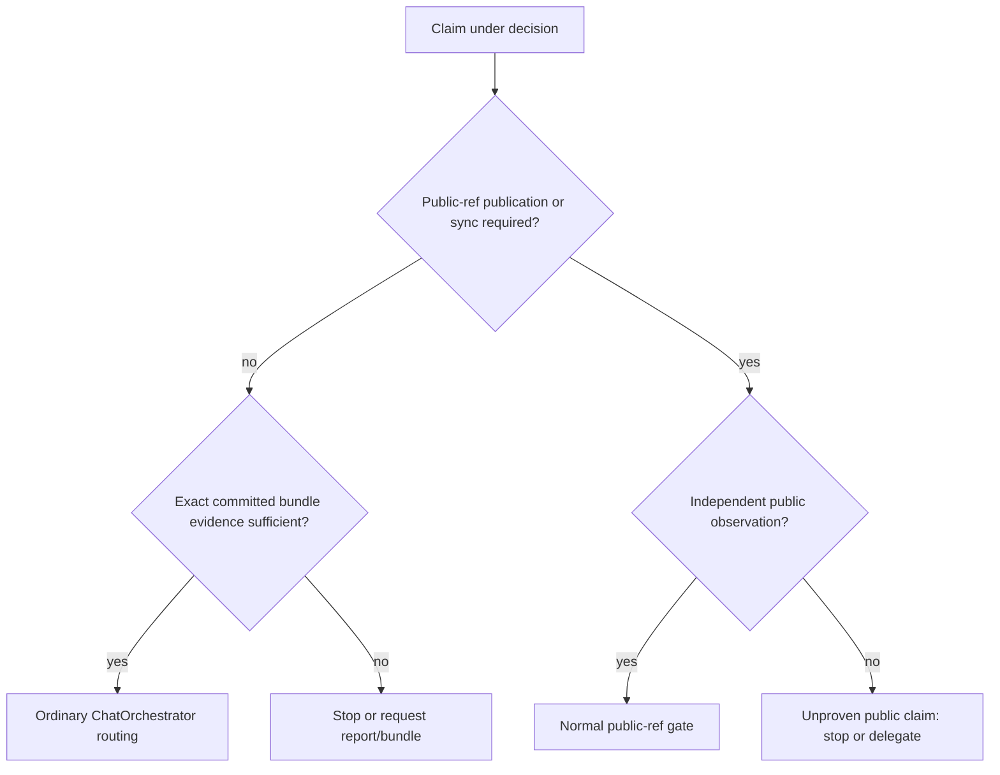

### Report for ORCHESTRATOR_CHAT

Logical whole identity: `chat-orchestrator-offline-bundle-transport`
Worker session ordinal: `01`
Worker exchange ordinal: `01`
Persistent role identity: WORKER
Worker session profile: Planner
Worker session target: fresh-worker-session
Planning layer: implementation-planning
Orchestration planning owner: ORCHESTRATOR
Implementation in same Worker session: prohibited
Plan disposition: approval-gated
Delivery route: manual Cooperator delivery

This is a terminal implementation-planning report. It does not implement, commit, push, edit AP or Meta, or change consumer pins.

---

## 1. Verified baseline and repository state

Independently verified from the Cooperator's local canonical checkout:

- Worktree: [`/home/agile/Projects/ap`](/home/agile/Projects/ap)
- Inside worktree: yes; not a superproject submodule
- `remote.origin.url`: `https://github.com/cisarik/ap.git` (canonical)
- Local branch: `feat/ap-practical-workflow-consolidation` tracking `origin/feat/ap-practical-workflow-consolidation`
- HEAD: `717ecb6cfb7c71eda12ff4e3e0b02f28101c59bf`
- Public `origin/main` via `git ls-remote origin refs/heads/main`: **same SHA**
- Local `origin/main`: same SHA; HEAD is an ancestor of (equals) public `main`
- Worktree and index: **clean** (`git status --porcelain=v1` empty)
- Latest subject: `docs: add ADR-0024 on reliable execution and cooperator experience`
- Executable [`ap`](ap): POSIX `/bin/sh`, mode `100755`, Git 2.55.0
- `git archive` formats include `zip`; **`zip(1)` is not installed** on this host; `python3` is present
- Neighbor layout (UX evidence, not AP protocol): [`~/Projects/ap`](/home/agile/Projects/ap), [`~/Projects/framenest`](/home/agile/Projects/framenest), Meta at [`~/meta`](/home/agile/meta) with origin `https://github.com/cisarik/meta.git` — **not** under `~/Projects/`
- FrameNest `.ap` gitlink is `7ef45da756ed3cc14808e89bf25d0a9f9aba5d26` (older than this AP HEAD). Consumer pin update remains a later separate operation.

Planning proceeds from this exact commit. Branch name is not `main`, but the commit identity equals public `main`.

---

## 2. Confirmed or disproven audit findings

**Confirmed (semantic conflict is real, not prompt folklore):**

1. Phase-specific gates: public-ref gates apply only when publication authority exists ([AP.md Phase-Specific Gates](AP.md#phase-specific-gates)).
2. §12 is capability-adaptive: independent public inspection “when a public remote is available”; DNS failure should record the failed capability and use another authorized method ([AP.md §12](AP.md#12-validation-and-public-verification)).
3. RF-19 nevertheless tells a ChatOrchestrator retrieving a manually delivered report to “verify the canonical public commit” before reconciliation ([AP.md RF-19](AP.md#rf-19-external-analytic-trace-and-worker-exchange-identity) around the manual-delivery paragraph).
4. Restoration: “The fresh Orchestrator must verify repository and public truth independently before continuing” ([AP.md §14](AP.md#14-session-rotation-and-dynamic-prompts)). Fresh Orchestrator Restoration in [PROMPT_CONTRACTS.md](PROMPT_CONTRACTS.md) lists “verified public commit” as evidence and “stop if public state … cannot be classified honestly.”
5. Continuation Stage 1 requires verifying “current public or external anchors relevant to the task” ([AP.md Continuation Bootstrap](AP.md#continuation-bootstrap) and [AP_ORCHESTRATOR.md](AP_ORCHESTRATOR.md#continuation-bootstrap)). Combined with RF-19 and restoration, a ChatOrchestrator DNS/`git ls-remote` failure becomes a hard stop before ordinary next-Worker routing even when publication is not the decision.

**Confirmed (dispatch / first-Planner):**

- Live AP: every new logical whole starts with a **manually delivered** Planner; subsequent route is Cooperator-selected; pending selection defaults to manual ([AP.md Orchestration Planning](AP.md#orchestration-planning-and-implementation-planning), [AP.md §3](AP.md#3-instances-sessions-and-worker-session-profiles)).
- ADR-0023 explicitly replaced ADR-0022’s Agent-Orchestrator default dispatch. Historical ADR bodies must stay historical.

**Confirmed (CLI):**

- `init` / `doctor` / `update` call `require_context`, which **fails unless** the tool runs from an initialized `.ap` submodule. `bundle` cannot be added by extending that helper as-is.
- `project check` / `exec` already take an explicit physical `--root` and do not use `require_context`. That pattern is the right precedent for locating a consumer repo.

**Challenges / improvements vs the prompt (do not blindly agree):**

- `$HOME/Projects/<name>` is a **Cooperator-local convenience**, not a universal AP machine layout. Meta lives at `~/meta`, not `~/Projects/meta`. Sibling-guessing would miss the actual trace repo and would violate RF-19 “never scan for guessed names.”
- A Git bundle **is** the native offline transport. The ZIP is only a multi-file wrapper for ChatGPT attach. Do not depend on `zip(1)`; wrap with `git archive --format=zip` in a **temporary** Git repo (this host has archive-zip and no `zip`).
- `git bundle create <file> HEAD` includes **all ancestors of HEAD**, not ignored worktree files. That matches the security goal. It also includes historical blobs no longer in HEAD — secret policy must scan reachable history, not only the current tree.
- Schema v1 [`ap.project.conf`](ap.project.conf) is **closed** (ADR-0012). Do not store companion-trace mapping or absolute paths there. `extension.*` keys are ignored and cannot drive execution; stuffing transport into them would still risk committing private paths.
- ADR-0015 forbids recreating a protocol mega-suite. The required smoke matrix should be **implementation-session disposable fixtures**, not a committed `tests/` tree.
- Inspection-clone text in §3 currently says the clone exposes “verified **published** content.” That wording already over-couples ChatOrchestrator inspection to public GitHub and must be corrected with the evidence split.
- Native planning mode for the first Planner and **delivery route** are currently fused. They must be split: native mode stays required; manual ferry is not required for a full Orchestrator with authorized dispatch.
- FrameNest `AGENTS.md` still describes ADR-0022 default dispatch. That is consumer-pin lag; **do not edit FrameNest** in this whole.

---

## 3. Exact semantic conflicts and authoritative locations

| Conflict | Live owner | Stale/over-strong projections |
|---|---|---|
| Public-ref only when publication exists vs RF-19 “verify canonical public commit” on manual report retrieval | [AP.md RF-19](AP.md#rf-19-external-analytic-trace-and-worker-exchange-identity); gates in [Phase-Specific Gates](AP.md#phase-specific-gates) | [AP_ORCHESTRATOR.md Worker Exchange Coordinates](AP_ORCHESTRATOR.md#worker-exchange-coordinates-and-optional-trace) step 2 (“verify its canonical commit”) |
| Capability-adaptive §12 vs restoration hard public gate | [AP.md §12](AP.md#12-validation-and-public-verification) | [AP.md §14](AP.md#14-session-rotation-and-dynamic-prompts) “verify repository and public truth independently before continuing”; [PROMPT_CONTRACTS Fresh Orchestrator Restoration](PROMPT_CONTRACTS.md) evidence/stop rule |
| “Public committed state is stronger than local uncommitted” lacks a third class | [AP.md §4](AP.md#4-source-of-truth-and-evidence) | [GLOSSARY.md](GLOSSARY.md) Evidence row; Orchestrator “verify public commits when available” ([§7](AP.md#7-orchestrator-responsibilities)) is almost right but does not name bundle evidence |
| Inspection clone = published content | [AP.md §3](AP.md#3-instances-sessions-and-worker-session-profiles) | [GLOSSARY.md](GLOSSARY.md) ChatOrchestrator |
| First Planner always manual vs full Orchestrator dispatch | [AP.md Orchestration Planning](AP.md#orchestration-planning-and-implementation-planning) + [§3](AP.md#3-instances-sessions-and-worker-session-profiles) | [PROMPT_CONTRACTS Session-And-Mode](PROMPT_CONTRACTS.md#session-and-mode-routing-contract) (“manual delivery”, “then paste”); [INTUITION.md §4](INTUITION.md); [FAQ.md planning](FAQ.md); P14 pointer in [PROMPT_ENGINEERING_PATTERNS.md](PROMPT_ENGINEERING_PATTERNS.md); ADR-0023 remains historical |
| Capsule emoji+state vs PASS | [AP.md Communication Routing](AP.md#communication-routing) already says ready/waiting do not claim PASS | [INTEGRATION.md](INTEGRATION.md) and [PROMPT_CONTRACTS.md](PROMPT_CONTRACTS.md) examples; consumer palettes (e.g. FrameNest 🟢 = “PASS”) remain project-owned |

No new RF family. Own the change under existing RF-06 (access vs dispatch vs GitHub), RF-12 (non-mutating Git evidence), RF-15 (`ap` executable), RF-19 (retrieval/trace discovery), plus §3, §4, §12, §14, Continuation Bootstrap.

---

## 4. Proposed final semantics: bundle vs public evidence

Introduce exactly two named evidence classes (English spellings owned in AP.md):

```text
exact committed bundle evidence
independently observed current public branch evidence
```

A verified ChatOrchestrator transport ZIP may establish the first class for included Git objects:

- exact commit SHA (not a synthesized lookalike)
- parent/tree/blob content present in the bundle (and declared prerequisites)
- diffs derivable from those objects
- exact `.ap` gitlink and reconstructed `.ap` HEAD
- exact bundled companion-trace commit when configured

It must **not** establish: current GitHub branch head, successful push, remote-tracking state, Cooperator uncommitted worktree, absence of newer public commits, or sender authenticity beyond internal Git object consistency.

Mandatory limitation string when GitHub was not independently observed:

```text
public branch state not directly observed
```

Never silently promote bundle evidence to public evidence. A later Worker/full Orchestrator with GitHub access still runs the normal repository/public gate before any mutation or push that requires it.

ChatOrchestrator may continue **ordinary routing** (next Planner/Worker, reconciliation of a relayed or bundled report) when the claim under decision is covered by bundle evidence plus Cooperator-relayed bytes. It must stop or delegate when the transition genuinely requires public-ref, publication equality, or remote synchronization.

Inspection clone: ephemeral cache of reconstructed **committed** state from authorized evidence (bundle and/or public). It is never the Cooperator worktree and never durable continuity. Lost cache ⇒ request a new `--initial`, never GitHub/mirrors/pinned IPs/guessed recovery.



---

## 5. Exact CLI contract for `ap bundle`

Invoked from the **standalone AP checkout** (typical: `~/Projects/ap/ap`). Must not require AP to be the consumer’s `.ap` submodule. Must not call `require_context` as it exists today.

```text
ap bundle <project> --initial
    [--root <absolute-physical-git-root>]
    [--projects-root <absolute-physical-directory>]
    [--companion-trace <absolute-physical-git-root>]
    [--include-submodule <project-relative-path>]...
    [--allow-path <project-relative-path>]...
    [--output-dir <absolute-directory>]
    [--replace-chain]

ap bundle <project>
    [--root <absolute-physical-git-root>]
    [--include-submodule <project-relative-path>]...
    [--allow-path <project-relative-path>]...
    [--output-dir <absolute-directory>]

ap bundle --help
```

Simple form `ap bundle framenest --initial` then `ap bundle framenest` is the primary UX and must not be displaced by `--root`.

**Name resolution (not machine-specific protocol):**

1. `--root` if given: must be `pwd -P` Git worktree top; no `..`; identity recorded.
2. Else chain-state mapping for `<project>` from a prior `--initial`.
3. Else `<projectsRoot>/<project>` where `projectsRoot` is the first existing directory among: `--projects-root`, `AP_PROJECTS_ROOT`, user config `bundle.projectsRoot`, and **only as convenience** `$HOME/Projects` if that directory exists.
4. Else fail with the `--root` form. Never scan arbitrary sibling repositories.

`<project>`: `^[A-Za-z0-9][A-Za-z0-9._-]*$` (no slashes, no `..`).

**Special case (repository analysis):** if the target is canonical AP (`normalize_ap_url` succeeds on origin), `.ap` submodule is **not** required; the project bundle *is* AP. For every other project, initialized `.ap` matching the gitlink is required.

**Export is read-only on the source:** no commit, push, fetch, ls-remote, clone of remotes, checkout, submodule update, remote/config/pin mutation. Temporary staging **outside** the project (and outside AP source objects) is required and must be cleaned.

Do not reuse `project_clean_stage` (it destroys `HOME`/XDG). Do not change `init`/`doctor`/`project`/`exec`/`update` behavior beyond extracting `require_tool_repository` from `require_context`.

---

## 6. ZIP / package structure

Generated ZIP (unique name, never overwrite):

```text
<project>-ap-transport-<initial|update>-<UTC-YYYYMMDDThhmmssZ>-<head12>.zip
```

Inner tree (Git-config manifest, no JSON parser dependency):

```text
manifest.conf
IMPORT.md
checksums
project.bundle
ap.bundle            # omitted only for canonical-AP special case
companion-trace.bundle   # only if configured
```

Create the ZIP by committing those files into a throwaway Git repo and `git archive --format=zip -o dest HEAD`. Do not `git hash-object -w` into the **source** object database.

`manifest.conf` (git-config syntax, `git config -f` parseable) must make reconstructable at least:

- `bundle.schemaVersion=1`
- `bundle.transportKind=chat-orchestrator-offline-git`
- `bundle.packageKind=initial|incremental`
- project identity, configured origin URL, HEAD, initial/base commit, branch or `detached`
- exact AP gitlink (or `not-applicable` for canonical AP)
- exporter AP commit (tool worktree HEAD; tool `ap` blob must match `HEAD:ap`)
- creation time (UTC)
- included companions/submodules
- integrity hashes of payload files
- `bundle.publicVerification=not-performed`
- `bundle.evidenceClass=exact-committed-bundle-evidence`
- `bundle.publicBranchState=not-directly-observed`
- any `--allow-path` exceptions

`IMPORT.md` is generated operational reconstruction text for the ChatOrchestrator. It is not a live semantic owner. Orchestration meaning remains in the reconstructed `.ap/AP.md` after consumer pin adoption.

---

## 7. Initial and cumulative-incremental algorithms

**Preconditions (fail-closed, no mutation to “make it pass”):**

- physical worktree root; HEAD resolves to a commit; not shallow; no `refs/replace`
- clean index/worktree for non-ignored state (`status --porcelain=v1 --untracked-files=all` empty) on project, `.ap`, and configured companion
- configured `remote.origin.url`; record it without contacting it
- `.ap` present, gitlink 160000, HEAD equals gitlink, canonical AP URL in `.gitmodules` (except canonical-AP special case)
- no Git LFS filter in use without a separately designed object transport (fail: bundle would contain pointers only)
- no other submodules unless each is listed in `--include-submodule` and the gitlink commit is present locally
- suspicious-path scan (section 9) passes
- exporter AP checkout clean and `ap` matches `HEAD:ap`
- `--initial` with an existing chain fails unless `--replace-chain`

**Initial:**

- `git bundle create project.bundle HEAD` plus the current branch ref if attached (ancestors of HEAD only, not `--all` stale branches)
- `git bundle create ap.bundle <gitlink>` from the `.ap` checkout
- companion similarly if configured
- record chain: projectId, absolute root, origin, initial HEAD, initial AP gitlink, companion identity/root/initial commit

**Incremental (`ap bundle framenest`):**

- load chain; verify origin/projectId still match; current HEAD must have recorded initial commit as ancestor (`merge-base --is-ancestor`)
- same for AP gitlink and companion if configured; non-ancestor ⇒ fail, instruct `--initial --replace-chain`
- if HEAD equals initial and AP/companion unchanged ⇒ fail “nothing new”
- `git bundle create project.bundle <initialCommit>..HEAD` (cumulative from **initial baseline**, not from last ZIP)
- AP: if gitlink unchanged, omit `ap.bundle` and mark unchanged-from-initial; if forward, `initialAp..currentAp`; else fail
- companion: same cumulative-from-initial rule

Newest update supersedes older incrementals for reconstruction. A Cooperator who discarded update 1 and 2 can still apply update 3 onto the original initial snapshot. Replaying a long historical chain after days/weeks is **not** required: a fresh ChatOrchestrator should receive a newly generated `--initial`.

---

## 8. State-storage and output-location design

Split hidden state from attachable packages:

- State: `${XDG_STATE_HOME:-$HOME/.local/state}/ap/bundle/<owner>--<repo>/chain.conf` (git-config)
- Optional user config: `${XDG_CONFIG_HOME:-$HOME/.config}/ap/bundle.conf` (`bundle.projectsRoot`, `bundle.outputDir`)
- Packages: `--output-dir`, else config `bundle.outputDir`, else `$XDG_DOWNLOAD_DIR` / `$HOME/Downloads` if that directory exists, else `${XDG_STATE_HOME:-$HOME/.local/state}/ap/bundle/packages/`
- Always print the absolute ZIP path
- Never write transport state or ZIPs into the consuming project’s tracked tree
- Never overwrite an existing ZIP path

`--initial` records the name→root mapping so later `ap bundle framenest` needs no `--root`. Absolute paths stay user-local, not in AP protocol files.

---

## 9. `.gitignore`, tracked files, historical secrets

The package is **only Git objects** (bundles). Ignored/untracked `.env`, `.venv/`, `node_modules/`, `build/`, `dist/`, caches, editor files, local binaries **cannot enter** merely because they exist on disk.

Accurate limitations (document in AP.md + generated IMPORT.md):

- `.gitignore` does not untrack an already tracked file and does not sanitize history
- an initial bundle can contain historical objects absent from current HEAD
- filename scanning **does not prove absence of secrets**
- legitimate tracked binary assets that belong to the commit are unavoidable; they are not the same as ignored build/runtime binaries
- do not strip objects to “sanitize” — that would destroy commit identity

Fail-closed scan of currently reachable paths in the objects about to be bundled (initial: ancestors of HEAD; incremental: `initial..HEAD`), conservative names such as:

- `.env`, `.env.*` except a documented allow-list candidate `.env.example` only if we keep the scan conservative enough to still fail on `.env`
- `id_rsa` / `id_dsa` / `id_ecdsa` / `id_ed25519` without `.pub`
- `*.pem`, `*.p12`, `*.pfx`, `*.key`, `*.keystore`, `*.jks`
- `credentials.json`, `secrets.json`, `secrets.yaml`, `.netrc`, `.pypirc`

On hit: refuse with the path list. Do not export. Optional `--allow-path <relpath>` records an explicit Cooperator exception in the manifest; no silent ignore. No `--force-export-secrets`.

---

## 10. `.ap` and other submodules

- Superproject bundle contains **gitlinks**, not submodule trees.
- `.ap` is required (except canonical-AP special case) and must be bundled at the **exact gitlink SHA**.
- Other submodules: default **fail-closed** listing paths; `--include-submodule` bundles that path’s gitlink commit from a local checkout only. No network fill. Manifest lists included vs excluded.
- Never claim a “complete repository snapshot” if any gitlink content is omitted.
- Reconstruction: `git clone project.bundle` **without** `--recurse-submodules`; then `git clone ap.bundle .ap`; verify `HEAD:.ap` equals `.ap` HEAD; `git remote set-url` to canonical URLs **without fetch**.

---

## 11. External trace / companion-repository design

**Recommend user-level transport mapping established at `--initial`, not project-tree declaration and not sibling scan.**

Why:

- RF-19 already owns trace semantics; implementations own storage/discovery. Absolute Cooperator paths must not enter the consuming Git tree.
- `ap.project.conf` schema v1 is closed; identity URLs in AGENTS.md would still not locate a local checkout without scanning.
- Meta is not under `~/Projects/`; guessing siblings fails this Cooperator’s real layout.
- Private traces must never be uploaded merely because they exist.

`--companion-trace <physical-root>` on `--initial` records origin URL, projectId-like identity, and initial commit in chain state. Later `ap bundle framenest` includes a cumulative companion bundle automatically. Public status of the companion remains a distinct unproven claim.

If the activated workflow needs `01_report_00.md` and no companion is configured, ChatOrchestrator uses RF-19’s already-legal **complete report relay**, or asks the Cooperator to rerun `--initial` with `--companion-trace`. Do not hardcode `cisarik/meta`.

---

## 12. ChatOrchestrator reconstruction / import algorithm

Treat container checkout as ephemeral cache.

**Initial ZIP:**

1. Unpack; parse `manifest.conf` with `git config -f`; verify checksums and `publicVerification=not-performed`.
2. `git bundle verify` each included bundle.
3. Clone project bundle; clone `ap.bundle` into `.ap`; clone companion if present — all local.
4. Confirm reconstructed HEADs equal advertised SHAs (exact objects, not lookalikes).
5. Set canonical remote URLs for identity only; do not fetch.
6. Record `public branch state not directly observed` unless separate actual public evidence exists.
7. Proceed with ordinary orchestration using bundled committed state + AP pin.

**Incremental ZIP:**

1. Inspection checkout and prerequisite objects from the **same chain initial** must still exist.
2. `git bundle verify` (native prerequisite check); fetch from the bundle file; checkout advertised HEAD; repeat for AP/companion as advertised.
3. If prerequisites missing or checkout gone: **request new `--initial`**. Do not contact GitHub.

Generated `IMPORT.md` carries this procedure. Conversational memory never substitutes for Git state.

---

## 13. Full Orchestrator vs ChatOrchestrator delivery semantics

Prospective correction in AP.md §3 + Orchestration Planning; new **ADR-0025** records partial supersession of ADR-0023’s “first manual Planner” delivery rule (not native-mode rule). Do not rewrite ADR-0022/0023 bodies.

Axes remain separate: GitHub capability ≠ dispatch capability ≠ access profile ≠ session freshness ≠ independence.

Target behavior:

- **ChatOrchestrator:** Cooperator manual ferry is the normal route (prompts and results).
- **Orchestrator with authorized functional dispatch, no opt-out, independence/fresh-session requirements not forbidding in-client dispatch:** Orchestrator dispatches the **complete** Worker prompt. This includes the first Planner of a new whole. The Cooperator is not a copy/paste courier merely for being first Planner.
- **Dispatch unavailable/failed/opt-out:** manual fallback.
- **Independent acceptance / required external fresh session:** RF-05 still forces an external/manual fresh session.
- First Planner still requires **actual native planning mode enabled**; that is a mode axis, not a delivery-route axis.
- Preserve Cooperator sovereignty and explicit opt-out (P14 remains lawful).

Stale live projections to update (not historical ADR bodies): AP.md §3 and Orchestration Planning; PROMPT_CONTRACTS session-and-mode table and “manual delivery” first-Planner sentence; INTUITION.md §4; FAQ planning; P14 “initial Planner owner” sentence; AP_ORCHESTRATOR capability/dispatch section; CHANGELOG unreleased (new entry, do not rewrite old ADR-0022/0023 history). Delivery-record examples may keep `Delivery route: manual Cooperator delivery` as **one valid example**, but must not imply it is the only first-Planner route.

---

## 14. Presentation-signal disposition

**In-scope small clarification, not a palette takeover.**

Keep: required visible capsule with emoji **plus** textual state; project owns emoji/localization; emoji is not task or closure authority (ADR-0022 rejection stands).

Add in [Communication Routing](AP.md#communication-routing) a short vocabulary: capsule textual states (`ready`, `waiting`, `blocked`, plus existing `partial` where used for routing) are **routing presentation**. They are not Implementation/Acceptance/Publication PASS or ORCHESTRATOR closure. Ready/waiting already “do not claim terminal PASS”; make the English tokens explicit so 🟢/🟡/🔴 mapping cannot smuggle PASS.

Align [INTEGRATION.md](INTEGRATION.md) non-normative example labels only. Do not edit FrameNest. No separate follow-up whole is required if the change stays this small.

---

## 15. Exact files expected to change

**Change and why:**

- [`AP.md`](AP.md) — sole live owner: evidence classes; §3 inspection clone + delivery defaults; RF-19 retrieval; §4; §12; §14 restoration; Continuation Bootstrap; Communication Routing tokens; RF-15/`ap` mention; anti-pattern for bundle-as-public
- [`ap`](ap) — `require_tool_repository` split; `bundle` command; usage text
- [`docs/adr/0025-chatorchestrator-offline-bundle-transport.md`](docs/adr/0025-chatorchestrator-offline-bundle-transport.md) — new ADR (partial supersession of ADR-0023 first-manual delivery; adds bundle evidence)
- [`docs/adr/README.md`](docs/adr/README.md) — index + relationship paragraph
- [`AP_ORCHESTRATOR.md`](AP_ORCHESTRATOR.md) — continuation, report retrieval, restoration classification, dispatch defaults
- [`PROMPT_CONTRACTS.md`](PROMPT_CONTRACTS.md) — restoration evidence/stop; session-and-mode; capsule example tokens
- [`GLOSSARY.md`](GLOSSARY.md) — ChatOrchestrator, two evidence classes, bundle transport
- [`FAQ.md`](FAQ.md) — ChatOrchestrator without GitHub; first-Planner delivery
- [`INTUITION.md`](INTUITION.md) — dispatch vs first Planner
- [`INTEGRATION.md`](INTEGRATION.md) — offline reconstruction pointer; capsule example
- [`README.md`](README.md) — `ap bundle` usage
- [`UPDATING.md`](UPDATING.md) — pin-time discoverability of the new executable (same hook style as ADR-0022)
- [`CHANGELOG.md`](CHANGELOG.md) — unreleased entry
- [`PROMPT_ENGINEERING_PATTERNS.md`](PROMPT_ENGINEERING_PATTERNS.md) — P14 pointer only if it would otherwise stay false

**Inspected, recommend unchanged:**

- [`AP_WORKER.md`](AP_WORKER.md) — Workers keep normal Git/GitHub; no bundle-as-public owner here
- [`ARTIFACT_LIFECYCLE.md`](ARTIFACT_LIFECYCLE.md) — no public-commit hard gate found
- [`INFOSEC.md`](INFOSEC.md) — activated advisory; secret **policy** for export lives in AP.md
- [`ap.project.conf`](ap.project.conf) / schema v1 — closed; no companion paths
- Historical ADR-0022/0023/0024 **bodies**
- Consumer repos and pins (FrameNest, Meta)

---

## 16. Backward-compatibility impact

- Prospective documentation + new executable command.
- Existing `init`/`doctor`/`project`/`exec`/`update` contracts unchanged.
- Managed `AGENTS.md` block unchanged.
- Schema v1 unchanged.
- Historical prompts/pins keep original meaning (first Planner manual; public-commit retrieval).
- Consumers adopt only by moving `.ap` gitlink after AP publication/acceptance.
- Leftover XDG chain state after rollback is inert.

---

## 17. Practical validation matrix

Per ADR-0015: **no** committed mega-suite. Implementation Worker runs disposable temp Git repositories (and a throwaway companion) as one-shot evidence in the report. Optionally a tiny untracked script in `/tmp`, not `tests/`.

Cover:

- successful `--initial` export
- reconstruction without network (`GIT_ALLOW_PROTOCOL=file` / invalid HTTP proxy / no `fetch`/`ls-remote` in `ap` bundle path)
- cumulative incremental export/import
- skip intermediate incremental (initial + update3 reconstructs C)
- dirty source refusal
- non-ancestor / rewritten baseline refusal
- missing or mismatched `.ap` refusal
- suspicious tracked/history path refusal
- ignored `.env` absent from bundle (`git bundle list-heads` / clone / `git show HEAD:.env` fails)
- changed AP pin forward in incremental
- missing prerequisite on ChatOrchestrator side
- unexpected extra submodule refusal
- configured companion included with explicit provenance; unconfigured Meta not guessed
- no GitHub/network during export (command audit + forced-fail proxy still PASS)
- `init`/`doctor`/`project`/`exec`/`update` still work from a dummy `.ap` submodule fixture
- ZIP uniqueness / no overwrite
- canonical AP self-bundle without `.ap`
- `zip(1)` unused

---

## 18. Security / privacy and failure-mode review

- Worktree ZIP is forbidden; ignored secrets stay out; tracked/historical secrets fail closed
- Private companion included only with explicit `--companion-trace`
- Manifest states no public verification
- Remote URLs in the inspection clone are identity, not observed public state
- Path traversal rejected; physical roots only
- Temp dirs cleaned; no writes into source object DB
- LFS/shallow/replace-refs refused
- `--allow-path` is an explicit exception list in the ZIP, not a silent hole
- Filename scan never claimed complete
- ChatOrchestrator must not be instructed to fetch GitHub as recovery

Failure modes: dirty tree, wrong project name, chain/project mismatch, non-ancestor, missing `.ap`, extra submodule, secrets, missing companion when reports live only there, lost inspection cache, ZIP attach too large for ChatGPT (Cooperator operational limit; not solved by protocol — `--initial` of huge history may need Cooperator awareness; do not silently shallow).

---

## 19. Rollback strategy

Revert the AP commit(s) on `main`/candidate. Historical ADRs remain. Delete or ignore XDG `ap/bundle` state. Consumers that never moved `.ap` are unaffected. If a consumer pinned the new AP, roll the gitlink back via existing `ap update`/checkout candidate workflow in [UPDATING.md](UPDATING.md).

---

## 20. Smallest implementation slices and Worker profile

Recommended: **one** fresh Implementation Worker, `Native planning mode: not-used`, High reasoning, mixed POSIX sh + documentation, no browser, no independent-acceptance claim, security-sensitive export.

Internal order inside that grant:

1. Split `require_context` → `require_tool_repository` without behavior change to existing commands
2. Implement `ap bundle` export (initial, incremental, safety, XDG, zip-via-git-archive)
3. Generate `IMPORT.md` + checksums + manifest
4. AP.md semantic corrections + ADR-0025 + listed projections
5. Run the disposable smoke matrix; report results

Do not implement in the Planner session.

---

## 21. Material findings that change the design

1. **Meta is `~/meta`, not a Projects sibling** — companion must be explicit opt-in; name-only `ap bundle framenest` can still work after `--initial --companion-trace`.
2. **`zip(1)` missing, `git archive` zip present** — do not add a zip dependency.
3. **`require_context` submodule requirement** is the actual blocker for standalone `~/Projects/ap/ap bundle`; smallest helper split is sufficient; do not build a framework.
4. **§3 “verified published content”** is an additional hard-coded coupling beyond RF-19/restoration.
5. **First Planner × manual delivery × native mode** are fused; only delivery should change for full Orchestrators.
6. **FrameNest still ships ADR-0022 dispatch prose** at pin `7ef45da…`; out of scope.
7. **Cumulative `A..HEAD` git bundles** are native Git; do not invent a custom pack format.
8. **Canonical AP has no `.ap` gitlink** — required special case or `ap bundle ap` cannot support AP’s own ChatOrchestrator sessions.

The design succeeds only if a ChatOrchestrator reconstructs exact committed project continuity without GitHub, while every other AP actor keeps normal Git/GitHub behavior, and bundle hashes are never relabeled as independently observed public heads.
