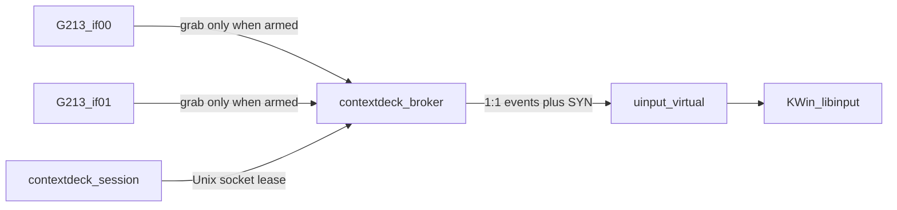

### Report for ORCHESTRATOR_CHAT

Logical whole identity: g213-contextdeck-input-passthrough-safety
Worker session ordinal: 01
Worker exchange ordinal: 01

- status: **PASS**
- Phase-qualified result: not-applicable
- Result artifact or commit: not-applicable
- Result evidence: bounded read-only planning evidence
- Logical-whole closure: not-closed
- Start commit: `b5c4be6b179a3df6e3f3803c02d819c1a7b4fe8c`
- End commit: `b5c4be6b179a3df6e3f3803c02d819c1a7b4fe8c`
- Changed files: none
- Tests: not run (plan-only)
- Commit/push: none / not authorized
- Report justification: new-evidence
- Authority expiry: planning authority expired at submission of this terminal report
- Planning cycle: initial; targeted revisions used: 0
- Implementation in this session: prohibited

PASS means the plan is decision-complete and routable. Gates **G1, G3, G4 remain open** as implementation/acceptance gates, not as planning incompleteness.

## Capability handshake

- Product/client/model: requested as this Cursor session; identity not independently attested.
- Reasoning: high requested; not independently measurable.
- Native planning mode: required; **directly observed** (Plan Mode + CreatePlan).
- Filesystem: read-only inspection exercised on product, AP, META, headers, udev, `/dev/input`.
- Network: public kernel-source confirmation of `evdev_release` → `evdev_ungrab` only; no product mutation.
- Tests/commit/push: not exercised.
- Sub-agents: not used (project hard rule).
- Secrets/serials: not probed; USB serials and uniq strings redacted from this report.
- Continuity: COOPERATOR-carried Worker prompt in a session that also loads Orchestrator AGENTS.md. Baseline was re-verified. This is **not** independent acceptance (not required for planning).

## Repository gate (verified)

- Root `/home/agile/Projects/contextdesk`, remote `https://github.com/cisarik/contextdesk.git`, branch `main`, worktree **clean**.
- HEAD and expected HEAD match: `b5c4be6`.
- `origin/main`: `ca3ac07` (local main ahead; do not push).
- `.ap` gitlink and checkout: `7ef45da`.
- No `src/broker/`; CMakeLists.txt has session app + three CTest units only. No libevdev/uinput/grab in the tree.
- Control catalog already lists 20 controls; Game Mode and Backlight are `conditionalOnHardwareEvidence` in `src/core/ControlCatalog.cpp`.

## Host facts vs docs drift (verified this session)

- Kernel **7.2.3-1-cachyos** (roadmap still mentions an older LTS string — do not treat that string as current).
- Plasma/KWin 6.7.5; libevdev 1.13.7; systemd 261.2; libevdev and libevdev-uinput headers present; `sd_notify` in `sd-daemon.h`.
- Session user is **not** in group `input` (`input` contains only `brltty`).
- G213 `046d:c336` currently: **if00 → event7** (boot kbd, `leds`, `sysrq kbd`), **if01 → event8** (extra kbd, `sysrq kbd`). Node numbers are **not** stable identifiers. hidraw if00/if01 remain the RGB path.
- Both event nodes currently carry **`TAG uaccess` and ACL `user:<session>:rw-`**. Documented host file `/etc/udev/rules.d/61-contextdeck-input-guard.rules` is **absent**. OpenRGB `60-openrgb.rules` still tags `046d:c336` with `uaccess` via `SUBSYSTEMS=="usb|hidraw"`, so **any session process can read G213 keystrokes today**. `/dev/port` and `/dev/i2c-*` also still have session ACLs.
- `/dev/uinput`: `root:root` + session ACL + `uaccess` from `40-kdeconnect-uinput.rules`. Injection as the GUI user is already possible; that is **not** the product access model.
- input-remapper 2.2.0 **enabled/active**; G213 preset file is still **zero bytes**; mouse preset is real. `99-input-remapper.rules` runs autoload on every new input device.

---

## A. Hardware topology and G1 probe

**Identity rule:** match USB ancestry + VID/PID `046d:c336` + interface `00` and `01`. Never bind to `eventN`. Reject `BUS_VIRTUAL`, name prefix `ContextDeck`, and any device the broker created.

**Candidate Linux codes** (headers; routing unproven until G1):

- F1–F10 = 59–68; F11 = 87; F12 = 88
- Previous / PlayPause / Next = 165 / 164 / 163
- Mute / VolDown / VolUp = 113 / 114 / 115
- Game Mode / Backlight: unknown. Watch also `KEY_KBDILLUMTOGGLE` (228), `KEY_F13`–`KEY_F24`, `KEY_UNKNOWN` (240), `MSC_SCAN`. **Never treat PrintScreen or Pause as substitutes.**

**G1 probe (COOPERATOR-run, no `EVIOCGRAB`, no ordinary typing transcript):**

1. Independent recovery ready: second keyboard or SSH. Stop OpenRGB GUI/CLI device listing for vendor-report steps only.
2. Resolve both G213 event nodes from udev (VID/PID + `ID_USB_INTERFACE_NUM`), not from memory of event7/event8.
3. Open both FDs read-only **without** grab. Prompt one named control at a time (the 20 catalog keys).
4. For each: three press/release cycles; one hold ≥0.8 s for repeat-capable keys. Record: interface, evdev code, value sequence (0/1/2), whether the other node also fired, firmware side effect (lighting / Windows-key disable).
5. Game Mode and Backlight only after an explicit extra confirm. Restore firmware state afterward (Game Mode off; backlight to the pre-probe level).
6. Persist a public-safe matrix to `docs/hardware/g213-control-matrix.md` (no serials, no typed text, no hidraw payloads).
7. Classification: **host-remappable** only if a stable EV_KEY (or bounded vendor report that can be consumed without detaching USB) appears **and** firmware side effects are acceptable. Else **firmware-only / unsupported** — omit from remapping forever in this product unless a later whole reopens G1.

M2 forwarding does **not** wait on G1 to pass through ordinary keys. G1 blocks **claims** about Game Mode/Backlight and any later M3 remap table.

---

## B. Gate G3 — permission model (recommended)

**Rejected:** root broker, GUI `sudo`, setuid, `MODE=0666`, adding the GUI account to `input`, relying on today's OpenRGB `uaccess` hole, user-service broker that reads G213 as the session user.

**Why a user service is rejected here:** granting G213 **event** nodes to the GUI account recreates the measured OpenRGB keylogging surface (any session process can `open()` the keyboard). Handout §23 prefers user services until evidence proves otherwise; this host already provided that evidence.

**Recommended model:**

- sysusers: system user/group `contextdeck-broker`, nologin, not in `input`.
- systemd **system** unit `contextdeck-broker.service`: `Type=notify`, `User=contextdeck-broker`, `WatchdogSec=2`, `Restart=no`, **no `[Install]`**, `LimitCORE=0`, `PrivateNetwork=yes`, `RestrictAddressFamilies=AF_UNIX`, `NoNewPrivileges=yes`, `ProtectSystem=strict`, `ProtectHome=yes`, `DeviceAllow=/dev/uinput rw` plus `char-input` (udev GROUP still narrows which nodes open).
- udev in-tree, installed to `/etc/udev/rules.d/` (host-local until packaging):
  - **Guard (owns the missing M1 decision):** `SUBSYSTEM=="input"` + `046d:c336` → `TAG-="uaccess"`. Also revoke `uaccess` from `KERNEL=="port"` and `KERNEL=="i2c-[0-9]*"`. **Do not** strip hidraw `uaccess` (OpenRGB lighting).
  - **Broker grant:** G213 `KERNEL=="event*"` → `GROUP="contextdeck-broker"`, `MODE="0660"`.
  - **uinput:** `RUN+=setfacl -m u:contextdeck-broker:rw /dev/uinput` so KDE Connect's session ACL stays. Do not change uinput `GROUP` globally.
- Broker never opens hidraw. Session app never opens event nodes or uinput.

**Rollback:** delete the two ContextDeck udev files, `udevadm control --reload-rules && udevadm trigger`, `userdel`/`groupdel` of `contextdeck-broker`, stop/disable nothing because the unit is not enabled. OpenRGB hidraw lighting should keep working. G213 event nodes return to `root:input 0660` **without** session ACL once the guard remains or OpenRGB is constrained.

**G3 COOPERATOR acceptance** is required before stage **S2**. S1 may use a fake sink and must not grab.

---

## C. Broker architecture (Gate G4 engine)

New binary `contextdeck-broker`: C++20, **no Qt, no QML, no OpenRGB, no network, no shell**. Dependencies: `libevdev`, `libevdev-uinput`, `libudev`, `libsystemd` via pkg-config in CMakeLists.txt. Still **no** `extra-cmake-modules`.

**Virtual device (one sink, union of both source capability bits):**

- name: `ContextDeck G213 passthrough`
- `BUS_VIRTUAL`, vendor `0x0000`, product `0x0001`, version `0x0001` (must **not** clone `046d:c336`)
- EV_KEY union of if00+if01; EV_LED from if00 only; EV_MSC if present
- **Do not enable EV_REP** on the virtual device (avoid extra kernel repeats). Forward hardware `value==2` as-is
- Build with `libevdev_new` + `libevdev_enable_event_code` + `libevdev_uinput_create_from_device`; never `create_from_device(physical)` without rewriting ids (loopback)

**Event loop:** single thread, `epoll` on both evdev FDs, udev monitor, IPC socket, uinput/LED fd, timerfd. `epoll_wait` timeout ≤1 s; on return (including timeout) `sd_notify("WATCHDOG=1")` from **this** thread only. No watchdog helper thread.

**Latency budget:** in-process `read` → `libevdev_uinput_write_event` + matching `SYN_REPORT`. Target p99 < 5 ms on this host; measure in S5, do not add `SCHED_FIFO` in M2.

**Multi-node contract:** create virtual device first; then open+grab if00 and if01. If either grab fails (`EBUSY` from input-remapper or anything else), ungrab/close everything, destroy uinput, stay **disarmed**. Hot-unplug → same disarm. Replug does **not** auto-regrab.

**LED pass-through:** compositor writes EV_LED to the virtual node; broker forwards to physical if00 only.

**input-remapper:** do not `stop_all`. If autoload grabs the virtual device, fail arm and surface a diagnostic. G4 must prove the empty G213 preset plus virtual-device name does not steal events.

---

## D. Crash, hang, zero-lockout

**Kernel (upstream `drivers/input/evdev.c`, not this kernel tree on disk):** `evdev_release` always calls `evdev_ungrab`. libevdev-uinput: closing the uinput FD destroys the virtual device. **G4 must still prove SIGTERM / SIGKILL / SIGSEGV / watchdog abort on this kernel 7.2.3.**

**libevdev warning:** grab can exclude other clients including some kernel-internal ones. Therefore **do not claim** Ctrl+Alt+Fn or SysRq still work from the G213 while grabbed. Recovery assumes G213 is silent if the broker hangs:

1. systemd watchdog (2 s) → SIGABRT/SIGKILL → FDs close → physical keyboard returns. `Restart=no` (no grab loop).
2. Second keyboard or SSH: `systemctl stop contextdeck-broker` / `kill`.
3. Document this in `docs/operations.md` / `docs/testing-m2.md` before any autostart discussion. Autostart stays forbidden until G4+G8.

**Orderly disarm (overrides architecture.md destroy-virtual-then-ungrab):** **ungrab physical first**, then emit balanced synthetic releases, then destroy uinput. Brief duplicates beat a lockout window.

**SYN_DROPPED:** `LIBEVDEV_READ_FLAG_SYNC`; update physical ledger; **do not** emit commands (M2 has none); do not replay reconstructed presses; if a key is physically down after sync, forward one `value=1` only if the virtual side was up (and the reverse). Never log codes in journal — only counters (`dropped_sync`, `keys_down`).

**Hang:** blocked `epoll_wait` is healthy (idle). Watchdog death means the thread did not return from wait/processing within 2 s.

---

## E. Session ↔ broker IPC

**Recommend Unix domain socket** `/run/contextdeck/broker.sock` (`RuntimeDirectory=contextdeck`), `SO_PEERCRED`, not system D-Bus for M2.

- Authenticates UID; must match the active local Wayland session user from logind (`session` active, local seat). Reject root, reject other uids.
- Messages (length-prefixed, max 256 bytes): `STATUS`, `ARM` (lease_ms, default 6000), `HEARTBEAT`, `DISARM`. **No inject-keys, no policy blobs, no chords** in M2.
- Armed only while heartbeats arrive (session app every 2 s). Three misses or socket close → disarm.
- Session app (existing `contextdeck`) gains a small Qt client in S4; default UI remains **disarmed / broker stopped**. No autostart of the unit.

This narrows docs/architecture.md "system-bus credentials" to the same property (peer UID + seat) with a smaller install surface. Revisit D-Bus when M3 carries policy objects.

---

## F. Stages, allowlists, gates

| Stage | Delivers | Gate to enter | Allowlist (implementation Worker) |
| P1 | G1 matrix + probe script/docs | none (COOPERATOR) | `docs/hardware/g213-control-matrix.md`, `docs/testing-m2.md` probe section |
| S1 | Virtual device + forward engine + ledger **without grab**; FakeSink unit tests | planning accepted | `src/broker/**`, `tests/unit/test_broker_*`, `CMakeLists.txt` |
| S2 | udev+sysusers+unit files; all-or-nothing grab; identity matcher | **G3 accepted and installed** | `packaging/udev/**`, `packaging/systemd/contextdeck-broker.service`, `packaging/sysusers.d/**`, broker acquire/teardown |
| S3 | Watchdog, SYN_DROPPED, crash harness docs | S2 binary exists | broker loop/watchdog, `docs/testing-m2.md` crash steps |
| S4 | Socket protocol + session client; lease disarm | S3 | `src/app/**` broker client only, `src/context` untouched unless D-Bus name collision |
| S5 | IRL pack: pass-through fidelity, crash/hang, input-remapper, uninstall | S4 | `docs/testing-m2.md`, `docs/operations.md`, `docs/architecture.md` G3/G4 notes |

**Negative allowlist (every M2 implementation prompt):** no remapping; no `emit_shortcut` activation; no Game Mode/Backlight actions; no autostart; no hidraw; no key/code logging; no `input` group membership for the GUI user; no `stop_all` on input-remapper; no PrintScreen/Pause aliases; no grabbing in S1; no `Restart=` other than `no`; no second RGB/input backend.

**New tests (S1, no hardware):** ledger balance on disarm; identity reject of `046d:c336` / `ContextDeck` loopback; protocol parser bounds. Keep existing three CTests green.

**INFOSEC (advisory):** M2 is a trust-boundary + authorization + device-node slice. Implementation = R1/R2 inside the Worker, **R3** focused audit before enabling grab on a real seat, **G4** independent acceptance (fresh session) before any opt-in autostart (G8).

---

## G. Risks and mitigations

- **Keylogging:** do not ship using the current session ACL. G3 guard removes `uaccess` from G213 **input** nodes. Diagnostics: state/counters only. `LimitCORE=0`.
- **Feedback loop:** virtual IDs ≠ `046d:c336`; never grab own node; udev matcher rejects `BUS_VIRTUAL`.
- **Stuck modifiers:** physical vs synthetic ledgers; ungrab-first disarm; on crash, kernel delivers physical releases to libinput after ungrab — G4 must include held-modifier crash.
- **Lost focus / races:** M2 has no consumed actions; freeze-at-keydown is an M3 concern. M2 only forwards.
- **Duplicate events:** possible during ungrab/destroy window and if firmware emits on both interfaces (G1 records this).
- **input-remapper autoload** on uinput add: arm fails closed.
- **Same-user compromise:** residual; a compromised session can still talk to the socket as that UID — cannot inject arbitrary keys, can only ARM pass-through. Owned by COOPERATOR.

## Facts / assumptions / unknowns

- **Facts:** baseline commit; two G213 interfaces; current OpenRGB over-grant; uinput session ACL; libevdev APIs; input-remapper empty G213 preset; no broker code; M1 IRL accepted per ROADMAP.md.
- **Assumptions (must be G4-tested):** FD close ungrabs on **this** kernel; 2 s watchdog is enough; one virtual union device is accepted by libinput/KWin; Unix-socket peer cred is enough authorization for M2.
- **Unknowns:** G1 routing including Game Mode/Backlight; whether grab blocks SysRq/VT; whether if00/if01 duplicate codes; whether input-remapper touches the virtual device.

## Smallest next step for the ORCHESTRATOR

Reconcile this plan with the COOPERATOR on G3 (system user + guard udev + no autostart) and the ungrab-first disarm order. Then have the COOPERATOR run **P1 (G1 probe)** under the procedure above. Only after G3 acceptance issue a **fresh** S1 implementation prompt (`Native planning mode: not-used`, grab prohibited).

Transition owner: ORCHESTRATOR. Stop.