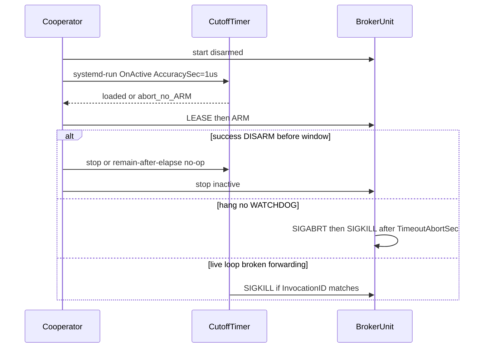

# One-keyboard recovery revision

Native Plan Mode is **observed** (this exchange switched into it). Continuity: same Worker session 12, prior authority expired at `12_report_00.md`, HEAD `64dd12bbc34c5ab09574d8edc76ebb7bed50af2d`, AP `0cf2cff`. This is planning cycle **targeted-revision** 1 of 1 against `01_report_00.md`. Implementation is **not** authorized now.

```text
Planning cycle: targeted-revision
Prior planning report: 01_report_00.md
Targeted revision basis: new-repository-or-external-evidence
Changed decision boundary: one-keyboard recovery + production prerequisites before first grab / full G4
Preserved unaffected decisions: G213-only; M1 accepted history; G1 firmware-only exclusions; pass-through-only; isolated broker; narrow device access; explicit authenticated ARM; all-or-nothing; ungrab-first; unchanged input-remapper; no unproven autostart
Automatic targeted revisions used: 1
```

## Selected recovery (A)

**Selected:** keep existing `WatchdogSec=2` (hung wait/ingest), **pin** `TimeoutStopSec=5` and `TimeoutAbortSec=5` on [packaging/systemd/contextdeck-broker.service](packaging/systemd/contextdeck-broker.service), and add a **system** transient cutoff timer that is armed after the broker is running and **before ARM**.

Cutoff properties (systemd 261, Arch `systemd.timer` / `systemd.kill` / `systemd.service`):

- `OnActiveSec=<window>` with **`AccuracySec=1us`** (default AccuracySec is **1min**; a 30s timer is not a 30s bound without this).
- `RandomizedDelaySec=0`, `Persistent=no`, `RemainAfterElapse=no`.
- OnesHot service owned by PID 1 (`sudo systemd-run`), so **controlling-terminal death does not cancel it**.
- Script compares saved `InvocationID` of `contextdeck-broker.service` and only then `systemctl kill --kill-whom=main --signal=SIGKILL`.
- SIGKILL works on a `SIGSTOP`’d task; `systemctl stop` additionally sends SIGCONT after SIGTERM ([systemd.kill](https://man.archlinux.org/man/systemd.kill.5.en)).
- Broker must **never** send `EXTEND_TIMEOUT_USEC=` (`WATCHDOG=1` does not extend `RuntimeMaxSec`; `EXTEND_TIMEOUT_USEC` would).



**Rejected as the primary one-keyboard path**

- Second keyboard / off-box SSH: still valid, **not waived**, not required if this cutoff is demonstrated.
- Same-process timer, shell `trap`/`sleep && kill`, mouse Stop, untested TTY chord: tied to the grabbed seat or the broker loop.
- **`RuntimeMaxSec` on the production unit:** counts from **start** (burns the disarmed wait); `systemctl set-property --runtime` **survives later starts until reboot**; Type=notify can extend it with `EXTEND_TIMEOUT_USEC`.
- Watchdog alone: does **not** recover a loop that still pings while forwarding fails. Host defaults already give `TimeoutAbortUSec=10s` / `TimeoutStopUSec=10s` on the inactive unit; pin 5s so docs do not depend on manager defaults.

**Covered:** hung or SIGSTOP’d broker; forwarding failure with live watchdog; session-app or terminal loss; cutoff setup failure (no ARM); success/abort/partial/timeout cleanup; no `Restart=`, no autostart, no persistent privilege.

**Residual:** PID1/kernel/machine hang; unplug if kernel ungrab fails (still G4); cutoff needs one privileged setup **while the keyboard still works**; SIGKILL skips synthetic releases (same as crash).

Host (this session, no grab): `contextdeck-session.service` **not-found**; `/usr/bin/contextdeck` missing; `build/contextdeck` present. `sd_pid_get_session` returned `-ENODATA` for this GUI scope, `systemd --user`, and user `dbus`. Seat-launched ContextDeck will likely fail today’s authorizer.

Recommended window: **30s** from cutoff arm to SIGKILL (COOPERATOR may pick 20–45s). Bound = window + `AccuracySec` (~0) + kill latency, **not** the nominal number alone.

## Device-free rehearsal (B) — proposed, not executed

Harmless **Type=notify** fixture via `systemd-run` (`systemd-notify READY=1` + `WATCHDOG=1` loop). Never opens evdev/uinput. Privileged only at setup.

Proposed names: `contextdeck-rehearsal-fixture-<nonce>.service` and `contextdeck-rehearsal-cutoff-<nonce>.timer` plus [packaging/systemd/contextdeck-trial-cutoff.sh](packaging/systemd/contextdeck-trial-cutoff.sh) taking `UNIT` + `InvocationID`.

| Case | Action | Expect | Must not score as |
|------|--------|--------|-------------------|
| Normal completion | Stop fixture at T+3s; window 8s | Fixture dead; cutoff cancelled or ID mismatch no-op | watchdog PASS |
| Stopped fixture | `SIGSTOP` fixture; **no cutoff** | Watchdog abort ≤2s then SIGKILL ≤ TimeoutAbortSec | cutoff PASS |
| Live but “broken” | Fixture keeps pinging; cutoff armed | SIGKILL at window; ID match | watchdog PASS |
| Controlling process loss | `systemd-run` then kill the sudoing shell | Cutoff still fires (PID1-owned) | “shell trap recovered” |
| Setup failure | Do not start fixture if `systemd-run` cutoff fails | No fixture / no ARM analogue | recovery PASS |
| Stale guard | New fixture InvocationID; fire old cutoff | New fixture **still running** | |

Abort: `systemctl stop` both nonce units; `reset-failed`; `RemainAfterElapse=no`. Rehearsal success ≠ physical typing restored. A cutoff fire during a watchdog trial is **not** watchdog PASS.

## Production gaps (C)

**1. Discarded uinput writes — required before any physical grab**

- Causal: [RealSink.cpp](src/broker/RealSink.cpp) `(void)libevdev_uinput_write_event`; [ForwardingEngine](src/broker/ForwardingEngine.cpp) / [Acquisition::emitSyntheticDisarm](src/broker/Acquisition.cpp) assume success. Live loop can ping watchdog while the seat sees nothing.
- Fix: `ISink::writeEvent` / `flushSyn` return `bool`. Live ingest: failed write → error class `sink-write-failed` → **disarm**. Disarm: **ungrab first**, best-effort synthetic writes, **always** `destroyVirtual` and clear ledger (`disarmSynthetic` already pops before write). Do not retry writes as a recovery path. Do not send `EXTEND_TIMEOUT_USEC`.
- Test: FakeSink failure mode in `test_broker_forwarding` / acquisition; ledger cleared even when writes fail.

**2. `passthroughCapabilities()` in production — required before any physical grab**

- Causal: [main.cpp](src/broker/main.cpp) builds `RealLifecycleSink(passthroughCapabilities())`. [unionSourceCapabilities](src/broker/RealSink.cpp) unused. Accepted plan: EV_KEY union, EV_LED from if00 only, no `EV_REP`.
- Fix: Production ARM **open both sources without grab** (identity already checked; seat still types), measure `libevdev_has_event_code`, set caps, **then** `createVirtual`, **then** grab. Open-fail ⇒ no virtual (`test_broker_production` today expects `creates==1` on missing paths because virtual is first — that expectation **changes**).
- `passthroughCapabilities()` stays test-only / documentation of the catalog, not the production constructor.

**3. Virtual→physical LED return — required before any physical grab** (same ARM I/O as G4; do not ship a grab path that cannot write LEDs)

- Causal: compositor LED events arrive on the **uinput fd**; code copies LED **from physical to virtual**. [EvdevSource](src/broker/EvdevSource.cpp) is `O_RDONLY`.
- Fix: `O_RDWR|O_NONBLOCK|O_CLOEXEC`; `libevdev_uinput_get_fd` on epoll; on `EV_LED` call `libevdev_kernel_set_led_value` on **if00 only**. RDWR/open/LED-fd failure at ARM ⇒ fail-closed, no grab. LED **write** failure at runtime: counter only, **do not** disarm (typing recovery). G4 still must **see** CapsLock on hardware.
- Test: fake uinput LED fd → if00 write; no real uinput.

**4. `sd_pid_get_session` — required before any physical grab**

- Causal: [LogindSeatAuthorizer](src/broker/SessionIpc.cpp) fail-closes on get_session. Measured: GUI `app-cursor-*.scope`, `systemd --user`, user dbus all `-ENODATA`. Documented start is [contextdeck-session.service](packaging/systemd/contextdeck-session.service) (`systemctl --user`); that unit is **not currently loaded**. Seat-launched tray will likely `UNAUTH`.
- Fix: keep `SO_PEERCRED` (pid>0, uid≠0). If get_session works, keep today’s seated/graphical/active/non-remote/uid match. On `-ENODATA`/`-ENXIO` only: require **exactly one** active, local (`sd_session_is_remote==0`), seated, `wayland`/`x11` session **for that UID** (`sd_uid_get_sessions` + per-session checks). Reject 0, reject >1 seat, reject inactive/lock-only, reject root/remote. **Not UID-only.**
- Test: injectable login lookup; do not weaken `FixedUidAuthorizer` tests.

**Deferred to full G4 (not first-grab blockers):** kernel ungrab-on-close on 7.2.3; held-modifier crash; input-remapper coexistence under grab; pass-through latency; CapsLock **visual** proof; WatchdogUSec after a real start.

**Unrelated / do not expand:** OpenRGB, M1 lighting, deck-layer, license G6.

## Execution sequence (D)

One later implementation grant, **two causal stages**, then independent review, then a **separate** live-trial grant.

### Stage R1 — broker safety (repo only)

- Outcome: write errors fail-closed; measured caps + LED return; logind fallback.
- Allowlist: `src/broker/**`, `src/app/**` only if ARM UI must surface `UNAUTH`/`ARM_FAILED` already returned, `tests/unit/test_broker_{forwarding,acquisition,production,ipc,watchdog}.cpp`, `CMakeLists.txt` only if a new unit is required.
- Host: none. Privileged: none.
- Existing tests: update acquisition/production **order** and FakeSink signatures; add write-fail, LED fake, login fallback.
- Exit: CTest names in `CMakeLists.txt` green; `nm` still has no grab in tests; `RealSink::create` still not called from tests.
- Rollback: revert the commit. Final: worktree as granted; broker **not** started.

### Stage R2 — cutoff packaging, docs, rehearsal

- Outcome: explicit stop/abort timeouts; cutoff script + documented `systemd-run` lines; architecture recovery order **ungrab-first**; testing-m2 hang path no longer **requires** a second keyboard (cutoff is the one-keyboard alternative; SSH/keyboard remain valid).
- Allowlist: `packaging/systemd/contextdeck-broker.service`, new `packaging/systemd/contextdeck-trial-cutoff.sh` (+ tiny `.in` timer comments), `docs/operations.md` §§6–9, `docs/testing-m2.md`, `docs/architecture.md` lifecycle bullets only.
- Host: **rehearsal fixture only** (table above). No G213, no `/dev/uinput`, no input-remapper change, no udev uninstall.
- Enter: R1 merged. Exit: rehearsal cases recorded; cutoff units gone; broker still static/inactive.
- Independent **fresh** review of R1+R2 evidence **before first grab** (production path and cutoff have never been independently accepted). Not G4.

### Live trial — NOT AUTHORIZED BY THIS PLANNING TASK

Prerequisites: R1+R2, independent review, G3 ACLs, broker static, remapper enabled/active, cutoff **loaded**, session app authenticates.

Visible: start broker; confirm cutoff unit; tray **Arm G213 pass-through**; type in a text field; **Disarm**; stop cutoff; `systemctl stop` broker.

Expect: keys type through the virtual path; deadline = chosen window; abort = cutoff SIGKILL; final inactive, not enabled, ungrabbed, remapper unchanged.

Do not uninstall guards. Do not `enable`. Do not score cutoff as watchdog.

## Docs the implementation must fix

- [docs/architecture.md](docs/architecture.md) “destroy virtual then release devices” vs implemented ungrab-first.
- [docs/testing-m2.md](docs/testing-m2.md) / [docs/operations.md](docs/operations.md) recovery still written as second-keyboard/SSH only.
- Do **not** reopen M1, G1, G2, G7, or later milestones.

## Remaining human decisions (plan is otherwise implementable)

1. Cutoff window seconds (recommend 30).
2. Accept one `sudo systemd-run` **before ARM** (keyboard still works).
3. Who runs the fresh independent review before first grab.

No `NEEDS_ORCHESTRATOR_DECISION` for missing second keyboard: the cutoff is the alternative. Cheapest later probe if auth fallback needs a live UID-session list shape: read-only `sd_uid_get_sessions` during implementation tests with fakes; no grab.

## Persistence note

Plan Mode forbids META file writes this turn. Terminal AP report and the Orchestrator notes entry are delivered in chat if still blocked; COOPERATOR archives. Product Git: unchanged.
