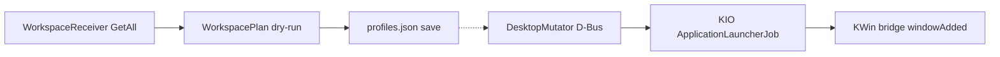

# M4 workspace session manager — implementation plan

Planner session `01/01` on exact product candidate `502ae75571358ec95d33c836084b5e2253850731` (parent `55e98130…`, AP `0cf2cff4…`, public product/META `main` match, `ap doctor` PASS/`stable`, product worktree clean). Native Plan approval does not grant implementation.

M3 park: M3 workspace-aware lighting is code-accepted on `502ae75...`; its physical five-zone IRL observation is deferred by explicit COOPERATOR decision. M3 is not closed, and code acceptance is not physical acceptance.

M2 park: The named live G4 slices are accepted, but the M2 logical whole remains open. M2 is parked with G3 host-mitigated on the authorized reference host; the next bounded whole is M4 workspace session manager.

## 1. Scope and M5 split

M4 (in an already running Plasma session, session app already started by the user):

- Observe and (later, under a separate grant) configure virtual desktops: count, names, rows, wrapping, named session layouts.
- Assign applications to desktops by reusing the existing identity matcher.
- Launch assigned apps only on in-session session-management events (explicit Apply / in-transaction `desktopCreated`), never at Plasma login.
- Place and maximize those windows event-driven through the existing KWin bridge.
- Opt-in, event-driven title fallback when identity matching fails.

M5/G8 (out of M4): Plasma login autostart, systemd user `[Install]` / `graphical-session.target`, packaging/production lifecycle, restoring the ecosystem without a manual session-app start. M4 must not add autostart units, enablement, or “launch because the session began.”

Also out of M4: broker start/ARM/grab, remapping, deck layer, M3 physical `docs/testing-m3.md`, G3/G4, production packaging, input-remapper, per-key RGB.

## 2. Observation vs mutation

Two separately authorized implementation slices. **Slice A (this plan’s first Worker)** is observational: schema, dry-run, UI that can *save assignments* via existing `Uložiť`, no live desktop/launch/rules writes. **Slice B** is the mutation grant.



Live host facts (introspection XML only; no desktop names/IDs captured): `org.kde.KWin` `/VirtualDesktopManager` / `org.kde.KWin.VirtualDesktopManager` exposes `count` `u` read; `current` `s` readwrite (UUID); `rows` `u` readwrite; `navigationWrappingAround` `b` readwrite; `desktops` `a(iss)` read; methods `createDesktop(u,s)`, `setDesktopName(s,s)`, `removeDesktop(s)`; extra signals `rowsChanged`, `navigationWrappingAroundChanged` (not subscribed today).

`kwinrulesrc` exists and is structurally tiny (one generic/numeric section). **M4 does not write it.**

| Mutation class | Operation | Slice | Idempotence / ordering | Failure / revert |
|---|---|---|---|---|
| Observe rows/wrapping | GetAll + subscribe `rowsChanged` / `navigationWrappingAroundChanged` as invalidations | A | Same coalesce/one-in-flight as M3 | Unknown workspace; no lighting change beyond existing M3 fallback |
| `createDesktop` | D-Bus `createDesktop(position, name)` | B | Create only missing trailing positions vs desired count; never implicit | Stop transaction; revert from checkpoint |
| `setDesktopName` | D-Bus `setDesktopName(id, name)` | B | Rename only when live name ≠ desired; match by then-current UUID | Inverse rename from checkpoint |
| `removeDesktop` | D-Bus `removeDesktop(id)` | B | **Not** part of default Apply; only explicit “remove extras” after preview | Recreate from checkpoint (new UUIDs; rebind by ordinal) |
| `rows` / wrapping | Properties.Set | B | Set only when preview diff is non-empty | Set checkpoint values |
| `current` | Properties.Set | B | Optional, only if Apply says “switch to session”; never on `currentChanged` | Restore checkpoint current id if still present |
| Launch | KIO job for typed `.desktop` | B | Skip if inventory already matches profile | No kill-on-failure; record error class |
| Placement / maximize | KWin script on `windowAdded` | B | Event-driven; skip docks/splashes | Leave window; no rules file |
| `kwinrulesrc` | file write | **rejected** | — | — |

**Checkpoint (slice B only):** before Apply, snapshot GetAll into user-local `workspace-checkpoint.json` (not the profile document, never META). Apply is a single transaction with a dry-run preview the user already saw. Revert reapplies checkpoint create/rename/rows/wrapping; removal-revert may mint new UUIDs and rebinds assignments by ordinal. First slice only *computes* that diff in memory.

**Do not fight the user:** live Plasma desktop edits never auto-rewrite. A drift flag compares the saved named session to live observation. Apply is explicit. Default Apply is create+rename+rows/wrapping only.

## 3. Desktop management design

Reuse [`src/context/WorkspaceReceiver.{h,cpp}`](src/context/WorkspaceReceiver.h); do not duplicate GetAll. Slice A extends `WorkspaceState` with `rows` and `navigationWrappingAround` decoded from the existing snapshot (extra map keys are already ignored). Subscribe the two extra signals as invalidations.

Durable “session” is **not** a bag of live UUIDs (they die on remove/recreate). It is a named layout of ordinals:

- `workspace_sessions[].id` / `display_name`
- `desktops[]`: `ordinal` (1-based, contiguous) + `name` (user-authored; may be stored in profiles.json; **never logged**)
- optional `rows`, `navigation_wrapping`
- `preferences.active_workspace_session_id` (optional)
- `preferences.workspace_management_enabled` default **false**

Live UUIDs are runtime-only, mapped ordinal↔id from `WorkspaceReceiver`. Caps stay 1–32 desktops.

## 4. Assignment schema (schema 4)

**Decision:** new schema **4** fields on the existing document; **reuse `MatchSpec` as the only identity matcher**. Do not put captions in `match` (existing test `matcherPrefersDesktopFileNameAndIgnoresCaption` stays).

Allowed root keys become: `schema_version`, `device`, `global`, `applications`, `preferences`, `workspace_sessions`. Unknown fields still rejected. Schema 1–3 load in memory: `workspace_sessions` empty, no assignments, lighting/keys unchanged; no rewrite until explicit save. Future `>4` still refused.

Representative JSON (illustrative ids only):

```json
{
  "schema_version": 4,
  "device": {"vendor_id": "046d", "product_id": "c336", "model": "logitech-g213-prodigy"},
  "global": {"lighting": {"mode": "untouched", "restore_mode": "wave", "zones": null}},
  "preferences": {
    "automatic_enabled": true,
    "tray_notifications": false,
    "workspace_management_enabled": false,
    "title_fallback_enabled": false,
    "active_workspace_session_id": "coding"
  },
  "workspace_sessions": [{
    "id": "coding",
    "display_name": "Coding",
    "rows": 1,
    "navigation_wrapping": true,
    "desktops": [
      {"ordinal": 1, "name": "Build"},
      {"ordinal": 2, "name": "Browse"}
    ]
  }],
  "applications": [{
    "id": "org.kde.dolphin.desktop",
    "display_name": "Dolphin",
    "match": {"desktop_file_name": "org.kde.dolphin.desktop"},
    "workspace": {
      "session_id": "coding",
      "desktop_ordinal": 1,
      "launch": true,
      "maximize": true,
      "launch_desktop_file": "org.kde.dolphin.desktop",
      "title_fallback": {"enabled": false, "mode": "contains", "pattern": ""}
    }
  }]
}
```

Bounds: session/profile ids non-empty, unique, ≤128 bytes, no control chars; ordinal in 1..32 and ≤ that session’s desktop count; `launch_desktop_file` optional, no shell metacharacters, must look like a desktop id (`*.desktop` or reverse-DNS); title `pattern` ≤128 bytes, no control chars; `mode` ∈ {`exact`,`contains`,`prefix`}. Missing `workspace` = no launch/place. `launch_desktop_file` defaults at resolve time to `match.desktop_file_name` only when that field is a desktop id; **never** from `resource_class`.

Lighting resolution stays override → workspace layout → app → global. Title fallback does **not** run unless both global `title_fallback_enabled` and the profile’s `title_fallback.enabled` are true.

## 5. Launch lifecycle (slice B; slice A dry-runs it)

**Decision:** typed KService id + [`KIO::ApplicationLauncherJob`](file:///usr/include/KF6/KIOGui/kio/applicationlauncherjob.h) (`KF6::Service` + `KF6::KIOGui`). Host has those CMake configs; `kioclient6` is absent; `systemd-run` 261 and `kstart` exist.

Reject `systemd-run --user` for GUI launch (session/Wayland inheritance), reject `kstart` argv wrapping, reject shell/`QProcess` of `Exec=` lines.

Triggers (only when `workspace_management_enabled` and user invoked Apply):

1. Explicit `applyWorkspaceSession`.
2. `desktopCreated` **during that in-flight transaction**, for apps assigned to the new ordinal.

Non-triggers: Plasma login, session-app start, `currentChanged`, user-created desktops outside a transaction, broker events.

Duplicate: skip launch if bridge inventory already `matchAgrees` that profile. Debounce: one launch attempt per profile per transaction (2 s). Failure: bounded error class, no retry storm (one retry only on `desktopCreated` for that ordinal if the first job failed before `windowAdded`). Reversibility: M4 does not kill launched apps on revert; revert is desktop-config only. Non-autostart posture: no units, no login hooks.

Slice A `WorkspacePlan` emits `would_launch` / `already_running` / `missing_desktop_file` without calling KIO. Do not add KF6KIO until slice B.

## 6. Placement and maximization (slice B)

**Decision:** extend the existing bridge; **do not write `kwinrulesrc`**. M4 only places while ContextDeck runs; persistent rules would fight user rules and are unnecessary without M5 autostart.

Host correction of ROADMAP: `window.desktops` is a writable `QList<VirtualDesktop*>` (installed KWin script already assigns it). `window.maximized` is **not** writable; `maximizeMode` is read-only. Scripts must call `window.setMaximize(true, true)` ([`Q_INVOKABLE` in `window.h`](file:///usr/include/kwin/window.h)). Desktop objects expose `id`.

On `windowAdded` (existing signal, still no polling): skip non-normal windows as today; `callDBus` `PlacementHint(desktop_file_name, resource_class, resource_name)` → `(desktop_id, maximize)`; set `window.desktops = [match id]`; if maximize, `setMaximize(true,true)`. Empty desktop_id = no-op. Identity still wins over title fallback for placement; title fallback only after a `TitleHint` match (below).

Keep `ContextReport` 6-arg signature for M1/M3 compatibility.

## 7. Title fallback

Opt-in, event-driven, never polling, never default identity.

- **Compared:** user-authored `pattern` + `mode` against the focused window caption **in memory for one call**.
- **Stored:** only the user-authored pattern/mode/enabled flags in profiles.json. Never the live caption.
- **Surfaced:** matched profile `display_name` / assignment preview only. Diagnostics: `title-fallback-matched` / `title-fallback-ignored` counters, no strings.
- **Hard rule:** captions/titles/desktop names/ids never in logs, prompts, reports, or META.

Matcher owner stays C++: `matchApplication` first; if null and both opt-in flags, `matchTitleFallback(document, caption)` (tests pass synthetic captions). Production slice B: new `Context1.TitleHint` (7th-field caption) **only when** `TitleFallbackEnabled` is true; discard caption after the call; do not log arguments. Do not add `caption` to `MatchSpec`.

When a fallback matches, that profile is used for lighting/assignment **for that focus event only**. Default flags false ⇒ M1/M3 lighting unchanged.

## 8. Minimal UI/controller

Not a UX redesign. Add one sidebar section **Plochy** ([`ui/Main.qml`](ui/Main.qml)) + [`ui/WorkspacePage.qml`](ui/WorkspacePage.qml): observed ordinal/count/rows/wrapping (user-visible names on-screen are OK; not logged), named-session editor, drift/preview list, Apply **hidden/disabled in slice A** with truthful copy that live apply is a later grant. Extend [`ui/ApplicationsPage.qml`](ui/ApplicationsPage.qml) per profile: session, ordinal, launch, maximize, launch desktop-file, title-fallback toggle+pattern. Existing lighting widgets unchanged. [`workspaceSummary()`](src/app/AppController.cpp) stays lighting-only; do not put captions or desktop names into diagnostics maps.

Controller: save still explicit `Uložiť`; new invokables mutate the in-memory document only (slice A). No broker/OpenRGB/KWin load-script changes in slice A.

## 9. Tests and validation

Registered CTest in [`CMakeLists.txt`](CMakeLists.txt) remains the **broad gate** (schema/resolver/session-app can regress M1–M3). Current suite: 17 names (14 C++ + `test_udev_verify` / `test_trial_cutoff` / `test_sleep_hook`). Do not run tests in this planning exchange.

New causal regressions (required; behaviors absent on the candidate):

- Persistence: schema 4 round-trip; 1–3 migrate with lighting unchanged; `match.caption` still rejected; unknown `workspace` keys rejected; title pattern/control-char bounds.
- Resolver: assignment by matcher rank; title fallback only when both flags set; identity beats title; no caption in `MatchSpec`.
- `WorkspacePlan`: create/rename/no-remove default diff; launch skip-if-inventory; missing desktop-file; debounce keys; transaction triggers vs `currentChanged` non-trigger.
- WorkspaceReceiver: decode `rows`/wrapping; `rowsChanged` invalidates; existing request-ownership tests still pass (extend fake manager).
- Title-fallback privacy: matcher unit never requires logging; a small test that diagnostics maps omit pattern/caption keys.

Placement/maximize JS is slice B (script + fake D-Bus PlacementHint). Rollback checkpoints: slice A git revert of the one commit; user `profiles.json.bak` already owned by persistence; slice B adds workspace-checkpoint revert.

## 10. Later IRL acceptance (COOPERATOR)

After slice B + fresh code acceptance, a **new** `docs/testing-m4.md` checklist (no raw input, broker, udev, suspend, autostart, input-remapper, M3 five-zone run):

1. Copy `profiles.json` aside (named checkpoint).
2. Slice A/B build: save a two-desktop named session + one assigned app; confirm lighting of an unrelated app unchanged.
3. Preview Apply; confirm create/rename intent; then authorized Apply; confirm invert via checkpoint.
4. Apply launches the assigned app once; second Apply does not duplicate.
5. New window is on the assigned desktop and maximized via `setMaximize`.
6. Enable title fallback; focus an unmatched window whose caption matches the user pattern; lighting/assignment follow that profile; disable flag and confirm no match. Do not paste captions into META.
7. Quit session app: keyboard still types (M4 never grabbed). Restore the copied profile file.

## 11. One implementation slice (A) and later B

Ordered slice A:

1. Schema 4 types + persistence/migration tests.
2. Resolver workspace assignment + title-fallback tests.
3. New [`src/workspace/WorkspacePlan.{h,cpp}`](src/workspace/) (pure diff/launch plan; justified so `WorkspaceReceiver` stays observation-only).
4. Receiver rows/wrapping + extra signal invalidations + tests.
5. `AppController` preview/save UI; new QML page; `CMakeLists.txt` `qt_add_qml_module` + `add_test`.
6. Docs: spec schema 4, architecture M4/M5 boundary, ADRs 0002 (host mutation / no `kwinrulesrc`), 0003 (schema 4), 0004 (KIO launch, not autostart), `docs/testing-m4.md`, ROADMAP (fix duplicate M4/M5 rows and “launch on session start”), README status. Do not edit `.ap/`, broker, packaging, M3 test procedure as a run.

Validation: `cmake -S . -B build -G Ninja && cmake --build build && ctest --test-dir build --output-on-failure`. One commit. No host/desktop/launch mutation. Independent fresh acceptance after A (code/docs only). Slice B is a **new** prompt (`Native planning mode: not-used`) adding mutator/launcher, KF6 Service/KIO, bridge `PlacementHint`/`TitleHint`, Apply UI, and the live IRL checklist.

**Slice A allowlist (subset of the ceiling):** `CMakeLists.txt`; `src/core/Types.h`; `src/core/Persistence.h`; `src/core/Persistence.cpp`; `src/core/Resolver.h`; `src/core/Resolver.cpp`; `src/context/WorkspaceReceiver.h`; `src/context/WorkspaceReceiver.cpp`; `src/workspace/WorkspacePlan.h`; `src/workspace/WorkspacePlan.cpp`; `src/app/AppController.h`; `src/app/AppController.cpp`; `src/app/SettingsHost.cpp` only if QML engine requires it; `ui/Main.qml`; `ui/ApplicationsPage.qml`; `ui/WorkspacePage.qml`; `tests/unit/test_profile_persistence.cpp`; `tests/unit/test_profile_resolver.cpp`; `tests/unit/test_workspace_receiver.cpp`; new `tests/unit/test_workspace_plan.cpp`; `docs/specification.md`; `docs/architecture.md`; `docs/adr/0002-host-desktop-mutation-authority.md`; `docs/adr/0003-workspace-assignment-schema.md`; `docs/adr/0004-typed-application-launch.md`; `docs/adr/README.md`; `docs/operations.md`; `docs/testing-m4.md`; `README.md`; `ROADMAP.md`.

Omit from A unless a later PARTIAL names them: `SessionApplication.*`, `kwin/.../main.js`. Do not silently widen.

## 12. Claim matrix

- **implementation-PASS (A):** schema 4, dry-run, tests, docs on a commit descendant of `502ae75…`. Not live desktop behavior.
- **Fresh code acceptance:** A1-style review of allowlist, migrations, matcher/privacy, non-claims.
- **Only COOPERATOR IRL (after B):** create/rename revert, launch-on-apply, maximize/place, opt-in title fallback.
- **Non-claims:** M3 physical, M2/G4, G3, M5/autostart, remap, deck, per-key, production, Session 27, any accepted desktop-management behavior before B + IRL.

This planning exchange mutates no product, AP, host, desktop, launch, device, dependency, or Git publication.

## Planner stop

After native plan approval, this Worker writes only [`01_report_00.md`](/home/agile/meta/projects/contextdesk/00/04-g213-contextdeck-workspace-session-manager/01_report_00.md) (report does not yet exist), reads it back, and stops. Smallest next step: ORCHESTRATOR reconciliation; only if accepted, a separate slice-A implementation prompt with `Native planning mode: not-used`.
