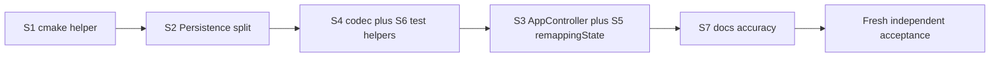

# Plán code health a refaktoringu

Planner Worker, Native Plan Mode, čerstvá session. Planning grant **neautorizuje** implementáciu. Po schválení tohto plánu Worker zapíše anglický terminálny report do [`01_report_00.md`](/home/agile/meta/projects/contextdesk/00/06-code-health-and-refactoring/01_report_00.md) a zastaví sa. Implementácia vyžaduje samostatný prompt s `Native planning mode: not-used`.

## Overené identity (read-only)

- Produkt: `https://github.com/cisarik/contextdesk.git`, `main`, HEAD = public `main` = `235d467c752958694dad4be7bcc31e66406dbdcc`, parent `293158887e4228a42b9c64bda7d4f0bd32fb4ec9`, čistý worktree.
- AP gitlink = checkout `0cf2cff483a36a4cc2254aa424a7c53bd57a97e9`; `./.ap/ap doctor` PASS, variant `stable`.
- META: `https://github.com/cisarik/meta.git`, `main` = public `main` = `f4f93e2c8bed9009bca5c16755bd9413b54aa951`. Untracked sú len očakávané opening artefakty tohto whole (`00_notes.md`, `01_planning_00.md`). Report ešte neexistuje.
- Prompt SHA-256 = `b9969040e1b735bdeda3800f88f4f70048339720ddcea788fa52ba9da649ac7e` (zhoda s notes). Handout SHA-256 = `7c4031d49b8acecc6f1ac40ca37afaadcdcca632677c74eb328711672937f26e`.
- Prompt prečítaný celý a byte-identický s doručeným súborom.

## Rozhodnutie o rozsahu

**Jeden logical whole**, nie split. Dôvod: všetky slice sú ten istý claim (behavior preservation) proti tej istej 21-testovej bráne; split by len znásobil acceptance bez inej rizikovej triedy. AP budget jedného primárneho independent auditu pokryje kumulatívny kandidát.

**Vybrané:** S1, S2, S4, S6, S3, S5 (len `remappingState`), S7.

**Parkované (vedomé, nie missing evidence):**
- Split [`src/core/Types.h`](src/core/Types.h) — 19 TU už ťahá umbrella; bez zmeny include sites sa coupling nezníži, so zmenou je to churn bez behavior prínosu.
- Codebase-wide reformat, `.clang-format`, `.clang-tidy` — nový format súbor by pri „format only touched files“ rozbil susedný štýl; žiadny linter, ktorý by tlačil sémantické „opravy“.
- Presun `FakeSink`/`FakeSource`/`FakeGrabber` do samostatného test-support targetu.
- Zmena 21 registrovaných `add_test` mien alebo COMMAND riadkov.
- QML binding mená, vizuály, IPC, schémy, log eventy, safety boundaries.
- `AGENTS.md:67-69`, `AGENTS.md:105-106`, `ROADMAP.md:7` (ChatOrchestrator) — byte-identical.

**Kľúčový architektonický invariant S3:** `SettingsHost` ostáva s jedným context property `"app"`. `AppController` ostáva QML/test fasádou. Žiadne nové QML context properties. QML súbory v S3 **mimo allowlist**.



Broad gate každej implementačnej výmeny (nespúšťať v tomto planning exchange):

```sh
cmake -S . -B build -G Ninja
cmake --build build
ctest --test-dir build --output-on-failure
```

Registrované mená (21, nemenné): `test_profile_resolver`, `test_profile_persistence`, `test_workspace_plan`, `test_openrgb_protocol`, `test_broker_identity`, `test_broker_ledger`, `test_broker_forwarding`, `test_broker_acquisition`, `test_broker_watchdog`, `test_broker_ipc`, `test_broker_production`, `test_udev_policy`, `test_workspace_receiver`, `test_workspace_lighting`, `test_placement_resolver`, `test_workspace_mutator`, `test_application_launcher`, `test_udev_verify`, `test_trial_cutoff`, `test_sleep_hook`, `test_broker_ipc_client`.

---

## S1 — CMake test helper (výmena 01, commit 1)

**Cieľ:** odstrániť 18 opakovaných `add_executable` / `target_link_libraries` / `add_test` trojíc helperom. Tri ne-executable testy (`test_udev_verify`, `test_trial_cutoff`, `test_sleep_hook`) ostanú explicitné.

**Helper** v novom [`cmake/contextdeck-tests.cmake`](cmake/contextdeck-tests.cmake), included z [`CMakeLists.txt`](CMakeLists.txt):

```cmake
function(contextdeck_add_unit_test name)
  # PARSE_ARGV: NO_AUTOMOC; DBUS_SESSION;
  # SOURCES (default tests/unit/${name}.cpp);
  # LIBRARIES; COMPILE_DEFINITIONS; INCLUDE_DIRECTORIES;
  # COMMAND_ARGS; ENVIRONMENT
  # add_test COMMAND must match today's spelling:
  #   plain: COMMAND ${name} ${COMMAND_ARGS}
  #   DBUS_SESSION: COMMAND "${DBUS_RUN_SESSION_EXECUTABLE}" -- $<TARGET_FILE:${name}>
endfunction()
```

COMMAND byte-stability je invariant. Špeciálne tvary ostávajú: broker `NO_AUTOMOC`; dbus testy `DBUS_SESSION` + `ENVIRONMENT "QT_QPA_PLATFORM=offscreen;QT_DISABLE_SESSION_MANAGER=1"`; `test_udev_policy` `COMPILE_DEFINITIONS CONTEXTDECK_SOURCE_DIR=...`; `test_broker_ipc_client` `COMMAND_ARGS -nocrashhandler` plus extra SOURCES `src/app/BrokerIpcClient.cpp`.

**Test doubles:** **ponechať** v `contextdeck_broker_core`. Produkčný `contextdeck-broker` má CLI `selftest` / `watchdog-selftest` ([`src/broker/main.cpp`](src/broker/main.cpp) 68–73), ktoré Fake* potrebujú. Samostatný test-support target by buď duplikoval objekty, alebo by z produkčného binárneho CLI Fake* vyhodil — to nie je behavior-preserving. CMake komentár pri Fake* zdrojoch: selftest/unit-only, nie ARM path.

**Allowlist:** [`CMakeLists.txt`](CMakeLists.txt), [`cmake/contextdeck-tests.cmake`](cmake/contextdeck-tests.cmake).

**Focused:** `ctest -N` — 21 mien; náhodný sample COMMAND v `build/CTestTestfile.cmake` zhodný s dnešným tvarom. Broad: celá sada.

**Rollback:** revert jedného CMake commitu.

**Unchanged-observable:** všetko runtime/QML/IPC/schémy/logy; mená a COMMAND 21 testov.

---

## S2 — Split Persistence (výmena 02, commit 1)

**Cieľ:** rozbiť 1483-riadkový [`src/core/Persistence.cpp`](src/core/Persistence.cpp) (anonymný ns ~19–925; `parseDocument` 954–1216; `validate` 1218–; `toJson` 1326–; IO 1392–) na `src/core/persistence/` za **nezmeneným** public API [`src/core/Persistence.h`](src/core/Persistence.h).

Jednotky (internal headers, nie súčasť public API):
- `JsonCommon` — `makeError`, `isInteger`, `checkObjectKeys`, `hasControlCharacters`, `boundedUtf8`, `looksLikeDesktopId`
- `KeysJson` — chord / assignment / keys parse+serialize
- `LightingJson` — zone v2/v3, lighting v1/common, lighting JSON
- `MatchJson` — match + title fallback
- `WorkspaceJson` — assignment + session
- `DocumentCodec` — `ProfileStore::parseDocument` / `validate` / `toJson` / `parsePreferences`
- `Persistence.cpp` — len paths + `load` / `save` / `toJsonBytes`

Žiadny zdieľaný helper s D-Bus receiverom (iné boundy, iný error model).

**Allowlist:** `src/core/Persistence.cpp`, `src/core/persistence/*.{h,cpp}` (nové), [`CMakeLists.txt`](CMakeLists.txt) (`contextdeck_core` sources). `Persistence.h` len ak include path ostane; **žiadna zmena signatúr**.

**Focused:** `test_profile_persistence`. Broad: 21. Nový test **nie** — public API sa nemení; nový test by zafixoval internú štruktúru.

**Rollback:** revert commitu; public API identické.

---

## S4 + S6 — Codec a test helpers (výmena 03, 2 commity)

### S4

**WorkspaceStateCodec:** presunúť `decodeSnapshot` ([`WorkspaceReceiver.cpp`](src/context/WorkspaceReceiver.cpp) 577–773) a čisté D-Bus decode helpery (`decodePosition`, `decodeDesktopStructure`, `decodeGetAllProperties`, `decodeCount`, `unwrapDbusVariant`, `hasControlCharacters`/`boundedUtf8` tohto TU) do `src/context/WorkspaceStateCodec.{h,cpp}`. Lifecycle (subscribe, owner, coalesce, deadline, recovery) ostáva v `WorkspaceReceiver`. `decodeSnapshot` môže ostať tenkým wrapperom.

**ContextReceiver:** extrahovať **len** `parseInventoryPayload` (~551–614) ako free function v `src/context/InventoryPayload.{h,cpp}`. Nested D-Bus `Object`, sequence/heartbeat **nechať**. Žiadna spoločná abstrakcia s Persistence.

**Allowlist:** `src/context/WorkspaceReceiver.{h,cpp}`, `src/context/WorkspaceStateCodec.{h,cpp}`, `src/context/InventoryPayload.{h,cpp}`, `src/context/ContextReceiver.cpp`, [`CMakeLists.txt`](CMakeLists.txt) (`contextdeck_context` sources), [`tests/unit/test_workspace_receiver.cpp`](tests/unit/test_workspace_receiver.cpp) (nové sloty na codec s `QVariantMap`, **bez** nového `add_test` mena).

**Focused:** `test_workspace_receiver` (existujúce lifecycle + nové codec sloty bez závislosti na fake manageri). Broad: 21.

### S6 (ten istý exchange, druhý commit)

**Nemergeovať** dva `FakeDesktopManager` do jednej triedy — receiver fake je GetAll/hold/malformed; lighting fake má `Set`/`createDesktop`/`setDesktopName` a iný introspect. Extrahovať zdieľané: `DesktopTuple` + D-Bus stream operátory + GetAll map builder do `tests/support/FakeVirtualDesktopMap.h` (header-only). Dve testovacie triedy ostanú, volajú helper.

**Nerozdeľovať** veľké test executables (Qt `QTEST_MAIN` = jedno meno).

**Allowlist:** `tests/support/FakeVirtualDesktopMap.h`, [`tests/unit/test_workspace_receiver.cpp`](tests/unit/test_workspace_receiver.cpp), [`tests/unit/test_workspace_lighting.cpp`](tests/unit/test_workspace_lighting.cpp), [`CMakeLists.txt`](CMakeLists.txt) include dir pre test targety ktoré helper potrebujú.

**Focused:** `test_workspace_receiver`, `test_workspace_lighting`. Broad: 21.

---

## S3 + S5 — AppController + dead API (výmena 04, 2 commity)

Namerané: [`AppController.h`](src/app/AppController.h) 277 riadkov, 48 `Q_PROPERTY`, 52 `Q_INVOKABLE`; [`AppController.cpp`](src/app/AppController.cpp) 2285 riadkov. Jeden QML `app` v [`src/app/SettingsHost.cpp`](src/app/SettingsHost.cpp). ~83 unique `app.*` väzieb v 9 QML. `test_workspace_lighting` **rekompiluje** `AppController.cpp` + `BrokerIpcClient.cpp` (nie je app knižnica).

**Fasáda:** `AppController` ostáva jediný QML typ; gettery/invokables delegujú. Signály a mená properties **okrem `remappingState`** ostávajú.

Nové jednotky pod `src/app/`:
- `LightingEdit` — dnešný anonymný ns (applyMode/zone/gradient/sanitize/hex/speed/breathing) + `parseHex`/`toHex`
- `ProfileDocumentEditor` — globálne/app lighting, add/remove profile, `assignEmitShortcut`, save cez `ProfileStore`
- `WorkspaceSessionEditor` — CRUD sessions + application workspace/title-fallback settery
- `WorkspaceApplyController` — fingerprint, apply/revert, launch-on-created, apply-status polia, `m_mutator`/`m_launcher`
- `PresentationModel` — hero/status/diagnostics/inventory/profiles/controls/workspaceObserved/plan maps (const queries)

`AppController` drží wiring: load, context/workspace/rgb connect, `recompute`/`sendLighting`, broker 3 one-linery, Q_PROPERTY forwarding.

**CMake v tomto slice:** nová static knižnica `contextdeck_app` (AppController + 5 jednotiek; **nie** `BrokerIpcClient`, `TrayController`, `SettingsHost`, `ChordRecorder`, `main`). `contextdeck` a `test_workspace_lighting` ju linkujú. `qt_add_qml_module` ostáva na executable (ChordRecorder). Globálne `CMAKE_AUTOMOC ON` moc-ne `AppController` v knižnici.

**S5 v druhom commite tej istej výmeny:** odstrániť `Q_PROPERTY remappingState` a inline getter (`"inactive-until-M2"`). Žiadny QML/C++ konzument (grep len header). **Neprepájať** — wiring by bolo tvrdenie o remapping stave, teda behavior/product zmena.

QML usage table (namerané, nie zmeny):
- Odstrániť len `remappingState`.
- Implementované, QML-unbound, C++ mŕtve: `currentApplication`, `lightingMode`, `globalColor`, `isValidHex` — **ponechať** pre neskôrší UI/UX whole.
- QML-unbound, C++ živé (Tray/diagnostics): `currentProfile`, `lightingConnection`, `contextDisplayName`, `lastError`, `bridgeConnected`, `degraded`, `isSelfWindow`, `lastExternalApplication`.

**Allowlist:** `src/app/AppController.{h,cpp}`, `src/app/{LightingEdit,ProfileDocumentEditor,WorkspaceSessionEditor,WorkspaceApplyController,PresentationModel}.{h,cpp}`, [`CMakeLists.txt`](CMakeLists.txt), [`tests/unit/test_workspace_lighting.cpp`](tests/unit/test_workspace_lighting.cpp) len ak treba include. **Nie** `ui/*`.

**Focused:** `test_workspace_lighting` (rovnaký `AppController` public API). Broad: 21. Nový unit test extrahovaných tried **nie** — zafixoval by internú štruktúru; fasáda je kontrakt.

**Rollback:** revert jedného alebo oboch commitov výmeny 04; QML nezmenené.

**Unchanged-observable:** všetky `app.*` okrem zmiznutia nepoužívaného `remappingState`; strings (vrátane SK fráz v `openRgbPhrase`/`lightsPhrase`/`contextDisplayName`); log eventy `loaded profile document`, `cold start: ...`, `profile load refused`, `save refused`, `temporary_color expired on external identity change`.

---

## S7 — Dokumentácia (výmena 05, commit 1)

Po kóde, aby ROADMAP mohol spomenúť novú internú štruktúru bez claimu closure.

**Allowlist:** [`ROADMAP.md`](ROADMAP.md), [`README.md`](README.md), [`docs/testing-m2.md`](docs/testing-m2.md). `docs/architecture.md` **nemeniť** — už popisuje measured capabilities a `sink-write-failed`; file-level layout tam nie je owner. `AGENTS.md` access riadky **nemeniť**.

### Presné náhrady

**A. `ROADMAP.md` „Current whole“ (~41–44)** nahradiť:

```text
- Closed documentation whole: **M4 state and ledger reconciliation** — accepted
  on `235d467...`; ledger dispositions recorded in the M4 backlog section.
- Current whole: **code health and refactoring** — behavior-preserving
  internal structure on the session app, core, receivers, and tests. No
  behavior, visuals, product-claim, or safety-boundary change. No host, device,
  desktop, launch, broker, packaging, or license mutation.
```

**B. `README.md` (~10–12)** — vetu „the current bounded whole reconciles the accepted M1–M4 state and disposes of the carried M4 ledger candidates“ nahradiť: „The M4 state and ledger reconciliation is closed on `235d467...`. The current bounded whole is behavior-preserving code health and refactoring.“

**C. Sleep-hook bullet `ROADMAP.md` (~429–432)** — „Not autostart. Not live suspend evidence. ADR 0001.“ nahradiť: „Not autostart. One named live suspend/resume slice is recorded (Session 22). Hibernate and hybrid-sleep remain open. ADR 0001.“

**D. Production-safety list `ROADMAP.md` (~456–460)** nahradiť (evidencia na kandidáte):
- Silent uinput writes: [`ForwardingEngine::failWrite`](src/broker/ForwardingEngine.cpp) loguje `sink-write-failed` a vracia false; test v `test_broker_forwarding`.
- Capabilities: [`Acquisition::arm`](src/broker/Acquisition.cpp) meria union a volá `applyMeasuredCapabilities` **pred** `createVirtual`; [`passthroughCapabilities()`](src/broker/RealSink.cpp) používa len [`test_broker_production.cpp`](tests/unit/test_broker_production.cpp); header už hovorí „Production ARM measures the live pair“.
- logind: [`LogindSeatAuthorizer::authorize`](src/broker/SessionIpc.cpp) — `sd_pid_get_session` first; pri `-ENODATA`/`-ENXIO`/`-ENOENT` enumerácia `sd_uid_get_sessions` a accept **práve jednej** eligible session. Zhoda s [`docs/architecture.md`](docs/architecture.md) ~213–216. Nie je to remaining source defect.

```text
does not choose which remainder comes next. Previously listed source gaps are
addressed in tree: `ForwardingEngine` fails closed on `sink-write-failed`;
production ARM measures the live capability union and applies it before
virtual creation (`passthroughCapabilities()` is a test helper, not the ARM
path); `LogindSeatAuthorizer` uses `sd_pid_get_session` first and, on no
session, accepts exactly one eligible active local seated graphical session.
Those items are not remaining source defects. Remaining M2 work is still
production/autostart readiness (G8/M5), hibernate/hybrid-sleep, and general
input-remapper coexistence.
```

**E. `docs/testing-m2.md` ~12–14** — remaining-G4 zoznam LED-return / all-control / live suspend / input-remapper je **stale** voči named slices 16/19/22/23/24. Nahradiť znením zhodným s ROADMAP G4: named slices accepted; remaining = production/autostart, hibernate/hybrid-sleep, general input-remapper coexistence.

**F. `docs/testing-m2.md` ~248–251** rovnaká korekcia remaining claims; named LED/all-control/suspend/bounded remapper slices sa nererunujú.

**Focused:** žiadny CTest (docs). Broad: 21 stále ako checkpoint že docs commit nesaiahol kód. Acceptance číta diff docs proti tejto kotve.

---

## Výmeny, commity, kumulatívny kandidát

| Výmena | Worker | Baseline | Commity | Full suite |
|---|---|---|---|---|
| 01 | impl, `current-worker-session` po samostatnom prompte | `235d467…` | `Add contextdeck_add_unit_test CMake helper` | po commite |
| 02 | impl (fresh alebo current, ORCH rozhodne) | HEAD po 01 | `Split ProfileStore codecs into src/core/persistence` | po |
| 03 | impl | HEAD po 02 | (1) `Extract WorkspaceStateCodec and inventory payload parser` (2) `Share FakeVirtualDesktopMap test helper` | po každom |
| 04 | impl | HEAD po 03 | (1) `Decompose AppController behind a stable QML facade` (2) `Remove unused remappingState placeholder` | po každom |
| 05 | impl | HEAD po 04 | `Correct M2 source-gap docs and current-whole wording` | po |
| 06 | **fresh** independent acceptance | finálny HEAD po 05 | žiadny produktový commit | mandatory |

Každá impl výmena: jeden parent, allowlist z tohto plánu, žiadny push v Workerovi kým prompt nedá Git publication. `Post-plan implementation session: current-worker-session` je **povolená** pre 01 po renewed grante; S3 (04) je dosť veľký, že ORCH môže dať fresh Worker — plán to necháva na ORCH, netrvá na ceremonial destruction.

Jeden produktový commit na slice/commit-subject vyššie; žiadny squash cez slice boundaries.

---

## Acceptance (jeden fresh independent audit)

Po výmene 05. `required-fresh-independent`. Najviac jedna korekcia + re-audit. Ak korekcia zmení public API / validator / runtime / QML mená → **full-fresh**, nie scoped.

**Control matrix (musí platiť):**
- Public `main` (alebo named candidate) = exact HEAD po 05; parent chain z `235d467…`.
- `ctest --test-dir build --output-on-failure` → 21/21, mená zhodné s listom.
- `grep -n remappingState` v `ui/` a `src/` → žiadny zásah okrem histórie; property preč z `AppController.h`.
- `grep` unique `app.` v `ui/*.qml` — množina mien **okrem** `remappingState` rovná baseline (mechanical inventory v reporte).
- `Persistence.h` public API byte-stable vs `235d467…`.
- IPC/wire: žiadny diff v `src/broker/IpcProtocol.*`.
- Schema: žiadna zmena `kSchemaVersion` ani parse error strings v Persistence codecs (porovnať test assertions v `test_profile_persistence`).
- Docs: A–F kotvy prítomné; `AGENTS.md` access riadky a `ROADMAP.md:7` byte-identical s `235d467…`.
- Falsifiers: failing test; zmena QML property/signal mena; zmena IPC; zmena JSON schema/validator dôvodu; zmena user-visible string; nový log event; `remappingState` stále v header; access-profile riadok zmenený; claim M2/M3/M4 closure.

Žiadny host/device/desktop/launch/broker ARM.

---

## Riziká

- **QML binding regression** — detekcia: QML compile + inventory grep + `test_workspace_lighting`; rollback výmeny 04; S3 nesmie editovať `ui/`.
- **Persistence parse regression** — `test_profile_persistence` + full suite; rollback S2.
- **Receiver lifecycle regression** — `test_workspace_receiver` pod `dbus-run-session`; codec testy nahrádzajú lifecycle; rollback S4.
- **Hidden coupling / missed CMake source** — `test_workspace_lighting` linkuje `contextdeck_app`; link failure je fail-closed.
- **Test helper zmení fake správanie** — S6 je helper nie unifikovaná trieda; oba dbus testy po extrakcii.
- **CMake COMMAND drift** — S1 musí emitovať dnešný `add_test COMMAND` spelling; acceptance porovná `CTestTestfile.cmake` tvary pre dbus a `-nocrashhandler`.

---

## Predpoklady a non-claims

- Maximal depth v bounds: Types.h split a formatter sú vedome park, nie minimalizácia.
- `contextdeck_app` nemení QML module URI ani ChordRecorder.
- Žiadne meranie výkonu/startup.
- Plán **nie je** implementation-PASS ani dôkaz, že refaktor zachová správanie — to urobí až impl + acceptance.
- Žiadna mutácia produktu, AP, hostu, Git publication v tomto exchange.

**Ďalší krok:** ORCHESTRATOR reconciluje tento plán; len ak ho prijme, vydá samostatný implementation prompt (výmena 01 = S1) s `Native planning mode: not-used`. Native Plan approval **nie je** execution authority.
