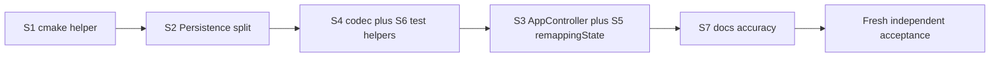

### Report for ORCHESTRATOR_CHAT

Persistent role identity: WORKER
Logical whole identity: code-health-and-refactoring
Worker session ordinal: 01
Worker exchange ordinal: 02
Worker session target: current-worker-session
Worker session profile: Planner (report-rendering continuation)
Phase: completion
Task identity: CONTEXTDECK-CODE-HEALTH-REFACTORING-REPORT-RENDER
Native planning mode: not-used
Evidence tier: E0

status: PASS
Phase-qualified result: not-applicable
start product commit: 235d467c752958694dad4be7bcc31e66406dbdcc
end product commit: 235d467c752958694dad4be7bcc31e66406dbdcc
Changed files and purpose: META report file `projects/contextdesk/00/06-code-health-and-refactoring/01_report_01.md` only (standard English terminal report rendered from the frozen planner artifact at the exchange-01 report path). No product, AP, host, or META Git mutation.

## Validation

- Frozen planner artifact at the exchange-01 report path exists, is readable, and is the exchange-01 client-native plan content (not a Worker report). It was read completely before rendering and was not altered.
- Product identity unchanged: remote `https://github.com/cisarik/contextdesk.git`, branch `main`, HEAD `235d467c752958694dad4be7bcc31e66406dbdcc`, parent `293158887e4228a42b9c64bda7d4f0bd32fb4ec9`; AP gitlink and checkout `0cf2cff483a36a4cc2254aa424a7c53bd57a97e9`.
- Prepared prompt `projects/contextdesk/00/06-code-health-and-refactoring/01_completion_01.md` exists, was read back completely, and is byte-identical to the received prompt (SHA-256 `7faae79229a50cc83ad5993efbbc73685a13f4a573b0b7aaa59c60906a0f4910`).
- Report destination `projects/contextdesk/00/06-code-health-and-refactoring/01_report_01.md` did not exist before this write.
- `00_notes.md`, `00_handout.md`, `01_planning_00.md`, and the frozen planner artifact at the exchange-01 report path were not modified.
- No tests were configured, built, or executed. No product Git mutation. No META Git mutation.

This exchange made no product, AP, host, service, desktop-configuration, launch, device, dependency, or Git publication mutation.

## Frozen plan rendered in English

Planner Worker, Native Plan Mode, fresh session. The planning grant does not authorize implementation. After approval of this plan the Worker writes an English terminal report to the exchange-01 report path and stops. Implementation requires a separate prompt with `Native planning mode: not-used`.

### Verified identities (read-only; frozen from exchange 01)

- Product: `https://github.com/cisarik/contextdesk.git`, `main`, HEAD = public `main` = `235d467c752958694dad4be7bcc31e66406dbdcc`, parent `293158887e4228a42b9c64bda7d4f0bd32fb4ec9`, clean worktree.
- AP gitlink = checkout `0cf2cff483a36a4cc2254aa424a7c53bd57a97e9`; `./.ap/ap doctor` PASS, variant `stable`.
- META: `https://github.com/cisarik/meta.git`, `main` = public `main` = `f4f93e2c8bed9009bca5c16755bd9413b54aa951`. Untracked paths at that check were only the expected opening artifacts of this whole (`00_notes.md`, `01_planning_00.md`). Report did not yet exist.
- Prompt SHA-256 = `b9969040e1b735bdeda3800f88f4f70048339720ddcea788fa52ba9da649ac7e` (matches notes). Handout SHA-256 = `7c4031d49b8acecc6f1ac40ca37afaadcdcca632677c74eb328711672937f26e`.
- Prompt read completely and byte-identical to the delivered file.

### Scope decision

**One logical whole**, not a split. Rationale: every slice is the same claim (behavior preservation) against the same 21-test gate; a split would only multiply acceptance without a different risk class. The AP budget of one primary independent audit covers the cumulative candidate.

**Selected:** S1, S2, S4, S6, S3, S5 (`remappingState` only), S7.

**Parked (deliberate, not missing evidence):**
- Split `src/core/Types.h` — 19 TUs already pull the umbrella; without changing include sites coupling does not drop, and with that change it is churn without a behavior benefit.
- Codebase-wide reformat, `.clang-format`, `.clang-tidy` — a new format file would, under “format only touched files”, break neighboring style; no linter that would push semantic “fixes”.
- Moving `FakeSink`/`FakeSource`/`FakeGrabber` into a separate test-support target.
- Changing the 21 registered `add_test` names or COMMAND lines.
- QML binding names, visuals, IPC, schemas, log events, safety boundaries.
- `AGENTS.md:67-69`, `AGENTS.md:105-106`, `ROADMAP.md:7` (ChatOrchestrator) — byte-identical.

**Key S3 architectural invariant:** `SettingsHost` remains with a single context property `"app"`. `AppController` remains the QML/test facade. No new QML context properties. QML files in S3 are **outside the allowlist**.



Broad gate of every implementation exchange (do not run in the planning exchange):

```sh
cmake -S . -B build -G Ninja
cmake --build build
ctest --test-dir build --output-on-failure
```

Registered names (21, invariant): `test_profile_resolver`, `test_profile_persistence`, `test_workspace_plan`, `test_openrgb_protocol`, `test_broker_identity`, `test_broker_ledger`, `test_broker_forwarding`, `test_broker_acquisition`, `test_broker_watchdog`, `test_broker_ipc`, `test_broker_production`, `test_udev_policy`, `test_workspace_receiver`, `test_workspace_lighting`, `test_placement_resolver`, `test_workspace_mutator`, `test_application_launcher`, `test_udev_verify`, `test_trial_cutoff`, `test_sleep_hook`, `test_broker_ipc_client`.

### S1 — CMake test helper (exchange 01, commit 1)

**Objective:** remove 18 repeated `add_executable` / `target_link_libraries` / `add_test` triples via a helper. The three non-executable tests (`test_udev_verify`, `test_trial_cutoff`, `test_sleep_hook`) remain explicit.

**Helper** in new `cmake/contextdeck-tests.cmake`, included from `CMakeLists.txt`:

```cmake
function(contextdeck_add_unit_test name)
  # PARSE_ARGV: NO_AUTOMOC; DBUS_SESSION;
  # SOURCES (default tests/unit/${name}.cpp);
  # LIBRARIES; COMPILE_DEFINITIONS; INCLUDE_DIRECTORIES;
  # COMMAND_ARGS; ENVIRONMENT
  # add_test COMMAND must match today's spelling:
  #   plain: COMMAND ${name} ${COMMAND_ARGS}
  #   DBUS_SESSION: COMMAND "${DBUS_RUN_SESSION_EXECUTABLE}" -- $<TARGET_FILE:${name}>
endfunction()
```

COMMAND byte-stability is an invariant. Special shapes remain: broker `NO_AUTOMOC`; dbus tests `DBUS_SESSION` + `ENVIRONMENT "QT_QPA_PLATFORM=offscreen;QT_DISABLE_SESSION_MANAGER=1"`; `test_udev_policy` `COMPILE_DEFINITIONS CONTEXTDECK_SOURCE_DIR=...`; `test_broker_ipc_client` `COMMAND_ARGS -nocrashhandler` plus extra SOURCES `src/app/BrokerIpcClient.cpp`.

**Test doubles:** **keep** in `contextdeck_broker_core`. Production `contextdeck-broker` has CLI `selftest` / `watchdog-selftest` (`src/broker/main.cpp` 68–73), which need Fake*. A separate test-support target would either duplicate objects or drop Fake* from the production binary CLI — that is not behavior-preserving. CMake comment at the Fake* sources: selftest/unit-only, not the ARM path.

**Allowlist:** `CMakeLists.txt`, `cmake/contextdeck-tests.cmake`.

**Focused:** `ctest -N` — 21 names; a random sample of COMMAND in `build/CTestTestfile.cmake` matching today's shape. Broad: the full suite.

**Rollback:** revert the single CMake commit.

**Unchanged-observable:** all runtime/QML/IPC/schemas/logs; names and COMMAND of the 21 tests.

### S2 — Split Persistence (exchange 02, commit 1)

**Objective:** split the 1483-line `src/core/Persistence.cpp` (anonymous namespace ~19–925; `parseDocument` 954–1216; `validate` 1218–; `toJson` 1326–; IO 1392–) into `src/core/persistence/` behind the **unchanged** public API `src/core/Persistence.h`.

Units (internal headers, not part of the public API):
- `JsonCommon` — `makeError`, `isInteger`, `checkObjectKeys`, `hasControlCharacters`, `boundedUtf8`, `looksLikeDesktopId`
- `KeysJson` — chord / assignment / keys parse+serialize
- `LightingJson` — zone v2/v3, lighting v1/common, lighting JSON
- `MatchJson` — match + title fallback
- `WorkspaceJson` — assignment + session
- `DocumentCodec` — `ProfileStore::parseDocument` / `validate` / `toJson` / `parsePreferences`
- `Persistence.cpp` — paths + `load` / `save` / `toJsonBytes` only

No shared helper with the D-Bus receiver (different bounds, different error model).

**Allowlist:** `src/core/Persistence.cpp`, `src/core/persistence/*.{h,cpp}` (new), `CMakeLists.txt` (`contextdeck_core` sources). `Persistence.h` only if the include path remains; **no signature changes**.

**Focused:** `test_profile_persistence`. Broad: 21. New test **no** — the public API does not change; a new test would freeze internal structure.

**Rollback:** revert the commit; public API identical.

### S4 + S6 — Codec and test helpers (exchange 03, 2 commits)

#### S4

**WorkspaceStateCodec:** move `decodeSnapshot` (`WorkspaceReceiver.cpp` 577–773) and the pure D-Bus decode helpers (`decodePosition`, `decodeDesktopStructure`, `decodeGetAllProperties`, `decodeCount`, `unwrapDbusVariant`, `hasControlCharacters`/`boundedUtf8` of this TU) into `src/context/WorkspaceStateCodec.{h,cpp}`. Lifecycle (subscribe, owner, coalesce, deadline, recovery) stays in `WorkspaceReceiver`. `decodeSnapshot` may remain a thin wrapper.

**ContextReceiver:** extract **only** `parseInventoryPayload` (~551–614) as a free function in `src/context/InventoryPayload.{h,cpp}`. Nested D-Bus `Object`, sequence/heartbeat **leave**. No shared abstraction with Persistence.

**Allowlist:** `src/context/WorkspaceReceiver.{h,cpp}`, `src/context/WorkspaceStateCodec.{h,cpp}`, `src/context/InventoryPayload.{h,cpp}`, `src/context/ContextReceiver.cpp`, `CMakeLists.txt` (`contextdeck_context` sources), `tests/unit/test_workspace_receiver.cpp` (new slots for the codec with `QVariantMap`, **without** a new `add_test` name).

**Focused:** `test_workspace_receiver` (existing lifecycle + new codec slots without dependence on the fake manager). Broad: 21.

#### S6 (same exchange, second commit)

**Do not merge** the two `FakeDesktopManager` classes into one — the receiver fake is GetAll/hold/malformed; the lighting fake has `Set`/`createDesktop`/`setDesktopName` and a different introspect. Extract the shared pieces: `DesktopTuple` + D-Bus stream operators + GetAll map builder into `tests/support/FakeVirtualDesktopMap.h` (header-only). The two test classes remain and call the helper.

**Do not split** the large test executables (Qt `QTEST_MAIN` = one name).

**Allowlist:** `tests/support/FakeVirtualDesktopMap.h`, `tests/unit/test_workspace_receiver.cpp`, `tests/unit/test_workspace_lighting.cpp`, `CMakeLists.txt` include dir for the test targets that need the helper.

**Focused:** `test_workspace_receiver`, `test_workspace_lighting`. Broad: 21.

### S3 + S5 — AppController + dead API (exchange 04, 2 commits)

Measured: `AppController.h` 277 lines, 48 `Q_PROPERTY`, 52 `Q_INVOKABLE`; `AppController.cpp` 2285 lines. One QML `app` in `src/app/SettingsHost.cpp`. ~83 unique `app.*` bindings across 9 QML files. `test_workspace_lighting` **recompiles** `AppController.cpp` + `BrokerIpcClient.cpp` (there is no app library).

**Facade:** `AppController` remains the sole QML type; getters/invokables delegate. Signals and property names **except `remappingState`** remain.

New units under `src/app/`:
- `LightingEdit` — today's anonymous namespace (applyMode/zone/gradient/sanitize/hex/speed/breathing) + `parseHex`/`toHex`
- `ProfileDocumentEditor` — global/app lighting, add/remove profile, `assignEmitShortcut`, save via `ProfileStore`
- `WorkspaceSessionEditor` — CRUD sessions + application workspace/title-fallback setters
- `WorkspaceApplyController` — fingerprint, apply/revert, launch-on-created, apply-status fields, `m_mutator`/`m_launcher`
- `PresentationModel` — hero/status/diagnostics/inventory/profiles/controls/workspaceObserved/plan maps (const queries)

`AppController` keeps wiring: load, context/workspace/rgb connect, `recompute`/`sendLighting`, broker 3 one-liners, Q_PROPERTY forwarding.

**CMake in this slice:** new static library `contextdeck_app` (AppController + 5 units; **not** `BrokerIpcClient`, `TrayController`, `SettingsHost`, `ChordRecorder`, `main`). `contextdeck` and `test_workspace_lighting` link it. `qt_add_qml_module` stays on the executable (ChordRecorder). Global `CMAKE_AUTOMOC ON` MOCs `AppController` in the library.

**S5 in the second commit of the same exchange:** remove `Q_PROPERTY remappingState` and the inline getter (`"inactive-until-M2"`). No QML/C++ consumer (grep hits the header only). **Do not wire it** — wiring would be a claim about remapping state, i.e. a behavior/product change.

QML usage table (measured, not changes):
- Remove only `remappingState`.
- Implemented, QML-unbound, C++ dead: `currentApplication`, `lightingMode`, `globalColor`, `isValidHex` — **keep** for the later UI/UX whole.
- QML-unbound, C++ live (Tray/diagnostics): `currentProfile`, `lightingConnection`, `contextDisplayName`, `lastError`, `bridgeConnected`, `degraded`, `isSelfWindow`, `lastExternalApplication`.

**Allowlist:** `src/app/AppController.{h,cpp}`, `src/app/{LightingEdit,ProfileDocumentEditor,WorkspaceSessionEditor,WorkspaceApplyController,PresentationModel}.{h,cpp}`, `CMakeLists.txt`, `tests/unit/test_workspace_lighting.cpp` only if an include is needed. **Not** `ui/*`.

**Focused:** `test_workspace_lighting` (same `AppController` public API). Broad: 21. New unit test of the extracted classes **no** — it would freeze internal structure; the facade is the contract.

**Rollback:** revert one or both commits of exchange 04; QML unchanged.

**Unchanged-observable:** all `app.*` except disappearance of unused `remappingState`; strings (including SK phrases in `openRgbPhrase`/`lightsPhrase`/`contextDisplayName`); log events `loaded profile document`, `cold start: ...`, `profile load refused`, `save refused`, `temporary_color expired on external identity change`.

### S7 — Documentation (exchange 05, commit 1)

After the code, so ROADMAP can mention the new internal structure without a closure claim.

**Allowlist:** `ROADMAP.md`, `README.md`, `docs/testing-m2.md`. `docs/architecture.md` **do not change** — it already describes measured capabilities and `sink-write-failed`; file-level layout is not its owner. `AGENTS.md` access lines **do not change**.

#### Exact replacements

**A. `ROADMAP.md` “Current whole” (~41–44)** replace with:

```text
- Closed documentation whole: **M4 state and ledger reconciliation** — accepted
  on `235d467...`; ledger dispositions recorded in the M4 backlog section.
- Current whole: **code health and refactoring** — behavior-preserving
  internal structure on the session app, core, receivers, and tests. No
  behavior, visuals, product-claim, or safety-boundary change. No host, device,
  desktop, launch, broker, packaging, or license mutation.
```

**B. `README.md` (~10–12)** — replace the sentence “the current bounded whole reconciles the accepted M1–M4 state and disposes of the carried M4 ledger candidates” with: “The M4 state and ledger reconciliation is closed on `235d467...`. The current bounded whole is behavior-preserving code health and refactoring.”

**C. Sleep-hook bullet `ROADMAP.md` (~429–432)** — replace “Not autostart. Not live suspend evidence. ADR 0001.” with: “Not autostart. One named live suspend/resume slice is recorded (Session 22). Hibernate and hybrid-sleep remain open. ADR 0001.”

**D. Production-safety list `ROADMAP.md` (~456–460)** replace (evidence at the candidate):
- Silent uinput writes: `ForwardingEngine::failWrite` logs `sink-write-failed` and returns false; test in `test_broker_forwarding`.
- Capabilities: `Acquisition::arm` measures the union and calls `applyMeasuredCapabilities` **before** `createVirtual`; `passthroughCapabilities()` is used only by `test_broker_production.cpp`; the header already says “Production ARM measures the live pair”.
- logind: `LogindSeatAuthorizer::authorize` — `sd_pid_get_session` first; on `-ENODATA`/`-ENXIO`/`-ENOENT` enumerate `sd_uid_get_sessions` and accept **exactly one** eligible session. Matches `docs/architecture.md` ~213–216. This is not a remaining source defect.

```text
does not choose which remainder comes next. Previously listed source gaps are
addressed in tree: `ForwardingEngine` fails closed on `sink-write-failed`;
production ARM measures the live capability union and applies it before
virtual creation (`passthroughCapabilities()` is a test helper, not the ARM
path); `LogindSeatAuthorizer` uses `sd_pid_get_session` first and, on no
session, accepts exactly one eligible active local seated graphical session.
Those items are not remaining source defects. Remaining M2 work is still
production/autostart readiness (G8/M5), hibernate/hybrid-sleep, and general
input-remapper coexistence.
```

**E. `docs/testing-m2.md` ~12–14** — the remaining-G4 list LED-return / all-control / live suspend / input-remapper is **stale** relative to named slices 16/19/22/23/24. Replace with wording matching ROADMAP G4: named slices accepted; remaining = production/autostart, hibernate/hybrid-sleep, general input-remapper coexistence.

**F. `docs/testing-m2.md` ~248–251** the same remaining-claims correction; named LED/all-control/suspend/bounded remapper slices are not rerun.

**Focused:** no CTest (docs). Broad: 21 still as the checkpoint that the docs commit did not touch code. Acceptance reads the docs diff against this anchor.

### Exchanges, commits, cumulative candidate

| Exchange | Worker | Baseline | Commits | Full suite |
|---|---|---|---|---|
| 01 | impl, `current-worker-session` after a separate prompt | `235d467…` | `Add contextdeck_add_unit_test CMake helper` | after the commit |
| 02 | impl (fresh or current, ORCH decides) | HEAD after 01 | `Split ProfileStore codecs into src/core/persistence` | after |
| 03 | impl | HEAD after 02 | (1) `Extract WorkspaceStateCodec and inventory payload parser` (2) `Share FakeVirtualDesktopMap test helper` | after each |
| 04 | impl | HEAD after 03 | (1) `Decompose AppController behind a stable QML facade` (2) `Remove unused remappingState placeholder` | after each |
| 05 | impl | HEAD after 04 | `Correct M2 source-gap docs and current-whole wording` | after |
| 06 | **fresh** independent acceptance | final HEAD after 05 | no product commit | mandatory |

Each impl exchange: one parent, allowlist from this plan, no push by the Worker until the prompt grants Git publication. `Post-plan implementation session: current-worker-session` is **allowed** for 01 after a renewed grant; S3 (04) is large enough that ORCH may use a fresh Worker — the plan leaves that to ORCH and does not insist on ceremonial destruction.

One product commit per slice/commit-subject above; no squash across slice boundaries.

### Acceptance (one fresh independent audit)

After exchange 05. `required-fresh-independent`. At most one correction + re-audit. If a correction changes public API / validator / runtime / QML names → **full-fresh**, not scoped.

**Control matrix (must hold):**
- Public `main` (or named candidate) = exact HEAD after 05; parent chain from `235d467…`.
- `ctest --test-dir build --output-on-failure` → 21/21, names matching the list.
- `grep -n remappingState` in `ui/` and `src/` → no hit except history; property gone from `AppController.h`.
- `grep` unique `app.` in `ui/*.qml` — the name set **except** `remappingState` equals baseline (mechanical inventory in the report).
- `Persistence.h` public API byte-stable vs `235d467…`.
- IPC/wire: no diff in `src/broker/IpcProtocol.*`.
- Schema: no change to `kSchemaVersion` or parse error strings in Persistence codecs (compare test assertions in `test_profile_persistence`).
- Docs: anchors A–F present; `AGENTS.md` access lines and `ROADMAP.md:7` byte-identical with `235d467…`.
- Falsifiers: failing test; change of a QML property/signal name; IPC change; JSON schema/validator-reason change; user-visible string change; new log event; `remappingState` still in the header; access-profile line changed; claim of M2/M3/M4 closure.

No host/device/desktop/launch/broker ARM.

### Risks

- **QML binding regression** — detection: QML compile + inventory grep + `test_workspace_lighting`; rollback of exchange 04; S3 must not edit `ui/`.
- **Persistence parse regression** — `test_profile_persistence` + full suite; rollback S2.
- **Receiver lifecycle regression** — `test_workspace_receiver` under `dbus-run-session`; codec tests do not replace lifecycle; rollback S4.
- **Hidden coupling / missed CMake source** — `test_workspace_lighting` links `contextdeck_app`; link failure is fail-closed.
- **Test helper changes fake behavior** — S6 is a helper, not a unified class; both dbus tests after extraction.
- **CMake COMMAND drift** — S1 must emit today's `add_test COMMAND` spelling; acceptance compares `CTestTestfile.cmake` shapes for dbus and `-nocrashhandler`.

### Assumptions and non-claims (frozen plan)

- Maximal depth within bounds: Types.h split and formatter are a deliberate park, not minimization.
- `contextdeck_app` does not change the QML module URI or ChordRecorder.
- No performance/startup measurement.
- The plan **is not** implementation-PASS and is not proof that refactoring preserves behavior — that is established only by impl + acceptance.
- No product, AP, host, or Git publication mutation in the planning exchange.

Frozen-plan next step (content of the plan, not this rendering exchange's next step): ORCHESTRATOR reconciles this plan; only if accepted, issues a separate implementation prompt (exchange 01 = S1) with `Native planning mode: not-used`. Native Plan approval **is not** execution authority.

## Trace persistence

- Prompt `01_completion_01.md` read back completely; SHA-256 `7faae79229a50cc83ad5993efbbc73685a13f4a573b0b7aaa59c60906a0f4910`; byte-identical to the received prompt.
- Frozen planner artifact at the exchange-01 report path read completely; SHA-256 `454ed225ddd688ec2383f37fecf57e558a3cf5e40da678fce8d5a22b520afce8`; not written.
- Report written to `projects/contextdesk/00/06-code-health-and-refactoring/01_report_01.md`.
- Report read back completely after write; header is `### Report for ORCHESTRATOR_CHAT`; coordinates are `code-health-and-refactoring` / session `01` / exchange `02`; filename is `01_report_01.md`.
- Archival remains a COOPERATOR action; wait-for-report.

## Deviations, risks, unresolved decisions, missing evidence

- Exchange-01 artifact-form deviation: the exchange-01 attempt wrote a client-native plan artifact to the exchange-01 report path instead of a valid terminal Worker report. That artifact lacks the required header, coordinates, and compact core; it is not in English; and it contains a local machine path that must never enter the public trace. This exchange treats that plan content as frozen and renders it here without reopening, improving, extending, or restructuring it. The frozen artifact was not modified and is left for COOPERATOR retirement after this report exists.
- Fidelity limitation: language conversion Slovak → English of the same decisions; English identifiers, commit subjects, commands, replacement text blocks A–F, and the 21 test names are byte-identical to the frozen artifact. No plan decision was added, removed, weakened, or strengthened.
- Unresolved relative to the frozen plan: none. Parked items remain parked by decision, not by missing evidence.
- Missing evidence: none for this rendering exchange. The plan itself still does not claim behavior preservation until later implementation and acceptance.

## Smallest next step

ORCHESTRATOR reconciliation of this report and, if the plan survives it, the next bounded exchange.

Report justification: new-evidence

Resolved Execution Issues / Near-Misses: exchange-01 persisted a client-native plan to the report path (missing standard header/coordinates, not English, contained a local machine path). Cause: Native Plan Mode artifact landed on the Worker report filename. Resolution: this exchange granted report-rendering-only authority, left the frozen artifact untouched, and wrote the standard English terminal report to `01_report_01.md`. Residual: COOPERATOR retires the exchange-01 artifact after archival of this prompt/report pair; the frozen plan is not independently accepted by this render.

Pre-Existing Failure Classification: none

Orchestration critique:

MEASURED: exchange-01 report path holds a client-native plan, not a Worker report (no `### Report for ORCHESTRATOR_CHAT`, not English, local machine path present); evidence: complete read of the frozen planner artifact at the exchange-01 report path; effect: this completion exchange was required before ORCHESTRATOR reconciliation; smallest correction: already issued as `01_completion_01.md`.

LEAD: none

Logical-whole closure: not-closed

Explicit non-claims: no implementation-PASS, acceptance-PASS, publication-PASS, deployment-PASS, production readiness, M2/G4/G3 closure, autostart, hibernate/hybrid sleep, input-remapper coexistence, M3/M4 closure or physical behavior, M5, remapping, deck layer, per-key RGB, license selection, or hardware acceptance; no claim that the plan's decisions are accepted before ORCHESTRATOR reconciliation; no claim that refactoring preserved behavior.

Authority for this Worker expires at this terminal report.
