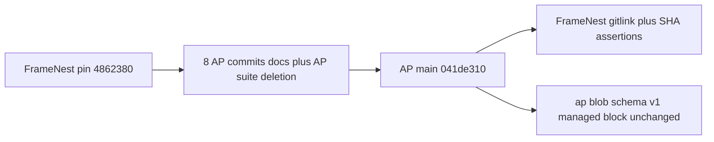

# FrameNest AP Generation Consumer Convergence

### Report for ORCHESTRATOR_CHAT

Logical whole identity: framenest-current-ap-generation-adoption-and-consumer-rebaseline
Worker session ordinal: 01
Worker exchange ordinal: 01
Standard terminal status: PASS
Phase-qualified result: not-applicable
Result artifact or commit: not-applicable
Logical-whole closure: not-closed

Recommended disposition: **mutate**. Smallest coherent FrameNest change is a forward pin of `.ap` from `4862380f351ddd74e1c141a4babe2d0f0b43979d` to public AP `main` `041de310ea33ed1b47dd8f5fbfcc2829d1a32514`, plus the two exact current-generation SHA assertions that would otherwise stay false. No product, schema, managed-block, dependency, provider, NUC, or production change is required.

## 1. Repository/public-ref gate

All three public `refs/heads/main` values were established with direct `git ls-remote`. Tracked FrameNest and AP trees are clean. Untracked FrameNest leftovers do not alter tracked compatibility evidence; they do block the standard `ap update --apply` / `doctor --candidate` clean-superproject checks in this worktree. Continue planning. Implementation must use a clean isolated worktree.

## 2. FrameNest public and local identities

- Root: `/home/agile/Projects/framenest`
- `remote.origin.url`: `https://github.com/cisarik/framenest.git`
- Branch: `feat/ap-baseline-bound-execution-adoption` (leftover name; not detached)
- Local `HEAD`: `d4c3402a4765b39cee0d8e2063d5ec8be161caf6` (`fix: repin AP adoption to published execution envelope`)
- Public `refs/heads/main`: `d4c3402a4765b39cee0d8e2063d5ec8be161caf6`
- Relationship: `HEAD` equals public `main`
- Tracked/index: clean
- Untracked, classified, not compromising pin evidence:
  - [`.accept-immut-work/`](.accept-immut-work/) leftover nested tree (1645 files)
  - [`.w6-immut-work/`](.w6-immut-work/) leftover nested tree (1356 files)
  - [`.playwright-mcp/`](.playwright-mcp/) operator browser dumps
  - [`uv.lock`](uv.lock) incidental; not project authority
  - `REPRO_DIR=/` accidental nested repro dir
- [`.gitmodules`](.gitmodules): path `.ap`, URL `https://github.com/cisarik/ap.git`

## 3. Pinned `.ap` gitlink and checkout

- Containing gitlink: `160000 commit 4862380f351ddd74e1c141a4babe2d0f0b43979d .ap`
- `.ap` `HEAD`: `4862380f351ddd74e1c141a4babe2d0f0b43979d` (`fix: preserve Python virtual-environment launch semantics`)
- `.ap` dirty state: clean
- FrameNest `.ap` object DB does **not** yet contain `041de310...`; its stale `origin/main`/`FETCH_HEAD` is `5c2f0e197d6aecdc6aca918b22e080bb58abc7a1`. Fetch is required at implementation time, not now.

## 4. Current AP public identity

- Root: `/home/agile/Projects/ap`
- Origin: `https://github.com/cisarik/ap.git`
- Local `HEAD` equals public `refs/heads/main`: `041de310ea33ed1b47dd8f5fbfcc2829d1a32514` (`docs: converge ADR-0014 lifecycle status`)
- Working tree: clean
- Expected restoration anchor **is** current public `main`
- `041de310...` is a normal forward descendant of pin `4862380...` (`merge-base --is-ancestor` yes)

Planning target: **`041de310ea33ed1b47dd8f5fbfcc2829d1a32514`**. Do not reset AP.

## 5. AP generation range and relevant compatibility delta

Eight commits, pin exclusive to target inclusive, all already in `/home/agile/Projects/ap`:

- `f3ea12df` docs: define AP semantic ownership and convergence
- `30c28c20` docs: compress AP operational projections
- `82d9db06` docs: compress AP explanatory projections
- `1b077411` fix: enforce orchestrator-only closure contract
- `f117457a` feat: define external analytic trace exchanges
- `81dee2c1` fix: enforce canonical trace transition example
- `4e7bfa56` refactor: retire monolithic AP test suite
- `041de310` docs: converge ADR-0014 lifecycle status

Changed paths (18): protocol/docs/ADRs plus deletion of AP-internal `tests/ap_tool_tests.sh`. **Executable `ap` is byte-identical** (blob `64821a14fb2b9e19dfaa04b409177be3c202d6d0` at both commits).

Relevant to FrameNest:

- Pin must move; otherwise FrameNest stays on the previous generation.
- Managed `AGENTS.md` block lives inside unchanged `ap`; FrameNest block already equals that canonical text.
- Schema v1 / `sanitized-v1` parsing lives inside unchanged `ap`.
- [`INTEGRATION.md`](/home/agile/Projects/ap/INTEGRATION.md) / [`UPDATING.md`](/home/agile/Projects/ap/UPDATING.md): relationship headers only; update procedure unchanged.
- RF-19 coordinates and optional trace: prompt/report semantics only. ADR-0014: no consumer artifact, CLI, schema, or managed-block migration.
- Monolithic AP suite retirement: AP-internal. ADR-0015 forbids weakening consumer tests. FrameNest has no reference to `ap_tool_tests.sh`.

## Compatibility answers

1. Current FrameNest pin: `4862380f351ddd74e1c141a4babe2d0f0b43979d`
2. Public `cisarik/ap` `main`: `041de310ea33ed1b47dd8f5fbfcc2829d1a32514`
3. Yes, normal forward descendant
4. Eight commits; paths listed above
5. Relevant: pin identity and protocol text under `.ap/`. Not relevant as FrameNest edits: RF-19, suite deletion, handbook compression
6. Managed [`AGENTS.md`](AGENTS.md) block: **no change** (equals `ap` `managed_block()`)
7. [`ap.project.conf`](ap.project.conf) schema v1: **valid unchanged**
8. [`tests/contract/test_ap_integration.py`](tests/contract/test_ap_integration.py): **yes**, `EXPECTED_AP_COMMIT` must become `041de310...`
9. [`tests/contract/test_ap_project_contract.py`](tests/contract/test_ap_project_contract.py): **not invalidated** (schema/envelope encoded in identical `ap`)
10. [`docs/WORKER_EXECUTION_CONTRACT.md`](docs/WORKER_EXECUTION_CONTRACT.md): **still true**; do not duplicate RF-19/planning into FrameNest
11. Other exact generation assertion: [`README.md`](README.md) lines 496–500 still claim current gitlink `5c2f0e197d6aecdc6aca918b22e080bb58abc7a1` (already stale vs `4862380...`). Include the one-line SHA update so the candidate does not keep a false current pin. ADR-0034 initial pin `c4c69f52...` is historical and stays
12. Yes: no product source, migrations, dependencies, providers, NUC, or production
13. Accepted repository change does **not** alter FrameNest runtime/deployment behavior (`ap` identical; no `src/`, deploy, or `ap.project.conf` change)
14. Deployment **not required**
15. Proportionate independent acceptance: short pin/trust-boundary review of allowlisted diff + doctor/SHA tests; not UX, not production, not full suite

## 6. `ap.project.conf` verdict

Keep [`ap.project.conf`](ap.project.conf) unchanged. Schema v1, `projectId = cisarik/framenest`, `environmentPolicy = sanitized-v1`, CPython 3.13, three operations. Parser and envelope are in the identical `ap` blob. ADR-0012 already exists at the pin.

## 7. FrameNest consumer-contract findings

- Integration test is the SHA lock; it must move with the gitlink.
- Project-contract tests remain valid.
- Doctor still requires the same managed block, canonical URL, gitlink/checkout equality, no copied root AP files.
- Worker execution contract remains a true FrameNest overlay on unchanged RF-16.

## 8. Exact proposed changed-path allowlist

1. `.ap` gitlink → `041de310ea33ed1b47dd8f5fbfcc2829d1a32514`
2. [`tests/contract/test_ap_integration.py`](tests/contract/test_ap_integration.py) — `EXPECTED_AP_COMMIT` only
3. [`README.md`](README.md) — replace the documented current gitlink SHA only (`5c2f0e19...` → `041de310...`)

No other paths.

## 9. Inspected and intentionally unchanged

- [`AGENTS.md`](AGENTS.md) managed block and project rules
- [`ap.project.conf`](ap.project.conf)
- [`tests/contract/test_ap_project_contract.py`](tests/contract/test_ap_project_contract.py)
- [`docs/WORKER_EXECUTION_CONTRACT.md`](docs/WORKER_EXECUTION_CONTRACT.md)
- [`.gitmodules`](.gitmodules)
- [`docs/adr/0034-canonical-analytic-programming-integration.md`](docs/adr/0034-canonical-analytic-programming-integration.md)
- [`DEVELOPMENT.md`](DEVELOPMENT.md), [`ROADMAP.md`](ROADMAP.md), [`SECURITY.md`](SECURITY.md) generic AP claims
- Product `src/`, deploy, migrations, lockfiles
- Do not run `./.ap/ap init`

## 10. Implementation plan

Fresh Worker only. `Native planning mode: not-used`. Baseline: public FrameNest `d4c3402a4765b39cee0d8e2063d5ec8be161caf6`. Do not reuse leftover branch name `feat/ap-baseline-bound-execution-adoption` unless the Orchestrator names it. Do not implement in this dirty canonical worktree.

1. Create a clean isolated worktree from that exact commit; init `.ap` at `4862380...`.
2. Confirm baseline `./.ap/ap doctor` PASS and gitlink/checkout equality.
3. `./.ap/ap update --apply` (forward-only fetch + detach to public AP `main`). Do not use `--check` in planning; apply is authorized only in the implementation session.
4. `./.ap/ap doctor --candidate`.
5. Set `EXPECTED_AP_COMMIT` to `041de310ea33ed1b47dd8f5fbfcc2829d1a32514`.
6. Set README current gitlink SHA to the same commit.
7. Stage exactly `.ap`, the integration test, and README.
8. Strict `./.ap/ap doctor` after staging.
9. Commit only if that session has Git write authority. Push only if separately granted.
10. Do not stage or delete canonical-worktree leftovers. Do not modify `.venv`, Poetry, NUC, Meta, or `cisarik/ap`.

Rollback: `git -C .ap checkout --detach 4862380f351ddd74e1c141a4babe2d0f0b43979d`, restore the two SHA strings, candidate doctor, stage, strict doctor, commit.

## 11. Validation plan

Do not run the full FrameNest suite.

- `.ap` HEAD == `041de310ea33ed1b47dd8f5fbfcc2829d1a32514`
- Staged gitlink == that commit
- `.ap` clean and canonical
- `doctor --candidate` then strict `doctor` with `OK resolved governing variant: stable` and `ap doctor: PASS`
- Optional cheap `./.ap/ap project check --root <worktree> --candidate` (schema unchanged; proves the identical tool still accepts the contract)
- Focused: `PYTHONPATH=<worktree>/src /home/agile/Projects/framenest/.venv/bin/python -m pytest tests/contract/test_ap_integration.py`
- Run [`tests/contract/test_ap_project_contract.py`](tests/contract/test_ap_project_contract.py) only as optional confirmation; not implicated
- Diff/path review equals the allowlist
- No copied `AP.md` / `AP_WORKER.md` / BOOT/NEXT files at FrameNest root
- Confirm leftovers were not staged

## 12. Independent-acceptance recommendation

**Yes, a short independent pin review is proportionate.** Governing protocol identity is a trust-boundary control even though runtime is unchanged. Scope: allowlisted diff, public AP SHA, doctor, SHA tests. Fresh Worker, not the implementer. Not UX, not NUC, not full audit. AP-side decisions at `041de310` are already accepted; this reviews FrameNest consumption only.

## 13. Publication classification

Ordinary FrameNest repository publication of the pin commit to public `main` after acceptance. Not a product release. Not Meta-as-authority.

## 14. Deployment and production impact

**Deployment not required. Production impact none.** Evidence: identical `ap` blob; unchanged [`ap.project.conf`](ap.project.conf); no `src/`, systemd, schema `0028`, or release-path change. Production remains a separate surface (`aec2f009...` / schema `0028` in living docs). SSH/NUC availability is not authority.

## 15. Meta restoration observation only

- Root: `/home/agile/meta`; origin `https://github.com/cisarik/meta.git`
- Local `HEAD` equals public `main`: `f8be66a222bb3df6509405ef878440e4c68603a2` (forward of historical `a452d51...`)
- Tracked clean; untracked `projects/framenest/` exists locally, including `00/00-framenest-current-ap-generation-adoption-and-consumer-rebaseline`
- README archive grammar: `projects/<project>/<archive-sequence>/<logical-whole-sequence>-<logical-whole-identity>/`
- No archive coordinate selected; no Meta mutation; Meta is not AP or FrameNest authority

## 16. AP empirical-learning evidence

`none`. Leftover dirty superproject blocking `update --apply` is FrameNest hygiene plus AP fail-closed cleanliness, not a protocol defect. RF-19 correctly requires no consumer file. Stale README SHA is a FrameNest living-status lag, not an AP contradiction.

## 17. Deviations, risks, missing evidence

- Canonical FrameNest worktree is not superproject-clean; implementation must isolate.
- FrameNest `.ap` lacks target objects until fetch.
- Leftover local branch name equals `main` SHA; do not treat the name as authority.
- README SHA is already stale at baseline; include it so the candidate is internally true.
- Public AP did not advance past `041de310`.

## 18. Smallest next ORCHESTRATOR decision

Accept this allowlist and issue a **fresh** implementation Worker prompt with `Native planning mode: not-used`, isolated worktree from `d4c3402...`, Git write limited to the three paths, no leftover cleanup unless separately authorized, no push/deploy/production, then independent pin review and publication routing. Do not close the logical whole from this planning report.

Start commit: `d4c3402a4765b39cee0d8e2063d5ec8be161caf6`
End commit: `d4c3402a4765b39cee0d8e2063d5ec8be161caf6`
Changed files: none
Tests and validation: read-only `git ls-remote` / identity / status; AP range log, name-status, `ap` blob equality; managed-block equality; FrameNest SHA/contract reads; Meta identity and README grammar
Commit result: not authorized / none
Push result: not authorized / none
Report justification: new-evidence
Resolved Execution Issues / Near-Misses: none
Pre-Existing Failure Classification: untracked leftover trees/operator artifacts in the canonical FrameNest worktree; README current-gitlink SHA already stale vs pin `4862380...`; FrameNest `.ap` `origin/main` stale at `5c2f0e19...`
Authority expiry: planning authority expired at this terminal report
