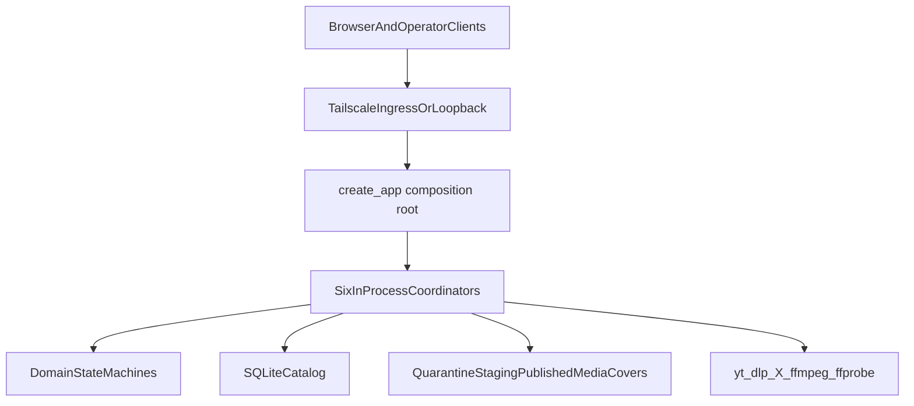

### Report for ORCHESTRATOR_CHAT

Logical whole identity: framenest-runtime-architecture-maintainability-and-backlog-rebaseline
Worker session ordinal: 01
Worker exchange ordinal: 01
Standard terminal status: PASS
Phase-qualified result: not-applicable
Result artifact or commit: not-applicable
Report justification: new-evidence
Authority expiry: all Worker 1 read-only planning and evidence authority expired at this terminal report
Repository mutation: none
Publication: none
Deployment: none
Production mutation: none
Provider calls: none
AP mutation: none
Meta mutation: none

## 1. Repository restoration gate

Working directory: `/home/agile/Projects/framenest`. Repository identity: `cisarik/framenest`. Origin: `https://github.com/cisarik/framenest.git`.

Direct Git transport (2026-08-13):

- `git ls-remote https://github.com/cisarik/ap.git refs/heads/main` → `041de310ea33ed1b47dd8f5fbfcc2829d1a32514`
- `git ls-remote https://github.com/cisarik/framenest.git refs/heads/main` → `a72be476f5634394287082be07380d03fa7ccd4d`

Both match the Orchestrator restoration anchors. Meta was not required.

Local state (read-only; not repaired):

- Branch: `feat/ap-baseline-bound-execution-adoption` (no upstream)
- Local HEAD: `d4c3402a4765b39cee0d8e2063d5ec8be161caf6` (`fix: repin AP adoption to published execution envelope`)
- Public `origin/main`: `a72be476…` (`chore: adopt current AP generation`), parent `d4c3402…`, tree `5f8afa3d…`
- Tracked/index: clean. Local vs public: 3 files (`.ap`, `README.md`, `tests/contract/test_ap_integration.py`)
- Untracked owner material preserved: `.accept-immut-work/`, `.playwright-mcp/`, `.w6-immut-work/`, `REPRO_DIR=/`, `uv.lock` (`uv.lock` is not project authority)

AP:

- Public FrameNest gitlink on `a72be476`: `041de310ea33ed1b47dd8f5fbfcc2829d1a32514`
- Local HEAD gitlink and `.ap` checkout: detached `4862380f351ddd74e1c141a4babe2d0f0b43979d`, clean
- Topology is valid for the local commit; it is one commit behind accepted public main
- [`ap.project.conf`](ap.project.conf), [`AGENTS.md`](AGENTS.md), [`docs/WORKER_EXECUTION_CONTRACT.md`](docs/WORKER_EXECUTION_CONTRACT.md) present

Not BLOCKED: identity and public refs match; production `src/` is identical on local HEAD and public main. Analysis used the accepted public tree plus the local production tree. Do not checkout to equalize.

Last runtime-affecting public commit before AP adoption: `6bf6f1d542d46c4365ae430b39eff197c2f3db87` (schema `0028`). Living docs still name production as `aec2f009…`.

## 2. Architecture map

Layering is real, not decorative: domain → application (ports + use cases + coordinators) → adapters (HTTP/CLI/web) → infrastructure (SQLite, filesystem, yt-dlp/X extractors, ffmpeg, AI).

Significant boundaries:

- Authorization: [`domain/identity_access.py`](src/framenest/domain/identity_access.py) + [`tailscale_ingress.py`](src/framenest/adapters/api/tailscale_ingress.py) (953 LOC). Capabilities are role-closed. HTTP adapters re-check `SCOPE_IDENTITY`.
- Persistence: sync SQLAlchemy Core, `BEGIN IMMEDIATE` writers, busy_timeout 5s, **no WAL**. Uvicorn `workers=1` ([`server.py`](src/framenest/server.py)). Multiprocess leases remain SPEC-deferred.
- Six lifespan coordinators in [`create_app`](src/framenest/adapters/api/application.py) (file 1342 LOC; `create_app` **867 lines**): analysis, catalog, publication, validation, YouTube, X. Nested sequential shutdown.
- YouTube and X are **intentionally parallel** stacks (X docstring: do not generalize YouTube).
- Packaged web client is one vanilla JS/CSS/HTML triad ([ADR-0017](docs/adr/0017-initial-local-web-application-delivery.md)): [`app.js`](src/framenest/adapters/api/web/app.js) **11,908 LOC / 514 functions**.
- Backup/recovery is a separate operator process family (closed ADR-0052/0056/0057), not in the FastAPI lifespan.
- Production stop: systemd `TimeoutStopSec=30s`, `KillSignal=SIGTERM`, `Restart=on-failure` ([`deploy/systemd/framenest.service`](deploy/systemd/framenest.service)).

Coupling concentrations that change for different reasons: (1) `create_app` composition + lifespan; (2) `app.js` product surfaces; (3) duplicated coordinator loop/stop semantics; (4) JS copies of Python domain constants (upload states, title 240).

## 3. Quantitative burden evidence

Method: `wc -l` + `ast` `end_lineno`. Limitation: blanks/comments included; no suite timings (no pytest duration cache); no coverage.

| Surface | Evidence |
| --- | --- |
| Production Python | 210 files, **59,624** LOC (56,109 excluding Alembic versions 3,515) |
| domain / application / adapters / infrastructure | 4,537 / 13,582 / 12,182 / 28,320 |
| Packaged web | **17,592** LOC (`app.js` 11,908, `styles.css` 4,835, `index.html` 849) |
| Python tests | 197 files, **68,303** LOC (unit 31,128; contract 22,072; integration 13,849) |
| JS tests | 21 files, **14,621** LOC |
| Python prod:test | ~0.87:1 — tests are heavy relative to production, not automatically wasteful |

Largest production Python: `catalog_backup_ops.py` 1,909; `catalog_schema.py` 1,706; `youtube_acquisition.py` 1,473; `catalog_backup_workstation.py` 1,273; `nvidia_nim.py` 1,148; `upload_session_repository.py` 1,088; `x_acquisition.py` 1,189; `application.py` 1,342.

Largest classes/functions: `create_app` 867; `SqliteUploadSessionRepository` 749; YouTube/X claim repos 712/553; `UploadTransportService` 701; `YouTubeAcquisitionCoordinator` 599; `XAcquisitionCoordinator` 535.

Touch frequency: `app.js` **87** commits (14 in the recent closed-product window) — highest production-file churn. `application.py` 36.

Backup size is real but **closed** (including stall fix `6bf6f1d`). File size alone is not a defect.

## 4. Test-burden classification

High preservation value (do not retire by analogy with AP’s monolithic suite):

- Authorization/privacy: [`test_tailscale_ingress_security.py`](tests/contract/test_tailscale_ingress_security.py) 1,393 LOC; identity frontend tests; ordinary-upload ownership; automatic-analysis privacy
- Restore/migration/integrity: upload-session migration 1,535; backup offdevice/workstation tests; catalog-removal; publication
- Historical incident protection: [`upload_cockpit_async_ownership.test.js`](tests/upload_cockpit_async_ownership.test.js) **3,859** LOC; catalog-card AI quick action 2,048

Expensive / duplicated, still protective:

- [`test_local_web_application.py`](tests/contract/test_local_web_application.py) **2,944** LOC with **105** `_javascript_function(...)` body scrapes — implementation-detail coupling that taxes any `app.js` structure change
- YouTube vs X Python/JS cockpits (X JS test only 84 LOC vs YouTube 689 — coverage asymmetry, not proof X is unfinished; X whole is CLOSED)
- Fedora systemd contract tests still guard **retained superseded source** — keep

No evidence-backed obsolete FrameNest tests were found that are safe to delete. **No test-reduction whole is recommended.**

## 5. Documentation and backlog reconciliation

| Theme | Class |
| --- | --- |
| Technical MVP, private upload, admin review/batch/removal, backup/restore, YT/X acquisition, taxonomy, off-device copy, workstation pull, repo/AP consumer convergence | CLOSED — do not reopen |
| Multi-model draft comparison | FROZEN |
| Movie identification richer taxonomy/reasoning | FROZEN (ADR-0045 code remains; do not mix into ordinary AI) |
| Responsive/mobile polish, screenshot UX | PARKED / DEFERRED BY OWNER |
| VPS, Kiosk, static X photos, Tauri, Cover Studio candidates, media second-copy, per-user metadata, multi-device sync | DEFERRED BY OWNER or TOO BROAD / do not auto-select |
| NUC Security Hardening (AppArmor profile, UFW Tailscale rules) | GENUINELY OPEN; ROADMAP names it near-term **before VPS**; this prompt forbids automatic selection; no host evidence collected |
| Portable/rebuildable sidecars | GENUINELY OPEN / do not auto-select |
| Living production SHA `aec2f009` vs last runtime `6bf6f1d` | REGRESSION of living status vs later accepted runtime commits — can misroute operators; too small as the next engineering whole; do not reopen the closed docs-authority convergence as a product whole |
| ROADMAP Phase 2 “in progress”; SPEC “first vertical slice is not implemented”; `CreatorAttributionKind` comment “X acquisition is not implemented” | SUPERSEDED / stale — misrouting risk, not the next implementation whole |
| ROADMAP “Current Active Logical Whole” | none declared after X baseline |

## 6. Ranked serious candidates

**C1 — In-process lifecycle runtime / stop contract (recommended)**
Six coordinators with **divergent stop semantics** against a **30s** systemd budget: YouTube `shutdown` cancels the runner; X `shutdown` **awaits** the runner (in-flight drain/download can continue); validation/publication/analysis `shutdown` await the runner then `ThreadPoolExecutor.shutdown(wait=True, cancel_futures=False)`. YouTube `_run` **swallows** `except Exception: progressed = False`. yt-dlp terminate grace is 10s+5s; default download timeout is **7,200s**. Sequential nested lifespan `finally` stacks these waits. Uvicorn is `workers=1` (accepted). Causal risk: SIGKILL during SQLite/staging/subprocess; stuck acquisition if a runner dies quietly. Boundable without unifying YT/X domain or building a job queue.

**C2 — Packaged web-client module boundary**
Strongest maintainability/churn concentration (`app.js` 11,908 LOC, 514 functions, 361 top-level bindings, 87 commits) plus 14,621 JS test LOC. One unit owns gallery, upload, YT, X, admin, covers, AI. Dominated **this round** by Gallery/Details freeze, screenshot-UX deferral, and 105 function-body contract scrapes (high visual/regression surface). Speculative split without a concrete UX/security defect.

**C3 — Living production SHA / operator-status rebaseline to `6bf6f1d`**
Docs still say production is `aec2f009`. Prompt states last production/runtime baseline is `6bf6f1d`. Operational misrouting only. Docs-sized; not the engineering whole.

**C4 — YouTube/X acquisition unification**
Large parallel stacks by **accepted design**. Unification would be speculative refactoring and would reopen closed acquisition wholes.

**C5 — NUC security hardening**
GENUINELY OPEN and owner-priority before VPS. Requires host/SSH/sudo authority not in this envelope. No concrete reachable application vulnerability was evidenced. Do not auto-select.

**C6 — JS/Python duplicated domain constants**
Real drift hazard (upload states, title 240). Smaller than C1; fold into C2 later, not a standalone next whole.

Backup LOC, `create_app` as composition root, Fedora leftovers, movie-identification frozen code, and WAL absence are **not** standalone next wholes (closed, textbook preference, historical retention, FROZEN, SPEC-deferred).

## 7. Recommended next bounded logical whole

**Proposed name:** In-Process Lifecycle Runtime Contract
**Proposed identity:** `framenest-in-process-lifecycle-runtime-contract`

**Problem:** After the technical MVP, FrameNest’s long-running work is six in-process coordinators with inconsistent start/notify/drain/shutdown/liveness, unbounded wait on stop, and a 30-second production SIGTERM budget. That is the highest evidenced **correctness + operational + runtime-coupling** cost that is still bounded and does not reopen closed product wholes.

**Why it dominates:** C2 is larger in LOC/churn but is frozen-UX refactoring. C5 is strategic but unauthorized here and not evidenced as an application defect. C4 is an accepted dual stack. C1 has causal stop/liveness hazards on the production restart path.

**Causal surface:**

- [`src/framenest/adapters/api/application.py`](src/framenest/adapters/api/application.py) lifespan start/stop (lines ~904–966)
- [`upload_validation_coordinator.py`](src/framenest/application/upload_validation_coordinator.py), [`upload_catalog_coordinator.py`](src/framenest/application/upload_catalog_coordinator.py), [`upload_publication_coordinator.py`](src/framenest/application/upload_publication_coordinator.py), [`media_analysis_coordinator.py`](src/framenest/application/media_analysis_coordinator.py)
- Coordinator classes in [`youtube_acquisition.py`](src/framenest/application/youtube_acquisition.py) and [`x_acquisition.py`](src/framenest/application/x_acquisition.py) (not domain state machines)
- Subprocess cancel paths: [`youtube/downloader.py`](src/framenest/infrastructure/youtube/downloader.py), [`x/downloader.py`](src/framenest/infrastructure/x/downloader.py), [`media_analysis/process.py`](src/framenest/infrastructure/media_analysis/process.py)
- [`deploy/systemd/framenest.service`](deploy/systemd/framenest.service) `TimeoutStopSec=30s` as the **alignment constraint** (do not casually extend it to hide unbounded waits)
- [`src/framenest/server.py`](src/framenest/server.py) `workers=1` preserved

**Inclusions:** shared coordinator protocol (start/notify/drain/shutdown/liveness); stop budget aligned to 30s; cancel in-flight subprocesses; executor shutdown must not wait without a deadline; fail-loud or durable-visible runner death; replace nested lifespan `try/finally` with one supervisor; tests with fake slow work proving stop returns inside budget and recovery after forced kill still holds.

**Exclusions:** YouTube/X domain unification; job queue / multiprocess leases / WAL; upload/acquisition product behavior changes; `app.js` split; backup/recovery; NUC/UFW/AppArmor; schema/migration; UI/UX; provider calls; deployment unless stop-contract acceptance requires it.

**Likely mutation path families (no mutation granted):** `src/framenest/application/*coordinator*.py`, coordinator sections of YT/X application modules, optional new `application/lifecycle_runtime.py`, lifespan section of `application.py`, focused unit/contract tests. systemd unit only if documenting the budget, not lengthening it as a workaround.

**Preserved behavior:** durable recovery after crash (already designed); `workers=1`; capability/privacy; acquisition/upload/analysis outcomes; Gallery freeze; schema `0028`.

**Sequencing:** (1) lock stop-budget invariant against systemd 30s; (2) make X stop cancel-like YouTube rather than await drain; (3) bound executor waits; (4) runner liveness; (5) lifespan supervisor; (6) fake-slow subprocess tests.

**Validation:** no full-suite orientation run. Focused coordinator/lifespan tests plus existing upload/YT/X recovery tests. Independent acceptance **warranted** (production SIGTERM/restart and staging/SQLite integrity). Publication: ordinary fast-forward after acceptance. Deployment: only if accepted stop behavior must land on NUC; no schema change expected. Rollback: prior release; durable claims remain recoverable by existing startup reconcile.

**Unresolved questions for the successor ORCHESTRATOR:** whether production host is still `aec2f009` or already `6bf6f1d` (docs vs this prompt); whether a field SIGKILL on stop has already been observed (not evidenced here; static budget mismatch is sufficient to plan).

## 8. AP empirical observations

AP empirical observations: none

## 9. Residual uncertainties

- Host production SHA was not observed (SSH forbidden). If production is still `aec2f009`, backup/recovery runtime is repository-ahead of the host; that is a **deployment** question, not this whole, and must not be used to reopen backup.
- No suite timings; test cost is static.
- No concrete authorization hole was hunted or found; this was not a security audit.
