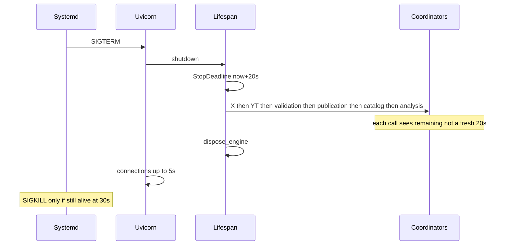

# FrameNest In-Process Lifecycle Runtime Contract

Planning baseline is public commit [`a72be476f5634394287082be07380d03fa7ccd4d`](https://github.com/cisarik/framenest/commit/a72be476f5634394287082be07380d03fa7ccd4d). Do not checkout owner `feat/ap-baseline-bound-execution-adoption`. Implementation belongs in an isolated worktree.

## Verified problem (not a production incident)

External envelope in [`deploy/systemd/framenest.service`](deploy/systemd/framenest.service) is `KillSignal=SIGTERM` and `TimeoutStopSec=30s`. Uvicorn is `workers=1` in [`src/framenest/server.py`](src/framenest/server.py). `timeout_graceful_shutdown` is currently the uvicorn default `None` (unbounded connection wait).

Lifespan in [`src/framenest/adapters/api/application.py`](src/framenest/adapters/api/application.py) starts six coordinators in order analysis → catalog → publication → validation → YouTube → X, then nested `finally` reverse shutdown with **no shared deadline**.

Hypothesis to bound (not proven in production): sequential unbounded cleanup can exceed 30s and allow cgroup SIGKILL while SQLite, staging, executor work, or a session-leader child is active.

## Selected architecture

**Composition-root supervisor + a small deadline helper.** Not a Coordinator ABC, not a job queue, not YT/X unification.

New module [`src/framenest/application/in_process_lifecycle.py`](src/framenest/application/in_process_lifecycle.py):

- Constants: `SYSTEMD_TIMEOUT_STOP_SECONDS = 30`, `INTERNAL_GRACEFUL_STOP_SECONDS = 20`, `SAFETY_RESERVE_SECONDS = 10`, shutdown child `TERM=2s` / `KILL=1s` caps.
- `StopDeadline` from `time.monotonic()`; `remaining()` never multiplied per component.
- `await_until(awaitable, deadline)` and `run_reverse_shutdown(steps, deadline)`.
- Optional duck `Protocol` with `start()` / `shutdown(deadline: StopDeadline | None = None)` only. Keep `notify`, `drain`, `runner_done` semantically distinct.

Lifespan creates **one** deadline at shutdown entry (including failed/cancelled startup) and passes it to every started coordinator, then `dispose_engine`.

`create_app(..., graceful_stop_seconds: float | None = None)` injects test budgets (milliseconds). Production uses the 20s constant. **No new settings/env field.**

[`src/framenest/server.py`](src/framenest/server.py): set `timeout_graceful_shutdown=5` so uvicorn cannot consume the 10s reserve. systemd unit stays **immutable**.

## Per-coordinator shutdown (keep domain differences)

- **YouTube:** keep cancel-on-shutdown. Cap `_terminate_process_group` to remaining (not 10s+5s). `CancelledError` already hits `except BaseException` and kills the process group. Add runner-death logging. Close start() race: if cancelled after `create_task`, cancel/await the runner before re-raise.
- **X (intentional drain() stays):** `drain()` remains cooperative/test-only. **Process shutdown must interrupt.** Today `_extractor.download` / `inspect` run synchronously on the event loop (`communicate()` up to 600s), so `shutdown()` cannot even be scheduled. Move inspect/download to `asyncio.to_thread` (keep sync adapter). Track active `Popen` and `interrupt()` with `killpg` TERM then KILL under remaining budget. Check `_shutdown_requested` between claims. **Do not** make X domain-identical to YouTube.
- **Validation / catalog / publication / analysis:** keep cooperative `_stopping` + wake; do **not** cancel in-flight SQLite as the primary path. Await runner with remaining budget; then owned `ThreadPoolExecutor.shutdown(wait=True)` only while remaining > 0, else `wait=False`. CPython 3.13 executor threads are **non-daemon**; `wait=False` and `cancel_futures=True` do **not** prove process exit. Interrupt subprocesses so threads can finish; last resort after deadline is structured log + `os._exit(0)` (intentional stop must not trip `Restart=on-failure`).
- **Media analysis:** `FFMPEG_FRAME_TIMEOUT_SECONDS = 30` plus join 5s can consume the whole envelope. Add `SubprocessRunner.interrupt()`, inject **one** shared runner from `create_app` into analysis adapters, call interrupt on coordinator shutdown.

## Durable recovery (no schema change; head stays `0028`)

Abandonment is allowed only where restart is already idempotent:

- Validation: startup `VALIDATING` via `recover_abandoned_validating_owned_blocking`; runtime claims only `RECEIVED`.
- Publication: copy to temp + hardlink + verify; DB commit after verify; leftover temp is safe. Do not publish partial media.
- Catalog: idempotent `CATALOGED` linkage.
- Analysis: `reconcile_interrupted` resets `ANALYZING`.
- YouTube: `DOWNLOADING` → `DOWNLOAD_PENDING`; `--continue` resume is intentional.
- X gap to close (lifecycle, not product rewrite): `ACQUIRING` assets are omitted from pending and `_advance_to_handoff` no-ops while `ACQUIRING` remains — interrupted X can stick. Resume by treating `ACQUIRING` as retryable download and `staging.clear(stage_key)` first (`--no-overwrites` without `--continue` would otherwise hash a partial `artifact.mp4`). No new Alembic revision.

## Observability

Do **not** change `/health` (`{"status":"ok"}`). Use structured `_safe_log` / YouTube+X loggers: ERROR once on unexpected runner completion or raise; WARNING rate-limited on YouTube `except Exception: progressed = False`; no log on expected shutdown cancellation. Never log URLs, tokens, cookies, paths, media names.

## Tests (millisecond budgets; no 30s sleeps)

New: `tests/unit/application/test_in_process_lifecycle.py`; lifespan deadline/partial-startup/reverse-order tests beside [`tests/contract/test_health_api.py`](tests/contract/test_health_api.py); X interrupt tests; `tests/integration/test_process_sigterm_lifecycle.py` (temp process, fake slow child, SIGTERM, exit inside injected envelope, child reaped, SQLite recoverable, schema still `0028`).

Extend existing coordinator, YouTube downloader, media-analysis process, and server-runtime tests.

Smallest regression set (not full suite): the four coordinator unit files, `test_upload_validation.py`, `test_media_analysis_lifecycle.py`, `test_x_acquisition_lifecycle.py`, `tests/integration/test_youtube_acquisition_lifecycle.py`, `tests/integration/test_atomic_upload_publication.py`, `test_health_api.py`, `test_server_process_output.py`, `test_fedora_systemd_service.py` (still `TimeoutStopSec=30s`), `test_server_runtime.py`, YouTube downloader + media_analysis process tests, one `0028` head assertion.

## Worktree / Git / later boundaries

Worker 2: `git worktree add` from `a72be476` onto `feat/in-process-lifecycle-runtime-contract`; canonical owner checkout unchanged; `PYTHONPATH=<worktree>/src` + `/home/agile/Projects/framenest/.venv/bin/python`; no `.venv` rebuild, no `uv sync`, no AP/Meta mutation, no NUC/deploy.

This plan does not authorize implementation, commit, push, or deployment.

## Rejected

Raising `TimeoutStopSec`; Coordinator ABC / job queue / WAL / schema; treating `asyncio.wait_for` or `shutdown(wait=False)` as sufficient; making X `drain()` cancel-like YouTube; changing `/health`; test retirement; `app.js` / backup / NUC / provider calls.

  - id: yt-deadline
    content: Cap YouTube process-group TERM/KILL to remaining deadline; close start() cancel race; runner-death logs
    status: pending
  - id: executor-interrupt
    content: Bound four executor coordinators; SubprocessRunner.interrupt for media analysis ffmpeg/ffprobe
    status: pending
  - id: focused-tests
    content: Millisecond deadline tests, fake slow work, SIGTERM process test, existing regression subset
    status: pending
isProject: false
---

# FrameNest In-Process Lifecycle Runtime Contract

Planning baseline is public commit [`a72be476f5634394287082be07380d03fa7ccd4d`](https://github.com/cisarik/framenest/commit/a72be476f5634394287082be07380d03fa7ccd4d). Do not checkout owner `feat/ap-baseline-bound-execution-adoption`. Implementation belongs in an isolated worktree.

## Verified problem (not a production incident)

External envelope in [`deploy/systemd/framenest.service`](deploy/systemd/framenest.service) is `KillSignal=SIGTERM` and `TimeoutStopSec=30s`. Uvicorn is `workers=1` in [`src/framenest/server.py`](src/framenest/server.py). `timeout_graceful_shutdown` is currently the uvicorn default `None` (unbounded connection wait).

Lifespan in [`src/framenest/adapters/api/application.py`](src/framenest/adapters/api/application.py) starts six coordinators in order analysis → catalog → publication → validation → YouTube → X, then nested `finally` reverse shutdown with **no shared deadline**.

Hypothesis to bound (not proven in production): sequential unbounded cleanup can exceed 30s and allow cgroup SIGKILL while SQLite, staging, executor work, or a session-leader child is active.

## Selected architecture

**Composition-root supervisor + a small deadline helper.** Not a Coordinator ABC, not a job queue, not YT/X unification.

New module [`src/framenest/application/in_process_lifecycle.py`](src/framenest/application/in_process_lifecycle.py):

- Constants: `SYSTEMD_TIMEOUT_STOP_SECONDS = 30`, `INTERNAL_GRACEFUL_STOP_SECONDS = 20`, `SAFETY_RESERVE_SECONDS = 10`, shutdown child `TERM=2s` / `KILL=1s` caps.
- `StopDeadline` from `time.monotonic()`; `remaining()` never multiplied per component.
- `await_until(awaitable, deadline)` and `run_reverse_shutdown(steps, deadline)`.
- Optional duck `Protocol` with `start()` / `shutdown(deadline: StopDeadline | None = None)` only. Keep `notify`, `drain`, `runner_done` semantically distinct.

Lifespan creates **one** deadline at shutdown entry (including failed/cancelled startup) and passes it to every started coordinator, then `dispose_engine`.

`create_app(..., graceful_stop_seconds: float | None = None)` injects test budgets (milliseconds). Production uses the 20s constant. **No new settings/env field.**

[`src/framenest/server.py`](src/framenest/server.py): set `timeout_graceful_shutdown=5` so uvicorn cannot consume the 10s reserve. systemd unit stays **immutable**.

## Per-coordinator shutdown (keep domain differences)

- **YouTube:** keep cancel-on-shutdown. Cap `_terminate_process_group` to remaining (not 10s+5s). `CancelledError` already hits `except BaseException` and kills the process group. Add runner-death logging. Close start() race: if cancelled after `create_task`, cancel/await the runner before re-raise.
- **X (intentional drain() stays):** `drain()` remains cooperative/test-only. **Process shutdown must interrupt.** Today `_extractor.download` / `inspect` run synchronously on the event loop (`communicate()` up to 600s), so `shutdown()` cannot even be scheduled. Move inspect/download to `asyncio.to_thread` (keep sync adapter). Track active `Popen` and `interrupt()` with `killpg` TERM then KILL under remaining budget. Check `_shutdown_requested` between claims. **Do not** make X domain-identical to YouTube.
- **Validation / catalog / publication / analysis:** keep cooperative `_stopping` + wake; do **not** cancel in-flight SQLite as the primary path. Await runner with remaining budget; then owned `ThreadPoolExecutor.shutdown(wait=True)` only while remaining > 0, else `wait=False`. CPython 3.13 executor threads are **non-daemon**; `wait=False` and `cancel_futures=True` do **not** prove process exit. Interrupt subprocesses so threads can finish; last resort after deadline is structured log + `os._exit(0)` (intentional stop must not trip `Restart=on-failure`).
- **Media analysis:** `FFMPEG_FRAME_TIMEOUT_SECONDS = 30` plus join 5s can consume the whole envelope. Add `SubprocessRunner.interrupt()`, inject **one** shared runner from `create_app` into analysis adapters, call interrupt on coordinator shutdown.

## Durable recovery (no schema change; head stays `0028`)

Abandonment is allowed only where restart is already idempotent:

- Validation: startup `VALIDATING` via `recover_abandoned_validating_owned_blocking`; runtime claims only `RECEIVED`.
- Publication: copy to temp + hardlink + verify; DB commit after verify; leftover temp is safe. Do not publish partial media.
- Catalog: idempotent `CATALOGED` linkage.
- Analysis: `reconcile_interrupted` resets `ANALYZING`.
- YouTube: `DOWNLOADING` → `DOWNLOAD_PENDING`; `--continue` resume is intentional.
- X gap to close (lifecycle, not product rewrite): `ACQUIRING` assets are omitted from pending and `_advance_to_handoff` no-ops while `ACQUIRING` remains — interrupted X can stick. Resume by treating `ACQUIRING` as retryable download and `staging.clear(stage_key)` first (`--no-overwrites` without `--continue` would otherwise hash a partial `artifact.mp4`). No new Alembic revision.

## Observability

Do **not** change `/health` (`{"status":"ok"}`). Use structured `_safe_log` / YouTube+X loggers: ERROR once on unexpected runner completion or raise; WARNING rate-limited on YouTube `except Exception: progressed = False`; no log on expected shutdown cancellation. Never log URLs, tokens, cookies, paths, media names.

## Tests (millisecond budgets; no 30s sleeps)

New: `tests/unit/application/test_in_process_lifecycle.py`; lifespan deadline/partial-startup/reverse-order tests beside [`tests/contract/test_health_api.py`](tests/contract/test_health_api.py); X interrupt tests; `tests/integration/test_process_sigterm_lifecycle.py` (temp process, fake slow child, SIGTERM, exit inside injected envelope, child reaped, SQLite recoverable, schema still `0028`).

Extend existing coordinator, YouTube downloader, media-analysis process, and server-runtime tests.

Smallest regression set (not full suite): the four coordinator unit files, `test_upload_validation.py`, `test_media_analysis_lifecycle.py`, `test_x_acquisition_lifecycle.py`, `tests/integration/test_youtube_acquisition_lifecycle.py`, `tests/integration/test_atomic_upload_publication.py`, `test_health_api.py`, `test_server_process_output.py`, `test_fedora_systemd_service.py` (still `TimeoutStopSec=30s`), `test_server_runtime.py`, YouTube downloader + media_analysis process tests, one `0028` head assertion.

## Worktree / Git / later boundaries

Worker 2: `git worktree add` from `a72be476` onto `feat/in-process-lifecycle-runtime-contract`; canonical owner checkout unchanged; `PYTHONPATH=<worktree>/src` + `/home/agile/Projects/framenest/.venv/bin/python`; no `.venv` rebuild, no `uv sync`, no AP/Meta mutation, no NUC/deploy.

This plan does not authorize implementation, commit, push, or deployment.

## Rejected

Raising `TimeoutStopSec`; Coordinator ABC / job queue / WAL / schema; treating `asyncio.wait_for` or `shutdown(wait=False)` as sufficient; making X `drain()` cancel-like YouTube; changing `/health`; test retirement; `app.js` / backup / NUC / provider calls.
