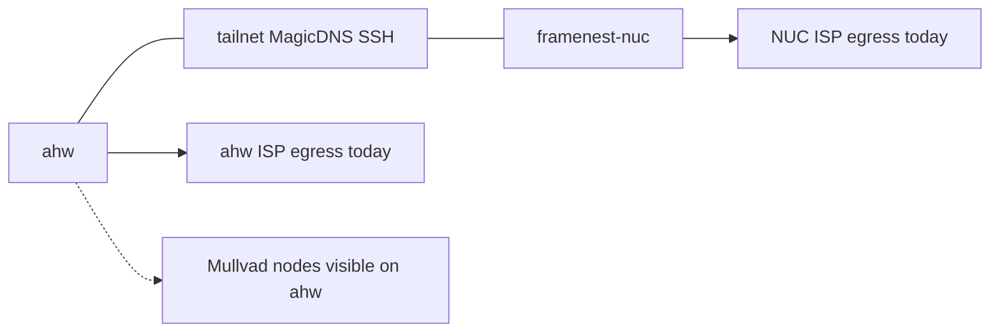

# Tailnet Mullvad Egress and Operator Network Recovery

```yaml
---
name: Tailnet Mullvad Egress and Operator Network Recovery
overview: Establish independent Mullvad egress for ahw and framenest-nuc while preserving direct tailnet SSH, reboot persistence, lightweight operator controls, and lockout-safe recovery.
logical_whole: framenest-tailnet-mullvad-egress-and-operator-network-recovery-contract
phase: planning
worker: 01
maximum_plan_only_cycles: 1
---
```

Native Plan Mode was active. This session did not implement anything.

## 1. Observed current state

**Repository (classification unit: `/home/agile/Projects/framenest`)**

- Public `main` is `148b6c2012809944262399c1a166e85082606fbf` (tree `1ea47dfb…`, parent `5fe07b01…`, subject `fix: restore upload validation layer boundary`). AP gitlink on that commit is `041de310…`. This matches the Orchestrator restoration anchors.
- This checkout is **not** that baseline. Active branch: `feat/ap-baseline-bound-execution-adoption`. HEAD: `d4c3402a4765b39cee0d8e2063d5ec8be161caf6`. AP gitlink/submodule: `4862380f…`. Porcelain: untracked `.accept-immut-work/`, `.playwright-mcp/`, `.w6-immut-work/`, `REPRO_DIR=/`, `uv.lock`.
- Five-class record: `accepted-continuation` no; `unrelated-owner-work` yes (other-task branch + untracked operator/worktree debris); `stale-clone` yes for local `main` (behind `origin/main`); `unpublished-candidate` yes (this branch is not public `main`); `unexplained-divergence` no. **Primary action: preserve owner work. Do not checkout, clean, or mutate this tree.** Future implementation must use an isolated worktree of public `148b6c20`.
- Public main has **no** `scripts/` tree, **no** `mullvad` / `connect_via_ahw` / ahw-exit-node design. Current Tailscale docs in-repo are Serve/MagicDNS **ingress** (ADR-0048, [SERVER.md](SERVER.md), [docs/UBUNTU_NUC_DEPLOYMENT.md](docs/UBUNTU_NUC_DEPLOYMENT.md) §11). Operator Ubuntu helpers live under [deploy/ubuntu/](deploy/ubuntu/). Home `~/.local/bin/` has Cursor/Poetry launchers only; no network scripts. `~/.local/bin/framenest-nuc-backup.fish` is documented as intentionally not installed.

**ahw (CachyOS, user `agile`, shell fish)**

- Tailscale `1.98.10`; `tailscaled` enabled and active; `BackendState=Running`; not `NeedsLogin`; MagicDNS on; CorpDNS accepted.
- Not using an exit node; not advertising one; `ExitNodeAllowLANAccess=false`; `OperatorUser` empty; syspolicy empty.
- Mullvad exit nodes **are visible** in the netmap (550 Mullvad-class peers). `tailscale exit-node suggest` returned a Czechia Mullvad hostname (`*.mullvad.ts.net`). No ordinary tailnet device currently advertises an exit node.
- Installed CLI **lacks** `tailscale get` (docs describe it; NUC `1.102.2` has it). Scripts must detect this.
- Standalone Mullvad: package `mullvad-vpn-daemon 2026.3-1.1`; `/usr/bin/mullvad` present; `mullvad-daemon.service` enabled+active; `mullvad-early-boot-blocking` disabled. No dedicated Mullvad interface in the main link list. Default route for `1.1.1.1` is `wlan0` via a LAN gateway.
- Official check `https://am.i.mullvad.net/json`: **ISP/non-Mullvad egress**.
- `framenest-nuc` and `nuc` resolve to **Tailscale addresses**. Route to the NUC v4 address is `dev tailscale0` (direct overlay, not LAN). Full MagicDNS name is `framenest-nuc.<tailnet>.ts.net` (4 labels). `ahw` resolves to a **LAN address** (this host).
- Serve/Funnel on ahw: none. Local console exists (this workstation). `sudo -n true` fails. LocalAPI socket is world-rw, but privileged `debug` still demands root or `--operator`.
- Cursor AppImage env (`APPIMAGE`, `ARGV0`, `LD_LIBRARY_PATH`, PATH prefix) is injected into this shell. That is the same class of hazard as the prior GUI lockout.

**framenest-nuc (Ubuntu 24.04, user `michal`, OS hostname `nuc`)**

- Tailscale `1.102.2`; `tailscaled` enabled and active; `BackendState=Running`; not `NeedsLogin`; MagicDNS on.
- Exit node empty; not advertising; LAN-access false; operator empty; syspolicy empty; `tailscale get` **is** supported.
- **Zero Mullvad peers. `exit-node suggest`: “No exit node suggestion is available.”** Mullvad access is **not** assigned to this device.
- No standalone Mullvad CLI/unit.
- `framenest.service` enabled and active. Serve: exactly one HTTPS handler to `unix:/run/framenest/framenest.sock`, tailnet-only. Funnel flag not present/true in `serve status --json`. `funnel status` text still shows the Serve handler labelled tailnet-only (newer CLI overlap; not public Funnel).
- Ordinary internet via `wlp1s0` (Wi-Fi up; wired `eno1` down). Official check: **ISP/non-Mullvad egress**.
- `systemd-run` present; `at` absent; user linger `no`. Planning-time `sudo -n true` **succeeded** (contrary to Worker 8 `sudo -K` expectation). Treat as non-durable.
- BatchMode SSH succeeded to both `michal@framenest-nuc` and the full MagicDNS name with `StrictHostKeyChecking=yes` and the declared identity. That is tailnet SSH, not LAN SSH.



## 2. Evidence limitations and sanitization

- No exact public IPs, tailnet names, emails, node keys, SSH fingerprints, or policy secrets are retained in this plan.
- `tailscale status --json` and one accidental Mullvad CLI line were reduced locally; raw JSON was not archived.
- `resolvectl` and `tailscale serve status` exposed the MagicDNS suffix in the live terminal; it is classified only as present.
- Standalone Mullvad CLI was invoked once under AppImage-polluted argv0; further Mullvad CLI use was stopped. Tunnel-up was **not** proven; the official HTTP check is the egress authority.
- NUC sudo timestamp is currently valid; it may vanish. Do not design around it.
- Persistence across reboot, blackhole-on-dead-exit-node, and Serve coexistence after `tailscale set --exit-node` remain **unproven until live mutation**.
- License slot count is not visible without the admin console. Concurrent two-device use is allowed by the published five-device license quantum **if** both devices are assigned.
- NUC_HOST_BASELINE still describes LAN-only SSH and “no Tailscale firewall rule yet”; live production already uses Tailscale Serve. Treat that baseline as historical hardening, not current network truth.

## 3. Authoritative source findings

Retrieved 2026-08-13. Claims below are from the named owner unless marked inference.

- [Mullvad exit nodes](https://tailscale.com/docs/features/exit-nodes/mullvad-exit-nodes) (Tailscale, last validated 2026-01-09): each device enables an exit node separately; admin-console path is General → Mullvad VPN → Configure → Add devices; cannot mix console and policy-file management; v1.48.3+ needs no old DNS workaround; LAN access can leak DNS; identity-aware, not anonymous; base add-on is five device slots; `tailscale set --exit-node=<name-or-ip>`.
- [Exit nodes](https://tailscale.com/docs/features/exit-nodes) (Tailscale, last validated 2025-12-15): every device opts in separately; LAN access default off; disable with `tailscale set --exit-node=`; advertising a Linux exit node requires IP forwarding (rejected here).
- [Recommended exit nodes](https://tailscale.com/docs/features/exit-nodes/auto-exit-nodes) (Tailscale, last validated 2025-01-07): `auto:any` / suggest **prefers ordinary tailnet exit nodes over Mullvad**.
- [Mandatory exit nodes](https://tailscale.com/docs/features/exit-nodes/mandatory-exit-nodes) (Tailscale, last validated 2024-12-20): MDM/system policy; disruption on exit-node loss, captive portal, or auth. [System policies](https://tailscale.com/docs/features/tailscale-system-policies) (last validated 2026-01-26): `ExitNodeID` listed for Android/iOS/macOS/Windows, **not Linux**.
- [Tailscale CLI](https://tailscale.com/docs/reference/tailscale-cli): `set` updates only named prefs (not a full `up` rewrite); `--operator`; `--exit-node=auto:any`. Installed ahw `1.98.10` has `set`/`exit-node` but **not** `get`.
- [tailscale/tailscale#9520](https://github.com/tailscale/tailscale/issues/9520): closed feature request for chaining; not a supported topology. Maintainer workaround is DNS override, not two-hop exit nodes.
- Upstream `ipn/prefs.go`: missing/unusable selected exit node installs a **blackhole** for non-overlay traffic. Inference: internet fail-closed, tailnet likely preserved. **Unproven on these hosts.**
- [Mullvad DNS leaks](https://mullvad.net/en/help/dns-leaks): a DNS leak is any non-Mullvad resolver. Combined with Tailscale’s LAN-access warning: `--exit-node-allow-lan-access=true` is the wrong default for this privacy goal.
- Inference: `tailscale set` prefs persist in the tailscaled state and survive reboot if `tailscaled` is enabled (`WantRunning` already true). Custom boot units are unnecessary unless a later reboot test fails.

## 4. Chosen topology and rejected alternatives

**Chosen:** each device independently selects an explicit Mullvad exit node. Overlay SSH/MagicDNS stays direct. Serve ingress is unchanged.

**Rejected:** NUC → ahw advertised exit node → Mullvad. Reasons: not a supported native topology (#9520); would require advertising ahw, IP forwarding, and extra lockout surface; ahw sleep/crash would take down NUC internet; `auto:any` would then prefer ahw over Mullvad.

**Rejected:** `auto:any` as the privacy mechanism. Official preference order can select a non-Mullvad node. Source comment (2025-07-02) still only supports `AnyExitNode`, not `auto:mullvad`.

**Rejected:** mandatory/MDM always-on exit node. Linux is not in the `ExitNodeID` platform table; prior workstation lockout; documented disruption on failure.

## 5. DNS, LAN-access, privacy, and failure semantics

- Privacy goal: ordinary destinations observe **Mullvad egress**, not ISP egress. Not anonymity. Tailscale identity remains. LAN and tailnet addresses remain.
- Operator SSH already uses Tailscale/MagicDNS. **LAN access is not required** for the PC→NUC control channel. Default `--exit-node-allow-lan-access=false`.
- Enabling LAN access is the documented DNS-leak trade. Keep it off unless Michal later proves a real local service that MagicDNS cannot reach.
- Current DNS is split: wlan default-route LAN resolver + tailscale0 MagicDNS. After Mullvad exit-node enable, re-check that ordinary DNS is not LAN/ISP (official Mullvad check / resolved servers classified, no IP print). If leak appears on v1.98.10, first fix is **not** LAN access; it is confirming Tailscale DNS acceptance and that the standalone Mullvad app stays disconnected. Only then consider Tailscale “override local DNS” as a **separate** Michal decision.
- Selected-node failure: design for **internet blackhole + preserved tailnet SSH** (upstream prefs comment). Scripts must still `disable`/`recover`. This is not a hard MDM fail-closed policy.
- Standalone Mullvad app on ahw **competes** with Tailscale Mullvad. Scripts fail closed if `/usr/bin/mullvad` reports a connected tunnel, or if `mullvad-daemon` is routing. Human disconnects the app before enable. Do not uninstall in this whole unless Michal asks.
- Reboot: rely on enabled `tailscaled` + persisted prefs. No new systemd network unit.

## 6. Exact repository mutation proposal

Do **not** put this under `deploy/ubuntu/` (Ubuntu NUC deployment only). ADR-0004 allows a new top-level `scripts/` tree. Public main has none today.

Proposed tracked files (all on a branch from `148b6c20`):

- [docs/adr/0058-independent-mullvad-egress-and-operator-network-recovery.md](docs/adr/0058-independent-mullvad-egress-and-operator-network-recovery.md) — durable architecture owner (independent Mullvad, no chaining, Serve coexistence, privacy limits).
- [docs/adr/README.md](docs/adr/README.md) — index row.
- [docs/OPERATOR_NETWORK.md](docs/OPERATOR_NETWORK.md) — operator contract: topology, SSH canonical name, enable/disable/verify/recover, rollback, human gates, sanitization.
- [scripts/operator/network/framenest_mullvad_egress.sh](scripts/operator/network/framenest_mullvad_egress.sh) — Bash, ahw+NUC, executable `0755`.
- [scripts/operator/network/framenest_mullvad_egress.fish](scripts/operator/network/framenest_mullvad_egress.fish) — thin fish wrapper calling the `.sh` with cleaned env; executable `0755`.
- [scripts/operator/network/framenest_nuc_worker_gate.fish](scripts/operator/network/framenest_nuc_worker_gate.fish) — noninteractive SSH gate (declared identity, BatchMode, no TTY/agent/forwarding); executable `0755`.
- [scripts/operator/network/README.md](scripts/operator/network/README.md) — discoverability.
- [tests/contract/test_operator_network_scripts.py](tests/contract/test_operator_network_scripts.py) — static contract: subcommands exist; forbidden strings absent; no secrets.
- Pointers only: [SERVER.md](SERVER.md) Network section, [SECURITY.md](SECURITY.md), [README.md](README.md), [docs/UBUNTU_NUC_DEPLOYMENT.md](docs/UBUNTU_NUC_DEPLOYMENT.md) (related, do not mix with Serve activation), [deploy/ubuntu/README.md](deploy/ubuntu/README.md).

Public-safe content: no host IPs, tailnet names, keys, emails. Placeholders `<node>.<tailnet>.ts.net`. Optional later `~/.local/bin` symlink is **live-host documentation**, not a Worker 2 repo write.

Lifecycle: keep while Tailscale Mullvad is the egress contract; remove only when a superseding ADR replaces it.

Do not create `connect_via_ahw.sh`. Do not add boot units.

## 7. Exact script interface and behavior

One tool, five subcommands:

```text
framenest_mullvad_egress.sh status|enable|disable|verify|recover [--node <mullvad-dns-name>]
```

Shared rules:

- Absolute binaries; `PATH=/usr/bin:/bin:/usr/sbin:/sbin`; unset `APPIMAGE`, `APPDIR`, `ARGV0`, `LD_LIBRARY_PATH`.
- Detect `tailscale`; refuse GUI/AppImage wrappers.
- `status` first on every mutating subcommand (sanitized).
- Stop on `NeedsLogin`, missing Mullvad netmap (`*.mullvad.ts.net` / empty `exit-node list`), competing standalone Mullvad tunnel, or self advertising `--advertise-exit-node`.
- Use `tailscale set` only, never `tailscale up`/`down`.
- Pin an **explicit** Mullvad DNS name. Default enable path: `exit-node suggest` only if the suggestion contains `mullvad.ts.net`, then set that name; otherwise require `--node`. Never `auto:any`.
- `--exit-node-allow-lan-access=false` on enable.
- `disable`: `tailscale set --exit-node=`.
- `verify`: tailnet SSH/MagicDNS still classified Tailscale; official Mullvad JSON `mullvad_exit_ip=true` without printing IP; Funnel still not public; this device not advertising an exit node.
- `recover`: disable exit node; print first causal error; do not touch firewall, NM, Wi-Fi, KDE, sysctl, Serve.
- Privilege: try unprivileged `set`; if LocalAPI denies, require sudo or a configured operator. Do not configure `--operator` implicitly.
- Distinguish `command failed` vs `egress is not Mullvad`.
- Operator output may use short Slovak labels; comments/docs English.

`framenest_nuc_worker_gate.fish`: only the declared SSH posture to `michal@framenest-nuc` or the full MagicDNS name; never `accept-new`.

Validation: `bash -n`, `fish -n` if fish exists, contract test, `poetry run pytest tests/contract/test_operator_network_scripts.py`.

## 8. PC operational sequence

Future live Worker, after repo scripts exist, **ahw only**:

1. Recapture sanitized baseline (status, route class, Mullvad check, NUC SSH).
2. Print exact recover command: `tailscale set --exit-node=`.
3. Confirm local console (this machine).
4. Human: disconnect standalone Mullvad app; leave daemon installed unless Michal wants removal.
5. Confirm Mullvad nodes still listed.
6. `enable` with explicit suggested Mullvad node (or Michal’s chosen city).
7. Verify: Mullvad egress, DNS classification, tailnet ping/SSH to NUC, ahw not an exit node, no Funnel.
8. Optional same-device reboot persistence **after** returning to a known-good SSH-to-NUC state; never reboot both hosts together.
9. Keep `disable`/`recover` available. Do not proceed to NUC until ahw verify passes and NUC Mullvad assignment exists.

## 9. Headless NUC operational sequence

Only after ahw is verified **and** the NUC netmap shows Mullvad nodes:

1. Canonical SSH via the fish gate (full MagicDNS preferred; bare name already Tailscale).
2. Capture `tailscale get exit-node` (empty today) and Serve JSON (unix socket present, Funnel false).
3. Install automatic rollback (section 11) **before** `set`.
4. `enable` on NUC only, explicit Mullvad node (may differ from ahw).
5. From ahw: SSH still works; NUC `verify` shows Mullvad egress; `framenest.service` still active; Serve still unix/tailnet-only.
6. Cancel rollback only after those checks.
7. Separate later reboot of NUC only.
8. If SSH is lost, do nothing from ahw except wait for rollback; then `recover`.

## 10. Human admin-console and privilege gates

**Required before NUC enable (Michal, admin console; do not scrape):**

1. General settings → Mullvad VPN → Configure → Add devices.
2. Select the production NUC (console name likely `nuc`; MagicDNS `framenest-nuc`) and confirm `ahw` remains assigned.
3. Save. Wait until `tailscale exit-node list` on the NUC shows Mullvad hostnames.

UI path taken from Tailscale docs dated 2026-01-09; Michal should follow the live console labels if they moved.

**Also human:**

- Identity-provider login if either device ever becomes `NeedsLogin`.
- Disconnect standalone Mullvad on ahw.
- One sudo per host if configuring `--operator` (recommended, not implied): `--operator=agile` on ahw, `--operator=michal` on NUC. Alternative: keep sudo for every `set`.
- Preferred Mullvad city if he rejects the latency suggestion (ahw suggest was Czechia). Slovak Mullvad cities exist; that is a privacy/jurisdiction preference, not a technical requirement.
- Accept residual risk: NUC has no proven non-Tailscale hostname; wired NIC is down; recovery if `tailscaled` dies is LAN-IP-from-memory or physical access.

No Worker may request passwords, keys, cookies, or recovery codes.

## 11. Automatic rollback and lockout prevention

NUC mechanism: root transient systemd timer via `systemd-run` (no `at`; linger is off so `--user` is wrong).

- Unit names: `framenest-exitnode-rollback.timer` and `.service` only.
- Captured prior pref: current `exit-node` string (today empty) plus `exit-node-allow-lan-access`.
- Action: `/usr/bin/tailscale set --exit-node=<prior-or-empty>` and restore LAN-access boolean. **Do not** pass Serve, advertise, operator, or DNS flags.
- Timeout: **10 minutes** (`AccuracySec=1s`). Enough for SSH + egress + health; short if overlay breaks.
- Cancel: `systemctl stop` those two units after verify passes; report leftover units if stop fails.
- SSH disconnect or Worker death: timer still fires on the NUC.
- Privilege: creating the timer needs sudo (or operator+systemd); the timer itself runs as root so it does not depend on the sudo timestamp afterward.
- Cleanup owner: the live implementation Worker, same names.
- ahw needs no automatic timer (local console + `disable`).

Lockout controls: one device at a time; never `tailscale down`; never advertise ahw; never LAN-access by default; never AppImage/GUI; never mix Mullvad app + Tailscale exit node.

## 12. Test and acceptance matrix

Fresh independent acceptance Worker required after E3 host mutation. Every row needs new evidence.

- Tailnet membership both devices — status BackendState Running, same MagicDNS class — owner: independent Worker — rollback if NeedsLogin.
- Independent Mullvad exit nodes — each `exit-node` is `*.mullvad.ts.net`; neither uses the other device — negative: no `auto:any`, no ahw advertisement.
- Ordinary internet Mullvad — `am.i.mullvad.net/json` `mullvad_exit_ip=true` — sanitize IP — one request per device.
- DNS posture — LAN-access false; classify resolvers; no printed IPs.
- Canonical SSH — full MagicDNS and bare `framenest-nuc` both BatchMode — route class Tailscale — negative: do not require LAN.
- FrameNest health — `framenest.service` active; do not read env/secrets.
- Serve tailnet-only unix socket; Funnel not public.
- Reboot persistence — one host per step; prefs survive; SSH/Serve survive.
- Scripts `status`/`disable`/`recover` — fail closed on missing Mullvad/NeedsLogin/Mullvad-app-connected.
- No standalone Mullvad tunnel while Tailscale egress is enabled.
- No chaining; no unintended advertised exit; no public inbound; no firewall/NM/Wi-Fi/KDE/sysctl mutation.

## 13. Security and privacy limitations

- Tailscale can associate user/device with Mullvad infrastructure. WireGuard protects content, not metadata toward Tailscale.
- MagicDNS is not an egress hide.
- World-rw LocalAPI sockets exist on both hosts (observed). Out of scope to harden here.
- Stale offline duplicate `ahw` node exists. Out of scope to delete.
- Overriding local DNS, Tailnet Lock signing of Mullvad nodes, and hard fail-closed MDM are **not** in this whole.

## 14. Smallest Worker 2 implementation authority

Proposal only; grants nothing.

- Session: fresh Worker, Native planning mode `not-used`, implementation-planning owner already satisfied.
- Baseline: public `148b6c2012809944262399c1a166e85082606fbf`. Isolated worktree. **Forbidden checkout:** current `feat/ap-baseline-bound-execution-adoption` tree.
- Paths: the file list in section 6 only.
- Stages: write docs/scripts/tests → `bash -n`/`fish -n`/contract pytest → one commit on a new branch. **No push** unless a later sentence grants it. **No host, tailnet, Mullvad-account, sudo, or systemd mutation.**
- Privileges: none beyond the worktree.
- Publication: separate Orchestrator task.
- Live ahw/NUC mutation: **Worker 3+**, after Michal completes the NUC Mullvad assignment and after scripts exist. Independent acceptance: separate fresh Worker after host mutation.

## 15. Unresolved Cooperator decisions

Recommendations where evidence allows:

- **NUC Mullvad assignment:** required gate, not optional, if the objective stands.
- **City:** pin the latency-suggested Mullvad node unless Michal wants a Slovak (or other) city for jurisdiction.
- **LAN access:** false.
- **Hard fail-closed MDM:** no.
- **`--operator`:** yes, one sudo each (`agile` / `michal`); otherwise every `set` needs sudo.
- **Canonical SSH:** document full MagicDNS; keep bare `framenest-nuc` as a working alias (already Tailscale).
- **ahw console:** present (observation).
- **NUC if Tailscale dies:** currently weak (observation). Do not turn on LAN access as a substitute. Optional later wired-NIC recovery is a different whole.
- **Standalone Mullvad app:** keep installed but disconnected for Tailscale egress; uninstall only if Michal wants that extra step.

## 16. AP empirical observations

Retain without implementing: `cooperator-facing-routing-header-and-meta-destination-projection`.

New observation: this planning session ran inside a Cursor AppImage environment that rewrites `ARGV0`/`PATH`/`LD_LIBRARY_PATH`. Operator scripts must scrub that environment or they can re-enter the historical GUI/lockout failure. Not an AP protocol change by itself; useful input to the parked routing-header candidate (Native Plan Mode / Worker-surface honesty). Do not reopen the exhausted AP backlog.

## 17. FrameNest ledger observations

Retain without implementing: `relocatable-immutable-release-build-contract`.

New non-authorizing observations:

- Public README / Ubuntu runbook still cite production SHA `aec2f009…` while the closed lifecycle whole and public `main` are `148b6c20…`. Do not reopen that whole; do not piggyback a SHA fix on this network whole.
- `NUC_HOST_BASELINE.md` SSH-on-LAN / “no Tailscale yet” is stale relative to live Serve. Historical hardening record; do not rewrite except a one-line “superseded for Tailscale facts by live OPERATOR_NETWORK + ADR-0048” if Worker 2 docs pointers make that necessary.
- NUC OS hostname is `nuc` while MagicDNS/Serve name is `framenest-nuc`. Document, do not rename the host.

---

### Report for ORCHESTRATOR_CHAT

```text
Logical whole identity: framenest-tailnet-mullvad-egress-and-operator-network-recovery-contract
Worker session ordinal: 01
Worker exchange ordinal: 01
Standard terminal status: PARTIAL
Phase-qualified result: not-applicable
Result artifact or commit: not-applicable
Logical-whole closure: not-closed
Report justification: new-evidence
```

**Why PARTIAL, not PASS or BLOCKED:** live inventory and official-docs adjudication are sufficient to recommend a later implementation slice, but the declared FrameNest checkout gate failed (wrong branch, dirty tree, different AP pin). `tailscale get` is unsupported on ahw `1.98.10`. Unqualified PASS is forbidden. Implementation must not use this checkout; it is not blocked from a *separate* worktree of public `148b6c20`.

- Start and end FrameNest commit (this session, no mutation): `d4c3402a4765b39cee0d8e2063d5ec8be161caf6`
- Planning baseline (public, verified): `148b6c2012809944262399c1a166e85082606fbf`
- Public refs: FrameNest `148b6c20…`, AP `041de310…`, Meta `59e87fa5…` (all match restoration anchors)
- Cleanliness: FrameNest dirty (unrelated untracked); AP local at `041de310` on branch `refactor/retire-monolithic-ap-test-suite`; Meta `main` at `59e87fa5` with untracked `01_planning.md` (not written by this Worker)
- AP pin on this checkout: `4862380f…` (mismatch vs expected `041de310…`); expected pin is on public main’s gitlink
- Native Plan Mode: required and observed active. Fresh Worker. Internal delegation: not-used. Topology: single-active
- Requested reasoning: Extra High. Observed Worker surface: Cursor Grok 4.6. Independent model attestation: unknown/not observably exposed

**Read-only commands (classes):** git identity/ls-remote/show; repository rg; official Tailscale/Mullvad/GitHub fetches; ahw tailscale version/help/status-json/debug-prefs/exit-node/syspolicy/serve; systemd; ip route/rule/link; resolvectl; getent; `sudo -n true`; one `https://am.i.mullvad.net/json` per host; declared BatchMode SSH; equivalent NUC inventory. No `tailscale set/up/down/login`, no firewall, no GUI.

**External diagnostic endpoints:** `https://am.i.mullvad.net/json` (ahw and NUC). Plus documentation URLs in section 3.

**Sanitized observed state:** both devices Running in one tailnet, MagicDNS on, no current exit node, neither advertising; ahw has Mullvad nodes, NUC does not; both currently ISP/non-Mullvad egress; ahw has competing Mullvad daemon (not proven as kernel default); SSH to NUC over Tailscale works for bare and full names; FrameNest Serve unix/tailnet-only; Funnel not public; version skew 1.98.10 vs 1.102.2.

**Unresolved evidence:** reboot persistence; blackhole-on-dead-node on these builds; remaining Mullvad license slots; whether NUC `sudo -n` will still hold; whether override-local-DNS will be needed after enable.

**Deviations/risks:** checkout gate failure (classified, preserved); AppImage env near-miss; NUC Wi-Fi with wired down; weak NUC recovery if tailscaled dies; Serve CLI printed MagicDNS in the live terminal (not copied here).

```text
Resolved Execution Issues / Near-Misses: Invoked /usr/bin/mullvad under Cursor AppImage ARGV0/LD_LIBRARY_PATH; help banner identified as the AppImage. Stopped further Mullvad CLI. Scrubbed APPIMAGE/LD_LIBRARY_PATH/PATH for later commands. One status line contained a public IP; it was not archived. Residual risk: future scripts/shells inherit AppImage env unless scrubbed.
Pre-Existing Failure Classification: none for this logical whole’s product code. Checkout divergence is unrelated-owner-work + unpublished-candidate (primary: preserve). Stale README/runbook production SHA vs 148b6c20 is a pre-existing docs lag outside this whole (complete class: candidate = documentation lag on public main; not a defect of this planning session; do not “fix” by mutating this dirty tree).
```

**Smallest next step:** Orchestrator asks Michal only for Mullvad city vs latency default and operator-account acceptance, then issues a **fresh Worker 2** prompt (`Native planning mode: not-used`) limited to an isolated worktree of `148b6c20` and the section-6 paths. Michal can add the NUC in the Mullvad console in parallel.

**Authority expiry:** all Worker 1 planning authority expires at this terminal report. Plan UI approval does not authorize implementation.
