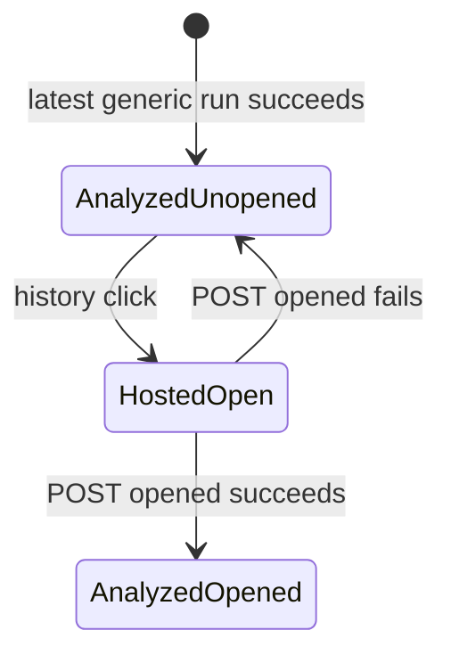

# Archived Planner report — session 02/exchange 01

Archival metadata (ORCHESTRATOR): task FRAMENEST-COMPANIE-HISTPLAN-01; fresh
Planner Worker, Plan Mode on; returned in chat 2026-08-26; archived verbatim
below except this block. Status reported: PASS (plan). Baseline inspected:
`91410fe063d9907304cff4550f61d403880a2eeb`.

---

```markdown
---
name: Companion history R1-R3
overview: "Decision-ready plan to correct companion history at baseline 91410fe: every own-row click uses hosted iframe Details (R1), admin list is analyzed-only with unopened accent/badge lifecycle (R2), ordinary users get a new requester-private own-saves GET instead of the admin inbox (R3)."
todos:
  - id: adr-0076
    content: Add ADR-0076 successor (R1–R3) superseding ADR-0073 mixed-inbox / pending-overlay / ordinary-403-hides-history; do not edit ADR-0073 body
    status: pending
  - id: admin-analyzed-only
    content: Filter GET /api/companion/review-inbox to analyzed-only; keep unopened persistence and global analyzed pool
    status: pending
  - id: ordinary-own-history
    content: Add GET /api/companion/own-history (x.request, requester-private cataloged X, movie excluded, unopened always false)
    status: pending
  - id: click-path-r1
    content: Every history row openHostedDetails; admin analyzed click also POST opened without gating the iframe
    status: pending
  - id: hide-analyze-hosted
    content: Hide Analyze by AI and Load AI suggestion when companionWebHosted(); keep standalone Details/Edit
    status: pending
  - id: tests-docs
    content: Node + Python contract/repository suites per R1–R3 plus negatives; rewrite X_COMPANION.md history section
    status: pending
isProject: false
---

# Companion history correction R1–R3

Baseline: `91410fe063d9907304cff4550f61d403880a2eeb` (public main). No schema migration. Do not open [`GET /api/companion/review-inbox`](src/framenest/adapters/api/companion_review_api.py) to ordinary identities (ADR-0067 trust surface stays). Record Cooperator R1–R3 in a successor **ADR-0076** that supersedes ADR-0073 mixed-inbox / pending-overlay / ordinary-403-hides-history statements without editing ADR-0073’s body.

## Identity-scoped listing

Do **not** reuse [`GET /api/workspace/media`](src/framenest/adapters/api/workspace_media_api.py) as companion history. It is requester-private and all-states, but the payload has no `analyzed` / `unopened` / companion `title`, uses offset pagination, and includes upload/YouTube plus movies.

| Audience | Endpoint | Capability | Rows | Badge |
|---|---|---|---|---|
| Admin | existing `GET /api/companion/review-inbox` | `media.workflow.read` | **analyzed-only** (drop pending union in [`_mixed_inbox_rows`](src/framenest/infrastructure/persistence/companion_review_repository.py)); still **global** analyzed pool; `unopened` + `unopened_count` unchanged | toolbar = `unopened_count` |
| Ordinary | **new** `GET /api/companion/own-history` | `x.request` (GET, not `companion_mutation`) | actor-owned cataloged X Saves, all analysis states, movie excluded; `unopened` always false; `unopened_count` always 0 | never |

Ordinary still **403** on review-inbox list/detail/opened/apply. Cross-user: SQL `created_by_login_key == actor` on own-history; retain Alice/Bob negatives plus admin-inbox 403.

Extension routing ([`sidebar.js` `refreshInbox`](extension/ui/sidebar.js) + [`service_worker.js`](extension/background/service_worker.js)): `GET /api/identity/me` already exists. If `media.workflow.read` → inbox; else if `x.request` → own-history; else hide chrome. Badge refresh keeps hitting inbox `limit=1` and already clears on 403.

**Compact vs All:** Admin compact = newest 5 analyzed (`completed_at_ms`); All = remainder analyzed (no pending). Ordinary compact = newest 5 **own saves of any state** (`created_at_ms`) so a fresh Save is immediately under the title bar; All = remainder. Plain classes only (no `--unopened`).

## Accent + badge state machine (admin)

Server already persists opened in `companion_review_open_states` (migration **0031**). **0033 is unrelated. No Alembic.**



- New analysis → top of compact list, `--unopened` accent, `unopened_count` +1.
- Click never removes the row. Open iframe immediately (**do not gate** on opened HTTP). Fire `POST .../opened` with the row’s `analysis_run_id` (today history click **explicitly does not** — [`companion_review_extension.test.js`](tests/companion_review_extension.test.js) asserts no `REVIEW_INBOX_OPENED`). Then refresh list/badge.
- Pending/ordinary rows never POST opened and never increment the badge.

## Click-path (R1)

Root cause: [`historyClickKind`](extension/ui/sidebar.js) returns `"pending_overlay"` when `analyzed !== true`, and [`onReviewListClick`](extension/ui/sidebar.js) maps that to `openReviewOverlay` → `#review-dialog` / `ui/review.html`. Compact and All **analyzed** rows already use `openHostedDetails`.

Minimal fix: every history row → `openHostedDetails` → `postToFrame(open_details, storedOrigin)` with `v: "framenest.companion.web.v1"`, never `*`. Leave `ui/review.html` in tree (dead from history; park deletion). Hosted Details already resolve unpublished own X via [`ContentAudiencePolicy.may_read`](src/framenest/application/content_publication.py) requester-private access.

## Companion popup contents

Details has **Edit** (hidden without `metadata.canonical.write` — ordinary already cannot Edit). **Analyze by AI** lives in the metadata dialog ([`#metadata-ai-analyze-button`](src/framenest/adapters/api/web/index.html)), not Details. Hide it when [`companionWebHosted()`](src/framenest/adapters/api/web/app.js) is true inside `updateMetadataControls` (same flag already used for Attach). Also hide **Load AI suggestion**. No query flag on iframe `src`. Standalone shell unchanged (`isHosted() === false`). Gallery card brain action stays (admin surface, not the companion popup).

## Security invariants (unchanged)

- Exactly four `companion_mutation` routes (submit, retry, opened, apply).
- Allowlist + `X-FrameNest-Request: 1`; no CORS; empty allowlist fail-closed for mutations; GET own-history like GET inbox (no mutation Origin).
- Publication sole-writer; Apply never publishes.
- Ordinary does not gain `media.workflow.read`, `analysis.run`, `metadata.canonical.write`, or `media.content.publish`.
- Uniform sanitized 401/403/404/422/500/503 postures.
- Movie exclusion retained.

New ordinary GET surfaces: **only** `GET /api/companion/own-history`. Existing `GET /api/media/{id}` and `.../metadata` already requester-private for cataloged own X.

## Docs in this slice

Rewrite the history section of [`docs/X_COMPANION.md`](docs/X_COMPANION.md) (R1–R3 + the known-stale “fade by position” sentence in the same paragraph). ADR-0076 + index row. Touch SPEC/PRODUCT/README present-tense sentences that still claim ordinary-403-hides-history or admin mixed pending, matching the ADR-0073 successor pattern. **Out of slice:** R4 Settings auto-analysis; failed-save tombstones; X extractor root cause.

## Tests (named)

**R1** — [`tests/companion_review_extension.test.js`](tests/companion_review_extension.test.js): replace `analyzed history click posts open_details and pending keeps the overlay` so pending/own also `open_details` and never `openReviewOverlay`. Keep protocol/`storedOrigin`/`never *` from [`tests/companion_web_bridge.test.js`](tests/companion_web_bridge.test.js). New web test: hosted `updateMetadataControls` hides Analyze + Load AI suggestion; standalone still shows them.

**R2** — [`tests/unit/infrastructure/persistence/test_companion_review_repository.py`](tests/unit/infrastructure/persistence/test_companion_review_repository.py) + [`tests/contract/test_companion_review_api.py`](tests/contract/test_companion_review_api.py): admin list analyzed-only; newest analyzed first; pending absent; `unopened_count` still analyzed-only; retain `test_suggestion_ready_lists_without_v1_schema_and_survives_decode_failure` and `test_corrupt_result_json_does_not_drop_inbox_page`. Extension: click analyzed → `REVIEW_INBOX_OPENED` then `open_details`; optimistic/refresh badge −1; iframe still opens if opened fails. Compact/All ignore pending.

**R3** — new contract tests beside workspace Alice/Bob: ordinary 200 own-history sees only own X saves all states; Alice ⊈ Bob; movies excluded; `unopened_count==0`. Ordinary still 403 on inbox/opened/apply (`test_admin_list_and_detail_are_no_store_and_ordinary_is_forbidden` retained). Extension: 403 inbox no longer wipes history if own-history 200; plain rows; badge stays empty. [`tests/contract/test_x_route_policy.py`](tests/contract/test_x_route_policy.py): new GET not `companion_mutation`; capability `x.request`. [`tests/contract/test_tailscale_ingress_security.py`](tests/contract/test_tailscale_ingress_security.py): Origin/header fail-closed **not** applied to the new GET; four mutations unchanged.

**Retention:** v1 apply/detail fail-closed; four mutations; empty allowlist; publication sole-writer; movie 409.

## Sequencing

Implementation at exact baseline → Node + `./.ap/ap exec --operation test-focus` Python → Cooperator **publication** grant → routine `framenest-release` NUC refresh → Cooperator re-render (admin analyzed-only + accent/badge click; ordinary own-saves plain + iframe Details; Edit without Analyze in hosted popup). Planner has no implementation, Git, NUC, or publication authority.

## Open questions (defaults)

- Own-history = companion X cataloged only, not full workspace (including uploads/YouTube): **yes**.
- Admin analyzed pool stays **global** (not own-only): **yes**.
- Opened POST failure still opens iframe: **yes**.
- Hide Load AI suggestion in hosted Edit: **yes**.
- Leave `ui/review.html` unused: **yes**.
- Strongest `--unopened` on every unopened analyzed row (newest is already first): **yes** (not index-0-only).
- `docs/X_COMPANION.md` history rewrite in this slice: **yes**.

## Parked

R4 Settings Administration auto-analysis checkbox; failed-save tombstones; X extractor failure; deleting review overlay files; workspace-media-in-companion; public-origin companion reconnect; six-per-hour rate-limit hygiene from session 01.
```
