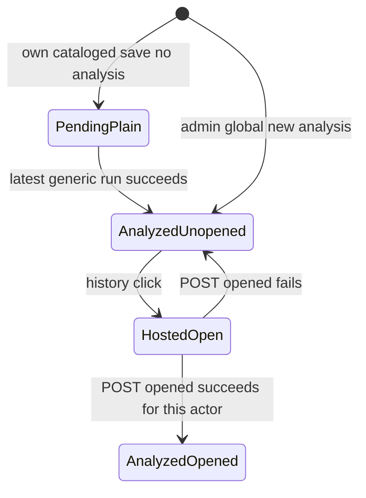

# Archived Planner report — session 02/exchange 02

Archival metadata (ORCHESTRATOR): task FRAMENEST-COMPANIE-HISTPLAN-02; same
Planner session, Plan Mode on; returned in chat 2026-08-26 after Cursor
blocked trace-file writes (expected under Plan Mode); archived verbatim
below except this block. Status reported: PASS (updated plan). Re-gate
claimed and ORCHESTRATOR-verified facts: 0031 PK `(actor_login_key,
media_id)`; `test_actor_opened_rows_are_isolated` present;
`historyClickKind`→`openReviewOverlay` root cause present;
`companionWebHosted()` at `app.js:5965`; schema head `0033`.

---

### Report for ORCHESTRATOR_CHAT

```text
Logical whole identity: framenest-companion-brave-testing-resume
Worker session ordinal: 02
Worker exchange ordinal: 02
Task identity: FRAMENEST-COMPANIE-HISTPLAN-02
```

Status: **PASS**  
Phase-qualified result: plan  
Logical-whole closure: not-closed  

Continuity: same healthy session as FRAMENEST-COMPANIE-HISTPLAN-01 (`02_report_00.md`). This exchange is a complete planning renewal after that terminal expiry. Evidence remains non-independent.

Re-gate: HEAD `91410fe063d9907304cff4550f61d403880a2eeb`; branch `feat/x-meme-browser-companion`; tracked-clean; `.ap` `9c5cc44f8b6c92dd56ad2427d13223d7d59c5656`. Schema head remains `0033`. No contradiction with R3′: per-actor open-state already exists in 0031; ordinary does not receive inbox list/detail/apply.

Report justification: changed-external-state

---

name: Companion history R1-R3  
overview: Decision-ready plan at 91410fe for R1–R3′: hosted iframe click-path; admin analyzed-only global inbox; ordinary own-history with per-actor unopened/badge on analyzed rows; reuse 0031 open-states (no 0034); same opened mutation with ownership gate.

todos:

- id: adr-0076 — ADR-0076 successor for R1–R3′: per-actor unopened, 0034-not-required, opened own-item; supersede ADR-0073 and ADR-0067 opened-admin-only without editing those bodies
- id: admin-analyzed-only — Filter GET /api/companion/review-inbox to analyzed-only; keep global analyzed pool and per-actor unopened_count
- id: ordinary-own-history — Add GET /api/companion/own-history (x.request, requester-private cataloged X, movie excluded, analyzed rows carry unopened; unopened_count over own analyzed)
- id: opened-own-item — Keep the same POST opened companion_mutation route; ingress capability x.request; API admin-any vs ordinary-owner; uniform 404 for not-owned/missing
- id: click-path-r1 — Every history row openHostedDetails; analyzed click (admin and ordinary) also POST opened without gating the iframe; pending never POST opened
- id: hide-analyze-hosted — Hide Analyze by AI and Load AI suggestion when companionWebHosted(); keep standalone Details/Edit
- id: tests-docs — Node + Python suites for R1–R3′ including Alice/Bob/admin isolation; no 0034; rewrite X_COMPANION.md history section

---

# Companion history correction R1–R3′

Baseline: `91410fe063d9907304cff4550f61d403880a2eeb`. Do not open `GET /api/companion/review-inbox` list/detail or Apply to ordinary identities. Record R1–R2–R3′ in successor **ADR-0076**.

## Changes from exchange 01

- R3 → **R3′**: ordinary own-history still lists all own saves; **analyzed** own rows now use unopened accent + toolbar badge; pending stay plain.
- Exchange-01 rows “ordinary `unopened` always false; `unopened_count` always 0; badge never” are **withdrawn**.
- Per-identity persistence: after inspecting 0031, **no 0034**. Table `companion_review_open_states` already has PK `(actor_login_key, media_id)`. Existing admin rows stay; no ordinary backfill.
- Opened POST stays the **same** of the four `companion_mutation` routes; widen callers via ingress `x.request` plus API ownership. Ordinary remains 403 on inbox list/detail/apply.
- Badge refresh: ordinary uses own-history `unopened_count` instead of the current 403-clear path.
- Analyzed history click POSTs opened for **both** audiences.
- Parked: auto-rebind polish (item 7 transient `composer_unbound`).

## Identity-scoped listing

Do **not** reuse `GET /api/workspace/media` (wrong payload, offset pagination, uploads/YouTube/movies).

- **Admin** — existing `GET /api/companion/review-inbox`, capability `media.workflow.read`. Rows: **analyzed-only** (drop the pending union in `_mixed_inbox_rows` in [`companion_review_repository.py`](src/framenest/infrastructure/persistence/companion_review_repository.py)); still the **global** analyzed pool. Item `unopened` and page `unopened_count` already join `companion_review_open_states` on **this actor**. Badge = that count.
- **Ordinary** — new `GET /api/companion/own-history`, capability `x.request`, not `companion_mutation`. Rows: actor-owned cataloged X Saves, **all analysis states**, movie excluded. Same item JSON as inbox (`media_id`, `title`, `created_at_ms`, `analyzed`, `analysis_run_id`, `completed_at_ms`, `unopened`). Pending: `unopened=false`. Analyzed: `unopened` iff no/stale `opened_run_id` for **this** actor. `unopened_count` = count of **own** cataloged analyzed items in that unopened set (reuse `_unopened_count_statement` with an **own-analyzed** `latest` subquery, not the global one).
- Ordinary still **403** `CAPABILITY_DENIED` on review-inbox list, detail, and apply.
- Cross-user listing: SQL `created_by_login_key == actor` on own-history; Alice ⊈ Bob.

Extension routing (`refreshInbox` in [`sidebar.js`](extension/ui/sidebar.js), [`service_worker.js`](extension/background/service_worker.js)): `GET /api/identity/me`. If `media.workflow.read` → inbox; else if `x.request` → own-history; else hide chrome.

**Badge refresh:** stop using inbox `limit=1` for ordinary (that 403 currently **clears** the badge). Admin: inbox `limit=1`. Ordinary: own-history `limit=1`. Both expose `unopened_count`; reuse `badgeTextForUnopenedCount`.

**Compact vs All:** Admin compact = newest 5 analyzed (`completed_at_ms`); All = remainder analyzed. Ordinary compact = newest 5 **own saves of any state** (activity stamp: analyzed `completed_at_ms`, pending `created_at_ms`) so a fresh Save sits immediately under the title bar and a newly analyzed own item can rise; All = remainder. Class `--unopened` only when `analyzed && unopened`.

## A. Per-identity open-state persistence

**Decision: reuse the 0031 table. Do not add 0034.**

DDL already in [`0031_companion_review_inbox.py`](src/framenest/infrastructure/persistence/alembic_environment/versions/0031_companion_review_inbox.py) and [`catalog_schema.py`](src/framenest/infrastructure/persistence/catalog_schema.py):

- PK `(actor_login_key, media_id)`
- `opened_run_id` FK to `media_analysis_runs`
- login-key CHECK; monotonic upsert in `_upsert_opened_state`
- Isolation already proven by `test_actor_opened_rows_are_isolated`

A second table or extra identity column would duplicate this. An empty 0034 would violate migration discipline (0033 is the additive-table pattern; there is nothing additive to create).

- **Upgrade:** none. Head stays `0033`.
- **Downgrade:** none new. 0031’s populated-open-state refuse-downgrade unchanged.
- **Existing rows:** already keyed by the administrator `actor_login_key`. Preserve as-is.
- **Ordinary backfill:** none. Missing row ⇒ unopened, which is the correct first-view accent/badge after analysis.
- Alice opening writes `(alice, media_id)`; Bob’s and admin’s tuples are different. Admin opening does not clear Alice.

## B. Badge sources and payloads

Admin inbox JSON: unchanged fields; `unopened_count` remains global-analyzed ∩ this-actor-open-state (already). After the analyzed-only filter, pending cannot affect the count (already true).

Own-history JSON: same page shape (`items`, `unopened_count`, `next_cursor`). `unopened_count` is **own-analyzed only**.

## C. Opened POST — same route, ownership gate

Keep `POST /api/companion/review-inbox/{media_id}/opened` as the **same** of the four `companion_mutation` routes. Do not add a fifth route. Allowlist + `X-FrameNest-Request: 1` + no CORS unchanged.

`RoutePolicy.additional_capabilities` is **AND**, not OR. Do not invent an OR field. Change opened ingress `capability` from `media.workflow.read` to **`x.request`** (both roles already have it). Then API:

- `_require_opened_identity`: verified identity with `x.request` (not `workflow.read` alone).
- If `media.workflow.read`: current `mark_opened` (any eligible non-movie run) — admin is never gated.
- Else: **owner** of cataloged X media (`has_live_requester_media_access`) **and** the submitted run belongs to that media and is eligible (`_require_eligible_run`). Else **404** `MEDIA_NOT_FOUND` (uniform with unknown id — no existence leak). Movie still 409. Pending/no eligible run: existing 404/409 run errors.
- List/detail/apply ingress stays `media.workflow.read` / dual apply caps → ordinary **403**.

`test_opened_and_apply_contracts` today: ordinary POST opened on admin GENERIC → 403. After R3′ that media is not USER-owned → **404** (update that assertion). New positive: ordinary POST opened on **their** analyzed cataloged X → 200, only their `actor_login_key` row upserted.

## Accent + badge state machine (both audiences)



- Pending: plain, never badge, never POST opened, click still `open_details`.
- Analyzed unopened (admin global or ordinary own): `--unopened`, badge +1 for **that actor**.
- Click never removes the row. Open iframe immediately (**do not gate** on opened HTTP). Fire opened with the row’s `analysis_run_id`, then refresh list/badge.
- Other actors’ accent/badge unchanged.

## Click-path (R1)

Root cause: `historyClickKind` in [`sidebar.js`](extension/ui/sidebar.js) returns `"pending_overlay"` when `analyzed !== true` → `openReviewOverlay` / `ui/review.html`.

Every history row → `openHostedDetails` → `postToFrame(open_details, storedOrigin)`, `v: "framenest.companion.web.v1"`, never `*`. Analyzed rows also POST opened (this **replaces** the current test that forbids `REVIEW_INBOX_OPENED` on history click). Leave `ui/review.html` in tree (park deletion). Hosted Details for unpublished own X already work via `ContentAudiencePolicy.may_read`.

## Companion popup contents

Details **Edit** stays capability-gated (`metadata.canonical.write` — ordinary cannot Edit). Hide **Analyze by AI** and **Load AI suggestion** when `companionWebHosted()`. No query flag. Standalone shell unchanged. Gallery card brain action stays.

## Security invariants

- Exactly four `companion_mutation` routes (submit, retry, **same** opened, apply). Opened allowlist+header unchanged.
- GET own-history is not a mutation (empty allowlist still readable, like GET inbox).
- Publication sole-writer; Apply never publishes; ordinary never gains `media.workflow.read`, `analysis.run`, `metadata.canonical.write`, or `media.content.publish`.
- Uniform sanitized 401/403/404/422/500/503.
- Movie exclusion retained.
- New ordinary GET: only `GET /api/companion/own-history`. New ordinary mutation caller: opened on **own** item only.

## Docs in this slice

ADR-0076 outline (new file + index row; do not edit ADR-0073 or ADR-0067 bodies):

- R1: every own-row click is hosted `open_details`.
- R2: admin history is analyzed-only global pool; unopened accent/badge; click opens + marks opened for the admin actor.
- R3′: ordinary history is requester-private own saves, all states; unopened/badge only after analysis; pending plain.
- Opened state remains `companion_review_open_states` (0031); no 0034; per-actor PK is the isolation mechanism.
- ADR-0073 mixed-inbox / pending-overlay / ordinary-403-hides-history succeeded.
- ADR-0067 “mark-opened is administrator-only” succeeded **only** for own-item opened; list/detail/apply stay admin-only.
- Schema head remains `0033`.

Rewrite the history section of [`docs/X_COMPANION.md`] and update superseded present-tense claims (ordinary-403-hides / mixed-pending sentences). Update `tests/contract/test_x_route_policy.py` opened capability to `x.request`. `test_current_schema_head_is_0033` stays.

## Tests (named)

**R1** — `tests/companion_review_extension.test.js`: pending/own click is `open_details`, never `openReviewOverlay`. Keep `tests/companion_web_bridge.test.js` protocol / `storedOrigin` / never `*`. Hosted web test: hide Analyze + Load AI suggestion; standalone shows them.

**R2** — repository + `tests/contract/test_companion_review_api.py`: admin list analyzed-only; newest first; pending absent; retain `test_suggestion_ready_lists_without_v1_schema_and_survives_decode_failure` and `test_corrupt_result_json_does_not_drop_inbox_page`. Extension: analyzed click → opened then `open_details`; iframe still opens if opened fails.

**R3′ listing** — ordinary own-history 200 all own states; Alice ⊈ Bob; movies excluded; pending `unopened=false` and omitted from count; analyzed unopened increments ordinary `unopened_count`. Ordinary still 403 on inbox list/detail/apply.

**R3′ opened + isolation (Alice / Bob / admin triple)** — Alice POST opened on her analyzed item 200; Bob’s own-history unopened/count unchanged; admin’s global unopened for that media unchanged until admin opens; admin POST opened does not clear Alice; Alice POST on Bob’s id or unknown id → **404**; Alice POST apply still 403. Retain `test_actor_opened_rows_are_isolated`.

**No 0034** — do not add `0034_*.py` or a 0033-style additive migration suite. Head remains 0033 (`test_current_schema_head_is_0033`, `tests/integration/test_persistence_migrations.py`, `tests/integration/persistence/test_analysis_proposal_migration.py`).

**Ingress** — `tests/contract/test_x_route_policy.py`: still exactly four `companion_mutation`; opened capability `x.request`; own-history GET not flagged. `tests/contract/test_tailscale_ingress_security.py`: opened still allowlist+header fail-closed; new GET is not.

**Retention:** v1 apply/detail fail-closed; empty allowlist mutations; publication sole-writer; movie 409.

## Sequencing

Implementation at exact baseline → Node + `./.ap/ap exec --operation test-focus` Python (include existing 0033 migration files, not a new 0034) → Cooperator **publication** grant → routine `framenest-release` NUC refresh → Cooperator re-render (admin analyzed-only + accent/badge; ordinary own-saves with analyzed accent/badge; iframe Details; Edit without Analyze in hosted popup). This Planner has no implementation, Git, NUC, or publication authority.

## Open questions (defaults)

- Own-history = companion X cataloged only, not full workspace: **yes**.
- Admin analyzed pool stays **global**: **yes**.
- Opened POST failure still opens iframe: **yes**.
- Hide Load AI suggestion in hosted Edit: **yes**.
- Leave `ui/review.html` unused: **yes**.
- `--unopened` on every unopened analyzed row (not index-0-only): **yes**.
- `docs/X_COMPANION.md` history rewrite in this slice: **yes**.
- Not-owned ordinary opened → 404 not 403: **yes** (uniform with unknown).
- No 0034: **yes**.

## Parked

R4 Settings Administration auto-analysis checkbox; failed-save tombstones; X extractor failure; deleting review overlay files; workspace-media-in-companion; public-origin companion reconnect; six-per-hour rate-limit hygiene from session 01; **auto-rebind polish** (rendered item 7: one transient `composer_unbound` then Attach PASS — do not redesign Attach). Item 6 pending-click superseded by R2. Item 10 superseded by R3′.

## Risks

- Ingress capability change on opened is the sharp trust-boundary edit; tests must prove ordinary cannot open others’ items and still cannot Apply.
- Own-history `unopened_count` must not accidentally reuse the **global** latest subquery (that would badge ordinary for other people’s analyses).
- NUC already on this SHA: this slice still needs publication + routine refresh before rendered re-test.

Authority expiry: this report terminates the FRAMENEST-COMPANIE-HISTPLAN-02 planning-renewal authority. No follow-on action, implementation, Git write, NUC access, provider call, or logical-whole closure is authorized.
```
