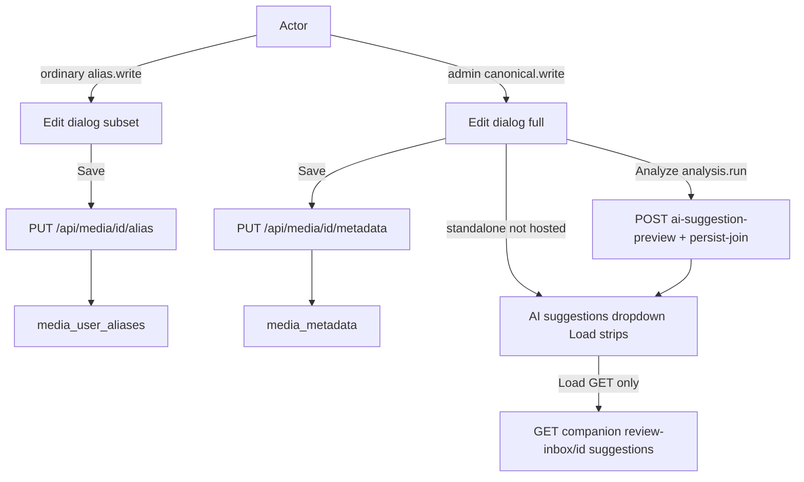

# Ordinary alias Edit a admin AI suggestions

**Stav brány (overené):** checkout `/home/agile/Projects/framenest`, branch `feat/x-meme-browser-companion`, HEAD `2aead540ee39a81a96425902f85e9b9a34f0d690`, tree `0900818f57326017712c07686c49de61d534507f`, tracked-clean, `.ap` pin `9c5cc44f8b6c92dd56ad2427d13223d7d59c5656`, `origin/main` rovnaký SHA. Informačný ahead-count voči `origin/feat/x-meme-browser-companion` sa nerieši. Schema head Alembic `0033`; žiadna migrácia `0034_*`.

**Táto relácia:** len plán. Native planning mode zakazuje zápis `01_report_00.md` teraz; po schválení plánu Worker zapíše ten jeden Meta súbor (anglický AP report) a zastaví. Implementácia je Worker 02.

Žiadna otázka na Cooperatora: Gallery/Details **čítajú** canonical; ordinary Edit **zapisuje** alias (default z promptu).

## 1. Surface matrix (capability + Save)

- **Gallery card bottom-left Edit**
  - Ordinary: show ak `metadata.alias.write` a workspace audience; Save = alias PUT.
  - Admin: show ak `metadata.canonical.write` (existujúce); Save = canonical PUT.
  - Predikát: canonical-write vyhráva, ak má oboje.
- **Details Edit** (`#media-details-edit`, dnes `app.js` ~443–444): rovnaký predikát namiesto len `metadata.canonical.write`.
- **Hosted companion Details:** Edit podľa predikátu vyššie **zobrazený**. Analyze, Load, dropdown a proposal strips **skryté** (`companionWebHosted()`), R1 ostáva. Admin hosted Edit je canonical form bez AI chrome.
- **Standalone Manage media:** ordinary nemá `media.workflow.read` → ostáva skryté. Admin: Analyze + suggestions chrome.
- **Gallery 🧠:** ostáva `identityAllowsCardAiQuickAction` = `analysis.run` ∧ `canonical.write` ∧ incomplete metadata ∧ nie movie ([app.js](src/framenest/adapters/api/web/app.js) ~5210–5220). Ordinary ho nikdy nevidí. Admin bulk analyze-and-canonical-save **parkovaný dlh**, mimo kebabu okrem keep-admin-only.

## 2. Save semantics

- Ordinary Save → `PUT /api/media/{id}/alias` (`display_title`, `description`, `tag_keys` only). Existujúci API už vyžaduje `metadata.alias.write` ([media_alias_api.py](src/framenest/adapters/api/media_alias_api.py)).
- Admin Save → existujúci `PUT /api/media/{id}/metadata` (`canonical.write`).
- Current sa **seeduje z canonical GET metadata**, nie z alias a nie z card overlay (Gallery ostáva canonical).
- Dirty ordinary: title/description/tags voči canonical seed. Prázdny alias obsah → žiadny overlay riadok (ADR-0062 `is_empty`).
- Ordinary **nemá** content-category, acquisition, genres (odstránené/skryté). Acquisition je už disabled. Ordinary **nevytvára** canonical tagy (`POST /api/canonical-tags` = `canonical.write` → 403); tag search len existujúce kľúče (ADR-0065 Surface A).
- Admin formulár ostáva s klasifikáciou; movie Identify ostáva admin movie-only, mimo generic dropdownu.

## 3. Suggestions data (žiadne 0034)

- `result_json` už nesie `title`, `description`, `tags`, `suggested_filename` ([serialize_suggestion_result](src/framenest/application/media_analysis_lifecycle.py) ~129–141). `create_manual_pending` + `supersedes_run_id` už uchováva históriu. **Žiadna Alembic 0034.**
- `GET /api/media/{id}/automatic-analysis` je **len latest** (`get_by_media_definition`) — nestačí na dropdown.
- **Existujúci list:** `GET /api/companion/review-inbox/{media_id}` pole `suggestions[]` (paged, newest first, generic analyzed, movie skip, `result_schema_version` v1). Capability `media.workflow.read` (admin). Ordinary ostáva 403. Website Edit to **len číta**; nikdy `POST …/apply`.
- Filter: `state=analyzed`, `automatic_post_catalog`, `generic_media` (alebo null profile), nie `movie_identification`.
- In-session preview: po úspešnom Analyze (jeden `POST …/ai-suggestion-preview` + persist-join) zaradiť odpoveď ako vybranú položku a odhaliť strips **bez** zápisu do Current; potom refresh listu.
- Jeden provider call na Analyze. Dropdown change = 0 provider. ✅ = 0 provider, 0 persist.

## 4. Chrome

- Heading **AI suggestions**. Odstrániť View details, `metadata-durable-ai-suggestion` essay, „Generated automatically after upload.“, „New AI analysis is available after confirmation.“
- Model dropdown + **Load** **nad Title** (presunúť z footera). Footer: Save, Analyze by AI (admin standalone), Cancel.
- Load: odhalí strips vybranej položky; **nesmie** volať `applyResolvedAiSuggestionToMetadataWorkspace` (ten dnes bulk-prepíše Current, [app.js](src/framenest/adapters/api/web/app.js) ~5494–5503). Odstrániť confirm „Replace current draft?“.
- Strips pod Title, Description, TAGS: neklikateľné, vizuálny jazyk companion compact history ([extension/ui/sidebar.css](extension/ui/sidebar.css) `--accent` / `--accent-border` / dark). ✅ na poli skopíruje len to pole do Current. Tagy: jeden ✅ na mapped tag (append ak ešte nie je v Current; unknown/ambiguous bez ✅, admin môže `ensureMetadataTagKey` len pre canonical-write).
- Suggested filename: **admin-only informačná poznámka**, žiadny ✅, nie catalog. Ordinary alias: vynechať.
- Analyze: ostáva `analysis.run` ∧ not hosted. Po úspechu **nesmie** locknúť ďalší Analyze (`aiSuggestionApplied` dnes schová Analyze) — druhé Analyze musí joinúť históriu. Confirm text: výsledok nahradí Current → výsledok sa stane proposal strips.
- Gallery karty: len pridať ordinary Edit control; žiadny restyle.

## 5. First-attempt provider miss (klasifikácia)

Pozorovaný reťazec „AI provider is not available.“ sedí na `aiSuggestionErrorMessage` ([app.js](src/framenest/adapters/api/web/app.js) ~7285), nie na library-scan `suggestionErrorMessage` ~10362.

Vrstvy:

1. **Copy/control (v tomto kebabe):** `renderMetadataAiPanel` vždy nastaví essay „New AI analysis is available after confirmation.“ keď `aiCapability.available`, aj po chybe.
2. **Silent abort (v tomto kebabe):** `metadataAiConfirmationContextIsCurrent` vyžaduje nezmenené `aiCapabilityRevision`; refresh počas confirm dialógu → `return` bez statusu.
3. **Remainder:** skutočný 503 `AI_PROVIDER_UNAVAILABLE` (transient NIM). Retry úspech to nevylučuje. **Netrhať persist-join.**

Najmenší fix: zmazať essay; live region Analyzing… / Loaded / Provider unavailable len z posledného POST; pri stale confirm ukázať krátku správu namiesto ticha. `suggestionErrorMessage` ~10362 nechať (library scan, mimo).

## 6. Tests (návrh pre Worker 02)

Aktualizovať suity, ktoré mrazia singular chrome: [tests/automatic_analysis_lifecycle.test.js](tests/automatic_analysis_lifecycle.test.js), [tests/upload_cockpit_async_ownership.test.js](tests/upload_cockpit_async_ownership.test.js), [tests/tailscale_identity_frontend.test.js](tests/tailscale_identity_frontend.test.js), [tests/companion_web_bridge.test.js](tests/companion_web_bridge.test.js), [tests/contract/test_local_web_application.py](tests/contract/test_local_web_application.py).

Nové prípady: ordinary Gallery/Details Edit viditeľný; ordinary Save = alias PUT; ordinary canonical PUT 403; hosted Analyze+Load skryté aj s alias Edit; dropdown/Load bez `ai-suggestion-preview`; ✅ nevolá Save; štyri `companion_mutation` ([tests/contract/test_x_route_policy.py](tests/contract/test_x_route_policy.py)); schema ostáva `0033`; ordinary Apply 403.

## 7. Docs + ADR-0077 (implementácia, nie táto relácia)

Súčasný prítomný čas: [PRODUCT.md](PRODUCT.md) §17 (a §2 „session-only“), [docs/X_COMPANION.md](docs/X_COMPANION.md) „Edit stays capability-gated“, [SPEC.md](SPEC.md) Current workspace „saves through the existing metadata API“ / tag create — len tam, kde tento kebab spraví text nepravdivým. **Needitovať** telá ADR-0062/0067/0073.

**Successor ADR-0077** (ďalšie voľné číslo): *Ordinary Alias Edit Affordance and Per-Field AI Suggestions in the Metadata Workspace*.

- Context: ADR-0062 freeze vs missing Edit; ADR-0023 bulk gap.
- Decision: Edit gate split; Save split; suggestions chrome; hosted hide Analyze/Load; no 0034; 🧠 parked.
- Supersedes: ADR-0062 „frozen surfaces“ len pre **Edit affordance** (nie Gallery read); ADR-0076 „Edit remains `metadata.canonical.write`“; ADR-0023 `Use this draft` → per-field ✅ v existujúcom dialógu.
- Deferred: Gallery alias display, 🧠 per-field, R4, Cover Studio, persistent comparison board.

## 8. Mimo rozsahu

R4 Settings checkbox; VPS; Cover Studio; persistent AI Drafts comparison; Funnel; CORS; ordinary `analysis.run` / canonical.write / Apply; items 11–12; SECURITY.md own-history; AP ledger `consumer-declared-execution-and-capability-route-binding`; Gallery alias **display**; movie identification redesign; persist-join redesign.

## 9. Allowlist + validácia (Worker 02)

Predpokladané cesty: [app.js](src/framenest/adapters/api/web/app.js), [index.html](src/framenest/adapters/api/web/index.html), [styles.css](src/framenest/adapters/api/web/styles.css); testy vyššie; PRODUCT/SPEC/X_COMPANION; `docs/adr/0077-*.md`; [docs/adr/README.md](docs/adr/README.md). Python API len ak reuse inbox GET zlyhá v testoch — vtedy najmenší additive GET na analysis lifecycle, `analysis.run`, stále 0033.

Commits: 1–3 (alias Edit; suggestions chrome; docs+ADR). Isolated worktree z `2aead54`. Python len `./.ap/ap exec --root /home/agile/Projects/framenest --baseline 2aead54…` (kanonický root; isolated `--root <worktree>` je známy launch-path miss). JS Node testy ako doteraz.

## 10. Numbered Cooperator re-test (po public SHA na NUC)

Položky 1–12 presne ako v promptu. Položka 12: PASS ak essay/silent-abort preč a provider-up Analyze uspeje na prvý pokus; inak FAIL s remainder 503.

## Ďalší krok

ORCHESTRATOR skontroluje plán, získa súhlas Cooperatora, vydá implementačný Worker 02 (`Native planning mode: not-used`). Táto planning autorita končí odovzdaním `01_report_00.md`.
