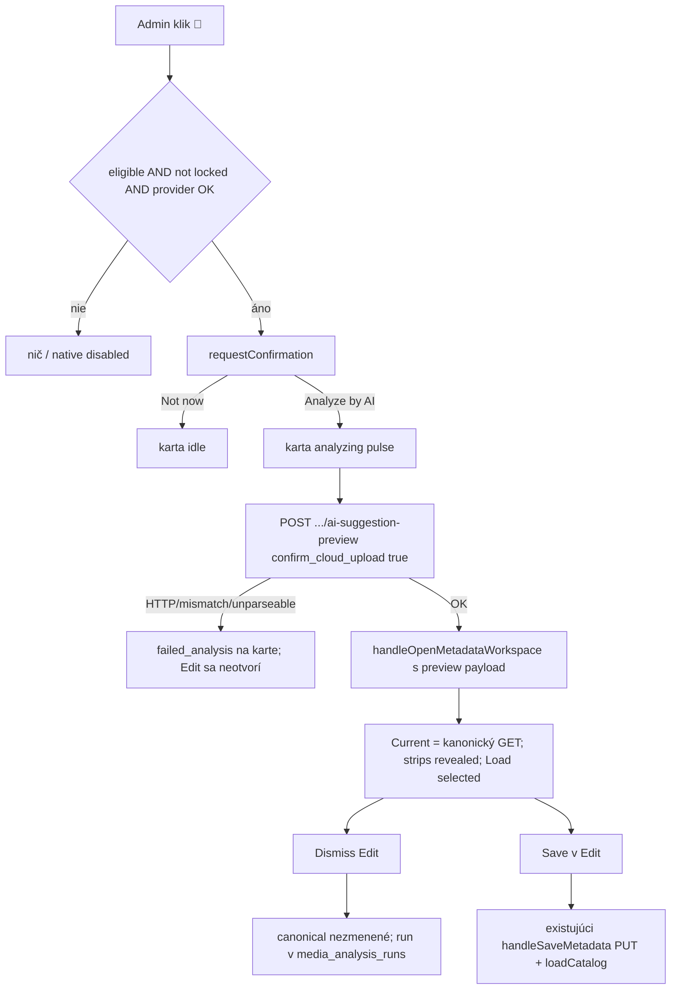

# Gallery 🧠 per-field (plán Worker 01)

**Logical whole:** `framenest-gallery-card-ai-per-field-mvp`  
**Baseline:** `afa0670e26d17b04570ad555ba4f922052507c6c` (gate PASS: branch `feat/x-meme-browser-companion`, tree `b6eafbcdef3a8bcb728498992c003d8ad5e9a447`, tracked-clean, `.ap` pin `9c5cc44…`, schema `0033`, žiadna `0034`).  
**Táto relácia:** len plán. Schválenie Cursor plánu **nie je** implementačná autorita. Jediný povolený zápis po schválení v tejto relácii: anglický AP report [`01_report_00.md`](/home/agile/meta/projects/framenest/08/00-framenest-mvp-remainder/01_report_00.md).

## Zvolený povrch (zmrazené)

**Otvoriť existujúci Edit dialóg. Nie inline strips na karte.**

Dôvody (evidencia, nie preferencia):

- Default Cooperatora a [GALLERY.md](GALLERY.md) už hovoria: shortcut otvorí existujúci metadata editor; persistuje až `Save` ([GALLERY.md](GALLERY.md) ~109–115). Kód v `handleAnalyzeCatalogCard` (~5744) od toho **odbočil** tichým `PUT /api/media/{id}/metadata`.
- Per-field chrome (dropdown, Load, strips, tag buttons, dirty/discard, canonical Save) je už v Edit (ADR-0077). Druhý workspace sa nezakladá.
- Inline strips by menili vizuálny grid (premium Gallery freeze) a duplikovali Save/dirty sémantiku na karte.
- Existujúci parameter `handleOpenMetadataWorkspace(..., { aiSuggestion })` (~7770, ~7897) **nesmie** ísť touto cestou: volá `applyResolvedAiSuggestionToMetadataWorkspace`, čo prepíše Current. Volajúci ho dnes nepoužívajú; je to leftover bulk-apply. Odstrániť ho v implementácii, aby sa neobnovil last-write-wins.



## 1. Tok po kliku 🧠

1. Gate: `cardAiQuickActionIsLocked` / `cardAiQuickActionEligible` / location / `cardAiQuickActionProviderBlocked` — bez zmeny poradia; provider-blocked ostáva native disabled, **žiadny** `openStatusDialog("ai")`.
2. Stav `confirming`; dialóg (presné EN reťazce produktu):
   - **Title:** `Analyze with AI?`
   - **Message:** `FrameNest will send up to 3 optimized preview frames and bounded metadata to the configured server-side AI provider. The original file, local path, and API key are not uploaded. The editor will open with proposal strips beside Title, Description, and Tags. Current canonical values are not replaced. Nothing is saved until you click Save, and the physical file is not renamed.`
   - **Confirm:** `Analyze by AI`
   - **Dismiss:** `Not now`
   - `destructive: false`, `focusReturn: button`
   - Odstrániť: `Analyze and save with AI?`, `will replace the current canonical values`, `last-write-wins`, `Analyze and save`.
3. Cancel → `idle`. Žiadny fetch.
4. Accept → `analyzing` + existujúci pulse v [styles.css](src/framenest/adapters/api/web/styles.css) (`catalog-card-analyze-pulse`). Žiadny viditeľný „Analyzing…“ text na karte (zachovať súčasný busy kontrakt).
5. `POST /api/media/{id}/locations/{loc}/ai-suggestion-preview` s `confirm_cloud_upload: true` a `framenestMutationHeaders` — **jediná** mutácia z karty. Persist-join ostáva v [PreviewImportedMediaSuggestion](src/framenest/application/media_suggestion.py) (~522–523). **Neredesignovať.** Preview JSON **nemá** `analysis_run_id` ([media_suggestion_api.py](src/framenest/adapters/api/media_suggestion_api.py) `_imported_preview_response`); to je v poriadku: `presentInSessionSuggestion` + `refreshMetadataSuggestionList` už v Edit Analyze nahradia ephemeral `preview-*` id najnovším inbox runom a nechajú `revealed = true`.
6. Chyby (žiadny Edit, karta ostane, retry):
   - HTTP nie OK → `failed_analysis` + `aiSuggestionErrorMessage` (vrátane `AI_PROVIDER_UNAVAILABLE`).
   - `cardAiPreviewResponseMatchesRequest` zlyhá → súčasná mismatch copy, upravená: metadata sa nemenili (pravda ostáva).
   - Unparseable payload / sieť v stave `analyzing` → `failed_analysis`.
7. Úspech: **žiadny** `suggestionIsUsableForCanonicalSave` (tá funkcia žije len pre auto-PUT; odstrániť ju). **Žiadny** `metadataTagKeysFromSuggestion` / `POST /api/canonical-tags` z karty. **Žiadny** GET/PUT metadata z karty.
8. `handleOpenMetadataWorkspace(item, button, { previewSuggestion, previewPayload })` **po** načítaní kanonického Current (a alias overlay, ak by bol alias mode — karta 🧠 je len canonical-write admin, takže Edit bude canonical):
   - `presentInSessionSuggestion(suggestion, payload)`
   - `metadataAiStatus = "Loaded"` (rovnako ako `handleAnalyzeMetadataByAi` ~7446–7448)
   - potom `refreshMetadataSuggestionList` (zachová selected + revealed)
   - **Nikdy** `applyResolvedAiSuggestionToMetadataWorkspace`
9. Early-return, ak je Edit už otvorený na **tom istom** `media_id`: nediscardovať dirty Current; len `presentInSessionSuggestion` + render. To je ADR-0023 (Current sa ticho neprepisuje).
10. Edit otvorený na **inom** iteme a dirty: existujúci discard confirm. Ak Cooperator discard **odmietne**: persist-join už prebehol; karta `idle`; status na karte `AI suggestion is ready. Open Edit to review.`; **neopakovať** analýzu.
11. Otvorené Details: existujúce `closeDetailsDialog` v `handleOpenMetadataWorkspace`.
12. Po úspešnom otvorení: karta späť `idle` (🧠 ostane, lebo metadata sú stále neúplné). Žiadne `AI metadata saved`, žiadne `dismissCardAiQuickActionButton`, žiadny FLIP reflow z 🧠.
13. Canonical persist **iba** cez existujúci `handleSaveMetadata` (~8153) → PUT + `loadCatalog()`. Zrušenie Edit = kanonické metadata nedotknuté.

**Stavy na odstránenie z 🧠 cesty:** `applying`, `failed_save`. `CARD_AI_QUICK_ACTION_LOCKED` = `{confirming, analyzing}`. Odstrániť mŕtvy success-patch: `applySavedAiMetadataToCatalogSurfaces`, `announceCardAiQuickActionSuccess`, `dismissCardAiQuickActionButton`, FLIP helpery (`captureCatalogCardLayoutSnapshot`, `animateCatalogCardMetadataReflow`, `clearCatalogCardReflowInlineStyles`) ak ostanú bez volajúceho. CSS: odstrániť `data-analysis-state="applying"` / `failed_save` / dismissing, ak prestanú existovať; **ponechať** analyzing pulse a reduced-motion. Grid layout kariet nemenit.

## 2. Save a stav

- Nula automatických `PUT /api/media/{id}/metadata` z 🧠.
- Persist-join do `media_analysis_runs` ostáva (už dnes pri preview POST).
- Dismiss Edit ≠ kanonický Save.
- `loadCatalog()` z 🧠 **nevolať** (karty sa neremountujú počas analýzy; playback na karte ostane).

## 3. Capability gate

Ponechať `analysis.run` ∧ `metadata.canonical.write` ∧ `resolved` ∧ `available` ∧ incomplete metadata ∧ nie movie.

**Doplniť** `&& !companionWebHosted()` do `identityAllowsCardAiQuickAction` (zhoda s `identityAllowsAiAnalyze` ~382–387 a ADR-0077 rozhodnutie 7: hosted Analyze ostáva skrytý). Dnes hosted admin 🧠 **vidí** ([catalog_card_ai_quick_action.test.js](tests/catalog_card_ai_quick_action.test.js) ~856–857); to by inak obnovilo hosted Analyze cez kartu. Ordinary / unauthenticated / bez `canonical.write` ostávajú bez 🧠. Meme/general áno; movie nie.

## 4. Testy

Hlavný súbor: [tests/catalog_card_ai_quick_action.test.js](tests/catalog_card_ai_quick_action.test.js).

**Prepis source-wiring** (~1017–1058, ~2093–2099, ~2127–2134):

- confirmation copy nové reťazce; `handleOpenMetadataWorkspace` **áno**; `method: "PUT"` **nie**; `applySavedAiMetadata…` **nie**; `failed_save` **nie**; `framenestMutationHeaders` presne 1× (len preview).

**Prepis / nahradenie flow testov**, ktoré dnes enqueue-ujú GET+PUT metadata a tvrdiá `AI metadata saved` / odstránenie 🧠 (~1167, ~1321 failed_save vetva, ~1718 lock-through-save, ~2017 PUT failure, ~2067 invalid→no PUT ostáva ako no-PUT ale Edit sa môže otvoriť s prázdnymi strips).

Nové tvrdenia (harness spy `handleOpenMetadataWorkspace`):

- úspešný preview → 1 POST preview, 0 PUT, 0 tag POST, volanie open-workspace s suggestion, karta idle, 🧠 connected, title karty nezmenený;
- failed analysis → 0 open-workspace;
- cancel confirm → 0 fetch.

**Odstrániť** testy viazané na `applySavedAiMetadataToCatalogSurfaces` (FLIP reflow, reduced-motion dismiss, Details patch z 🧠). Details po Save ostáva na `handleSaveMetadata` + `loadCatalog`.

Ďalšie súbory (promptom spomenutý `tests/ai_suggestion_alias_edit_flow.test.js` **neexistuje**):

- [tests/contract/test_local_web_application.py](tests/contract/test_local_web_application.py) ~1702, ~1893: obrátiť PUT/applying/failed_save/applySaved… na no-PUT + open workspace; odstrániť asserty na dismiss/announce/FLIP.
- [tests/contract/test_youtube_creator_taxonomy_frontend.py](tests/contract/test_youtube_creator_taxonomy_frontend.py) ~40–47: PUT-body/creator-preserve copy z karty zmizne; nahradiť assertom, že `handleAnalyzeCatalogCard` neobsahuje `acquisition_source:` / `creator_attribution_kind:` (už nečíta metadata) a že confirmation **nepoužíva** last-write-wins vetu.
- [tests/tailscale_identity_frontend.test.js](tests/tailscale_identity_frontend.test.js): doplniť `companionWebHosted()` v identity gate, ak sa tam presunie hide.
- [tests/metadata_alias_edit.test.js](tests/metadata_alias_edit.test.js): ak sa zmení signature `handleOpenMetadataWorkspace`, overiť, že alias open/Load/Save sa nepokazí; card path nesmie volať `applyResolvedAiSuggestionToMetadataWorkspace`.
- [tests/gallery_details_playback_handoff.test.js](tests/gallery_details_playback_handoff.test.js): **bez zmeny** (žiadny overlap).

## 5. Dokumenty

**Nemeniť telá** ADR-0023, 0020, 0062, 0066, 0067, 0077.

Nový **ADR-0078** (ďalšie voľné číslo; 0078 neexistuje):

- Succeeds len ADR-0077 §10 (Gallery 🧠 bulk analyze-and-canonical-save).
- Rozhodnutie: admin 🧠 = explicit Analyze (preview + persist-join) + otvorenie existujúceho Edit s revealed strips; Current sa neprepisuje; kanonický zápis len Save; nie publikácia; hosted 🧠 skrytý; štyri `companion_mutation` nedotknuté; schema ostáva 0033.
- Index riadok v [docs/adr/README.md](docs/adr/README.md); v ADR-0077 **nemeniť body** — successor stačí.

Living:

- [GALLERY.md](GALLERY.md): chirurgicky zosúladiť ~109–118 s per-field strips a admin gate; opraviť zastarané „opens AI Status panel when unavailable“ (kód už native-disable, testy to držia).
- PRODUCT.md / SPEC.md: len ak by ostala veta o card auto-save (pri recon **nie**); inak nesaheť.

## 6. Mimo rozsahu

R4 Settings checkbox; VPS / Funnel / port-forward; Cover Studio; ordinary `analysis.run` / `canonical.write`; piata `companion_mutation`; schema `0034`; AP ledger; persist-join redesign; movie identification; restyle gridu; publikácia cez 🧠; druhý suggestion store.

## 7. Allowlist a commity (Worker 02, iná relácia)

**Súbory:**

- [src/framenest/adapters/api/web/app.js](src/framenest/adapters/api/web/app.js)
- [src/framenest/adapters/api/web/styles.css](src/framenest/adapters/api/web/styles.css)
- [tests/catalog_card_ai_quick_action.test.js](tests/catalog_card_ai_quick_action.test.js)
- [tests/contract/test_local_web_application.py](tests/contract/test_local_web_application.py)
- [tests/contract/test_youtube_creator_taxonomy_frontend.py](tests/contract/test_youtube_creator_taxonomy_frontend.py)
- [tests/tailscale_identity_frontend.test.js](tests/tailscale_identity_frontend.test.js) (ak gate)
- [tests/metadata_alias_edit.test.js](tests/metadata_alias_edit.test.js) (ak signature)
- `docs/adr/0078-gallery-card-ai-per-field-review.md` (nový)
- [docs/adr/README.md](docs/adr/README.md)
- [GALLERY.md](GALLERY.md)

**2 commity:** (1) frontend + testy; (2) ADR-0078 + GALLERY/index. Isolated worktree; žiadny push.

**Validácia Worker 02:**

```text
node --test tests/catalog_card_ai_quick_action.test.js
node --test tests/metadata_alias_edit.test.js tests/tailscale_identity_frontend.test.js tests/*_frontend.test.js tests/*_cockpit.test.js tests/gallery_*.test.js
./.ap/ap project check --root <worktree-or-canonical> --baseline <authorized-HEAD>
./.ap/ap exec --root <canonical-for-launch> --baseline <authorized-HEAD> --operation test-focus -- tests/contract/test_local_web_application.py tests/contract/test_youtube_creator_taxonomy_frontend.py -q -p no:cacheprovider
```

Python len cez `./.ap/ap exec`. Isolated-worktree `ap exec --root <worktree>` je známy miss — klasifikovať, neremontovať `.venv`.

## 8. Číslovaný re-test na NUC (po public SHA)

1. Ordinary: 🧠 nikde; Edit ostáva ak má `alias.write`.
2. Admin, neúplné non-movie: 🧠 vpravo hore.
3. Movie: bez 🧠.
4. Úplné metadata: bez 🧠.
5. Klik 🧠: copy **nie** replace/save/last-write-wins; confirm `Analyze by AI`.
6. Not now: editor zatvorený, karta idle, bez analýzy.
7. Confirm: pulse; Edit sa otvorí; Current = predošlé kanonické hodnoty (nie bulk replace); strips viditeľné; nový run selected; status `Loaded`.
8. Zavrieť Edit bez Save: titulok/tagy karty nezmenené; 🧠 ostane.
9. Edit ceruzkou: Load ukáže persist-joinnutý run.
10. Z 🧠→Edit, ✅ na niektorých poliach, Save: katalog sa zmení len uloženým Current; nie je to publish.
11. Hosted companion Gallery: 🧠 skrytý; Load v Edit ostáva.
12. AI unavailable: 🧠 disabled, bez confirmation, bez Status panelu.
13. 503 po confirme: `failed_analysis` na karte, Edit sa neotvorí, retry po novom confirme ide.
14. Unpublished položka ostane unpublished.

## Otvorené otázky

Žiadna. Hosted hide je zmrazené ako zarovnanie s ADR-0077 §7, nie ako nový produktový spor.

## Ďalší krok

ORCHESTRATOR skontroluje tento plán, získa súhlas Cooperatora, vydá **Worker 02** (`Native planning mode: not-used`, isolated worktree). Táto Planner relácia po odovzdaní reportu končí.
