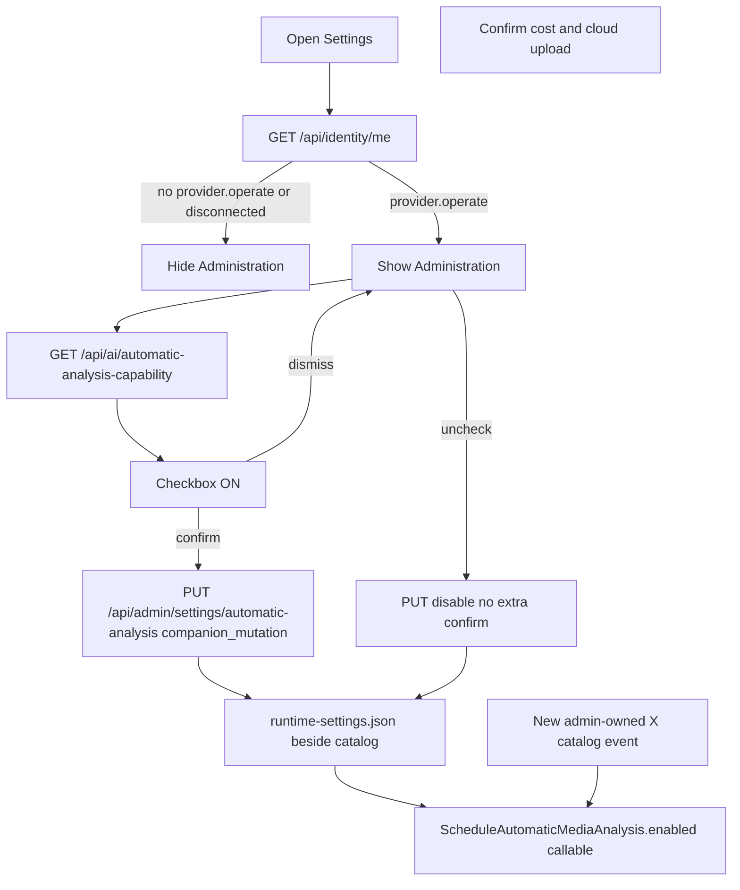

# R4: Companion Settings — automatic analysis (plan-only)

Táto relácia je **len plánovanie**. Po schválení zapíšem anglický Worker report do [`06_report_00.md`](/home/agile/meta/projects/framenest/08/00-framenest-mvp-remainder/06_report_00.md) a zastavím sa. Žiadna implementácia, žiadny Git write vo FrameNest, žiadny NUC.

## Gate (overené)

| Fakt | Prompt | Pozorované |
|---|---|---|
| Branch | `feat/x-meme-browser-companion` | sedí |
| HEAD / baseline | `1eee09c1afcfe41b2a411784f8c43c428e610b9b` | sedí |
| Tree | `651664e754efbe9492161b402860fe368415fc17` | **nesedí:** `bd160c2a7f9a34c689a08b0e5facff3e426f127f` (to je skutočný tree commitu `1eee09c1…`; očakávaný tree je orchestrátorový preklep) |
| Working tree | tracked-clean | sedí |
| `.ap` gitlink = HEAD | `9c5cc44f8b6c92dd56ad2427d13223d7d59c5656` | sedí |
| Schema | Alembic `0033`; žiadne `0034_*` | sedí (`src/framenest/infrastructure/persistence/alembic_environment/versions/0033_media_analysis_proposals.py`) |

Plánovanie pokračuje proti autorizovanému commitu. Tree SHA v prompte nie je tree tohto HEAD.

Súradnice: logical whole `framenest-companion-r4-automatic-analysis-settings-mvp`, session `01`, exchange `01`.

---

## 1. Persistencia (zmrazené)

**Mechanizmus:** JSON sidecar vedľa katalógu, **nie** SQLite tabuľka, **nie** Alembic `0034`, **nie** prepis systemd `EnvironmentFile` (to by chcelo sudo), **nie** zápis do trackovaného gitu, **nie** vloženie flagu do [`/var/lib/framenest/ai/config.json`](/home/agile/Projects/framenest/src/framenest/infrastructure/ai/configuration.py) (`write_ai_server_config` prepíše celý súbor a `production_ai_deploy` ho restore-uje).

- Predvolená cesta: `{database_path.parent}/runtime-settings.json`
  - NUC: `/var/lib/framenest/runtime-settings.json` (user `framenest`, `StateDirectory=framenest`, `ProtectSystem=strict` — service tam už píše katalóg)
  - Lokálny dev: `/tmp/framenest-development/runtime-settings.json`
- Test override: `FRAMENEST_RUNTIME_SETTINGS_PATH` (absolútna cesta)
- Atómický zápis podľa existujúceho `_atomic_write_json` (tmp + `os.replace`, mode `0o600`, žiadne symlinky)
- Telo:

```json
{"schema_version":1,"automatic_media_analysis_enabled":true,"updated_at_ms":0}
```

**Precedencia tohto jedného boolu** (úzke doplnenie ADR-0005, zapísané v ADR-0079):

1. Ak JSON existuje a kľúč je validný bool → ten
2. Inak `FrameNestSettings.automatic_media_analysis_enabled` (env `FRAMENEST_AUTOMATIC_MEDIA_ANALYSIS_ENABLED`, default **false**)

Chýbajúci súbor = žiadny GUI override (EnvironmentFile stále platí, kým admin prvýkrát neprepne). Poškodený JSON pri čítaní: fail-closed na vrstvu 2, proces nespadne. Git default ostáva `false`. Žiadny backfill (ADR-0066 §4).

**Dynamické čítanie bez restartu:**

- [`ScheduleAutomaticMediaAnalysis`](/home/agile/Projects/framenest/src/framenest/application/media_analysis_lifecycle.py) dnes mrazí `self._enabled` v konštruktore a `execute` aj `MediaAnalysisCoordinator.notify_cataloged` to čítajú. Zmena: `enabled` môže byť `bool | Callable[[], bool]`; property aj `execute` volajú callable. Existujúce testy s `enabled=True/False` ostávajú.
- [`MediaAnalysisLifecycleApiDependencies.automatic_analysis_enabled`](/home/agile/Projects/framenest/src/framenest/adapters/api/media_analysis_lifecycle_api.py) sa stane `Callable[[], bool]`; `GET /api/ai/automatic-analysis-capability` volá reader **pri každom requeste** (dnes vracia frozen bool z `create_app`).
- `x_acquisition.automatic_analysis_allowed_for_upload` sa **nemeni** (stále len identita, nie flag). Flag ostáva v scheduleri.

Vypnutie počas behu: nové catalog eventy sa nezaradia; už `pending`/`analyzing` dobehnú. Zapnutie: len budúce eventy, žiadny backfill.

Katalog backup tento súbor **nezahŕňa** (rovnako ako `ai/config.json`). Strata = návrat na env/default. Nie je súčasťou tohto kebabu rozširovať backup.

---

## 2. API a ingress (zmrazené)

Existujúci **GET** [`/api/ai/automatic-analysis-capability`](/home/agile/Projects/framenest/src/framenest/adapters/api/tailscale_ingress.py) (riadky 404–408) ostáva: capability `provider.operate`, **bez** `companion_mutation`, číta runtime store. Extension ho použije na načítanie checkboxu. Ordinary → 403.

Nový **PUT** `/api/admin/settings/automatic-analysis`:

- Capability: `provider.operate` (žiadna nová capability; zhodné s GET capability surface). Ordinary → 403 `CAPABILITY_DENIED`.
- `companion_mutation=True` — **piata** flagged mutácia.
- `audit_action`: `settings.automatic_analysis.put`
- `X-FrameNest-Request: 1` povinné (všetky unsafe metódy).
- Telo (extra=forbid):
  - zapnúť: `{"automatic_media_analysis_enabled": true, "confirm_cloud_upload": true}` — bez `confirm_cloud_upload: true` → 422
  - vypnúť: `{"automatic_media_analysis_enabled": false}` — confirm nie je potrebný
- Odpoveď 200: `{"automatic_media_analysis_enabled": <bool>}`

### Prečo piata `companion_mutation` (dôkaz)

[`_mutation_origin_allowed`](/home/agile/Projects/framenest/src/framenest/adapters/api/tailscale_ingress.py) pre PUT/POST/PATCH/DELETE:

- Origin == Tailscale web origin → OK
- inak len ak `companion_mutation` **a** origin je v `companion_extension_origins`

Settings dialog je [`extension/ui/sidebar.html`](/home/agile/Projects/framenest/extension/ui/sidebar.html) (`chrome-extension://…`). Handout zakazuje checkbox vo website Edit. Štyri existujúce flagged routy (opened / apply / x submit / x retry) nie sú settings write. Website-origin PUT by vyžadoval presun UI.

`companion_mutation=True` **neblokuje** web origin (`origin == external_origin` je prvá vetva). Pridáva extension Origin. Prázdny allowlist → PUT 403 `MUTATION_ORIGIN_FORBIDDEN` (rovnako ako ostatné mutácie). GET capability allowlist nepotrebuje.

Žiadny GET `companion_mutation`. Žiadny reuse existujúcej mutácie.

Loopback `create_app` ingress capability neskáče (známy remainder 5.4). 403 dôkazy musia ísť cez Tailscale ingress fixture v [`tests/contract/test_tailscale_ingress_security.py`](/home/agile/Projects/framenest/tests/contract/test_tailscale_ingress_security.py).

---

## 3. Extension UI (zmrazené)

V Settings, **pod** origin/Save, sekcia **Administration** (hidden by default):

- Viditeľná len keď je relácia connected **a** `GET /api/identity/me` má `provider.operate`.
- Ordinary, disconnected, unmapped, zlyhaný identity fetch: sekcia hidden, žiadny GET/PUT settings.
- Hosted iframe: checkbox **nie** vo website Edit (ADR-0077/hosted Analyze ostáva).
- Pri otvorení Settings (admin): GET capability, nastaví checkbox, loading/disabled kým fetch neskončí.
- Zapnutie: confirm vnorený v settings sheet (nie `window.confirm`; copy nižšie). Confirm → PUT s `confirm_cloud_upload: true`. Dismiss → checkbox späť na off, žiadny PUT.
- Vypnutie: PUT hneď, bez druhého confirm.
- Chyba: lokalizovaná hláška v Settings (network / 403 / 422), checkbox revert na server hodnotu.

Confirm copy (EN, v UI):

> Turn on automatic media analysis? Newly captured administrator-owned X media will automatically send preview frames to the configured server-side AI provider and incur usage cost. YouTube and ordinary identities stay excluded.

Checkbox label: **Automatic media analysis**.

Transport: všetok HTTP cez service worker (`fetchJson` + `X-FrameNest-Request: 1`), nové `TYPES` + `pathFor` v [`extension/shared/messages.js`](/home/agile/Projects/framenest/extension/shared/messages.js). Sidebar nesmie fetchovať FrameNest priamo.

`capabilitiesFromBody` v [`service_worker.js`](/home/agile/Projects/framenest/extension/background/service_worker.js) rozšíriť o `providerOperate` (dnes len `workflowRead` / `xRequest`).

---

## 4. Testy

Python cez `./.ap/ap project check` a `./.ap/ap exec --baseline 1eee09c1afcfe41b2a411784f8c43c428e610b9b`. Isolated-worktree `ap exec --root <worktree>` ostáva známym miss (ledger); implementačný Worker použije canonical `--root` + `--rootdir` / `pythonpath=<worktree>/src` a dokáže `framenest.__file__` pod candidate `src/`. Ambient `python` / `.venv/bin/python` / `poetry run` zakázané.

- Nový unit: atomic JSON store, precedencia, fail-closed malformed, symlink reject
- Nový contract: PUT 200 admin, 403 ordinary, 403 bez mutation header, 403 extension Origin na **neflagged** by sa netýkal tohto PUT; PUT s companion Origin OK; empty allowlist 403; 422 enable bez confirm; persistencia cez nový `create_app` na tom istom súbore; GET capability odráža PUT bez reštartu procesu
- Scheduler: callable `enabled` False→True medzi dvoma `notify_cataloged` (druhý enqueue, prvý nie)
- [`test_x_route_policy.py`](/home/agile/Projects/framenest/tests/contract/test_x_route_policy.py) `test_only_companion_mutations_are_companion_flagged`: množina **5**
- [`test_companion_origin_is_accepted_only_on_flagged_companion_routes`](/home/agile/Projects/framenest/tests/contract/test_tailscale_ingress_security.py): pridať PUT
- JS: `node --test` na `tests/companion_review_extension.test.js` (alebo úzky nový `tests/companion_settings_automatic_analysis.test.js`): admin vidí sekciu, ordinary nie, disconnected nie, confirm dismiss bez PUT, confirm ON s telom, OFF bez confirm, error revert
- [`tests/contract/test_automatic_analysis_privacy_contract.py`](/home/agile/Projects/framenest/tests/contract/test_automatic_analysis_privacy_contract.py): PRODUCT stále default-off + standing consent; default v gite ostáva false

---

## 5. Dokumenty

Nový **ADR-0079** (`0079-administrator-automatic-analysis-runtime-setting.md`): JSON sidecar, precedencia nad env pre tento bool, piata `companion_mutation`, capability `provider.operate`, confirm pri enable, YouTube stále excluded, žiadny 0034, git default false. Úzko dopĺňa ADR-0005/0044/0066/0067/0075. **Telá** ADR-0020/0023/0044/0066/0067/0072/0073/0075/0076 **needitovať**.

Living docs (nie staré ADR telá): [`PRODUCT.md`](/home/agile/Projects/framenest/PRODUCT.md) (veta „no GUI Settings“ → companion Settings má admin-only automatic-analysis toggle; desktop Settings ostáva unshipped), [`SPEC.md`](/home/agile/Projects/framenest/SPEC.md) (four → five), [`docs/X_COMPANION.md`](/home/agile/Projects/framenest/docs/X_COMPANION.md), [`SECURITY.md`](/home/agile/Projects/framenest/SECURITY.md), [`README.md`](/home/agile/Projects/framenest/README.md) (index four → five), [`docs/adr/README.md`](/home/agile/Projects/framenest/docs/adr/README.md), krátka poznámka v [`docs/BACKUP_AND_RECOVERY.md`](/home/agile/Projects/framenest/docs/BACKUP_AND_RECOVERY.md) (súbor mimo catalog backup), komentár v [`deploy/systemd/framenest.env.example`](/home/agile/Projects/framenest/deploy/systemd/framenest.env.example).

---

## 6. Mimo rozsahu

Cover Studio, VPS, Funnel, YouTube auto-analysis, ordinary auto-analysis, zmena git default na true, website Settings/Edit checkbox, piata mutácia okrem tohto PUT, Alembic 0034, backup expansion, EnvironmentFile rewrite, nové capability meno, kiosk/Tauri, AP ledger repair.

---

## 7. Allowlist a commity (neskorší Implementation Worker)

**Commit 1 — server:** store + PUT + dynamický flag + Python testy  
**Commit 2 — companion:** HTML/JS/CSS + messages + service worker + JS testy  
**Commit 3 — docs:** ADR-0079 + living docs  

Súbory (orientačne):

- nové: `src/framenest/infrastructure/runtime_settings.py`, `src/framenest/adapters/api/runtime_settings_api.py`, `tests/unit/test_runtime_settings_store.py`, `tests/contract/test_automatic_analysis_settings_api.py`, `docs/adr/0079-administrator-automatic-analysis-runtime-setting.md`, voliteľne `tests/companion_settings_automatic_analysis.test.js`
- úpravy: `configuration.py` (len path helper / env meno ak treba), `media_analysis_lifecycle.py`, `application.py`, `media_analysis_lifecycle_api.py`, `tailscale_ingress.py`, `extension/ui/sidebar.{html,js,css}`, `extension/shared/messages.js`, `extension/background/service_worker.js`, menované testy a living docs

Žiadny push. Isolated worktree. Baseline `1eee09c1…`.

---

## 8. Numbered NUC re-test (až po publikácii na `main` + `~/nuc_push.fish`)

Kód na teste musí byť verejný `main` na NUC. Položka 6 môže spustiť reálny NIM náklad.

1. Admin, connected: Settings ukáže Administration + checkbox **Automatic media analysis** (default off, ak nebol env override).
2. Ordinary, connected: Settings má origin/Save, **žiadnu** Administration.
3. Disconnected: Administration hidden.
4. Admin ON → Dismiss confirm: checkbox ostane off.
5. Admin ON → Confirm: checkbox on; znovuotvorenie Settings drží on.
6. **(náklad)** Admin X Save jedného itemu: objaví sa v admin history/inbox ako analyzovaný/pending. YouTube Save sa nezaradí.
7. Admin OFF: ďalší admin X Save sa nezaradí do automatic analysis.
8. Ordinary PUT na `/api/admin/settings/automatic-analysis` (ak ho niekto skúsi) ostáva 403; ordinary UI toggle nemá.
9. Po reštarte služby (nie celý release, ak Cooperator vie unit restart) checkbox ostane v stave z kroku 5/7.
10. Hosted Details/Edit **nemá** tento checkbox.

Independent acceptance je povinná (INFOSEC-adjacent).


