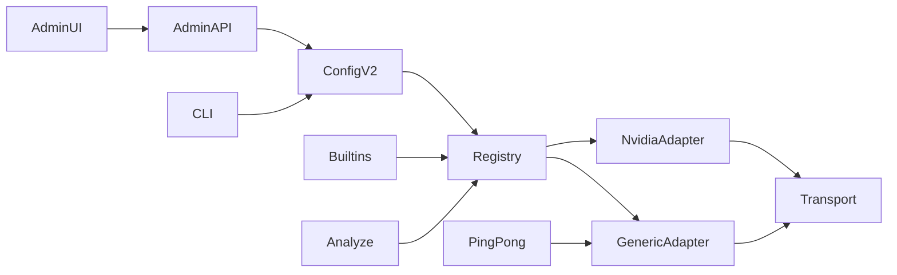

# Declarative OpenAI-Compatible Provider Registry and Vision Probe — Parallel Planning Experiment (English Rendering)

Artifact relationship: **historical/evidence projection** of the external analytic
trace under [RF-19](../../../../../../Projects/framenest/.ap/AP.md) (locally: the
pinned AP at `.ap/`). Not an AP Worker report, not a plan authority, and not a
task grant.

- Source artifact: `01_report_planner.md` (Slovak; produced outside AP by an
  alternate model at the Cooperator's initiative, 2026-09-16, as a comparative
  planning experiment).
- This file: English translation and AP structural normalization prepared by
  the ORCHESTRATOR for trace readability; the source plan's content is
  preserved in meaning, its client-native Cursor/Plan frontmatter
  (`name`/`overview`/`todos`/`isProject`) is summarized rather than copied.
- Original preserved unchanged at `01_report_planner.md`; provenance is not
  destroyed.
- Authority: non-authorizing comparative evidence. The accepted planning
  artifact for this logical whole is `01_report_orchestrator.md` (Worker
  session 01, exchange 01, PASS). Where they differ, see the reconciliation
  annex at the end of this file.
- Consumer: ORCHESTRATOR and COOPERATOR of
  `framenest-admin-openai-compatible-provider-registry-and-vision-probe`.
- Retention: whole lifetime; then frozen historical trace evidence. Cleanup
  owner: COOPERATOR (Meta Git).
- Public-safe by default; contains no secrets, keys, private host values, or
  provider payloads.

> Translator's note: the source plan's header states an intention that its
> Planner session would, after approval, write the English terminal report to
> `01_report.md`. That did not occur and does not occur here; the Cooperator
> renamed the actual session-01 companion to `01_report_orchestrator.md`, and
> this rendering is evidence preparation, not a Worker terminal report.

- Baseline (verified 2026-09-16): FrameNest
  `33946e08447dc92621ed6844b4b5d13a19ec29f1` on
  `feat/x-meme-browser-companion` = `origin/main`; porcelain clean; AP pin
  `7478ddb07d2c3911f79e1aa1441f0115a31c45d8`; `ap doctor` PASS; Alembic head
  `0033` (`down_revision = "0032"`); no migration `0034`.

## 1. Whole verdict

- **Identity stays** `framenest-admin-openai-compatible-provider-registry-and-vision-probe`.
  A tighter kebab would cut off either ping/pong or the admin UX, which is the
  acceptance target.
- **The UI stays inside this whole.** ADR-0079 decision 5 deferred website
  Settings; `SERVER.md` still lists "centralized browser provider Settings" as
  a MacBook MVP non-goal; the Cooperator tests the NUC web shell. The
  companion checkbox is not extended. Gallery/Details are not restyled.
- **Migration `0034` is not needed.** State is a non-secret JSON sidecar
  (`ai/config.json` + `vision-probe-state.json`), the same precedent as
  ADR-0079's `runtime-settings.json`. No SQLite table.

One outcome after publish + NUC refresh: the administrator adds OpenCode Go,
selects the vision model, pings, runs the color pong, then uses the existing
Analyze path.

## 2. Correction ledger (repository wins)

Verified exactly as in the Planner prompt: config v1 in
`configuration.py`; hardcoded `PROVIDER_DEFINITIONS` in `registry.py`;
env-then-systemd credentials; `HttpsJsonTransport` maps 401/403 → auth
rejected; Vercel is already chat-completions + `image_url`; `provider.operate`
is admin-only; five `companion_mutation` routes; website mutations = origin +
`X-FrameNest-Request: 1`; `.secrets/ai.env.fish` is sourced generically.

**Corrections against the prompt / previous draft:**

1. **Loopback admin gating.** `identityAllowsAdminWorkflow()` requires
   `identityState.available`, which is true only for `tailscale_workspace`
   (`app.js` ~316–445). Loopback returns `trusted_loopback` with the full
   admin set (`application.py` ~1396–1416). New helper following the
   `identityAllowsCoverEditing` pattern:
   `isWorkspaceAudience() && identityHasCapability("provider.operate")`.
2. **`validate_provider_id` is currently an enum**
   (`SUPPORTED_PROVIDER_IDS`). The `"unsupported"` test in
   `test_ai_configuration_storage.py` must change to a syntactically invalid
   id. The `"API_KEY" not in raw` assertion must be rewritten (because
   `credential_env` is the name `OPENCODE_API_KEY`).
3. **Static startup resolution** (`application.py` ~617–661, 1627–1642) would
   require a restart after Add/Activate. The plan requires a dynamic resolver
   (ADR-0079 precedent).
4. **Slice 1 must be able to add a record through the CLI**, otherwise it is
   not a "declared record" without UI. The previous draft only widened
   `configure` selection.
5. **Opening the dialog may GET** `/api/admin/ai/providers` (network-free).
   Provider calls are forbidden, not the local fetch. A frontend test must not
   claim "no fetch on dialog open".
6. **OpenCode docs (GET 2026-09-16, no provider call):** Go chat-completions
   `https://opencode.ai/zen/go/v1/chat/completions`, catalog `/models`, model
   `deepseek-v4-flash-vision-exp` is `@ai-sdk/openai-compatible`; a mix of
   `/responses` and `/messages`; DeepSeek Vision Exp: training "Not used",
   ZDR through 2026-09-30; Contributor models train; Go is intended for
   coding-agent traffic (User-Agent, `x-opencode-session`); Zen is a different
   billing surface (`https://opencode.ai/zen/v1/...`). The date "Last updated:
   Sep 14, 2026" was **not observed** in the fetched markdown and is not cited.

## 3. Schema v2 (non-secret)

Owner: `configuration.py` keeps atomic write / 0600 / symlink refusal. A new
`provider_records.py` owns record validation.

On-disk (strict JSON, `sort_keys`, compact separators, trailing newline):

```json
{
  "schema_version": 2,
  "active_provider_id": "opencode-go",
  "provider_models": {"opencode-go": "deepseek-v4-flash-vision-exp"},
  "providers": {
    "opencode-go": {
      "name": "OpenCode Go",
      "protocol": "openai-chat-completions",
      "base_url": "https://opencode.ai/zen/go/v1",
      "credential_env": "OPENCODE_API_KEY",
      "models": {
        "deepseek-v4-flash-vision-exp": {
          "name": "DeepSeek V4 Flash Vision Exp",
          "capabilities": ["vision_input"]
        }
      }
    }
  },
  "updated_at_ms": 0
}
```

Rules:

- Reading v1: in-memory v2 with `providers={}`; `active_provider_id` +
  `provider_models` unchanged; the writer always writes v2. Unsupported
  version / malformed = fail-closed `AiConfigurationError` (as today).
- Built-in ids `nvidia-nim` / `vercel-ai-gateway` inside `providers` =
  malformed (built-ins are code, not file records), but they remain valid in
  `provider_models` / `active_provider_id`.
- Record fields: `name` 1–80, `protocol` exactly `openai-chat-completions`,
  `base_url`, `credential_env`, `models` (at least one). Unknown keys
  rejected.
- Bounds: ≤16 declared providers, ≤64 models, provider id
  `^[a-z0-9][a-z0-9._-]{0,63}$`, model id via existing `validate_model_id`,
  `credential_env` `^[A-Z][A-Z0-9_]{0,63}$`. Forbidden: transport header
  names; builtin env names `NVIDIA_API_KEY` / `AI_GATEWAY_API_KEY`; the
  substrings `apiKey` / `Authorization` / `Bearer ` / `data:`. File ≤64 KiB.
- URL: `https://` only, no userinfo/query/fragment/port/trailing slash; host
  DNS labels, not `localhost` / loopback IP. Request =
  `base_url + "/chat/completions"`. Loopback URL = backlog.
- OpenCode jsonc / `~/.config/opencode/` is never read. The server file is
  snake_case FrameNest JSON (`base_url`, not `baseURL`).

Built-ins in the same registry type: NVIDIA protocol `nvidia-nim` (202
polling stays special); Vercel protocol `openai-chat-completions`, `base_url`
`https://ai-gateway.vercel.sh/v1`.

## 4. Generic adapter

New module `openai_chat_completions.py`: bodies for suggestion / ping / vision
probe; class
`OpenAiChatCompletionsMediaSuggestionProvider(credential, *, base_url,
provider_id, model_id, ...)`.

- 401/403 → `MediaSuggestionProviderAuthError` (403 = credential **or**
  entitlement; copy names it, never "invalid response").
- 429 / 404 / 5xx as today in `vercel_gateway.py` ~187–216.
- One HTTP call, no retry, timeout 120 s, bounded bodies, `User-Agent:
  framenest/0.1`. **No** invented `x-opencode-session`.
- `response_format: json_object` only for suggestions; fail-closed parse;
  per-record override = backlog.
- The Vercel class stays a thin subclass (existing tests stay green). NVIDIA
  stays specialized and gains `probe_vision` in slice 2.
- `still-frame-smoke` behavior unchanged (legacy NVIDIA-only); help/docs mark
  it legacy and point to `vision-probe`.



## 5. Registry and credentials

Precedence unchanged: env override → persisted config → legacy NVIDIA when
`NVIDIA_API_KEY` exists → unconfigured. Declared ids are valid in the
override.

`load_ai_credential(env_name)`: env first, then exact-name
`CREDENTIALS_DIRECTORY`, 4096 B, symlink refusal. A missing key =
`credential_available=false`, the server runs, the hint names the variable
**name**.

A dynamic `DynamicAiProviderResolver` / lazy proxy: Analyze, the capability
GET, and Status read the current config per call (slice 1 wiring in
`application.py` so CLI add works without restart). Movie identification
stays NVIDIA-only.

## 6. Capabilities

Consume `vision_input` from the SPEC §22 set. The operator declares per
model. Analyze and pong refuse a model without `vision_input`
(`409 AI_MODEL_CAPABILITY_MISSING`). Ping may be text-only. Catalog refresh
`GET {baseURL}/models` = backlog; opening the UI never calls a provider.
`/responses` and `/messages` are refused at save with a named error.

## 7. Ping and pong

| Step | Operation | Must not |
|---|---|---|
| Add | atomic v2 write | secret |
| Ping | `test_connection()` | frames |
| Pong | golden PNG + fixed prompt | catalog media, suggestion persist |
| Analyze | existing path | auto-run |

- Fixture: `src/framenest/infrastructure/ai/fixtures/vision-probe-red-8x8.png`
  — 8×8 solid sRGB (255,0,0), plain PNG; `pyproject.toml` include; loaded via
  `importlib.resources`. Outbound JPEG through the existing
  `PillowVlmImageDerivativeEncoder.encode_png_bytes`.
- Prompt: `What color is this? Answer with one word.` Judge (not the prompt)
  accepts `red|crimson|scarlet|vermillion|červená|cervena|#ff0000|ff0000`.
  Statuses: `success|mismatch|authentication_failed|…`. Raw completion is
  never logged.
- Sidecar `vision-probe-state.json`:
  `{schema_version, provider_id, model_id, status, matched, observed_color,
  probed_at_ms}` — `observed_color` is an allowlisted token or null.
- One shared `.provider-probe.lock` for ping+pong; busy → `409
  AI_PROVIDER_BUSY`.
- Pong requires `confirm_cloud_upload` (`409 CLOUD_CONFIRMATION_REQUIRED`).
  Ping does not.
- Confirm copy mentions that Go bills image tokens and that the fixture is a
  synthetic red square made by FrameNest.

## 8. Admin API

New `ai_admin_api.py`. All routes: `channel=tailscale`, `provider.operate`,
`companion_mutation=False`. The public composition does not mount them.

- `GET /api/admin/ai/providers` — network-free list
- `PUT /api/admin/ai/providers/{provider_id}` — upsert declared; audit
  `ai.provider.put`
- `DELETE /api/admin/ai/providers/{provider_id}` — 409 if builtin or active;
  audit `ai.provider.delete`
- `PUT /api/admin/ai/active-selection` — audit `ai.provider.activate`
- `POST /api/admin/ai/ping` — audit `ai.provider.ping`
- `POST /api/admin/ai/pong` — body `{confirm_cloud_upload: true}`; audit
  `ai.provider.pong`

Six new `RoutePolicy` rows; the `test_x_route_policy.py` flagged set stays at
five companion routes.

## 9. Admin UI

New header button (wrench glyph) + `<dialog class="settings-dialog">`. 🧠
Status stays read-only. Companion Settings keeps only automatic-analysis.

Inventory: active summary (credential yes/no, env-override warning), list
(builtin/declared, chips, Ping / Test vision / Use / Edit / Delete), form
(id, name, base URL, credential env, read-only protocol, model rows +
`vision_input` chip), read-only JSON preview from form state, in-dialog pong
confirm (not `window.confirm`), `aria-busy` progress, `role="status"` /
`role="alert"`.

Gating: helper from §2; an ordinary identity never sees the chrome. No
provider call on hover/type; dialog open = list GET only. Gallery/Details are
not restyled.

## 10. CLI (`./framenest ai` → `framenest-ai`)

New (slice 1, no UI):

```text
./framenest ai provider add --provider-id … --name … --protocol openai-chat-completions --base-url … --credential-env … --model-id … --model-name … --capability vision_input --yes
./framenest ai provider list
./framenest ai provider remove --provider-id … --yes
```

`configure` / `status` / `test` accept declared ids. New
`vision-probe [--confirm-cloud-upload]` in slice 2. `still-frame-smoke`
unchanged. Output contains no keys, Authorization, base64, or raw payloads.

## 11. Credentials / deploy (source material only)

- New `deploy/systemd/framenest-ai-credential-opencode-go.conf`: `[Service]` +
  `LoadCredential=OPENCODE_API_KEY:/etc/framenest/credentials/OPENCODE_API_KEY`
- Map entries in `production_ai_deploy.py` `PROVIDER_CREDENTIALS` /
  `PROVIDER_DROPIN_TEMPLATES`
- Docs: `OPENCODE_API_KEY` beside the two existing keys in
  SECURITY/README/AI_WORKSPACE; launcher code unchanged
- **Out of scope:** live `fn-production-env-deploy`, key installation, NUC SSH

## 12. Documents

New **ADR-0081** (0080 exists):
`docs/adr/0081-declarative-openai-compatible-provider-registry-and-administrator-vision-probe.md`.
Narrow supersession notes (closed ADR bodies are not edited): 0020 Revisit
(provider administration), 0023 capabilities (declared only), 0036 third
credential identity, 0044 deferred provider-management UI, 0079 website
Settings for this surface only. Index update.

SPEC §22 key changes: operator boundary = CLI **plus** the `provider.operate`
web surface; ordinary clients still must not; config may contain declarative
records (env name, not a key); NVIDIA/Vercel stay built-in + declared
OpenAI-compatible (first instance OpenCode Go); ping text-only; pong
synthetic fixture + confirm; 403 = entitlement; `https://` only.

Narrow additions: SECURITY.md, SERVER.md (remove the non-goal "centralized
browser provider Settings" for this surface), README route list + CLI,
AI_WORKSPACE.md, UBUNTU_NUC_DEPLOYMENT.md Production AI Credential Helper.

## 13. Tests (canonical AP route / `node --test`)

Unit: `test_provider_records.py`, edits to `test_ai_configuration_storage.py`
(v1→v2, no-secret name-aware), `test_registry.py` (dynamic rewrite),
`test_openai_chat_completions.py` (403), `test_vision_probe.py` (judge +
fixture sha256), CLI tests including `provider add`.

Contract: `test_ai_provider_admin_api.py` (403 matrix, audit-before-mutation,
no secrets, zero provider calls on GET, no-restart dynamism), route inventory
1:1, `test_production_ai_deployment.py` third template,
`test_ai_package_resources.py` (pattern `test_web_package_resources.py`),
public_published regression.

JS: `tests/ai_providers_admin_frontend.test.js` — gating of both audiences,
list GET allowed on open, no POST on typing, `framenestMutationHeaders`, pong
confirm, no secret in preview.

## 14. Slices (one Implementation Worker grant per slice)

1. **Schema v2 + records + registry + generic adapter + CLI provider
   add/list/remove + dynamic resolver wiring + systemd template** (no UI, no
   pong).
2. **Color pong:** fixture, judge, sidecar, CLI `vision-probe`, NVIDIA
   `probe_vision`, pyproject include.
3. **Admin API + RoutePolicy + audit.**
4. **Website admin surface** (`index.html` / `app.js` / `styles.css` + JS
   test).
5. **Docs + ADR-0081.**

Then: independent acceptance → publication grant → `framenest-release
status/check/deploy` → Michal's UX test. Session 02: Fresh Implementation
Worker, `Native planning mode: not-used`.

## 15. Acceptance (abridged)

**Local (loopback, no mandatory key):** Status 🧠 without regression; wrench
visible; add OpenCode Go; JSON preview without a key; without a credential,
Ping/Pong disabled with an `OPENCODE_API_KEY` hint.

**NUC only after publish + `framenest-release`:** installing
`OPENCODE_API_KEY` is a **separate grant**. Admin: add → activate without
restart → ping → pong with confirm → Analyze through the existing path.
Ordinary identity: hidden + 403. Never ask for acceptance of unpublished code.

## 16. Risks and defaults

- **R-1 billing/terms (Cooperator):** Go monitors coding-agent traffic.
  Default: `User-Agent: framenest/0.1`, no fake session identity.
- **R-2 model:** default `deepseek-v4-flash-vision-exp`; the record is
  editable.
- **R-3 privacy:** default never pin Contributor/free-training models.
- **R-4:** one sanitized 403 text (key or entitlement).
- **Backlog:** catalog refresh, Zen record, loopback URL, `/messages` +
  `/responses`, per-record `response_format`.
- **Future wholes:** inline picker / persistent drafts (ADR-0023), Cover
  Studio.

No blocker. Key in the browser, Django, spawning `opencode`, reading OpenCode
jsonc as FrameNest config = stop-and-escalate (not proposed in the plan).

## 17. Budget

One planning cycle. No implementation. After approval: write `01_report.md`,
verify byte identity, stop. No Git.

---

## Orchestrator reconciliation annex (Orchestrator authorship; not part of the source plan)

The accepted plan (`01_report_orchestrator.md`) and this experiment agree on
the architecture: schema v2 declarative records, one registry world for
built-ins and declared providers, a parameterized generic chat-completions
adapter, `vision_input` capability gating, a committed golden red PNG
fixture, a bounded judge, a sanitized sidecar, six audited
`provider.operate` admin routes, a website administrator surface with a
read-only JSON preview, ADR-0081, and the same five-slice order.

Differences and their disposition in the Orchestrator's binding synthesis:

| Topic | Accepted plan | Experiment | Disposition |
|---|---|---|---|
| CLI record management | `configure` lists declared providers; new `vision-probe` | explicit `provider add/list/remove` in slice 1 | Experiment adopted: a declared record must be creatable by the operator before any UI exists |
| Ping/pong locking | `.test.lock` (ping/test) + `.vision-probe.lock` (pong), busy → `409 AI_PROVIDER_BUSY` | one shared `.provider-probe.lock` | Accepted plan's per-operation locks adopted, via one shared helper; UI-level mutual exclusion lands in slice 4 |
| Dynamic no-restart resolution | slice 3 (`application.py`, capability reads) | slice 1 wiring | Accepted plan's slicing adopted; slice 1 keeps startup resolution only |
| Detail depth | exact SPEC sentence rewrites, route tables, error codes, test inventory, judge rules | comparable but leaner in places | Accepted plan is the binding detail owner; experiment used as cross-check |

Two experiment findings were already reflected in the implemented slices:
the loopback admin-gating correction (dedicated capability-based helper) and
the `validate_provider_id` enum→bounded-identifier change with the rewrite of
the stale `"API_KEY"` no-secret assertion.

Delivery note: the experiment's stated intention to write a terminal report
to `01_report.md` was not executed by any AP-dispatched session and is not
executed here. The canonical exchange-01 companion is
`01_report_orchestrator.md` (Cooperator rename; bytes and SHA-256 verified by
the Orchestrator); a foreign plan at a report filename would fail the
Companion Integrity Invariant and must not be committed as a report.
