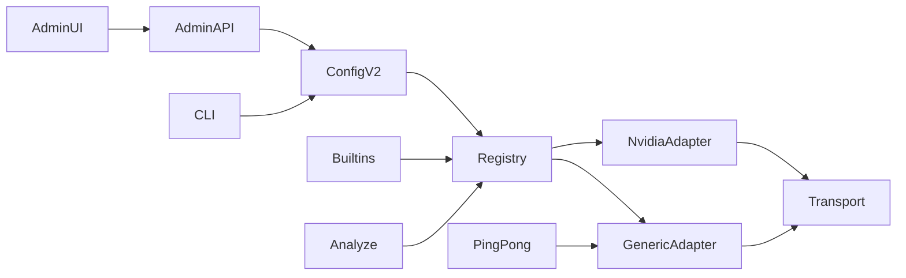

# Plán: deklaratívny OpenAI-compatible provider registry a vision probe

Toto je schvaľovací plán pre Orchestrátora/Kooperátora. Po potvrdení Planner zapíše anglický terminálny report do [`01_report.md`](/home/agile/meta/projects/framenest/12/00-framenest-admin-openai-compatible-provider-ux/01_report.md) (tá cesta je teraz prázdna; predchádzajúci draft je historická evidencia v `01_report_orchestrator.md`). Implementácia v tejto relácii je zakázaná.

**Baseline (overené 2026-09-16):** FrameNest `33946e08447dc92621ed6844b4b5d13a19ec29f1` na `feat/x-meme-browser-companion` = `origin/main`; porcelain čistý; AP pin `7478ddb07d2c3911f79e1aa1441f0115a31c45d8`; `ap doctor` PASS; Alembic head `0033` (`down_revision = "0032"`); žiadna migrácia `0034`.

## 1. Verdikt celku

- **Identita ostáva** `framenest-admin-openai-compatible-provider-registry-and-vision-probe`. Tesnejší kebab by odrezal ping/pong alebo admin UX, čo je akceptačný cieľ.
- **UI ostáva v tomto celku.** ADR-0079 decision 5 odložil website Settings; [SERVER.md](SERVER.md) stále uvádza „centralized browser provider Settings“ ako MacBook MVP non-goal; Kooperátor testuje NUC web shell. Companion checkbox sa nenaťahuje. Gallery/Details sa nementia.
- **Migrácia 0034 nie je potrebná.** Stav je non-secret JSON sidecar (`ai/config.json` + `vision-probe-state.json`), rovnaký precedens ako ADR-0079 `runtime-settings.json`. Žiadna SQLite tabuľka.

Jeden výsledok po publish + NUC refresh: administrátor pridá OpenCode Go, vyberie vision model, ping, color pong, potom existujúci Analyze.

## 2. Korekčný ledger (repository wins)

Overené presne ako v Planner prompte: config v1 v [`configuration.py`](src/framenest/infrastructure/ai/configuration.py); hardcoded `PROVIDER_DEFINITIONS` v [`registry.py`](src/framenest/infrastructure/ai/registry.py); env-then-systemd credentials; `HttpsJsonTransport` mapuje 401/403 → auth rejected; Vercel je už chat-completions + `image_url`; `provider.operate` je admin-only; päť `companion_mutation` routes; website mutácie = origin + `X-FrameNest-Request: 1`; `.secrets/ai.env.fish` sa sourcuje genericky.

**Korekcie voči promptu / predchádzajúcemu draftu:**

1. **Loopback admin gating.** `identityAllowsAdminWorkflow()` vyžaduje `identityState.available`, ktoré je true len pre `tailscale_workspace` ([`app.js`](src/framenest/adapters/api/web/app.js) ~316–445). Loopback vracia `trusted_loopback` s plným admin setom ([`application.py`](src/framenest/adapters/api/application.py) ~1396–1416). Nový helper podľa vzoru `identityAllowsCoverEditing`: `isWorkspaceAudience() && identityHasCapability("provider.operate")`.
2. **`validate_provider_id` je dnes enum** (`SUPPORTED_PROVIDER_IDS`). Test `"unsupported"` v [`test_ai_configuration_storage.py`](tests/unit/infrastructure/ai/test_ai_configuration_storage.py) sa musí zmeniť na syntakticky neplatné id. Assertion `"API_KEY" not in raw` sa musí prepísať (lebo `credential_env` je názov `OPENCODE_API_KEY`).
3. **Statická resolúcia pri štarte** (`application.py` ~617–661, 1627–1642) by vyžadovala restart po Add/Activate. Plán vyžaduje dynamický resolver (precedens ADR-0079).
4. **Slice 1 musí vedieť záznam pridať cez CLI**, inak nie je „declared record“ bez UI. Predošlý draft rozširoval len `configure` výber.
5. **Otvorenie dialógu smie GET-núť** `/api/admin/ai/providers` (network-free). Zakázaný je provider call, nie lokálny fetch. Frontend test nesmie tvrdiť „no fetch on dialog open“.
6. **OpenCode docs (GET 2026-09-16, bez provider call):** Go chat-completions `https://opencode.ai/zen/go/v1/chat/completions`, catalog `/models`, model `deepseek-v4-flash-vision-exp` je `@ai-sdk/openai-compatible`; mix `/responses` a `/messages`; DeepSeek Vision Exp: training „Not used“, ZDR do 2026-09-30; Contributor modely trénujú; Go je určený pre coding-agent traffic (User-Agent, `x-opencode-session`); Zen je iný billing (`https://opencode.ai/zen/v1/...`). Dátum „Last updated: Sep 14, 2026“ som v fetchnutom markdown **nepozoroval** — necitujem ho.

## 3. Schema v2 (non-secret)

Owner: [`configuration.py`](src/framenest/infrastructure/ai/configuration.py) ostáva atomic write / 0600 / symlink refusal. Nový [`provider_records.py`](src/framenest/infrastructure/ai/provider_records.py) vlastní validáciu záznamov.

On-disk (strict JSON, `sort_keys`, compact separators, trailing newline):

```json
{
  "schema_version": 2,
  "active_provider_id": "opencode-go",
  "provider_models": {"opencode-go": "deepseek-v4-flash-vision-exp"},
  "providers": {
    "opencode-go": {
      "name": "OpenCode Go",
      "protocol": "openai-chat-completions",
      "base_url": "https://opencode.ai/zen/go/v1",
      "credential_env": "OPENCODE_API_KEY",
      "models": {
        "deepseek-v4-flash-vision-exp": {
          "name": "DeepSeek V4 Flash Vision Exp",
          "capabilities": ["vision_input"]
        }
      }
    }
  },
  "updated_at_ms": 0
}
```

Pravidlá:

- Čítanie v1: in-memory v2 s `providers={}`; `active_provider_id` + `provider_models` bez zmeny; writer vždy píše v2. Nepodporená verzia / malform = fail-closed `AiConfigurationError` (ako dnes).
- Built-in id `nvidia-nim` / `vercel-ai-gateway` v `providers` = malformed (built-iny sú kód, nie file records), ale v `provider_models` / `active_provider_id` ostávajú platné.
- Polia záznamu: `name` 1–80, `protocol` presne `openai-chat-completions`, `base_url`, `credential_env`, `models` (aspoň jeden). Neznáme kľúče zamietnuté.
- Bounds: ≤16 declared providers, ≤64 models, provider id `^[a-z0-9][a-z0-9._-]{0,63}$`, model id existujúci `validate_model_id`, `credential_env` `^[A-Z][A-Z0-9_]{0,63}$`. Zakázané: transport header names; **builtin env names** `NVIDIA_API_KEY` / `AI_GATEWAY_API_KEY`; substringy `apiKey` / `Authorization` / `Bearer ` / `data:`. Súbor ≤64 KiB.
- URL: len `https://`, žiadne userinfo/query/fragment/port/trailing slash; host DNS labels, nie `localhost` / loopback IP. Request = `base_url + "/chat/completions"`. Loopback URL = backlog.
- OpenCode jsonc / `~/.config/opencode/` sa nikdy nečíta. Server file je snake_case FrameNest JSON (`base_url`, nie `baseURL`).

Built-iny v tom istom registry type: NVIDIA protocol `nvidia-nim` (202 polling ostáva špecialita); Vercel protocol `openai-chat-completions`, `base_url` `https://ai-gateway.vercel.sh/v1`.

## 4. Generický adapter

Nový modul [`openai_chat_completions.py`](src/framenest/infrastructure/ai/openai_chat_completions.py): bodies pre suggestion / ping / vision probe; class `OpenAiChatCompletionsMediaSuggestionProvider(credential, *, base_url, provider_id, model_id, ...)`.

- 401/403 → `MediaSuggestionProviderAuthError` (403 = credential **alebo** entitlement; copy to pomenuje, nikdy „invalid response“).
- 429 / 404 / 5xx ako dnes vo [`vercel_gateway.py`](src/framenest/infrastructure/ai/vercel_gateway.py) ~187–216.
- Jeden HTTP call, žiadne retry, timeout 120 s, bounded bodies, `User-Agent: framenest/0.1`. **Žiadny** vymyslený `x-opencode-session`.
- `response_format: json_object` len pre suggestion; fail-closed parse; per-record override = backlog.
- Vercel class ostáva tenký subclass (existujúce testy zelené). NVIDIA ostáva špecializovaný + v slice 2 dostane `probe_vision`.
- `still-frame-smoke` správanie nezmenené (legacy NVIDIA-only); help/docs označia legacy a odkážu na `vision-probe`.



## 5. Registry a credentials

Precedencia nezmenená: env override → persisted config → legacy NVIDIA ak existuje `NVIDIA_API_KEY` → unconfigured. Declared id sú platné v override.

`load_ai_credential(env_name)`: env first, potom exact-name `CREDENTIALS_DIRECTORY`, 4096 B, symlink refusal. Chýbajúci kľúč = `credential_available=false`, server beží, hint pomenuje **názov** premennej.

Dynamický `DynamicAiProviderResolver` / lazy proxy: Analyze, capability GET a Status čítajú aktuálny config per call (slice 1 wiring v `application.py`, aby CLI add platil bez restartu). Movie identification ostáva NVIDIA-only.

## 6. Capabilities

Konzumujeme `vision_input` z SPEC §22 množiny. Operator deklaruje per model. Analyze a pong odmietnu model bez `vision_input` (`409 AI_MODEL_CAPABILITY_MISSING`). Ping smie text-only. Catalog refresh `GET {baseURL}/models` = backlog; otvorenie UI nikdy nevolá providera. `/responses` a `/messages` sa pri save odmietnu pomenovanou chybou.

## 7. Ping a pong

| Krok | Operácia | Nesmie |
|---|---|---|
| Add | atomic v2 write | secret |
| Ping | `test_connection()` | framy |
| Pong | golden PNG + fixný prompt | catalog media, suggestion persist |
| Analyze | existujúca cesta | auto-run |

- Fixture: [`src/framenest/infrastructure/ai/fixtures/vision-probe-red-8x8.png`](src/framenest/infrastructure/ai/fixtures/vision-probe-red-8x8.png) — 8×8 solid sRGB (255,0,0), plain PNG; `pyproject.toml` include; load cez `importlib.resources`. Outbound JPEG cez existujúci `PillowVlmImageDerivativeEncoder.encode_png_bytes`.
- Prompt: `What color is this? Answer with one word.` Judge (nie prompt) akceptuje `red|crimson|scarlet|vermillion|červená|cervena|#ff0000|ff0000`. Statusy: `success|mismatch|authentication_failed|…`. Raw completion sa neloguje.
- Sidecar `vision-probe-state.json`: `{schema_version, provider_id, model_id, status, matched, observed_color, probed_at_ms}` — `observed_color` len allowlisted token alebo null.
- Jeden zdieľaný `.provider-probe.lock` pre ping+pong; busy → `409 AI_PROVIDER_BUSY`.
- Pong vyžaduje `confirm_cloud_upload` (`409 CLOUD_CONFIRMATION_REQUIRED`). Ping nie.
- Confirm copy spomenie, že Go účtuje image tokeny a že fixture je syntetický červený štvorec FrameNestu.

## 8. Admin API

Nový [`ai_admin_api.py`](src/framenest/adapters/api/ai_admin_api.py). Všetky: `channel=tailscale`, `provider.operate`, `companion_mutation=False`. Public composition ich nemountuje.

- `GET /api/admin/ai/providers` — network-free list
- `PUT /api/admin/ai/providers/{provider_id}` — upsert declared; audit `ai.provider.put`
- `DELETE /api/admin/ai/providers/{provider_id}` — 409 ak builtin alebo active; audit `ai.provider.delete`
- `PUT /api/admin/ai/active-selection` — audit `ai.provider.activate`
- `POST /api/admin/ai/ping` — audit `ai.provider.ping`
- `POST /api/admin/ai/pong` — body `{confirm_cloud_upload: true}`; audit `ai.provider.pong`

Šesť nových `RoutePolicy` riadkov; `test_x_route_policy.py` flagged set ostáva päť companion routes.

## 9. Admin UI

Nový header button (wrench glyph) + `<dialog class="settings-dialog">`. 🧠 Status ostáva read-only. Companion Settings ostáva len automatic-analysis.

Inventár: active summary (credential yes/no, env-override warning), zoznam (builtin/declared, chips, Ping / Test vision / Use / Edit / Delete), formulár (id, name, base URL, credential env, protocol read-only, model rows + `vision_input` chip), read-only JSON preview zo stavu formulára, in-dialog pong confirm (nie `window.confirm`), `aria-busy` progress, `role="status"` / `role="alert"`.

Gating: helper z §2; obyčajná identita nevidí chrome. Žiadny provider call na hover/type; dialog open = len list GET. Gallery/Details sa nementia.

## 10. CLI (`./framenest ai` → `framenest-ai`)

Nové (slice 1, bez UI):

```text
./framenest ai provider add --provider-id … --name … --protocol openai-chat-completions --base-url … --credential-env … --model-id … --model-name … --capability vision_input --yes
./framenest ai provider list
./framenest ai provider remove --provider-id … --yes
```

`configure` / `status` / `test` prijímajú declared id. Nové `vision-probe [--confirm-cloud-upload]` v slice 2. `still-frame-smoke` nezmenené. Výstup bez kľúčov, Authorization, base64, raw payloadov.

## 11. Credentials / deploy (len source material)

- Nový [`deploy/systemd/framenest-ai-credential-opencode-go.conf`](deploy/systemd/framenest-ai-credential-opencode-go.conf): `[Service]` + `LoadCredential=OPENCODE_API_KEY:/etc/framenest/credentials/OPENCODE_API_KEY`
- Mapové položky v [`production_ai_deploy.py`](deploy/ubuntu/production_ai_deploy.py) `PROVIDER_CREDENTIALS` / `PROVIDER_DROPIN_TEMPLATES`
- Docs: `OPENCODE_API_KEY` vedľa dvoch existujúcich v SECURITY/README/AI_WORKSPACE; launcher kód sa nemení
- **Mimo rozsahu:** live `fn-production-env-deploy`, inštalácia kľúča, NUC SSH

## 12. Dokumenty

Nové **ADR-0081** (0080 existuje): `docs/adr/0081-declarative-openai-compatible-provider-registry-and-administrator-vision-probe.md`. Úzke supersession notes (telo closed ADR sa needituje): 0020 Revisit (provider administration), 0023 capabilities (declared only), 0036 tretí credential identity, 0044 deferred provider-management UI, 0079 website Settings len pre tento surface. Index update.

SPEC §22 kľúčové zmeny: operator boundary = CLI **plus** `provider.operate` web surface; ordinary klienti stále nesmú; config smie obsahovať deklaratívne záznamy (názov env, nie kľúč); NVIDIA/Vercel ostávajú built-in + declared OpenAI-compatible (prvá inštancia OpenCode Go); ping text-only; pong syntetický fixture + confirm; 403 = entitlement; `https://` only.

Úzke dodatky: SECURITY.md, SERVER.md (odstrániť non-goal „centralized browser provider Settings“ pre tento surface), README route list + CLI, AI_WORKSPACE.md, UBUNTU_NUC_DEPLOYMENT.md Production AI Credential Helper.

## 13. Testy (kanonická AP cesta / `node --test`)

Unit: `test_provider_records.py`, úpravy `test_ai_configuration_storage.py` (v1→v2, no-secret name-aware), `test_registry.py` (dynamic rewrite), `test_openai_chat_completions.py` (403), `test_vision_probe.py` (judge + fixture sha256), CLI testy vrátane `provider add`.

Contract: `test_ai_provider_admin_api.py` (403 matrix, audit-before-mutation, no secrets, zero provider calls on GET, dynamika bez restartu), route inventory 1:1, `test_production_ai_deployment.py` tretí template, `test_ai_package_resources.py` (vzor [`test_web_package_resources.py`](tests/contract/test_web_package_resources.py)), public_published regression.

JS: `tests/ai_providers_admin_frontend.test.js` — gating oboch audience, list GET allowed on open, žiadny POST na type, `framenestMutationHeaders`, pong confirm, žiadny secret v preview.

## 14. Slice-y (jedna Implementation Worker grant na slice)

1. **Schema v2 + records + registry + generic adapter + CLI provider add/list/remove + dynamic resolver wiring + systemd template** (žiadne UI, žiadny pong).
2. **Color pong:** fixture, judge, sidecar, CLI `vision-probe`, NVIDIA `probe_vision`, pyproject include.
3. **Admin API + RoutePolicy + audit.**
4. **Website admin surface** (`index.html` / `app.js` / `styles.css` + JS test).
5. **Docs + ADR-0081.**

Potom: independent acceptance → publication grant → `framenest-release status/check/deploy` → Michalov UX test. Session 02: Fresh Implementation Worker, `Native planning mode: not-used`.

## 15. Akceptácia (skrátene)

**Lokálne (loopback, bez povinného kľúča):** Status 🧠 bez regresu; wrench viditeľný; add OpenCode Go; JSON preview bez kľúča; bez credentialu Ping/Pong disabled s hintom `OPENCODE_API_KEY`.

**NUC až po publish + `framenest-release`:** inštalácia `OPENCODE_API_KEY` je **samostatný grant**. Admin: add → activate bez restartu → ping → pong s confirm → Analyze existujúcou cestou. Ordinary identita: hidden + 403. Nikdy nežiadať akceptáciu nepublikovaného kódu.

## 16. Riziká a defaulty

- **R-1 billing/terms (Kooperátor):** Go monitoruje coding-agent traffic. Default: `User-Agent: framenest/0.1`, žiadna falošná session identita.
- **R-2 model:** default `deepseek-v4-flash-vision-exp`; záznam je editovateľný.
- **R-3 privacy:** default nikdy nepinovať Contributor/free-training modely.
- **R-4:** jeden sanitized 403 text (kľúč alebo entitlement).
- **Backlog:** catalog refresh, Zen record, loopback URL, `/messages`+`/responses`, per-record `response_format`.
- **Future wholes:** inline picker / persistent drafts (ADR-0023), Cover Studio.

Žiadny blocker. Kľúč v prehliadači, Django, spawn `opencode`, čítanie OpenCode jsonc ako FrameNest config = stop-and-escalate (v pláne sa nenavrhujú).

## 17. Budget

Jeden planning cyklus. Žiadna implementácia. Po schválení: zapísať `01_report.md`, overiť byte identity, zastaviť. Git nikde.
