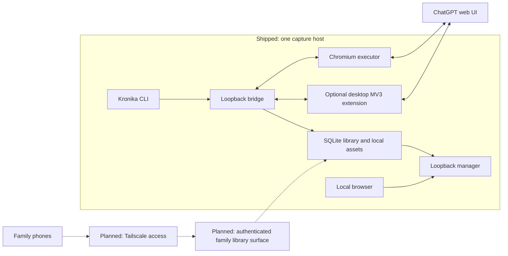

### Report for ORCHESTRATOR_CHAT

# Kronika public identity and clean-start implementation plan

```text
Logical whole identity: kronika-public-identity-and-clean-start
Worker session ordinal: 01
Worker exchange ordinal: 02
Persistent role identity: WORKER
Worker session target: current-worker-session
Worker session profile: Planner
Native planning mode: required
Phase: planning
status: PASS
Phase-qualified result: not-applicable
Result artifact or commit: not-applicable
Logical-whole closure: not-closed
Evidence tier: E0
Report justification: new-evidence
Start commit: 2727451d2502925377637e19fa435917c970a996
End commit: 2727451d2502925377637e19fa435917c970a996
Delivery: one Markdown artifact in this session; no file persistence
```

This continues the initial planning cycle under the Cooperator’s explicit renewal. The latest instruction replaces the file-delivery requirement; the preceding PARTIAL report remains historical evidence. No implementation authority is granted by this plan.

### Binding Cooperator amendment (2026-09-22)

This amendment is current repository truth. Where it conflicts with a later
section that still describes the pre-boot checkout, **this block wins**.

```text
Lab checkout: /home/agile/Tools/cli_chatgpt
lab/cli-chatgpt-190      = 2727451d2502925377637e19fa435917c970a996
main                     = 2727451d2502925377637e19fa435917c970a996
work/kronika-clean-start = 3c345cbd659ccb5817bb11cbc89d037798553ca8
AP pin                   = 7478ddb07d2c3911f79e1aa1441f0115a31c45d8
Remotes                  = none
Boot commit subject      = docs(kronika): boot repository identity, license, and ignore rules
```

Already done; do **not** repeat:

- creating `lab/cli-chatgpt-190` or `work/kronika-clean-start`
- adding `LICENSE` (MIT, Copyright (c) 2026 Michal Cisárik)
- adding the public-safe `.gitignore` (venv, sqlite, profiles, logs, token,
  `/docs/environment.md`)
- renaming the AGENTS product block to Kronika, activating the private Meta
  trace, recording the wizard exception, and marking recovery-provider as
  not shipped

S1 still must change the declared AGENTS CLI/bridge route from `chatgpt_cli`
to `kronika` after the package rename. Do not regress LICENSE, `.gitignore`,
or the rest of the Kronika AGENTS rules.

S1 baseline is the boot commit, not the lab tip. Gate 1 in §4 is
verification-only.

## 1. Summary, verified state, and decisions

Kronika will become the public identity of the existing household research library. Rename the Python package, CLI, and default state directory; remove unimplemented recovery scaffolding and the parked Obscura integration; replace experimental documentation with a short, accurate public documentation set.

Preserve working Chromium capture, the optional desktop extension, SQLite storage, Private and shared collections, local accounts, authoring, `library check`, sanitization, and loopback boundaries.

Perform implementation on a local preparation branch. Preserve the original 190-commit lab tip separately. Construct public `main` from the accepted cleaned tree using a parentless commit, then require independent acceptance before separately authorized remote configuration and publication.

### Verified-state table

| Class | Verified evidence or accepted boundary |
|---|---|
| Direct repository evidence | Physical root `/home/agile/Tools/cli_chatgpt`; standalone canonical checkout; Git directory `.git`; one worktree. |
| Direct repository evidence | At planning time: `main` at `2727451d2502925377637e19fa435917c970a996`, 190 reachable commits, clean, no remotes. |
| Direct repository evidence | Repository is not shallow; no replacement refs were listed. |
| Direct AP evidence | Gitlink and submodule HEAD both `7478ddb07d2c3911f79e1aa1441f0115a31c45d8`; submodule clean; expected AP origin confirmed. |
| Direct public Git evidence | Unauthenticated `git ls-remote https://github.com/cisarik/kronika.git` exited 0 with empty ref output, including the renewed check. |
| Direct public Git evidence | Public AP `refs/heads/main` equals the pinned commit at inspection time. |
| Direct source evidence | 31 Python package files; 37 test modules; 33 test modules contain the old Python package name. Static search found 1,190 `test_` method declarations. These are inventory counts, not test results. |
| Direct environment metadata | `.venv`, its Python symlink, `/usr/bin/node`, and `/usr/bin/chromium` exist. Versions and runtime usability were not tested. |
| Direct privacy evidence | `docs/environment.md` was inspected only through path/Git metadata. Filename-only scans also identified a local host path in `docs/human-steps.md`. Neither value is reproduced here. |
| Direct documentation evidence | Environment-document references occur in `README.md`, `docs/adapter-pack.md`, and `docs/ROADMAP.md`. |
| Direct Meta evidence | The prepared initial prompt matched the supplied attachment. The preceding report now exists as untracked owner-managed Meta state. Neither Meta artifact was changed. |
| Accepted Cooperator decision | Retain the existing login wizard with its narrow, explicit credential-transit exception. This grants agents no access to real credentials. |
| Direct repository evidence (boot amendment) | After planning: `lab/cli-chatgpt-190` and `main` remain `2727451d2502925377637e19fa435917c970a996`. Implementation branch `work/kronika-clean-start` is at boot commit `3c345cbd659ccb5817bb11cbc89d037798553ca8` (`LICENSE`, `.gitignore`, Kronika AGENTS identity). No remotes. |
| Inference | Package and state renaming are bounded because paths and imports are centralized, there is no production migration obligation, and existing tests cover the affected behavior. |
| Unknown | Current suite outcome, live ChatGPT behavior, actual test duration, and public package-index name availability. No package-index publication is planned. |

### Decision table

| Decision | Selected recommendation and evidence | Cost/test bound | Rejected alternative; invalidation condition |
|---|---|---|---|
| Public identity | **Kronika**, throughout current user-facing surfaces. | Existing CLI, rendering, extension, and contract checks. | Partial branding would leave contradictory instructions. Stop if an unexpected external integration requires an old user-facing name. |
| CLI | **`kronika`**; console entry `kronika = "kronika.cli:main"`; wrapper `scripts/kronika`. | Existing subprocess version test, help tests, wrapper smoke checks. | No `chatgpt-cli` executable alias. Reconsider only with evidence of a supported external consumer. |
| Python package | **Rename `src/chatgpt_cli` to `src/kronika`.** | Move 31 files, update imports and patch targets in the 33 affected test modules, plus named script/comment references. One executable slice; baseline and post-change full-suite evidence. | Retaining the internal package is unnecessary on current evidence. If bounded corrections cannot keep the declared suite green, stop for a revised grant; do not silently introduce a compatibility package. |
| XDG state | **Clean break to `kronika`** in Python and both Node state resolvers. | Extend state-path, setup, permission, and cross-language checks. No database-schema migration. | No migrator, automatic copy, symlink, fallback to old state, or old-state deletion. Contrary evidence of a production installation would invalidate this choice. |
| Working directory | Keep the current directory. Fresh public clones may naturally use `kronika`. | No filesystem relocation. | Folder renaming adds no required product outcome. |
| License | **MIT** for project-owned Kronika files, with `Copyright (c) 2026 Michal Cisárik`. | Review notices and license scope; no dependency change. | Another license requires a Cooperator decision. Material conflicting third-party provenance would stop licensing of the affected material. |
| Public documentation | Root README, LICENSE, SECURITY, CONTRIBUTING; one current architecture document; focused usage/headless/technical references. | Semantic review, links, command checks, filename-only privacy scans. | Do not retain roadmap/security experiment ledgers as active public documentation. |
| Compatibility identifiers | Preserve `chatgpt_cli_session`, `chatgpt-cli-bridge`, `chatgpt-cli-library-manager`, existing contract URNs, `globalThis.ChatGPTCLI`, the extension ID/public key, its internal heartbeat identifier, and dummy scrypt salt `chatgpt-cli-dummy`. Keep the `cw` omnibox shortcut. | Existing protocol, session, and extension tests remain applicable. | These are internal compatibility identifiers, not executable aliases. Renaming them would unnecessarily touch authentication or injection seams. |
| Login wizard | Preserve its implemented behavior and document the newly reaffirmed narrow exception. Prefer direct manual Chromium login in the main setup instructions. | Existing login-server and driver tests with synthetic inputs; independent security review before publication. | Removing the wizard was explicitly rejected in this planning exchange. |

The test-cost estimate is structural, not a runtime promise. The rename requires no new dependency, packaging framework, database migration, or browser automation design. Setup already runs the suite; do not immediately repeat an unchanged baseline suite.

## 2. Implementation changes and public-content contract

### Impact map

All source paths below refer to the current baseline; subsequent slices use their renamed `src/kronika` counterparts.

| Area | Current paths and relevant locations | Planned effect |
|---|---|---|
| Package and entrypoints | `pyproject.toml:1`, `src/chatgpt_cli/__main__.py`, `scripts/chatgpt-cli`, `scripts/dev-setup.sh:27` | Rename package/distribution/entrypoint/wrapper; rename the generated `.pth` filename. Preserve source-based development setup. |
| CLI identity and behavior | `src/chatgpt_cli/cli.py:96`, `:324`, `:986`, `:1083` | Kronika descriptions, examples, help, version and setup guidance; remove five stub commands and the Obscura-only verifier. |
| State paths | `src/chatgpt_cli/config.py:1`, `paths.py:7`, `extension/src/headless/bridge_client.mjs:33`, `probe.mjs:174` | Default application directory becomes `kronika`; preserve existing XDG interpretation and explicit runner `--state-dir`. |
| Rendered identity | `src/chatgpt_cli/library/manager_render.py`, `library/manager_server.py`, `bridge/render.py`, `bridge/server.py` | Update product titles, explanatory text, logger names and server banners; preserve escaping, route logic and wire API identity. |
| Extension identity | `extension/manifest.json`, `src/options/options.html`, `src/sw.js`, `src/headless/login_app/index.html` | Display name, description, options/login titles and log prefix. Preserve key, permissions, origin scope and internal scheduling identity. |
| Stub scaffolding | `cli.py:86`; `bridge/server.py:439`, `:649`; `bridge/store.py:59`; `extension/src/engine/dom_engine.js:713` | Remove unsupported command handlers, two 501-only diagnostic routes, unused diagnostics-directory creation and unused `collectDiagnostics`. |
| Stub contracts | `contracts/diagnostics-bundle.v1.schema.json`, `recovery-response.v1.schema.json`, `recovery-targets.v1.json`; HTTP and extension protocol contracts | Retire unused schemas and remove their unimplemented endpoint/message declarations. |
| Implemented diagnostics/recovery | `bridge/server.py:875`; headless job/driver modules; library migration and flush modules | Retain startup diagnostics, operational error reporting, retries, idempotent author recovery, migrations, backups and flush behavior. |
| Obscura | `tools/obscura-patches/README.md`; `driver.mjs:984`; `probe.mjs`; `cdp_client.mjs`; CLI verifier and config constants | Remove Obscura-specific integration and documentation; preserve Chromium and shared CDP behavior. |
| Rename tests | `tests/unit/test_cli.py`, `test_bridge_store.py`, `test_bridge_results.py`, `test_library_accounts.py`; import-bearing test modules | Update imports, mock targets, command output and state expectations; add meaningful state-isolation checks. |
| Stub tests | `tests/unit/test_cli.py:109`, `test_bridge_jobs.py:824`, `tests/contract/test_schemas.py` | Replace stub-success-shape expectations with removal checks; retain unrelated upload-unavailable coverage. |
| Obscura tests | `tests/contract/test_extension_syntax.py:877`, `:948`, `:1192`, `:1440`, `:1508` | Retarget shared-behavior fake drivers to Chromium; remove only Obscura-specific expectations. |
| Documentation/governance | README, root AGENTS, `docs/architecture.md`, `docs/ROADMAP.md`, `docs/security.md`, usage/headless/reference documents | Establish current semantic owners, remove private material and obsolete claims, activate private Meta trace outside the managed AP block. |

### Public interfaces

The shipped public command identity becomes:

```text
python -m kronika <args>
python -m kronika bridge
./scripts/kronika <args>
```

The declared development/test environment remains:

```bash
bash scripts/dev-setup.sh
source .venv/bin/activate
python -m unittest discover -s tests -t .
```

`python` must resolve to the prepared `.venv/bin/python`. Focused test selection uses that same interpreter and environment.

Additional interface decisions:

- `--version` prints `kronika 0.1.0`.
- Remove `doctor`, `diagnostics`, `recover`, `apply-recovery`, `rollback`, and the Obscura-only `headless verify` command group.
- Removed CLI commands return the normal usage error without initializing state.
- Authenticated POST requests to the removed diagnostics/self-test endpoints return the existing unknown-route response. Authentication checks remain in force.
- Preserve supported job envelopes, capabilities, error codes, protocol version 1, adapter pack version 5, manager contract v6 and library schema v7.
- Prune declarations for operations that never worked; do not renumber functioning interfaces. Discovery of an actual consumer of those unsupported declarations is a stop condition.
- Preserve argv/stdin prompt input, text stdout, stderr progress, textual `--json` output and the absence of an answer-output-file option.
- File-upload flags remain explicitly unavailable. No upload implementation or broader upload-contract cleanup is included.

### README contract

Keep README readable in roughly ninety seconds before the detailed setup portion. Use this order:

1. **What Kronika is:** a durable household library of web searches and deep research worth reopening.
2. **What it is not:** ChatGPT history, group chat, notification inbox, or a replacement for family communication.
3. **Architecture:** clearly distinguish shipped local behavior from planned family access.
4. **Status:** early, experimental, household-scale; family access over Tailscale is not shipped.
5. **Requirements and quick start:** describe the source-checkout workflow that exists.
6. **Security invariants:** concise, linked to SECURITY.
7. **Unofficial/account/terms/no-warranty posture.**
8. **MIT license and documentation links.**

Use this architectural distinction:



Requirements must distinguish:

- CPython 3.11+, Bash and SQLite with FTS5 support.
- Node 22+ and a supported system Chromium for the headless route.
- Desktop Brave/Chrome for the optional unpacked extension route.
- An operator-managed ChatGPT login and access to the requested ChatGPT features.
- No Python runtime dependencies; no Playwright requirement.
- No claim that a package-index install or Android extension is available.

The quick start must cover environment preparation, local `setup`, account bootstrap through `library ui`, executor selection, manual login, bridge/runner startup, project configuration, capture and reopening the library. Keep longer instructions in `docs/usage.md`.

For headless execution, document the existing `"job_executor": "headless"` config setting, preserving other keys. Use only placeholders for project URLs and secrets. Explain that `setup` displays local capability values that must not be copied into reports or issues.

Do not turn historical observations about a particular ChatGPT page or anti-automation challenge into current reliability claims. Existing Chromium launch options may be described accurately, without promising bypass of provider controls.

### SECURITY contract

One concise current-boundary document, approximately one page plus reporting instructions:

- Loopback-only listeners; per-install bridge token; strict Host/Origin checks; no wildcard CORS.
- Untrusted captured HTML/CSS/assets are bounded and sanitized; local result and manager pages contain no JavaScript or external resources.
- State directories/files retain 0700/0600 protections.
- Capture does not extract browser cookies, storage, session databases, other-tab content or browser history.
- Explicitly distinguish Kronika’s own local account credentials/sessions from ChatGPT credentials.
- Document the accepted wizard exception: operator-entered login fields transit memory over loopback to the engine; no persistence, logging or response echo; no agent access.
- Explain the **two result-access boundaries**: manager-mounted results enforce account scope; the bridge’s independent render key is an installation-level capability. It must not be presented as family authorization.
- Normal chat uses the ChatGPT web UI, with no external LLM API provider integration.
- No shipped recovery-provider application loop.
- Local administrator/process access and bearer-URL disclosure remain relevant limitations.
- Unofficial, unaffiliated with OpenAI, potentially incompatible with applicable provider terms, operator-owned account risk, AS IS and no warranty. A disclaimer grants no provider permission.
- Use the intended repository’s private vulnerability-reporting route when enabled. Do not invent a security email address or response-time promise. Until a private channel is available, public issues may request a private contact without sensitive details.

### CONTRIBUTING, usage and architecture ownership

- **CONTRIBUTING.md:** canonical development setup, declared test route, Node/Chromium fixture requirements, skip reporting, synthetic-data policy, English contributions and commit-subject convention. No real account credentials or private household examples in contributions.
- **docs/usage.md:** current operator procedures for setup, capture, project selection, library access, accounts, sharing, authoring, `library check` and existing explicit maintenance commands.
- **docs/headless-engine.md:** current Chromium executor, supported options, manual login, the optional wizard exception, resource/asset behavior and bounded diagnostic probes. No Obscura or experiment chronology.
- **docs/architecture.md:** concise current component/data-flow explanation, security boundaries, protocol/storage ownership, compatibility identifiers, state clean break, and the deferred family-access direction.
- Technical JSON contracts remain the structural owners. Their Markdown companions explain them rather than creating competing requirements.

### Path disposition matrix

| Disposition | Paths | Durable owner and reason |
|---|---|---|
| Rename | `src/chatgpt_cli/**` → `src/kronika/**`; `scripts/chatgpt-cli` → `scripts/kronika` | Product code and executable identity. |
| Rewrite | `README.md`, `docs/architecture.md`, `docs/headless-engine.md` | Public overview, architecture and Chromium operation respectively. |
| Already added (boot) | `LICENSE`, `.gitignore`; Kronika product identity in `AGENTS.md` except the still-predecessor CLI route | Do not recreate or regress. S1 updates the declared route. S4 may refine `.gitignore` only. |
| Add | `SECURITY.md`, `CONTRIBUTING.md`, `docs/usage.md` | Security, development and operator guidance. |
| Remove and replace meaning | `docs/human-steps.md` | Author `docs/usage.md` from verified code/current safe requirements. Do not copy its private host value. |
| Remove and consolidate | `docs/security.md`, `docs/dev-setup.md`, `docs/ROADMAP.md` | Meaning moves to SECURITY, CONTRIBUTING and the short architecture horizon. Historical ledgers remain on the local lab branch. |
| Remove by path only | `docs/environment.md` | No public replacement containing household values. Add an ignore rule preventing casual reintroduction. |
| Remove | `tools/obscura-patches/README.md` and the three unused diagnostics/recovery schema files | Parked or unimplemented material has no active public owner. |
| Update narrowly | `docs/protocol.md`, `docs/adapter-pack.md`, current HTTP/engine/bridge/render/manager-v6 explanatory contracts | Current technical behavior and links; eliminate unsupported claims and private-document references. |
| Retain frozen | Adapter schemas v2–v4; manager JSON contracts v3–v5 and their Markdown companions | Versioned contract history used by existing compatibility/removal tests. Architecture explicitly identifies v6 as current. |
| Retain current | Adapter pack v5, implemented library/migration/security modules and their tests | Working product behavior. No unrelated cleanup. |
| Update outside managed block | `AGENTS.md` | Product identity, routes, trace activation and accepted credential exception. |
| Retain byte-for-byte | `.ap` gitlink, `.gitmodules`, managed AP block | Pinned protocol integration; no AP upgrade or relicensing. |

The boot commit already added project-owned `LICENSE`. Kronika’s MIT grant must not claim to relicense the separately maintained `.ap` repository.

### Exact project-rule wording

Use these replacements/additions outside the managed block; preserve the other binding invariants.

```markdown
# Project Rules - Kronika

## Declared execution route (project-owned capability gate)
Run from the repository root with the dev environment prepared
(`bash scripts/dev-setup.sh`, `.venv` present; `python` resolves to
`.venv/bin/python` when the venv is active):
- tests: `python -m unittest discover -s tests -t .`
- CLI: `python -m kronika <args>` (equivalently `./scripts/kronika <args>`)
- bridge: `python -m kronika bridge`
Worker prompts bind to this route; equivalent ambient commands are not a second route.

## Credential-handling clarification
Kronika's own local account passwords and sessions are governed by its local
authentication contracts and are distinct from ChatGPT credentials.

The existing operator-driven login wizard has one narrow application exception:
it may forward explicitly entered email, password and one-time-code values
through loopback memory to the dedicated Chromium login page. It must not
persist, log or echo those values. It must not extract stored browser
credentials, cookies, sessions or profile contents. This exception grants
agents no authority to inspect, obtain or enter real credentials.

## Repository governance
- Public branch: main.
- Before clean-history construction, implementation uses the local-only
  work/kronika-clean-start branch.
- lab/cli-chatgpt-190 preserves the predecessor history. It and
  work/kronika-clean-start must never be pushed.
- Remote configuration and publication require separate explicit Cooperator
  authorization after acceptance of the cleaned public tree.
- AP variant: stable, selected by the pinned .ap gitlink and managed block.
- External trace: configured; private; historical-evidence-only; project key kronika.
- Trace discovery: the Cooperator supplies the private Meta checkout root in
  the current task. Project artifacts are under <META_ROOT>/projects/kronika/
  using that checkout's README naming convention.
- Trace archival and cleanup owner: COOPERATOR. Notes are Orchestrator-owned;
  assigned Workers author their terminal reports. Persistence requires an
  explicit destination and a permitted delivery route.
- Trace artifacts are evidence, not task, implementation, acceptance,
  publication or closure authority. Do not place private Meta host paths or
  transcript archives in the public project tree.
- Upgrade observation ledger: not activated.
- Commit subjects: feat(scope): ..., fix(scope): ..., docs(scope): ...; English.
```

Replace the current recovery-provider wording with an explicit “not shipped” statement while retaining the validation, confirmation, backup, redaction, budget and kill-switch requirements for any separately authorized future integration.

## 3. Ordered slices, security and validation

One Worker grant executes only one slice below. Every grant supplies the exact predecessor commit, its allowlist, permitted commands, synthetic-fixture containment, Git effects, delivery route and stop conditions.

Shared prohibitions: no AP edits, production-state migration, real credential access, provider calls, new dependencies, remote listener, publication, or owner-state cleanup unless separately named by the relevant later gate.

### S1 — Establish the Kronika executable and state identity

**Outcome:** Kronika runs through the renamed package and CLI, using fresh Kronika state.

**Prerequisites:** on `work/kronika-clean-start` at boot commit `3c345cbd659ccb5817bb11cbc89d037798553ca8`; lab ref and `main` still at `2727451d2502925377637e19fa435917c970a996`; no remotes; clean worktree. Do not recreate branches. Do not rerun an extra baseline suite before edits (the boot commit did not change executable identity). After edits, the declared setup/test route is mandatory.

**Allowlist:**

- Move exactly the 31 baseline Python files to the corresponding `src/kronika` paths.
- Update package references, mock targets and identity/state expectations in the baseline import-bearing test files; `tests/contract/test_extension_syntax.py` may change only identity expectations.
- `pyproject.toml`, both old/new wrapper paths, `scripts/dev-setup.sh`.
- `extension/manifest.json`, `extension/src/options/options.html`, `extension/src/sw.js`.
- Headless `bridge_client.mjs`, `probe.mjs`, `runner.mjs`, `job_engine.mjs`, and `login_app/index.html`, limited to identity/state/path references.
- `contracts/render-surface.v1.json` for user-facing command hints.
- README identity/command references and `docs/dev-setup.md`.
- `AGENTS.md` declared CLI/bridge route only (`python -m kronika`, `./scripts/kronika`). Keep the managed AP block byte-for-byte. Do not revert Kronika identity, Meta trace, wizard exception, or Git-governance rules.

**Authority/effects:** reversible tracked changes on the existing preparation branch and one local commit. No branch creation. No real state migration, token rotation, extension reconfiguration or browser login. Do not regress `LICENSE` or `.gitignore`.

**Checks:** existing CLI version/module/help/setup tests; `StatePathsTest`; state-dependent account/result tests; cross-language constants; rendering/manager tests; full suite after changes. Extend tests to demonstrate new-state isolation and untouched synthetic old state.

**Recovery:** old state remains untouched; lab branch preserves old code. Correct the slice within its allowlist or stop. Any later revert requires an explicit bounded grant.

**Stop:** unexplained baseline failures, required environment repair, external consumers requiring aliases, or need to modify authentication semantics.

**Evidence for S2:** clean preparation-branch commit, exact changed paths, full-suite result and disclosed skips.

**Tier/INFOSEC:** E2; R3 filesystem-boundary coverage at A1, with inline implementation checks.

### S2 — Remove unimplemented recovery and diagnostics scaffolding

**Outcome:** advertised commands and associated contracts describe implemented capabilities.

**Prerequisite:** accepted S1 commit.

**Allowlist:**

- `src/kronika/cli.py`, `bridge/server.py`, `bridge/store.py`.
- `extension/src/engine/dom_engine.js`.
- Delete the three named diagnostics/recovery schemas.
- Update `contracts/http-api.v1.json`, `contracts/extension-protocol.v1.json`.
- `tests/unit/test_cli.py`, `test_bridge_jobs.py`, `test_bridge_store.py`, `tests/contract/test_schemas.py`.
- Current Markdown files outside `.ap`, excluding `docs/environment.md` and frozen manager-v3–v5 documents, only where they advertise or reference the removed commands, schemas, methods or endpoints.

**Exact behavior:** remove five CLI stub parsers and `_stub`; remove the diagnostics/self-test 501 branches and unused diagnostics-directory creation; remove unused `collectDiagnostics` and its interface declaration.

Preserve startup diagnostics, real headless result diagnostics, locator probes, navigation retry, author idempotency, migration/backup logic, `library flush`, and the unrelated upload-unavailable behavior.

**Checks:** command rejection without state creation; authenticated removed-endpoint POSTs return 404; authentication still rejects unauthorized requests; update exact contract/message sets; retain the existing `/v1/files/{fid}` 501 assertion in a separate test; run full suite.

**Recovery/stop:** local commit is reversible. Stop if a removed surface has an implemented caller or a functioning-client compatibility dependency.

**Evidence for S3:** source/reference sweep, preserved-behavior checks, clean commit and full-suite result.

**Tier/INFOSEC:** E2; R2 focused verification of routing/error-path changes.

### S3 — Remove the parked Obscura engine

**Outcome:** Chromium is the sole headless implementation and documented engine.

**Prerequisite:** accepted S2 commit.

**Allowlist:**

- Delete `tools/obscura-patches/README.md`.
- `extension/src/headless/driver.mjs`, `probe.mjs`, `cdp_client.mjs`.
- `src/kronika/cli.py`, `config.py`.
- `tests/unit/test_cli.py`, `tests/contract/test_extension_syntax.py`.
- Obscura-only portions of `docs/headless-engine.md`, `docs/human-steps.md`, `docs/architecture.md`, `docs/security.md`, `docs/ROADMAP.md`.

Remove `ObscuraDriver`, its launch/endpoint helpers that have no remaining caller, probe engine-path selection, obsolete pin constants, `headless verify`, its handlers and now-unused imports.

Preserve `BaseCdpDriver`, `ChromiumDriver`, CDP retry/timeout behavior, login wizard, resource policy, ingest, authoring and deep research.

Retarget the four shared-behavior fake-driver harnesses from `ObscuraDriver` to `ChromiumDriver`, using `chromePath: "unused"`. Preserve their fill, click, retry and fingerprint assertions.

**Checks:** Chromium-only probe admission; unsupported engine and removed flag rejected before process/profile access; existing driver/login tests; headless runner/ingest/author/deep-research modules; resource-policy and real Chromium synthetic fixtures; full suite.

**Recovery/stop:** revertible local commit; never uninstall an engine or remove a real profile. Stop on a shared helper whose behavior cannot be preserved within the slice.

**Evidence for S4:** no remaining Obscura implementation/documentation, retained shared-behavior coverage and clean commit.

**Tier/INFOSEC:** E2; R3 process/browser-boundary coverage at A1, with inline checks.

### S4 — Create the public documentation and remove private material

**Outcome:** a coherent, public-safe Kronika tree.

**Prerequisite:** accepted S3 commit.

**Exact allowlist:**

```text
.gitignore
AGENTS.md
README.md
LICENSE
SECURITY.md
CONTRIBUTING.md
docs/architecture.md
docs/usage.md
docs/human-steps.md
docs/headless-engine.md
docs/protocol.md
docs/adapter-pack.md
docs/contracts/automation-engine-v1.md
docs/contracts/bridge-modules-v1.md
docs/contracts/http-api-v1.md
docs/contracts/render-surface-v1.md
docs/contracts/manager-surface-v6.md
docs/ROADMAP.md
docs/security.md
docs/dev-setup.md
docs/environment.md
```

The environment file is **deletion-only, without content inspection**. The old human-steps file is retired; its safe successor is authored from current behavior. Review privacy-related removals through filenames and Git metadata, never by displaying deleted values.

`LICENSE` already exists; do not rewrite the copyright holder or relicense `.ap`. `.gitignore` already exists; S4 may only add rules required by this slice (keep the `docs/environment.md` exclusion). `AGENTS.md` already has Kronika identity; after S1 the declared route must already be `kronika` — S4 must not restore predecessor command names.

**Checks:** README order and architecture labels; all new public claims traced to code/contracts; valid local links; current CLI examples; no private-document references; no private host paths; no archived task chronology promoted to product guidance; managed AP block, `.gitmodules` and gitlink unchanged.

No new prose-snapshot tests. Reuse S3’s executable evidence when the implementation tree is unchanged.

**Recovery/stop:** lab branch retains removed history. Stop on unidentified private data or a security claim that cannot be made accurate without an ungranted behavior change.

**Evidence for S5:** accepted complete path manifest, public-safety review, documentation review, commit/tree IDs.

**Tier/INFOSEC:** E1; R0 documentation route, with security-claim reconciliation included in A1.

### S5 — Construct local public `main`

**Outcome:** local `main` contains one parentless commit of the accepted cleaned tree.

**Prerequisite:** accepted S4 commit/tree; lab ref unchanged; no remotes; clean checkout; public repository still advertises no refs.

**Allowlist/effects:** Git objects and the exact local refs in the recipe only. No tracked-file edits, remote changes or push.

**Checks:** one root, zero parents, exact cleaned-tree equality, no lab ancestry, exact lab-tip preservation, unchanged AP pin and clean worktree.

**Recovery/stop:** retain lab, preparation and public-candidate refs. A failed gate leaves these recovery points intact. No automatic reset, clean, branch deletion or force operation.

**Evidence for A1:** public root SHA/tree, commit metadata, ref readbacks and privacy manifest.

**Tier/INFOSEC:** E2; provenance verification covered by A1.

### A1 — Fresh independent acceptance

Use one genuinely fresh, manually dispatched Worker that did not implement S1–S5.

**Outcome:** acceptance of the exact public root and its security/documentation/provenance claims.

**Authority:** read-only canonical review; explicitly authorized synthetic tests and temporary fixture state; no corrections, real accounts, browser profiles or publication.

**Route:** R4 milestone audit, with explicit coverage of the state-path and Chromium process boundaries from S1/S3. It is the whole’s primary independent audit; do not create separate ceremonial audits for each rename.

Review the complete current attack surface proportionately: bridge, manager/render separation, local authentication, wizard exception, browser executor, local filesystem and publication tree. Review `.ap` only for pin/integration identity, not as a new AP audit.

Any blocking finding receives a separate exact-path correction grant and proportionate independent re-acceptance under R6. The auditor does not correct its own acceptance target.

### P1, P2 and V1 — Publication gates

| Gate | Useful outcome | Authority and evidence |
|---|---|---|
| P1 | Configure `origin` for the accepted clean root | Separate Cooperator grant; exact repository URL and local remote settings only. Root acceptance and empty remote rechecked. E1/R1. |
| P2 | First non-force push of public `main` | Separate Cooperator publication grant; explicit main-to-main refspec; no lab/preparation refs or tags. Default executor is the Cooperator using their own Git authentication. E2/R1. |
| V1 | Direct public verification | Public Git readback and a separately authorized fresh verification clone; confirm branch, root, tree, content and AP pin. No correction or force-push authority. E2; independent acceptance continuation. |

### Validation matrix

| Claim | Positive checks | Negative checks / acceptance owner |
|---|---|---|
| Rename works | `VersionTest`, `HelpTest`, setup tests, `python -m kronika --version`, wrapper invocation | Old package/wrapper absent from the source tree; no executable compatibility shim. S1 Worker, reconciled by Orchestrator. |
| New state is isolated | Extend `StatePathsTest`; exercise Python and Node resolver behavior with synthetic XDG roots | Pre-existing synthetic `chatgpt-cli` state unchanged; no copied token/config/database; 0700/0600 retained. S1 and A1. |
| Stub removal is accurate | CLI and bridge rejection tests; exact schema/endpoint/message inventory | No accidental removal of startup diagnostics, author recovery or upload-unavailable behavior. S2 and A1. |
| Chromium still works | Existing driver/login tests; `CaptureAssetsChromiumFixtureTest`; resource-policy fixtures | Unsupported engine rejected before launch; retry bounds and synthetic login failure checks retained. S3 and A1. |
| Capture/author/check preserved | `test_headless_runner`, `test_headless_ingest`, `test_headless_author`, `test_headless_deep_research`, corresponding bridge/library tests | Foreign targets rejected; ingest never sends; author baseline drift sends nothing; already-present matching turn is not sent twice. |
| Private/shared behavior preserved | `test_library_accounts`, `test_library_collections`, `test_library_manager`, render tests | Cross-user plain 404, recipient cannot delete shared records, CSRF/replay checks, manager-mounted results require sessions. |
| Browser/HTTP boundaries preserved | `test_bridge_auth`, URL-guard and extension contract tests, manager HTTP tests | Foreign Host/Origin and invalid tokens rejected; no wildcard CORS or remote bind; exact extension permissions preserved. |
| Render/state safety preserved | `test_sanitize`, `test_render`, asset/result/store tests | Hostile HTML/external resources rejected; result content not logged; path secrets redacted; synthetic symlink/permission checks. |
| Documentation is public-safe | Link review, command/parser comparison, current-owner review | Filename-only scans; no household URL, host path, private environment document, unsupported capability claim or accidental secret fixture. S4/A1; Cooperator owns public presentation acceptance. |
| Public history is clean | Parentless commit, one reachable commit, tree equality, lab ref/count | Lab tip is not an ancestor; forbidden paths absent; no remote before acceptance. S5/A1. |
| Publication is exact | Direct remote `main` SHA, independent clone tree/content, default HEAD readback | No extra refs, no lab ancestry, no changed candidate after acceptance. V1 and Cooperator. |

For S1–S3, record focused checks and one full-suite result per materially changed candidate. Diagnose failures narrowly before repeating a full gate. Required Node/Chromium evidence may not be represented by an undisclosed skip.

Live ChatGPT capture was not exercised during planning. Later automated acceptance uses synthetic fixtures and existing harnesses. Any additional live account smoke test requires a specifically bounded Cooperator-owned action; absence of such a test must remain visible rather than being converted into a live-verification claim.

## 4. Command-level Git and publication recipe

These commands are proposals for later grants. They are not authorized for execution by this report.

### Common preflight

Prepend this preflight to each separately authorized Git gate. Re-establish its variables in that gate; do not treat retained shell state as authority.

```bash
set -euo pipefail

KRONIKA_REPO=/home/agile/Tools/cli_chatgpt
KRONIKA_BASE=2727451d2502925377637e19fa435917c970a996
KRONIKA_BOOT=3c345cbd659ccb5817bb11cbc89d037798553ca8
KRONIKA_AP=7478ddb07d2c3911f79e1aa1441f0115a31c45d8
KRONIKA_URL=https://github.com/cisarik/kronika.git

cd -- "$KRONIKA_REPO"

kronika_fail() {
    printf '%s\n' "$*" >&2
    exit 1
}

test "$(pwd -P)" = "$KRONIKA_REPO"
test "$(git rev-parse --show-toplevel)" = "$KRONIKA_REPO"
test "$(git rev-parse --absolute-git-dir)" = "$KRONIKA_REPO/.git"
test "$(git rev-parse --is-shallow-repository)" = false

KRONIKA_REPLACEMENTS="$(git replace -l)"
test -z "$KRONIKA_REPLACEMENTS"

for KRONIKA_MARKER in \
    index.lock MERGE_HEAD CHERRY_PICK_HEAD REVERT_HEAD \
    rebase-apply rebase-merge sequencer info/grafts
do
    test ! -e ".git/$KRONIKA_MARKER"
    test ! -L ".git/$KRONIKA_MARKER"
done

KRONIKA_STATUS="$(git status --porcelain=v1 --untracked-files=all)"
test -z "$KRONIKA_STATUS"
git diff --quiet
git diff --cached --quiet

test "$(git rev-parse HEAD:.ap)" = "$KRONIKA_AP"
test "$(git -C .ap rev-parse HEAD)" = "$KRONIKA_AP"
KRONIKA_AP_STATUS="$(git -C .ap status --porcelain=v1 --untracked-files=all)"
test -z "$KRONIKA_AP_STATUS"

kronika_require_empty_remote() {
    local refs rc
    if refs="$(git -c credential.helper= \
        -c core.askPass= \
        -c credential.interactive=false \
        ls-remote "$KRONIKA_URL")"
    then
        test -z "$refs" || kronika_fail "Public repository has refs; stop."
    else
        rc=$?
        kronika_fail "Public ref check failed with exit $rc; stop."
    fi
}
```

A nonzero check stops that gate. Do not repair unexpected repository state, reuse conflicting refs, or select another checkout automatically.

### Gate 1: already executed — verify the lab tip and preparation branch

Do **not** create branches. Existing names must not be overwritten. Authorized
as the opening Git portion of S1:

```bash
test "$(git branch --show-current)" = work/kronika-clean-start
test "$(git rev-parse HEAD)" = "$KRONIKA_BOOT"
test "$(git rev-parse refs/heads/main)" = "$KRONIKA_BASE"
test "$(git rev-parse refs/heads/lab/cli-chatgpt-190)" = "$KRONIKA_BASE"
test "$(git rev-list --count refs/heads/lab/cli-chatgpt-190)" = 190
test "$(git rev-list --count refs/heads/main)" = 190

KRONIKA_REMOTES="$(git remote)"
test -z "$KRONIKA_REMOTES"

kronika_require_empty_remote

test -f LICENSE
test -f .gitignore
test -f AGENTS.md

git for-each-ref --format='%(refname) %(objectname)' refs/heads/
git status --short
```

Public `main` must not be pushed while it still points to the lab tip.

### Gates 2–5: implement and commit S1–S4 locally

For each slice:

1. Bind its exact starting commit to the accepted predecessor.
2. Perform only its allowed edits and checks.
3. Review changed paths and safe content.
4. Stage exact reviewed filenames, including both sides of renames/deletions.
5. Verify the staged path set is inside that slice’s allowlist.
6. Create one local commit, then read back the commit, tree and clean status.

Never use `git add .`, `git add -A`, or a directory-wide staging command that could include unreviewed new files.

For S4, the staging list is explicit:

```bash
git add -- \
    .gitignore AGENTS.md README.md LICENSE SECURITY.md CONTRIBUTING.md \
    docs/architecture.md docs/usage.md docs/human-steps.md \
    docs/headless-engine.md docs/protocol.md docs/adapter-pack.md \
    docs/contracts/automation-engine-v1.md \
    docs/contracts/bridge-modules-v1.md \
    docs/contracts/http-api-v1.md \
    docs/contracts/render-surface-v1.md \
    docs/contracts/manager-surface-v6.md \
    docs/ROADMAP.md docs/security.md docs/dev-setup.md docs/environment.md

git diff --cached --name-status
git diff --cached --stat
```

Do not display a content diff for the private environment file or privacy-bearing predecessor documentation. Inspect their removal through metadata, and review the newly authored safe documents separately.

Recommended local commit subjects:

```text
docs(kronika): boot repository identity, license, and ignore rules
feat(identity): rename the application and state root to Kronika
fix(cli): remove unimplemented recovery scaffolding
fix(headless): remove the parked engine integration
docs(kronika): prepare the public documentation and clean tree
```

The boot subject is already on `work/kronika-clean-start`. S1–S4 each add one further local commit. None is pushed.

### Public-tree safety checks

Bind scans to the accepted cleaned commit, not an arbitrary worktree or the lab history:

```bash
: "${KRONIKA_ACCEPTED_CLEAN:?S5 grant must supply the accepted S4 commit}"

test "$(git rev-parse refs/heads/work/kronika-clean-start)" = \
    "$KRONIKA_ACCEPTED_CLEAN"

git ls-tree -r --name-only "$KRONIKA_ACCEPTED_CLEAN"
git diff --name-status "$KRONIKA_BASE" "$KRONIKA_ACCEPTED_CLEAN"
```

The reviewed manifest must exclude:

```text
docs/environment.md
docs/human-steps.md
docs/ROADMAP.md
docs/security.md
docs/dev-setup.md
tools/obscura-patches/**
contracts/diagnostics-bundle.v1.schema.json
contracts/recovery-response.v1.schema.json
contracts/recovery-targets.v1.json
src/chatgpt_cli/**
scripts/chatgpt-cli
```

Also reject tracked virtual environments, caches, application state, profiles, database/result exports, reports and temporary evidence.

Run public-safety searches with filename-only output:

```bash
git grep -I -l -E \
    '/home/|/Users/|[A-Za-z]:\\Users\\|BEGIN [A-Z ]*PRIVATE KEY|https://chatgpt\.com/g/g-p-' \
    "$KRONIKA_ACCEPTED_CLEAN" -- . ':(exclude).ap'
```

Exit 1 means no matches; exit greater than 1 is a scanner failure. Matches are review leads, not automatically secrets. Classify synthetic test URLs and intentional examples without printing private values.

Review old-name occurrences by category. Only the explicitly preserved internal identifiers and frozen historical contracts may remain. Tests for rejected old commands are permitted; active help or operator instructions advertising them are not.

### Gate 6: construct the clean root and local public `main`

Prerequisites: accepted S4 tree and privacy manifest, clean preparation branch, no remotes, unchanged lab/main refs and successful empty-public-repository check.

The public author identity below is a public-safe recommendation for review with the root commit. It does not claim that GitHub has verified account attribution.

```bash
: "${KRONIKA_ACCEPTED_CLEAN:?S5 grant must supply the accepted S4 commit}"

test "$(git branch --show-current)" = work/kronika-clean-start
test "$(git rev-parse HEAD)" = "$KRONIKA_ACCEPTED_CLEAN"
test "$(git rev-parse refs/heads/main)" = "$KRONIKA_BASE"
test "$(git rev-parse refs/heads/lab/cli-chatgpt-190)" = "$KRONIKA_BASE"

KRONIKA_REMOTES="$(git remote)"
test -z "$KRONIKA_REMOTES"
kronika_require_empty_remote

KRONIKA_TREE="$(git rev-parse "$KRONIKA_ACCEPTED_CLEAN^{tree}")"
test "$(git rev-parse "$KRONIKA_ACCEPTED_CLEAN:.ap")" = "$KRONIKA_AP"

KRONIKA_PUBLIC="$(
    GIT_AUTHOR_NAME='Michal Cisárik' \
    GIT_AUTHOR_EMAIL='cisarik@users.noreply.github.com' \
    GIT_COMMITTER_NAME='Michal Cisárik' \
    GIT_COMMITTER_EMAIL='cisarik@users.noreply.github.com' \
    git -c commit.gpgSign=false commit-tree "$KRONIKA_TREE" \
        -m "feat(kronika): introduce the household research library"
)"

test "$(git rev-list --parents -n 1 "$KRONIKA_PUBLIC")" = "$KRONIKA_PUBLIC"
test "$(git rev-list --count "$KRONIKA_PUBLIC")" = 1
test "$(git rev-parse "$KRONIKA_PUBLIC^{tree}")" = "$KRONIKA_TREE"

git branch public/kronika-initial "$KRONIKA_PUBLIC"
git switch public/kronika-initial

git update-ref refs/heads/main "$KRONIKA_PUBLIC" "$KRONIKA_BASE"
git switch main

test "$(git rev-parse HEAD)" = "$KRONIKA_PUBLIC"
test "$(git rev-list --count main)" = 1
test "$(git rev-list --parents -n 1 main)" = "$KRONIKA_PUBLIC"

git diff --exit-code "$KRONIKA_ACCEPTED_CLEAN^{tree}" "main^{tree}"

if git merge-base --is-ancestor "$KRONIKA_BASE" main
then
    kronika_fail "Lab history is an ancestor of public main."
else
    KRONIKA_ANCESTRY_STATUS=$?
    test "$KRONIKA_ANCESTRY_STATUS" -eq 1
fi

test "$(git rev-parse refs/heads/lab/cli-chatgpt-190)" = "$KRONIKA_BASE"
test "$(git rev-list --count refs/heads/lab/cli-chatgpt-190)" = 190
test "$(git rev-parse HEAD:.ap)" = "$KRONIKA_AP"

git show --no-patch --format=fuller main
git log --oneline main
git ls-tree main .ap .gitmodules
git for-each-ref --format='%(refname) %(objectname)' refs/heads/

KRONIKA_STATUS="$(git status --porcelain=v1 --untracked-files=all)"
test -z "$KRONIKA_STATUS"
```

`commit-tree` receives no `-p`, so it creates a new root using the already reviewed tree. The lab and preparation histories remain reachable locally.

Stop here for **A1 independent acceptance**. No `origin` exists yet.

### Gate 7: add `origin`

A separate Cooperator grant must supply the independently accepted public SHA and authorize these exact remote settings.

```bash
: "${KRONIKA_ACCEPTED_PUBLIC:?P1 grant must supply the accepted public root}"

test "$(git branch --show-current)" = main
test "$(git rev-parse HEAD)" = "$KRONIKA_ACCEPTED_PUBLIC"
test "$(git rev-list --count HEAD)" = 1
test "$(git rev-list --parents -n 1 HEAD)" = "$KRONIKA_ACCEPTED_PUBLIC"

KRONIKA_REMOTES="$(git remote)"
test -z "$KRONIKA_REMOTES"
kronika_require_empty_remote

git remote add origin "$KRONIKA_URL"
git config --local remote.origin.push refs/heads/main:refs/heads/main
git config --local remote.origin.mirror false

test "$(git remote get-url --all origin)" = "$KRONIKA_URL"
test "$(git remote get-url --push --all origin)" = "$KRONIKA_URL"
test "$(git config --get-all remote.origin.push)" = \
    refs/heads/main:refs/heads/main
test "$(git config --bool --get remote.origin.mirror)" = false

git remote -v
```

This gate configures a remote; it does not authorize a push.

### Gate 8: first push

The Cooperator owns the first-push decision and authentication. No agent needs to inspect or receive GitHub credentials.

Recheck acceptance, exact URLs, one parentless local commit, clean status, preserved lab ref and empty remote immediately before pushing.

```bash
: "${KRONIKA_ACCEPTED_PUBLIC:?P2 grant must supply the accepted public root}"

test "$(git branch --show-current)" = main
test "$(git rev-parse HEAD)" = "$KRONIKA_ACCEPTED_PUBLIC"
test "$(git rev-list --parents -n 1 HEAD)" = "$KRONIKA_ACCEPTED_PUBLIC"
test "$(git rev-list --count HEAD)" = 1
test "$(git remote get-url --all origin)" = "$KRONIKA_URL"
test "$(git remote get-url --push --all origin)" = "$KRONIKA_URL"
test "$(git rev-parse refs/heads/lab/cli-chatgpt-190)" = "$KRONIKA_BASE"

kronika_require_empty_remote

git -c push.followTags=false \
    -c push.recurseSubmodules=no \
    -c remote.origin.mirror=false \
    push --porcelain --no-follow-tags --recurse-submodules=no \
    origin refs/heads/main:refs/heads/main
```

No force option, wildcard refspec, `--all`, `--mirror`, tag push or submodule push is permitted. A rejection stops publication; do not fetch/rebase/force as automatic recovery.

### Gate 9: direct public readback

A successful push message alone is insufficient. The verification grant supplies the accepted SHA/tree and authorizes one exact temporary verification directory.

```bash
: "${KRONIKA_ACCEPTED_PUBLIC:?V1 grant must supply the accepted public root}"
: "${KRONIKA_ACCEPTED_TREE:?V1 grant must supply the accepted public tree}"

KRONIKA_PUBLIC_REFS="$(
    git -c credential.helper= \
        -c core.askPass= \
        -c credential.interactive=false \
        ls-remote --refs "$KRONIKA_URL"
)"
KRONIKA_EXPECTED_REF="$(printf '%s\trefs/heads/main' "$KRONIKA_ACCEPTED_PUBLIC")"
test "$KRONIKA_PUBLIC_REFS" = "$KRONIKA_EXPECTED_REF"

KRONIKA_VERIFY_DIR="/tmp/kronika-public-verification-$KRONIKA_ACCEPTED_PUBLIC"
test ! -e "$KRONIKA_VERIFY_DIR"
test ! -L "$KRONIKA_VERIFY_DIR"

umask 077
git -c credential.helper= \
    -c core.askPass= \
    -c credential.interactive=false \
    clone --no-checkout --no-tags --single-branch --branch main \
    "$KRONIKA_URL" "$KRONIKA_VERIFY_DIR"

test "$(git -C "$KRONIKA_VERIFY_DIR" rev-parse HEAD)" = \
    "$KRONIKA_ACCEPTED_PUBLIC"
test "$(git -C "$KRONIKA_VERIFY_DIR" rev-list --count HEAD)" = 1
test "$(git -C "$KRONIKA_VERIFY_DIR" rev-list --parents -n 1 HEAD)" = \
    "$KRONIKA_ACCEPTED_PUBLIC"
test "$(git -C "$KRONIKA_VERIFY_DIR" rev-parse 'HEAD^{tree}')" = \
    "$KRONIKA_ACCEPTED_TREE"
test "$(git -C "$KRONIKA_VERIFY_DIR" rev-parse HEAD:.ap)" = "$KRONIKA_AP"

git -C "$KRONIKA_VERIFY_DIR" show --no-patch --format=fuller HEAD
git -C "$KRONIKA_VERIFY_DIR" ls-tree -r --name-only HEAD

for KRONIKA_PUBLIC_DOC in \
    README.md LICENSE SECURITY.md CONTRIBUTING.md docs/architecture.md
do
    git -C "$KRONIKA_VERIFY_DIR" show "HEAD:$KRONIKA_PUBLIC_DOC"
done

git -c credential.helper= \
    -c core.askPass= \
    -c credential.interactive=false \
    ls-remote --symref "$KRONIKA_URL" HEAD

KRONIKA_FINAL_REFS="$(
    git -c credential.helper= \
        -c core.askPass= \
        -c credential.interactive=false \
        ls-remote --refs "$KRONIKA_URL"
)"
test "$KRONIKA_FINAL_REFS" = "$KRONIKA_EXPECTED_REF"
```

The symbolic HEAD readback must identify `refs/heads/main` at the accepted SHA. The Cooperator also checks the public README rendering and repository visibility.

Retain the verification clone as bounded acceptance evidence until its exact-path cleanup is separately authorized. Do not choose another temporary directory automatically if the declared one already exists.

### Recovery points

- `lab/cli-chatgpt-190`: immutable predecessor anchor, exactly 190 commits.
- `work/kronika-clean-start`: all local implementation commits.
- `public/kronika-initial`: parentless candidate anchor.
- Recorded accepted commit and tree IDs: evidence for every transition.

Before publication, a clean checkout can return to the preparation branch under a bounded recovery grant. If any owner work appears, stop and preserve it. Do not reset, clean, stash or delete branches to manufacture the expected state.

After publication, corrections use reviewed forward commits. If the wrong content or history is published, stop and obtain an explicit incident/recovery decision; do not attempt an unauthorized force push or repository deletion.

## 5. Acceptance route, assumptions, and closeout

### Recommended transition

The smallest next step is a complete S1 implementation grant to a **fresh**
Worker session (session 02), with:

```text
Phase: Implementation
Worker session ordinal: 02
Worker exchange ordinal: 01
Worker session target: fresh-worker-session
Native planning mode: not-used
Predecessor evidence: this completed planning report
Primary outcome: S1 only
Baseline: 3c345cbd659ccb5817bb11cbc89d037798553ca8
Git effects: verify existing lab/preparation refs; one local S1 commit
Publication: prohibited
Do not recreate lab/cli-chatgpt-190 or work/kronika-clean-start
```

The S1 grant is `02_implementation_00.md` in this Meta directory. Session 01
was planning only. Do not send S1 back into the Planner chat.

The Orchestrator accepts each slice from evidence, then issues the next single-slice grant. A1 requires a fresh independent session and manual delivery. The Cooperator retains public presentation, account/privacy decisions and publication ownership.

### Explicit assumptions and remaining decisions

- MIT, package rename, CLI rename, fresh XDG state and no executable alias are the selected recommendations. MIT LICENSE is already in the boot commit.
- The installation is not family production; existing lab state remains untouched.
- The wizard’s narrow credential-transit exception is explicitly accepted in this exchange.
- Internal protocol/session identifiers remain stable.
- No PyPI release, service installation, live account test, Chrome Web Store release or hosting is assumed.
- No unresolved product question blocks this implementation plan.
- Acceptance of the final public root, its visible author metadata, remote creation and first push remain later Cooperator gates. These are approvals of concrete artifacts, not missing implementation decisions.

### Out of scope and horizon

The next logical whole is:

```text
kronika-tailnet-family-library
```

It will address a reachable, authenticated family library surface. This plan includes no Tailscale configuration, non-loopback listener, reverse proxy or hosted endpoint.

Native Android/iOS share targets follow that reachable family surface.

Also excluded: remote ChatGPT-conversation deletion, pairwise-friends redesign, file-upload implementation, recovery-provider loop, model/reasoning control, notifications/watch/scheduler machinery and group-chat behavior.

### Planning validation and report closeout

Material choices were grounded in the current package, CLI, state resolvers, bridge routes, Chromium/Obscura driver structure, extension surfaces, contracts and tests. The path matrix identifies owners for retained meaning and removes obsolete/private material without rewriting the lab history.

The publication recipe preserves the lab anchor, constructs a parentless root from an accepted tree, separates remote and push authority, and requires direct public verification.

```text
Changed files: none during planning; Cooperator later added boot commit
  3c345cbd659ccb5817bb11cbc89d037798553ca8 on work/kronika-clean-start
Setup/tests/application/browser execution: not run during planning
Security audit performed: no
Git mutation: none by this planning Worker; boot branches and LICENSE/.gitignore/AGENTS
  were created afterwards by Cooperator-authorized boot
Commit/push result: none by this planning Worker
Meta mutation: none by this planning Worker
Final project status at planning close: clean at 2727451d2502925377637e19fa435917c970a996
Current project status after boot: work/kronika-clean-start at
  3c345cbd659ccb5817bb11cbc89d037798553ca8; lab/main unchanged
Final AP status: unchanged and clean
Delivery: this session only, as explicitly authorized; later Cooperator amendment
  is binding for implementation
```

```text
Orchestration critique:
MEASURED: The original report-persistence prerequisite conflicted with native
Plan Mode. The Cooperator explicitly replaced it with session-only delivery;
planning then proceeded without a write or mode bypass.

MEASURED: Existing wizard credential transit conflicted with the broad written
credential prohibition. Source and documentation established the discrepancy;
the Cooperator explicitly retained the narrow exception. S4 makes it legible.

LEAD: none

Resolved Execution Issues / Near-Misses:
The file-delivery blocker was resolved by an explicit Cooperator instruction.
Private-document and host-path findings were handled through metadata and
filename-only output; private values were not copied into this report.

Pre-Existing Failure Classification:
No runtime failure classification is claimed; tests were not executed.

Authority expiry:
This terminal planning report ends the renewed planning authority.
Implementation, acceptance, publication and logical-whole closure remain separate.
```
