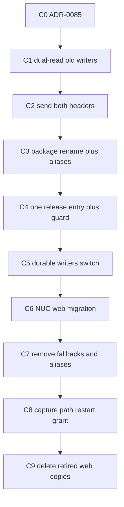

# KSI-PLAN-02 decision-complete identity cut sequence

### Report for ORCHESTRATOR_CHAT

Logical whole identity: `kronika-sole-identity`
Worker session ordinal: `03`
Worker exchange ordinal: `01`
Persistent role identity: WORKER
Worker session profile: Planner
Task identity: `KSI-PLAN-02`
Status: **PASS**
Phase-qualified result: `not-applicable`
Logical-whole closure: `not-closed`
Report justification: `new-evidence`
Start commit: `ca649f6eb6231591292e174dff994fd0f4448378`
End commit: `ca649f6eb6231591292e174dff994fd0f4448378`
Changed files: **none**

The level-1 title above is required by this client's native planning surface. The standard report header is the next line. This plan was not written into the Kronika repository and not written to `03_report_00.md`. Acceptance of this plan does not authorize implementation, push, or any NUC action. Each cut below needs its own later grant with `Native planning mode: not-used`.

## Repository gate

Re-verified read-only at `/home/agile/Projects/kronika`:

- Branch `main`, HEAD `ca649f6eb6231591292e174dff994fd0f4448378`, clean tree before and after the suites
- `origin` `https://github.com/cisarik/kronika`
- Public `refs/heads/main` and `refs/heads/fix/operator-gate-test-hermetic` both equal that SHA
- `.ap` gitlink and submodule HEAD both `73e20ef80b88700d5fcbc397cd8edd4fc425869f`
- `./.ap/ap doctor`: PASS, governing variant `stable`
- `./.ap/ap project check --root /home/agile/Projects/kronika --baseline ca649f6eb6231591292e174dff994fd0f4448378`: PASS
- `ap.project.conf` `projectId` is `cisarik/kronika`; `provenanceModule` is `framenest`

Python, declared route `./.ap/ap exec --root /home/agile/Projects/kronika --baseline ca649f6eb6231591292e174dff994fd0f4448378 --operation test`: **4145 passed, 8 skipped, 3 warnings, 0 failed**, 655.73s, exit 0.

JavaScript, `node --test tests/*.test.js`: **554 total, 549 passed, 0 failed, 5 skipped**, exit 0.

The green baseline reproduces. The eight Python skips are the seven real-media-tool tests and one live NVIDIA test. The five JavaScript skips are the gated browser-evidence suites.

`ap doctor` and `ap project check` warned that inherited environment classes were sanitized (`LD_LIBRARY_PATH`, `SSH_AUTH_SOCK`, `VIRTUAL_ENV_DISABLE_PROMPT`, `PROMPT_COMMAND`, `APPDIR`, `APPIMAGE`, `PATH`). The check still passed. That warning is not a failed gate.

## Inventory recount

Method: tracked content only, `git grep` at `ca649f6eb6231591292e174dff994fd0f4448378`. Path and header figures are occurrence counts (`git grep -o`). The same counts hold at parent `0c850996…` for the `FRAMENEST_` prefix. The hermetic-test commit adds no `FRAMENEST_` token.

- Python files under `src/framenest`: **284**. Delta: none.
- Files containing case-insensitive `framenest`: src **254** / tests **314** / deploy **19** / scripts **7** / docs **87** / extension **12**. Delta: none.
- Tracked Markdown files: **100**. Delta: none.
- Distribution name / `provenanceModule`: `framenest` / `framenest`. Delta: none.
- `framenest-*` console scripts: **14** = 13 application commands plus `framenest-chatgpt-page`. `kronika-capture` is a fifteenth script entry and is already Kronika. Delta: none.
- `FRAMENEST_` substring occurrences: **639** = 637 tokens matching `FRAMENEST_[A-Z0-9_]+` plus 2 bare prefix spellings (`env_prefix="FRAMENEST_"` in [configuration.py](src/framenest/configuration.py) and the prose prefix in ADR-0020). Distinct names: **103** = 102 tokens plus that bare prefix. Delta: none, once the bare prefix is counted. Leading tokens match the issued table exactly (`FRAMENEST_DATABASE_PATH` 67, `FRAMENEST_PORT` 51, `FRAMENEST_ENV_FILE` 40, `FRAMENEST_HOST` 30, `FRAMENEST_API_KEY` 19, `FRAMENEST_AUTOMATIC_MEDIA_ANALYSIS_ENABLED` 18).
- `X-FrameNest-Request`: **53** occurrences in **28** files; **9** JavaScript test files; **5** ADR files. Delta: none.
- `/opt/framenest` **198**, `/etc/framenest` **73**, `/var/lib/framenest` **91**, `/var/cache/framenest` **20**, `/mnt/framenest-catalog-offdevice` **12**. Delta: none.
- `User=framenest` / `Group=framenest`: **5 / 5**. Delta: none.
- Capitalized `FrameNest`: **3335** occurrences in **478** files. Delta: none.
- Alembic version files: **36**, head `0035`. Revision ids do not contain `framenest`.

## Standing rules for every cut

- One repository, `cisarik/kronika`. No history rewrite, no force push, no second product. `cisarik/cli_chatgpt` at `66c40d43c577276b0ad304a494fbbb1ffb6fc933` stays active.
- `kronika-capture` and the `kronika-capture-*` units are not renamed.
- Alembic revision bytes through `0035` are never edited. Head stays `0035` in every cut of this whole. No cut adds a migration. A routine deploy therefore stays inside the same-schema rule.
- Writers of durable on-disk identifiers keep the old spelling until the matching readers are already the installed NUC release.
- Routine `deploy` / `rollback` never install unit files, never rename Unix accounts, never move `/opt`, `/etc`, `/var`, or the socket, and never restart capture. That is already how [framenest_release.py](deploy/ubuntu/framenest_release.py) behaves: it switches `/opt/framenest/current` and restarts `framenest.service` only.
- The NUC web release observed on 2026-10-02 is `0c850996…`, behind this baseline by the hermetic-test commit. The first routine deploy of a later cut may fast-forward across that commit. It is same-schema and is not a separate identity cut.
- Tooling paths stay exactly:
  - `/opt/framenest/tooling/poetry/2.4.1/.venv/bin/poetry`
  - `/opt/framenest/tooling/python/cpython-3.13.14-linux-x86_64-gnu/bin/python3.13`
- `/mnt/framenest-catalog-offdevice` is not renamed and not created. The off-device units were not in the installed set. A mount change is outside this whole.
- Carried residuals L-1, L-2, L-3, L-4, L-9, L-10, L-11, and the 2026-10-02 media-AI indicator observation, are not fixed here.
- Implementation grants checkout only `/home/agile/Projects/kronika`. The stale clone `/home/agile/Projects/framenest` is not a work source.
- Evidence: C0–C4 and C7 are E2 in Git, plus the existing routine-deploy health check when a refresh is specified. C5 is E3 (durable backup contract). The read-only `0035` observation after C3's refresh is E3. C6, C8, and C9 are E4.



## 1. ADR-0085

Number **0085**. Path [docs/adr/0085-kronika-sole-identity.md](docs/adr/0085-kronika-sole-identity.md). Status `Accepted`. Decision date `2026-10-02`. Accepted by the Cooperator on that date, when he stated that the `framenest` identity does not remain and that the product name is Kronika, including NUC paths and script names. The ADR cut records that decision; it does not pretend the code has already moved.

ADR-0082 is not edited. Its original wording stays historical text. ADR-0085 supersedes only these three sentences, by citation, not by patch:

- [docs/adr/0082-kronika-one-product-and-private-records.md](docs/adr/0082-kronika-one-product-and-private-records.md) lines 87–89: the internal `framenest` package, migration history, compatible HTTP headers and deployment identifiers remain during that stage, and there is no mass `framenest` rename.
- The same file, lines 208–209: the `framenest` package, provenance module, migration history, HTTP headers and deployment identifiers stay.
- The same file, line 196: "Local paths need not be renamed," superseded only for product commands, the settings prefix, the mutation header, systemd unit names, and the host paths this ADR names. It is not superseded for Git history, for the historical MacBook path in old artifacts, or for the tooling paths listed above.

Unaffected and still accepted from ADR-0082, ADR-0083, and ADR-0084: one repository and application; parked capture constraints; `kronika-capture`; `cisarik/cli_chatgpt` remaining active; Gallery as a separate frozen view; administrator-curated Timeline; owner-private records; research disabled by default; the single release helper; no Git history rewrite; no public listener.

Index [docs/adr/README.md](docs/adr/README.md) gains the 0085 row and one supersession paragraph in the same style as the ADR-0083 paragraph. It states that ADR-0082's historical reasoning stays in that file.

### Decision text the ADR cut must contain

- The product identity is Kronika. The import package is `kronika` (`src/kronika`). The distribution name is `kronika`. `provenanceModule` is `kronika`. Console scripts are `kronika-*` as mapped in cut C3. The root launcher is `./kronika`.
- Settings prefix is `KRONIKA_`. The mutation header is `X-Kronika-Request: 1`. Command error-code strings use the `KRONIKA_` prefix after the removal cut.
- Web host layout is `/opt/kronika/releases`, `/opt/kronika/current`, `/etc/kronika/kronika.env`, `/var/lib/kronika`, `/var/cache/kronika`, `/run/kronika/kronika.sock`, Unix account `kronika`, units `kronika.service`, `kronika-catalog-backup.service` and `.timer`, `kronika-catalog-offdevice.service` and `.timer`.
- The sole release entry becomes `deploy/ubuntu/kronika-release`. It is the same engine, not a second deployment system.
- Applied Alembic bytes through `0035` stay byte-identical. The only mechanism that loads `from framenest.infrastructure.persistence.sqlite_batch_fk import ...` is an in-memory alias installed by the migration loader. There is no `src/framenest` package and no `framenest` distribution after C3.
- Frozen residues, named so they are not "leftover rename work": tooling paths above; protocol magic `FNCBE01`; capture state-directory name `framenest-chatgpt-page`; off-device mount path; historical ADR bodies; [docs/FEDORA_SERVICE.md](docs/FEDORA_SERVICE.md); [docs/NUC_HOST_BASELINE.md](docs/NUC_HOST_BASELINE.md); existing backup archives and sidecars, which readers keep accepting.
- Compatibility windows and their removal gate are the cut sequence in this plan. A mass search-and-replace is not an implementation of this ADR.
- This ADR grants no implementation, no deploy, and no host migration.

### Living prohibition edits in the same docs cut

In the same C0 commit, and only as wording that currently forbids the rename, replace the present-tense "package / headers / deployment identifiers remain" and "no mass rename" instructions in [AGENTS.md](AGENTS.md), [README.md](README.md), [PRODUCT.md](PRODUCT.md), [SPEC.md](SPEC.md), [SERVER.md](SERVER.md), [DEVELOPMENT.md](DEVELOPMENT.md), and [ROADMAP.md](ROADMAP.md) with a pointer that ADR-0085 is the identity authority and that the ordered cuts implement it. Do not rename commands, paths, or headers in C0. Those sentences would otherwise make the next grant contradict current normative text. Historical narrative of what S10 already did stays.

## Cut sequence and NUC state

### C0 — ADR only

- Mutation: add ADR-0085, the index paragraph and row, the living-prohibition edits above, and `tests/contract/test_kronika_identity_retention.py` locking the frozen hashes from question 12. No code, packaging, unit, or helper behavior change.
- NUC: not refreshed. Still serving the release it already runs (`0c850996…` at the last observation, or any later same-schema refresh an unrelated grant has done).
- Evidence: E2. Docs review plus the retention test, the declared Python suite, and the JavaScript suite. `git diff` for ADR-0082 is empty.
- Rollback: revert the commit before acceptance is published. After the Cooperator accepts ADR-0085, it is one-way: a later ADR may supersede it; this whole does not delete it.
- Routine-deployable: yes, behavior-neutral, and not required.

### C1 — dual-read, old writers

- Mutation:
  - Add one resolver, initially `framenest.identity_env.lookup_env(suffix)`. It reads `KRONIKA_<SUFFIX>` and `FRAMENEST_<SUFFIX>`. One set: use it. Both unset: caller default. Both set and equal: use it. Both set and different: fail closed, exit 2 for CLIs, message names the suffixes only, never the values.
  - `FRAMENEST_ENV_FILE` and `KRONIKA_ENV_FILE` go through that resolver before the env file opens. Replace `SettingsConfigDict(env_prefix="FRAMENEST_")` in [configuration.py](src/framenest/configuration.py) with a settings source that calls the resolver for every field.
  - Point every direct reader at the same function: [catalog_backup_ops.py](src/framenest/infrastructure/persistence/catalog_backup_ops.py), [catalog_backup_offdevice.py](src/framenest/infrastructure/persistence/catalog_backup_offdevice.py), [development.py](src/framenest/infrastructure/runtime/development.py), [infrastructure/ai/configuration.py](src/framenest/infrastructure/ai/configuration.py), [production_ai_deploy.py](deploy/ubuntu/production_ai_deploy.py), and the release helper's injected env-file name. The helper still injects `FRAMENEST_ENV_FILE` until C6.
  - Header consumer in [tailscale_ingress.py](src/framenest/adapters/api/tailscale_ingress.py): accept the mutation when `x-kronika-request` is `1` or `x-framenest-request` is `1`. A header that is present with any other value is rejected. If both are present, both must be `1`. Senders in this cut still send only the old header.
  - Readers accept both spellings, writers stay on the old spelling: backup `application.name` (`framenest` or `kronika`) in [catalog_backup.py](src/framenest/infrastructure/persistence/catalog_backup.py); sidecar format `framenest-media-sidecar` and suffix `.framenest.json` plus the future `kronika-media-sidecar` and `.kronika.json`; off-device and workstation marker purposes and marker filenames; release-manifest key `framenest_release_sha` or `kronika_release_sha`; marker filenames `.framenest-release-sha` / `.framenest-release-manifest.json` and the `.kronika-*` pair. `PROTOCOL_MAGIC` `FNCBE01` is unchanged. `version("framenest")` stays until C3.
  - Emitted CLI error-code strings stay `FRAMENEST_*`.
- NUC after the required routine refresh: still `framenest.service`, same paths, same account, database `0035`, backup ready, serving. Installed `/etc/framenest/framenest.env` keeps working because the new code still reads `FRAMENEST_`.
- Evidence: E2 tests for both prefixes, conflict failure, both headers, an old-name backup manifest still verifying, a new-name manifest also verifying, and writers still emitting the old name. Then the ordinary routine release health check.
- Rollback: the helper's existing release rollback. One-way: no. New-name artifacts are not written yet, so rolling back to today's reader is safe.
- Routine-deployable: yes. This refresh is a precondition for C5 and C6.

### C2 — send both headers; migrate browser state on read

- Mutation: [app.js](src/framenest/adapters/api/web/app.js) and [extension/background/service_worker.js](extension/background/service_worker.js) send both `X-Kronika-Request: 1` and `X-FrameNest-Request: 1`. An extra header is ignored by the current server and by C1, so this does not depend on C1 already being installed in order to keep mutations working. Storage and local keys (`frameNestOrigin`, `framenest.youtube.currentClaim.v1`, `framenest.catalog.pageSize`, `framenest.upload.recovery.v1`, and the review-inbox keys) are read from the old key when the new key is absent, and written to the new key. Old keys are left in place. Companion protocol strings inside the extension (`framenest.companion.v1` and the related source, alarm, and port names) switch inside this one extension change so the extension stays internally consistent. The server does not validate those strings; the only server contract is the mutation header.
- Cooperator-visible step, required before C7 and not before this cut is what he loads: reload the Brave companion, including an open side panel, so the running extension is this revision. Until that reload, the already-installed extension keeps sending the old header, which C1 and the pre-C1 server both accept.
- NUC: routine refresh after C1. Web shell starts sending both headers. Service stays up. Extension reload does not restart the service.
- Evidence: E2. JavaScript tests cover both headers and old-key fallback. No browser-evidence suite is required for this grant.
- Rollback: routine release rollback of the web shell. The reloaded extension still sends the old header as well, so a rollback to C1 or to the pre-C1 server still accepts mutations. One-way: no, while both headers are sent and old storage keys remain.
- Routine-deployable: yes.

### C3 — package, distribution, and command rename, with aliases

- Mutation:
  - Move `src/framenest` to `src/kronika` with Git rename detection. Update living imports. `pyproject.toml` `[project].name` becomes `kronika`. Poetry packages become `kronika` and `kronika_capture`.
  - `ap.project.conf` `provenanceModule` becomes `kronika`. The `runtime-info` argv becomes `import kronika`.
  - Canonical scripts: `kronika-server`, `kronika-db`, `kronika-catalog`, `kronika-library`, `kronika-dev`, `kronika-ai`, `kronika-production`, `kronika-backup`, `kronika-youtube`, `kronika-previews`, `kronika-covers`, `kronika-recovery`, `kronika-sidecar`, each pointing at the moved module. Keep a `framenest-*` alias for each of those thirteen, same target. Leave `kronika-capture` untouched. Leave `framenest-chatgpt-page` untouched until C7.
  - Root launcher `./kronika` is the Fish entry. `./framenest` remains a wrapper that execs it.
  - Class and settings renames travel with the package (`FrameNestSettings` to `KronikaSettings`). Behavior stays the C1 resolver.
  - Alembic directory moves with the package. `DEFAULT_MIGRATION_PACKAGE` becomes `kronika.infrastructure.persistence.alembic_environment`. Version-file contents stay byte-identical to `ca649f6…`. `script.py.mako` is updated so future revisions import `kronika`; it is not used to regenerate applied files.
  - In-memory loader alias, installed at the start of `load_script_directory` and idempotently at the start of Alembic `env.py`: create empty parent modules `framenest`, `framenest.infrastructure`, and `framenest.infrastructure.persistence` in `sys.modules`, and bind `framenest.infrastructure.persistence.sqlite_batch_fk` to `kronika.infrastructure.persistence.sqlite_batch_fk`. No other `framenest.*` import resolves. There is no `src/framenest` tree and no distribution named `framenest`.
  - `importlib.metadata.version("kronika")`. Backup manifests still write `application.name = "framenest"` until C5.
  - `DEVELOPMENT_DATABASE_DIRECTORY` stays `framenest-development` until C7, so an unset dev path does not silently open an empty catalog.
  - Release-helper path constants, unit files, and emitted error-code strings stay old.
- Re-gate, in this order, and the C3 grant must authorize it explicitly because the pinned AP cannot run `ap exec` against a drifted `ap.project.conf`:
  1. Edit the worktree, including `ap.project.conf`.
  2. `./.ap/ap project check --root /home/agile/Projects/kronika --candidate` must print `PASS (non-authorizing)`. This is readiness only.
  3. One commit of that tree. Do not amend. The pre-C3 SHA is no longer a valid `--baseline` for this worktree.
  4. `./.ap/ap project check --root /home/agile/Projects/kronika --baseline <new SHA>` must PASS.
  5. `./.ap/ap exec --root /home/agile/Projects/kronika --baseline <new SHA> --operation test` and `node --test tests/*.test.js` must pass.
  6. A red suite is fixed by a follow-up commit and a new `--baseline` equal to that commit. `--candidate` never substitutes for step 5.
- NUC after routine refresh: still the installed `framenest.service`, whose `ExecStart` is `framenest-production`. The new venv contains that alias, so the existing unit starts. `relocate_venv_shebangs` still requires `framenest-db` and `framenest-backup`, which the aliases provide. Database stays `0035` because head is unchanged. The same-schema check runs `framenest-db status` on the target tree before the symlink switch; a loader failure aborts before cutover, and the current release keeps serving.
- Evidence: E2 suites on the new baseline. Plus a test that a fixture database stamped `0035` stays `at_head` and its `alembic_version` row is unchanged, and that a fresh temporary database upgrades to `0035` through the alias. E3 after the refresh: read-only status shows `current_revision == head_revision == 0035`. No upgrade command is run.
- Rollback: helper rollback to the C2 release. One-way: no, while aliases exist and writers still emit old durable names.
- Routine-deployable: yes, only with the aliases present.

### C4 — one release entry, old layout still the routine layout

- Mutation: move the engine to [deploy/ubuntu/kronika_release.py](deploy/ubuntu/kronika_release.py) and add Fish entry [deploy/ubuntu/kronika-release](deploy/ubuntu/kronika-release). [deploy/ubuntu/framenest-release](deploy/ubuntu/framenest-release) becomes a wrapper that execs that engine with the same arguments. Routine constants stay `SERVICE = framenest.service`, `RELEASE_ROOT = /opt/framenest/releases`, `CURRENT = /opt/framenest/current`, `CAPTURE_CURRENT = /opt/framenest/capture-current`, `ENV_FILE = /etc/framenest/framenest.env`, tooling paths unchanged. `PROGRAM` printing may say `kronika-release` while the wrapper remains.
- Add subcommand `migrate-identity`. C4's grant forbids running it. Routine `deploy` does not call it.
- Before any routine symlink switch, the engine checks that every basename in the installed web unit's `ExecStart` and `ExecStartPre` exists as a non-symlink file in the target release's `.venv/bin`. If not, it exits without switching and without restarting. This is the guard that makes a premature C7 deploy refuse.
- Marker readers accept both `.framenest-release-*` and `.kronika-release-*`, and both manifest keys. Routine writers still write the old names.
- Rename [scripts/operator/network/framenest_nuc_worker_gate.fish](scripts/operator/network/framenest_nuc_worker_gate.fish) to `kronika_nuc_worker_gate.fish`. The old path remains a wrapper that execs the new file. The new file reads `KRONIKA_NUC_SSH_TARGET`, `KRONIKA_NUC_SSH_USER`, `KRONIKA_NUC_SSH_IDENTITY`, and `KRONIKA_NUC_SSH_COMMAND`, and falls back to the `FRAMENEST_NUC_SSH_*` names when the new name is unset. Both set and different: exit 2, suffixes only. CLI flags still override. Missing-value exit stays 2. Probe behavior stays. Test hooks follow the same prefix fallback.
- [AGENTS.md](AGENTS.md) and [docs/WORKER_EXECUTION_CONTRACT.md](docs/WORKER_EXECUTION_CONTRACT.md) name `kronika-release` and `kronika_nuc_worker_gate.fish` as canonical and state that the old paths and the old SSH variable names still work until C7.
- NUC: routine refresh. Installed units unchanged, so the service keeps serving. The helper the operator invokes is the Git checkout, so either filename works as soon as he has this commit.
- Evidence: E2, including a hermetic Fish test (`fish --no-config`, synthetic environment, no read of `~/.config/fish/**` or `fish_variables`) for new names, old names, conflict, and the wrapper path. A unit test asserts `migrate-identity` is not invoked by `deploy`, `rollback`, `activate-capture`, or `rollback-capture`.
- Rollback: routine release rollback. One-way: no.
- Routine-deployable: yes.

### C5 — durable writers switch

- Preconditions: C1 is the installed NUC release or an ancestor of it. Do not publish this writer change in the same release as the first dual-read. The routine deploy writes a checkpoint backup with the target tree's code before cutover. A checkpoint written with the new spelling must still verify on the rollback release, which is C4, whose readers come from C1.
- Mutation: new backups, new sidecars, new off-device and workstation markers, and new release manifests on a newly written tree use the Kronika spellings (`application.name = "kronika"`, `kronika-media-sidecar`, `.kronika.json`, Kronika marker purposes and filenames, `kronika_release_sha`). Existing files are not rewritten. `FNCBE01` stays. Readers still accept the old spelling. Default off-device root string stays `/mnt/framenest-catalog-offdevice`.
- NUC after routine refresh: same unit, same paths, serving. The next scheduled backup is a Kronika-named manifest. Restore of pre-C5 archives still works.
- Evidence: E3. Round-trip tests for old and new artifacts. After refresh, one read-only backup status shows `ready` without printing archive contents.
- Rollback: routine rollback to C4 is safe for artifacts C5 wrote. Rollback past C1 is not safe for those artifacts. Relative to pre-C1, this cut is one-way.
- Routine-deployable: yes, only after C1 is installed.

### C6 — NUC web migration

This is not a routine `deploy`. The grant must name account rename, unit installation, env-file rewrite, state-directory copy, and one Tailscale Serve retarget. It must forbid capture restart, `activate-capture`, media deletion, profile deletion, secret deletion, and backup deletion.

Preconditions, all read-only except the checkpoint:

- Checkout contains C5. `kronika-release status` and `check` pass. Backup readiness is `ready`. Database revision is `0035` and equals head. Capture release SHA is recorded and is not modified.
- `migrate-identity` is the only mutating entry. It refuses unless the operator passes the explicit confirmation flag the grant names.

Procedure:

1. Checkpoint backup with the current, already-serving release, so the checkpoint is readable by C1 readers and by the new readers.
2. Prepare the new release tree under `/opt/kronika/releases/<sha>` and point a new symlink `/opt/kronika/current` at it. Do not change `/opt/framenest/current`, `/opt/framenest/releases`, `/opt/framenest/capture-current`, or the tooling directories.
3. Stop writers: `framenest.service`, `framenest-catalog-backup.timer`, and `framenest-catalog-backup.service` if active. Do not stop or restart `kronika-capture-bridge`, `kronika-capture-runner`, `kronika-capture-xvfb`, `kronika-capture-view`, or `kronika-capture-vnc`.
4. Abort if any process is still running as `framenest`. Capture processes run as `kronika-capture` and must still be running.
5. `groupmod -n kronika framenest` and `usermod -l kronika framenest` so the UID and GID stay and ownership follows. Abort if the rename does not apply cleanly; do not create a second account and do not chown the world.
6. Copy, do not move, `/var/lib/framenest` to `/var/lib/kronika` and `/var/cache/framenest` to `/var/cache/kronika`. Copy `/etc/framenest` to `/etc/kronika`. Rename the copied env file to `kronika.env`. Rewrite key names `FRAMENEST_` to `KRONIKA_` on the copy only. Do not print the file. The check is `grep -c '^FRAMENEST_'` equals 0 and `grep -c '^KRONIKA_'` is greater than 0.
7. Install the release's unit files as `kronika.service` and `kronika-catalog-backup.service` / `.timer`, with `User=kronika`, `Group=kronika`, `WorkingDirectory=/opt/kronika/current`, `EnvironmentFile=/etc/kronika/kronika.env`, `ExecStart` and `ExecStartPre` using `kronika-production`, and `StateDirectory` / `CacheDirectory` / `RuntimeDirectory` = `kronika`. Copy credential drop-ins by filename only, rewriting `/etc/framenest/` path strings to `/etc/kronika/`. Do not print drop-in bodies. Leave the old unit files installed and disabled after the new ones are enabled.
8. `systemctl daemon-reload`. Disable the old web and backup units. Enable the new ones. Do not enable off-device units that were not installed.
9. Retarget the existing Tailscale Serve handler from `unix:/run/framenest/framenest.sock` to `unix:/run/kronika/kronika.sock`, using the bounded procedure already in [docs/UBUNTU_NUC_DEPLOYMENT.md](docs/UBUNTU_NUC_DEPLOYMENT.md): record `tailscale serve status --json` first, replace only that one Unix handler, and do not use `tailscale serve reset` if any other handler exists. This is an edit of the existing tailnet ingress, not a new listener and not a router forward. The env copy sets `KRONIKA_UDS_PATH=/run/kronika/kronika.sock` and `KRONIKA_INGRESS_MODE=tailscale_uds`.
10. Start `kronika.service` and the backup timer. Verify: service active, socket present, read-only database status `0035` / `0035`, backup status `ready`, Tailscale handler points at the new socket, capture units still active and the capture SHA unchanged. Do not read secret values, the env file body, or the capture profile.
11. Leave the old directories, the old env file, `/opt/framenest/current`, and the tooling paths in place.

Published NUC state after success: serving as `kronika.service` on the new socket, database `0035`, backup ready, capture still on its previous release and previous unit paths.

Rollback, before any cleanup: stop the new unit, point Tailscale Serve back at the old socket, `usermod -l framenest kronika` and `groupmod -n framenest kronika`, disable the new units, enable and start `framenest.service` against the untouched `/opt/framenest/current`, start the old backup timer. Old state directories were copied, not moved, so they are still the pre-window bytes. This rollback is operational. Reverting the Git commit does not undo it.

One-way: no, until C9 deletes the old copies. After a successful verification the grant ends; it does not delete those copies.

The cut most likely to leave the web service not serving is this one, because the account rename, the unit swap, and the Tailscale retarget have to land in one window. A failed step before step 10 is recovered by the rollback above. A failed Tailscale edit with a healthy `kronika.service` leaves loopback serving and tailnet ingress down until the handler is pointed back or forward; the grant must treat that as rollback, not as success.

### C7 — remove aliases, fallbacks, and old entry points

Removal is allowed only when every one of these is true:

- C6 finished and `kronika.service` is active.
- The name-only env check still shows zero `^FRAMENEST_` lines in `/etc/kronika/kronika.env`.
- The Orchestrator has recorded the Cooperator's confirmation for the Fish universals in question 14 and for the Brave companion reload in question 5.
- The C4 `ExecStart` guard is in the helper being run.

Mutation:

- Delete the thirteen `framenest-*` script aliases and the `./framenest` wrapper. `kronika-production` is the only production executable Poetry installs. `relocate_venv_shebangs` requires `kronika-db` and `kronika-backup` instead of the old names. The old names are absent, so they cannot survive as stale aliases.
- Delete `framenest-chatgpt-page` from `[project.scripts]`. Do not rename `kronika-capture`. Do not move the capture state directory `framenest-chatgpt-page`.
- Remove `lookup_env`'s `FRAMENEST_` fallback, the old mutation-header spelling, the old gate-variable fallback, `deploy/ubuntu/framenest-release`, and `scripts/operator/network/framenest_nuc_worker_gate.fish`.
- Switch emitted CLI error-code strings from `FRAMENEST_*` to `KRONIKA_*`. Numeric exit statuses stay.
- Change `DEVELOPMENT_DATABASE_DIRECTORY` to `kronika-development`. An explicit `KRONIKA_DATABASE_PATH` is unchanged. A dev catalog that existed only at the old default temp path is not moved; the C7 grant says so to the Cooperator.
- Apply the living-prose denylist from question 12.
- Routine helper constants now describe the Kronika layout. The ExecStart guard still refuses a switch if the installed unit names a binary the target venv lacks. Deploying this commit onto a host still running `framenest.service` therefore refuses before cutover.
- NUC: routine refresh only after the preconditions. Service keeps serving. Capture is not restarted.
- Evidence: E2 suites, retention test, hermetic gate test with only the new variable names, and a test that `framenest-production` is not an installed script. After refresh: service active, revision `0035`, backup ready.
- Rollback: routine rollback to the C6 release, which still has aliases and the env fallback. One-way relative to an env file or an extension that still uses only the old spelling. Those are already gone by the preconditions.
- Routine-deployable: yes, only after C6.

### C8 — capture paths, explicit restart

Not a side effect of C6 or of any routine web deploy. The grant must explicitly allow one stop/start of `kronika-capture-bridge`, `kronika-capture-runner`, and `kronika-capture-xvfb`. It uses a new helper subcommand `migrate-capture-paths`, not `activate-capture`. `activate-capture` restarts the runner and stays a release-switch operation, not a rename operation.

Procedure: record the capture SHA; stop bridge and runner; do not stop the web service; install updated capture unit files whose `WorkingDirectory` and `ExecStart` use `/opt/kronika/capture-current`; point that symlink at the existing capture release directory without moving tooling and without moving unrelated web releases; start bridge and runner; verify the capture units are active and the web service was not restarted. Unit names stay `kronika-capture-*`.

NUC: web keeps serving throughout. Capture is down only during this window.

Rollback: restore the previous capture unit files and `/opt/framenest/capture-current`, start the capture units once. One-way: no, until C9 removes the old symlink.

This is the cut most likely to leave capture not serving. It is not the cut most likely to leave the web service down.

### C9 — delete retired copies

Separate E4 grant, only after C8 and after one scheduled backup on the new layout has reported `ready`. Delete the disabled `framenest*.service` and `.timer` units, `/etc/framenest`, the copied-from `/var/lib/framenest` and `/var/cache/framenest`, and `/opt/framenest/current` if it is not the capture target. Do not delete `/opt/framenest/tooling`, media, profiles, secrets, or backup archives. Do not delete a release directory that `capture-current` still resolves into. One-way.

NUC after this cut: serving as Kronika, capture on `/opt/kronika/capture-current`, tooling still on the accepted `/opt/framenest/tooling/...` paths.

## Answers to the fourteen questions

1. ADR-0085, file and supersession citations in the ADR section above. ADR-0082 is not rewritten.
2. The sequence is C0 through C9. NUC state after each cut is in that cut's "NUC" paragraph. The serving bar is: web routine cuts either do not refresh, or refresh through the existing helper, which aborts before symlink switch when the target cannot satisfy the installed unit. C6 is the only web cut that changes account, units, and ingress, and it has an explicit rollback. C8 is the only capture restart.
3. Per-cut mutations, evidence, and rollback are the cut sections above.
4. The `FRAMENEST_` read fallback is `lookup_env`, landed in C1, kept through C6, removed in C7. Conflict between the two prefixes fails closed with exit 2 and no values. CLI error-code strings stay `FRAMENEST_*` until C7, then become `KRONIKA_*` in that same commit. The removal condition is the C7 precondition list: C6 done, env file has no `FRAMENEST_` keys, Cooperator confirmations recorded, ExecStart guard in the helper. There is no time-based expiry.
5. From the C1 refresh until the C7 refresh, the server honors `X-Kronika-Request: 1` and `X-FrameNest-Request: 1` as specified in C1. C2 sends both. The Cooperator-visible step is reloading the Brave companion after C2 is the extension he loads, and confirming that reload to the Orchestrator before C7. C7 stops accepting and sending the old spelling.
6. C4 adds `kronika-release` as the engine and keeps `framenest-release` as a wrapper. No commit lacks both. Routine deploy does not install units, so the installed `framenest.service` keeps working until C6 installs `kronika.service` and disables the old one. C7 deletes the wrapper only after that.
7. The C6 procedure is the migration for the account, `/opt/kronika` web tree, `/etc/kronika`, `/var/lib/kronika`, `/var/cache/kronika`, the systemd state/cache/runtime directories, and the installed web and backup units. Writers stop first. Capture is not restarted. The catalog database, media, profiles, secrets, and backups are copied or left in place, not deleted. The off-device mount is not renamed. Tooling paths are not renamed.
8. Rollback per cut is in each cut. One-way boundaries: accepted ADR-0085 is superseded rather than deleted; C5 artifacts are not safely readable by a pre-C1 release; C6 is reversible until C9 deletes the old copies; C7 is not safe for a client or env file that still has only the old spelling; applied Alembic bytes are never a reversible edit because they are never edited; C9 is one-way.
9. The Alembic directory moves with the package in C3. Applied revision files move and stay byte-identical. No new revision is added. The safe mechanism is the in-memory module alias in C3, installed before `ScriptDirectory.from_config`, limited to `sqlite_batch_fk` and its parent names. Proof the NUC database is unharmed: head remains `0035`, the refresh runs no upgrade, and the post-refresh read-only status is `current_revision == head_revision == 0035`. The repository proof is a fixture database whose `alembic_version` row is unchanged.
10. Ordering and commands are the C3 re-gate. `--candidate` is the pre-commit readiness check and is non-authorizing. `--baseline` for `ap exec` and for `project check` after the commit is the new SHA, never the pre-C3 SHA, because worktree/baseline drift of `ap.project.conf` forbids execution. The pinned AP executable is not upgraded.
11. C3 installs `kronika-production` and keeps `framenest-production` as an alias so the installed unit and `relocate_venv_shebangs` still match. C6's new unit `ExecStart` is `kronika-production`. C7 drops every `framenest-*` script from `pyproject.toml` and changes the shebang check to `kronika-db` and `kronika-backup`. Poetry then does not install `framenest-production` into that release venv. The C4 guard prevents this tree from being switched in while an old unit still names the old binary.
12. Historical text is a path rule, not a per-line judgement. Frozen, hash-locked to the blobs at `ca649f6eb6231591292e174dff994fd0f4448378`: every file in `docs/adr/` whose name starts with `0001` through `0084`, [docs/FEDORA_SERVICE.md](docs/FEDORA_SERVICE.md), [docs/NUC_HOST_BASELINE.md](docs/NUC_HOST_BASELINE.md), and the contents of the 36 Alembic version files (path may change in C3; bytes may not). The C0 test stores those SHA-256 values and fails on any byte change. Living prose is the complementary path list: [README.md](README.md), [PRODUCT.md](PRODUCT.md), [SPEC.md](SPEC.md), [SECURITY.md](SECURITY.md), [SERVER.md](SERVER.md), [DEVELOPMENT.md](DEVELOPMENT.md), [ROADMAP.md](ROADMAP.md), [AGENTS.md](AGENTS.md), [docs/UBUNTU_NUC_DEPLOYMENT.md](docs/UBUNTU_NUC_DEPLOYMENT.md), [docs/WORKER_EXECUTION_CONTRACT.md](docs/WORKER_EXECUTION_CONTRACT.md), [docs/BACKUP_AND_RECOVERY.md](docs/BACKUP_AND_RECOVERY.md), and [docs/adr/README.md](docs/adr/README.md). From C7 onward, a case-insensitive `\bframenest\b` match in a living file fails unless the line is copied verbatim into the test's exception list. The only allowed exceptions are the frozen residues named in ADR-0085: the two tooling paths, `FNCBE01`, the capture state-directory name `framenest-chatgpt-page`, `/mnt/framenest-catalog-offdevice`, and the Alembic alias module string. [docs/adr/README.md](docs/adr/README.md) may also name `framenest` inside the historical supersession paragraph that cites ADR-0082. Anything else in a living file is a test failure, not a review comment.
13. Planning-size estimate, not a schedule: C0 small; C1 two to three days; C2 about two days; C3 five to eight days; C4 about two days; C5 about two days; C6 one maintenance window; C7 two to three days; C8 one capture window; C9 one short cleanup window. Risk order for "NUC not serving," highest first: C6 web migration, then C8 capture restart, then a C5 rollback past C1, then C3 (a bad loader aborts before cutover, so the current release keeps serving), then C7 if the guard were missing (the guard is mandatory from C4), then C9, then C0–C2 and C4. The single cut most likely to leave the web service not serving is **C6**.
14. From C4 until C7 the gate and its old-path wrapper accept `KRONIKA_NUC_SSH_*` and fall back to `FRAMENEST_NUC_SSH_*`. The Cooperator-visible step, done by him in his own shell before C7, is:

```text
# [MacBook / fish]
set -U KRONIKA_NUC_SSH_TARGET $FRAMENEST_NUC_SSH_TARGET
set -U KRONIKA_NUC_SSH_USER $FRAMENEST_NUC_SSH_USER
set -U KRONIKA_NUC_SSH_IDENTITY $FRAMENEST_NUC_SSH_IDENTITY
#------------------------------------------------------
```

He then runs the canonical gate with `--probe` and one ordinary read-only `kronika-release status`, and tells the Orchestrator that those two commands succeeded. He does not paste values. The worker does not read `~/.config/fish/**` or `fish_variables`. Verification of the window is the hermetic `--no-config` test in C4, with synthetic values only. After his confirmation, C7 removes the fallback, and a later Cooperator step may `set -e` the three old universal names. That `set -e` is his, and it is not required for C7's code to be correct.

## Open questions

None. The tooling-path residue, the capture-path split, the Alembic alias, and the off-device mount are decided above. They are consequences recorded in ADR-0085, not questions left for a later planning cycle.

## Risks

- C6 couples account rename, socket path, and Tailscale Serve. The rollback depends on the old tree and the old env file still being present. C9 must not start inside the C6 window.
- C5's checkpoint is written by the target code before cutover. That is safe only because C1 readers are already the rollback release.
- The in-memory Alembic alias is process-local state created when migration status loads. It is not a shipped `framenest` distribution. A future revision that imports any other `framenest` name will fail the fresh-database test, which is the intended alarm.
- SQLite status during routine deploy already opens the production database. C3 does not add a new open; a crash in status happens before the symlink moves.
- This plan does not re-verify the live NUC. The 2026-10-02 unit list is a carried observation. C6's preflight has to observe the host again under its own grant.

## Smallest next step

Issue one implementation grant for **C0 only**: write ADR-0085, the index update, the living-prohibition wording, and the frozen-hash test. No package move, no NUC contact, no push unless that grant says so.

## Resolved Execution Issues / Near-Misses

- Native planning mode requires this artifact to open with a level-1 title. The standard report header is the first line of the report body.
- The authorized report destination is this session, not a file. The plan was not written to the repository or to the Meta trace.
- Inventory: a token regex alone yields 637 / 102. Including the two bare `FRAMENEST_` spellings yields the issued 639 / 103. No identity was added or removed since `0c850996…`.
- `ap doctor` sanitized inherited environment classes and still passed.

## Pre-Existing Failure Classification

none

Orchestration critique:
MEASURED: none
LEAD: none
