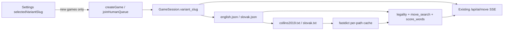

# Slovenský hrateľný variant (implementation plan)

**Baseline:** `30c4d30a97ba797ae77ec05c66187a6a6498279b` na `main`. Žiadna implementácia v tejto session. Native Plan Mode on.

**Vzory z** [PROMPT_ENGINEERING_PATTERNS.md](https://github.com/cisarik/libretiles/blob/main/.ap/PROMPT_ENGINEERING_PATTERNS.md): aplikované P01, P02, P03, P04, P11, P12, P13; abbreviated P10. Nehodia sa: P14 (rotácia modelov), live provider, browser, JULS, paralelná topológia.

---

## A. Diagnóza aktuálneho stavu

### Už variant-ready (nemente architektúru)

- [backend/gamecore/variant_store.py](backend/gamecore/variant_store.py) načíta `backend/assets/variants/<slug>.json`; `normalise_letter` drží Unicode dĺžky 1, odmieta `CH`.
- Vak a body v [backend/gamecore/tiles.py](backend/gamecore/tiles.py) cez `load_variant`.
- [backend/gamecore/fastdict.py](backend/gamecore/fastdict.py) — NFC + casefold, cache už kľúčovaná cestou súboru. Singleton v services je problém, nie fastdict.
- `GameSession.variant_slug`, `create_game` / `join_human_queue` už persistujú slug; queue matchuje podľa slugu.
- [backend/game/services.py](backend/game/services.py) `get_ai_context` už vracia `"variant": session.variant_slug`.
- SSE orchestrátor, playability, ranked candidates, witness rescue — dedia slovník/alfabetu z backendu, ak sa opraví resolver. Nemení sa protokol.

### Musí sa zmeniť (English-hardcoded landminy)

1. **ASCII reject** — `_word_passes_dictionary` v [services.py](backend/game/services.py) (riadky 139–145): `if not w.isascii() or not w.isalpha()`. Diakritika = vždy neplatné → PASS. Rovnaký filter v test helperoch [test_move_search.py](backend/tests/test_move_search.py), [test_full_game_simulation.py](backend/tests/test_full_game_simulation.py), [test_strength_benchmark.py](backend/tests/test_strength_benchmark.py) — tie ostávajú English-only.
2. **Globálny slovník** — `_prefix_index` / `_get_prefix_index()` vždy `PRIMARY_DICTIONARY_PATH` (Collins). Jeden proces by zdieľal/prepísal cache. `fastdict._INDEX_CACHE` je per-path; services ho ignorujú.
3. **`create_game` / queue** — ľubovoľný string; [CreateGameSerializer](backend/game/serializers.py) default `"english"` bez `list_installed_variants()`. Frontend [play/page.tsx](frontend/src/app/play/page.tsx) `createGame` slug neposiela; queue hardcoduje `"english"`.
4. **Alfabetá legality** — [legality.py](backend/gamecore/legality.py) `LETTERS = A–Z`. `Č`/`Á` = `invalid_letter` / `invalid_blank`. Witness volá `evaluate_scoring_move` ([move_search.py](backend/gamecore/move_search.py) ~349, ~546).
5. **Blank search** — `_BLANK_LETTERS = string.ascii_uppercase`. Blank nikdy nie je `Á`.
6. **Skóre defaultuje na English** — `score_words(..., variant=None)` → `get_tile_points(None)` = english. [services.py](backend/game/services.py) ~747, [legality.py](backend/gamecore/legality.py) ~179, [game.py](backend/gamecore/game.py) ~135. Slovak `Á` = 0 bodov; `L`/`M` sa líšia od SSS. Diakritický ťah môže spadnúť na `REASON_NON_SCORING`. Ranked leave už posiela `get_tile_points(session.variant_slug)` — legality skóre nie.
7. **UI rack** — [rack.ts](frontend/src/lib/rack.ts) `/^[A-Za-z?]$/` → slovenský stojan je „neplausibilný“, UI ho schová.
8. **BlankPicker** — [BlankPicker.tsx](frontend/src/components/game/BlankPicker.tsx) A–Z.
9. **Grid parse** — [prompts.ts](frontend/src/lib/prompts.ts) `GRID_ROW = /^[A-Za-z.]{15}$/` zahodí riadky s diakritikou; `extractGridRows` nesplní 15 riadkov.
10. **Prompt tile values** — `buildMoveUserPrompt` hardcoduje English (`Q=10`, `W=4`).
11. **CORE/Judge Collins** — `MOVE_SYSTEM_PROMPT` / `JUDGE_SYSTEM_PROMPT` + inline Collins v [judge/route.ts](frontend/src/app/api/ai/judge/route.ts) ~254. English hash pin v [prompts.test.ts](frontend/src/lib/prompts.test.ts) (`pfr-s2-core-1`) musí ostať.
12. **`validate_words` source** — vždy `"collins2019"` ([services.py](backend/game/services.py) ~1473).
13. **Frontend body kameňov** — [constants.ts](frontend/src/lib/constants.ts) `TILE_POINTS` English; [Tile.tsx](frontend/src/components/tiles/Tile.tsx) a [AIThinkingOverlay.tsx](frontend/src/components/game/AIThinkingOverlay.tsx) ukazujú 0 pre `Á`.
14. **Copy** — [game/[id]/page.tsx](frontend/src/app/game/[id]/page.tsx) „Not in Collins Scrabble Words 2019“; chrome ostáva EN, vetu parametrizovať.
15. **Settings persist** — [useGameStore.ts](frontend/src/hooks/useGameStore.ts) version 1, žiadny language field.
16. **NFC ingest** — board/placement bez NFC; kombinované znaky by rozbili 15-znakový riadok.

### English-only a musí ostať English-only

- `backend/assets/dicts/collins2019.txt` (279 497 riadkov) — nerenamovať, nahradiť, ani nastaviť `PRIMARY_DICTIONARY_PATH` na slovenčinu.
- English testy `qi`/`za`/`fe` pass, `qlet` fail.
- Tool-only protokol, ≤3 fallback attempts, `provider_requests_used`, unchanged-turn reconciliation, `nvidia/nemotron-3-super-120b-a12b` flagship.
- `sowpods.txt` sa netýka tohto whole.
- Landing copy o Collins môže ostať (produktová identita EN).

---

## B. Architektúra (odporúčaná kombinácia)

**Dve nainštalované varianty:** `english` (nezmenený set) a `slovak`.

**Per-variant lexikón:** do `VariantDefinition` pridať `dictionary_file`. `english.json` → `collins2019.txt`; `slovak.json` → `slovak.txt`. Resolver: `dicts_dir / variant.dictionary_file`. Nikdy neprepisovať process-global Collins. `_get_prefix_index(session)` volá existujúci `load_prefix_index(path)`.

**Validácia slugu:** `create_game` a `join_human_queue` odmietnu slug mimo `list_installed_variants()` (400).

**Frontend:** persist `selectedVariantSlug` default `english`, Zustand version **2**, migrate chýbajúci kľúč → `english`. Settings fancy dropdown (premium panel, nie natívny `<select>`): labely **English** / **Slovak**. `createGame` aj `joinHumanQueue` posielajú slug. Zmena jazyka **nikdy** nemutuje live `GameSession`.

**Game state snapshot** (aby UI/AI neskopírovali JSON): `_build_state` + `get_ai_context` pridajú `tile_points`, `alphabet` (bag letters bez `?`), `lexicon_id` (`collins2019` | `slovak`). Blank picker a rack membership berú **session** alphabet, nie Settings.

**AI:** jeden parameterized CORE (`moveSystemPromptFor(spec)`); `export const MOVE_SYSTEM_PROMPT = moveSystemPromptFor(ENGLISH)` ostane byte-identical kvôli SHA-256. Žiadny druhý SSE route.

### Forky (jedna kombinácia)

1. **Tile set — oficiálny SSS 100** (Wikipedia § Slovak, 2026-08-29). Zamietnuté: 112 commercial (SSS neodporúča); historický 108-tile ScrabGPT JSON (poškodený 2013 set bez F/G/Q/W). Žiadne kameňové CH/DZ/DŽ.
2. **Lexikón — hunspell-sk (sk-spell / LibreOffice `sk_SK`)**, unmunch → NFC, `isalpha`, `len>=2`, jeden word/line, `backend/assets/dicts/slovak.txt` + `slovak.LICENSE` / THIRD_PARTY. **Nekopírovať** `sk.sorted.txt` (50 478 riadkov, licencia UNKNOWN). Floor po generovaní: ≥ 80 000 unique words (inak stop). GPL/MPL dátový súbor vedľa MIT kódu s notice; presný COPYING overí Slice 0. Ak licencia nesedí → Worker stop, `NEEDS_ORCHESTRATOR_DECISION`.
3. **Human queue — rovnaký Settings slug** (match už filtruje `variant_slug`). Zamietnuté: English-only queue.
4. **Slovak blanks — len bag letters** (41). Wikipedia loan Q/W/Ě/Ö/Ř/Ü sú neskôr; X je v vaku. Dôvod: fanout search + picker.
5. **Prompt — jeden parameterized CORE.** Zamietnuté: duplicitný Slovak CORE súbor.
6. **Judge — advisory, Django autorita.** English ostáva Collins. Slovak judge menuje shipped lexicon, nikdy neoverride Django, exhaustion 503, žiadne falošné invalid.

**Rollback:** revert slice commitov. English cesta nezávisí od `slovak.txt`. `PRIMARY_DICTIONARY_PATH` ostáva Collins. Persist v2 bez kľúča → english. Odstránenie `slovak.json` = Slovak create 400, English nedotknutý.

---

## C. Prečo to nezopakuje ScrabGPT PASS

Príčina PASS v ScrabGPT: Collins-shaped prompt + zlý/malý lexikón + žiadny witness cez slovenskú abecedu + JULS ako autorita.

Libre Tiles reťazec:

1. SSS bag + `slovak.txt` membership (Unicode, NFC).
2. `evaluate_scoring_move` + `_BLANK_LETTERS` + `score_words` berú variant alphabet/points → witness/ranked **nájdu** slovenský scoring move.
3. Existujúci `GET .../ai-playability/` a ranked rescue ostávajú; Nemotron nemusí „vedieť“ slovenčinu.
4. `legal_scoring_move_exists` stále blokuje AI PASS/exchange.

**English invarianty:** tool-only `validateMove` → `finishMove({ready:true})`; ≤3 fallback; `provider_requests_used`; unchanged-turn reconciliation; Collins pre `english`; search capy sa **neuvoľňujú**.

---

## D. Settings / UX (len herný jazyk)

- Dropdown v [settings/page.tsx](frontend/src/app/settings/page.tsx): panel **Game language**, labely English / Slovak, popis že UI ostáva English.
- Persist version 2 + `partialize` `selectedVariantSlug`.
- Žiadny switch v aktívnej hre. Aktívna hra číta `gameState.variant_slug`.
- Blank picker: 7-stĺpcová mriežka, menšie buttony pre 41 písmen.
- Invalid-word copy: English → Collins 2019; Slovak → „Not in the Slovak lexicon“.

---

## E. Ordered implementation slices

Každý slice = fresh Implementation Worker, `Native planning mode: not-used`. Git-write len po granate. mypy: žiadne **nové** chyby (baseline 63/17). Existujúce pytest/Vitest zelené.

### Slice 0 — Assety + English lock (UI ešte nie)

- **Allowlist:** `backend/assets/variants/english.json` (pridať `dictionary_file`); `backend/assets/variants/slovak.json` (SSS 100, overený súčet 100); `backend/assets/dicts/slovak.txt` + license notice; voliteľne `backend/scripts/build_slovak_lexicon.py`; [variant_store.py](backend/gamecore/variant_store.py) `dictionary_file`; testy v [test_gamecore.py](backend/tests/test_gamecore.py), nový `backend/tests/test_slovak_variant.py`.
- **Pozitívne:** `load_variant("slovak").total_tiles == 100`; English `Q==10`, `E==12`; Collins path default.
- **Negatívne:** žiadny UI, žiadny services resolver ešte, žiadny ScrabGPT import, žiadny JULS.
- **Git-write:** áno. **Evidence:** E2 po testoch.
- **Validácia:** `poetry run pytest backend/tests/test_dictionary_validation.py backend/tests/test_gamecore.py -q`; `wc -l` Collins nezmenený.
- **Stop:** licencia hunspell neoverená / word count &lt; 80k / Collins zmenený.

### Slice 1 — Engine (slovník, alfabetá, skóre, slug gate)

- **Allowlist:** [services.py](backend/game/services.py), [serializers.py](backend/game/serializers.py), [legality.py](backend/gamecore/legality.py), [move_search.py](backend/gamecore/move_search.py), [scoring.py](backend/gamecore/scoring.py) (thread variant; default english pre staré volania), [game.py](backend/gamecore/game.py) ak treba, testy dictionary/move_search/api (nové Slovak + English regression).
- **Pozitívne:** `_word_passes_dictionary` = NFC + `isalpha` + `len>=2` + `contains` (bez `isascii`); English `qi`/`za` pass, `qlet` fail; Slovak diacritic word pass len na `slovak` path; `create_game("klingon")` 400; witness nájde ťah s `Á` na mini fixture.
- **Negatívne:** žiadny Settings/UI wiring; `PRIMARY_DICTIONARY_PATH` ostáva Collins; search capy nezmenené.
- **Git-write:** áno.
- **Validácia:** `poetry run pytest -m "not internet"` (backend); `poetry run mypy config game gamecore accounts catalog`.
- **Stop:** English test červený; globálny swap Collins.

### Slice 2 — Settings + create/join + in-game alphabet UI

- **Allowlist:** [useGameStore.ts](frontend/src/hooks/useGameStore.ts), [settings/page.tsx](frontend/src/app/settings/page.tsx), [play/page.tsx](frontend/src/app/play/page.tsx), [api.ts](frontend/src/lib/api.ts), [types.ts](frontend/src/lib/types.ts), [rack.ts](frontend/src/lib/rack.ts), [BlankPicker.tsx](frontend/src/components/game/BlankPicker.tsx), [Tile.tsx](frontend/src/components/tiles/Tile.tsx), [AIThinkingOverlay.tsx](frontend/src/components/game/AIThinkingOverlay.tsx), [game/[id]/page.tsx](frontend/src/app/game/[id]/page.tsx) (lexicon copy + blank letters from state), services `_build_state` snapshot fields.
- **Pozitívne:** default english; migrate v1 store; nová AI hra so Slovak posiela slug; queue tiež; rack zobrazí `Ľ`.
- **Negatívne:** žiadny i18n chrome; žiadny PATCH variant na živej hre.
- **Git-write:** áno.
- **Validácia:** `npm run lint` + cielené Vitest.

### Slice 3 — Prompty + judge + turn-pipeline test

- **Allowlist:** [prompts.ts](frontend/src/lib/prompts.ts), [prompts.test.ts](frontend/src/lib/prompts.test.ts), [move/route.ts](frontend/src/app/api/ai/move/route.ts) (odovzdať variant spec z context; **neforkovať** orchestrátor), [judge/route.ts](frontend/src/app/api/ai/judge/route.ts) + testy, [ai-turn-simulation.test.ts](frontend/src/lib/ai-turn-simulation.test.ts) (jeden deterministický Slovak turn: legal move exists ⇒ nie PASS), fake Django context s `variant`.
- **Pozitívne:** English CORE SHA-256 nezmenený; Slovak CORE neobsahuje Collins ako lexikón; `GRID_ROW` Unicode letters; `buildMoveUserPrompt` berie tile values z contextu; English Vitest hash green.
- **Negatívne:** žiadny paid model; žiadny druhý route.
- **Git-write:** áno.
- **Validácia:** `npx vitest run src/lib/prompts.test.ts src/lib/ai-turn-simulation.test.ts src/app/api/ai/judge/route.test.ts src/app/api/ai/move/route.test.ts`.
- **Stop:** English CORE hash drift; judge syntetizuje invalid.

Žiadny production deploy. Push len samostatný grant.

---

## F. Live-play acceptance (DESIGN ONLY)

Nespušťať v tejto session. Neskorší grant.

- **2 English control** vs `nvidia/nemotron-3-super-120b-a12b` (NIM id, bez `:free`): AI musí hrať; serial PASS pri `playability.status=found` = fail.
- **3 Slovak** vs ten istý NIM, nová hra po Settings=Slovak.
- Fail: AI pass/exchange keď probe `found`; English session skóruje Slovak písmená; Collins membership na Slovak hre.
- Telemetria pre Orchestrátora: `variant_slug`, `completion_source`, `probe_status`, `repair_attempted`, `terminal_cause`, `provider_requests_used` / `turn_provider_requests`.

---

## G. Non-goals

UI i18n; tretí jazyk; JULS/online lexicon autorita; import ScrabGPT Python/UI; CH ako jeden kameň; nahradenie Collins; paid models; Stripe; LM Studio; Vercel AI Gateway; zatváranie/reopen prior wholes; ťažké nové závislosti; production deploy; push bez grantu; loan-letter blanks; 112-tile set.

---

## Prompt-engineering / AP

Planning Record: cycle initial; post-plan implementation session **none**; implementation až nový Worker `not-used`.
